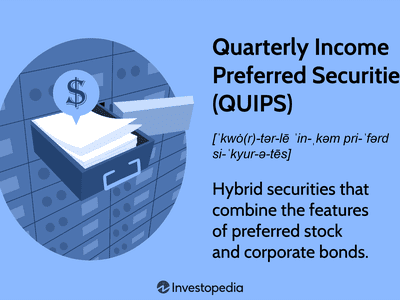

In the ever-evolving world of finance, investors are continuously seeking instruments that offer both stability and potential returns. Preferred securities stand out as a unique financial instrument that embodies characteristics of both equity and debt, providing investors with a versatile avenue for capital allocation. This blend of features allows preferred securities to offer dividends similar to stocks, while also providing the fixed income typically associated with bonds.

A specific subset of preferred securities, Monthly Income Preferred Securities (MIPS), is designed to deliver regular income streams, making them particularly appealing to income-focused investors. MIPS are structured to provide monthly dividend payments, offering a predictable and steady income. This structure is a significant advantage over traditional bonds that usually offer semi-annual interest payments. The regular income provided by MIPS can satisfy investors looking for consistent returns, especially those preparing for retirement or seeking to manage cash flow effectively.



Algorithmic trading introduces a technological dimension to investing in preferred securities. By employing sophisticated algorithms, investors can enhance their trading strategies through automated processes that analyze vast datasets and execute trades at high speeds. The potential to capitalize on market inefficiencies and optimize income from investments like MIPS is a critical aspect of modern financial strategies. Algorithmic trading not only facilitates better decision-making but can also help manage the inherent risks associated with market volatility.

Understanding preferred securities and their potential benefits is crucial for investors aiming to diversify their portfolios. By combining elements of equity and debt, preferred securities, especially MIPS, offer a hybrid approach to investment. This versatility, coupled with advances in trading technology, provides investors with tools to achieve both stability and attractive returns. As financial markets continue to evolve, the role of preferred securities and algorithmic trading is likely to grow, offering new opportunities for those seeking to balance risk and income effectively.

## Table of Contents

## Understanding Preferred Securities

Preferred securities represent a unique class of financial instruments that bridge the characteristics of both stocks and bonds. Essentially, they offer the potential for fixed income typically associated with bonds while maintaining certain equity-like features. This creates a hybrid security that can meet various investor needs.

### Characteristics of Preferred Securities

#### Dividend Priority
One of the primary features of preferred securities is the priority in dividend payments. Preferred shareholders receive dividends before any dividends are paid to common shareholders. This priority can offer a layer of income stability, especially in companies that may not consistently have surplus profits.

#### Fixed Dividend Payments
Preferred securities often come with fixed or set dividend payments, akin to interest payments on bonds. The dividends are usually expressed as a percentage of the par value (the face value of the security), offering predictability for income-focused investors. For example, if a preferred stock has a par value of $100 and an annual dividend rate of 5%, the investor will receive $5 per preferred share each year.

### Types of Preferred Securities

#### Cumulative Preferred Stock
Cumulative preferred stock permits investors to accumulate unpaid dividends. If a company faces financial difficulties and cannot pay dividends, these unpaid dividends are carried over to future periods. When the company resumes dividend payments, cumulative preferred shareholders must be paid in full before any dividends can be issued to common shareholders. This feature provides an additional layer of security for preferred shareholders.

#### Non-Cumulative Preferred Stock
Unlike cumulative preferred stock, non-cumulative preferred stock does not accumulate unpaid dividends. If a company skips a dividend payment, it is not obligated to pay it in the future. Investors opting for non-cumulative stocks should be aware of the potential risk of missing dividend payments based on the company's performance.

#### Participating Preferred Stock
Participating preferred stock offers investors the ability to receive extra dividends. If company profits surpass a predetermined level, participating preferred shareholders can receive additional dividend payments on top of their fixed dividends. This type of preferred stock allows investors to benefit from the company’s success beyond regular fixed dividends.

#### Convertible Preferred Stock
Convertible preferred stock offers investors the option to convert their preferred shares into a fixed number of common shares after a specified date. This conversion feature provides investors with the opportunity to participate in the equity upside if the company's common stock appreciates. The conversion ratio, which determines how many common shares one receives for each preferred share, along with market conditions, significantly influences the decision to convert.

Overall, understanding the nuanced features of preferred securities is essential for investors aiming to utilize these instruments in their investment portfolios. These securities can provide a blend of steady income streams and potential capital gains, attracting both income-focused and growth-oriented investors.

## Monthly Income Preferred Securities (MIPS)

Monthly Income Preferred Securities (MIPS) represent a specialized category of preferred securities, designed to provide investors with regular monthly income distributions. This feature makes MIPS particularly appealing to income-focused investors who prioritize steady cash flow in their portfolios. 

### Structure and Origins of MIPS

MIPS are structured as hybrid financial instruments, combining elements of both equity and debt. Like traditional preferred shares, they possess characteristics such as fixed dividend payments and priority over common stock dividends in the event of a liquidation. However, unlike most preferred shares that typically distribute income on a quarterly basis, MIPS are structured to distribute income monthly. This unique feature is a key [factor](/wiki/factor-investing) in their appeal to those seeking regular income streams. 

The origins of MIPS can be traced back to the innovative financial engineering of the 1990s, when there was a heightened demand for investment products that could provide the stability of fixed income with the additional feature of elevated dividend frequency. They emerged as a solution to meet this demand, appealing to both institutional and retail investors. 

### Advantages Over Traditional Fixed Income Options

MIPS offer several advantages over traditional fixed-income securities such as bonds. Firstly, the monthly income distribution aligns well with the cash flow needs of many investors, especially those relying on investment income for living expenses. This monthly payout structure can also enhance the reinvestment potential, as investors can allocate received cash more frequently compared to typical bond semi-annual or annual coupon payments.

Furthermore, MIPS can potentially offer higher yields compared to standard bonds due to their equity-like risk profile. While they share characteristics with bonds, such as fixed income distributions and a senior claim over dividends, MIPS still [carry](/wiki/carry-trading) equity risk, which can translate into a higher yield to compensate for this additional risk. They also have the ability to reset their dividend rates, which provides a hedge against rising interest rates—a feature not typical in traditional bonds. 

Lastly, MIPS can serve as a diversifying tool within an investment portfolio. They often exhibit a low correlation with other asset classes, which can help in reducing overall portfolio risk. Their hybrid nature allows investors to benefit from both the fixed income and equity markets' performance, potentially offering a balanced risk-return profile.

In conclusion, Monthly Income Preferred Securities present a compelling option for investors focused on consistent income generation while seeking to benefit from both equity and debt market dynamics. Their origins, structural design, and strategic advantages over traditional fixed-income instruments underscore their value in a diversified investment portfolio.

## Algorithmic Trading for Preferred Securities

Algorithmic trading, also known as automated trading or black-box trading, involves the use of computer-driven algorithms to execute trades with precision and at speeds beyond human capability. When applied to preferred securities, such as Monthly Income Preferred Securities (MIPS), [algorithmic trading](/wiki/algorithmic-trading) can play a crucial role in enhancing returns and managing associated risks.

One of the primary benefits of algorithmic trading is its ability to capitalize on market inefficiencies. In the context of preferred securities, these inefficiencies may arise due to anomalies in pricing between the preferred stock market and the broader equity or bond markets. Algorithms are designed to detect these discrepancies and execute trades that can exploit the price differences, potentially leading to improved returns.

The optimization of income from MIPS through algorithmic trading involves several processes. Firstly, algorithms can systematically analyze vast datasets to forecast price trends and economic indicators that affect interest rates and preferred stock performance. For instance, [machine learning](/wiki/machine-learning) techniques like regression analysis and time series forecasting can be employed to predict future movements based on historical data.

```python
import numpy as np
from sklearn.linear_model import LinearRegression

# Example: Predicting future price movements of a preferred security
# Historical price data for a preferred security
prices = np.array([[100], [102], [105], [107], [110]])
# Corresponding time periods
time_periods = np.array([1, 2, 3, 4, 5])

# Training linear regression model
model = LinearRegression().fit(time_periods.reshape(-1, 1), prices)

# Predicting price for the next time period
future_period = np.array([6]).reshape(-1, 1)
predicted_price = model.predict(future_period)
```

Furthermore, algorithms can also manage risks associated with preferred securities, such as [interest rate](/wiki/interest-rate-trading-strategies) risk, by executing trades that offset potential losses. For example, if an increase in interest rates is forecasted, an algorithm may reduce the position in interest-rate-sensitive preferred securities or employ hedging strategies via derivatives.

Additionally, the use of high-frequency trading algorithms enables the continuous scanning of order [books](/wiki/algo-trading-books) and market depths to optimize entry and [exit](/wiki/exit-strategy) points for trades. These algorithms can serve to enhance [liquidity](/wiki/liquidity-risk-premium) and reduce transaction costs, thereby facilitating more efficient portfolio management.

A key aspect of algorithmic trading is its ability to operate without the limitations of human emotions, such as fear or greed, which often lead to suboptimal trading decisions. By relying on quantitative models and precise rules, algorithmic trading ensures consistency and discipline in executing strategy without deviation.

Finally, while algorithmic trading offers significant benefits, it is important to consider the associated risks, such as technological failures or algorithmic errors, which could result in significant financial losses. Robust risk management protocols and continuous monitoring of algorithm performance are essential to mitigate these risks effectively.

In conclusion, algorithmic trading stands as a powerful tool for optimizing returns and managing risks associated with Monthly Income Preferred Securities, leveraging market inefficiencies to the investor's advantage. As technology continues to advance, its integration into preferred securities trading is poised to grow, offering new opportunities for maximizing income in sophisticated investment environments.

## Risks and Considerations

Monthly Income Preferred Securities (MIPS) offer appealing prospects for income-focused investors, but they also carry specific risks that can impact their returns. One of the primary risks associated with MIPS is interest rate risk. As interest rates fluctuate, the fixed income nature of MIPS makes them susceptible to price [volatility](/wiki/volatility-trading-strategies). When interest rates rise, the value of existing MIPS, which typically offer lower yields than new issues, may decrease. This price decline can affect the marketability and overall return of the investment. To mitigate interest rate risk, investors can employ duration management strategies. By using algorithmic trading, sophisticated models can be developed to predict interest rate movements, enabling timely adjustments in the MIPS portfolio to either hedge against or capitalize on interest rate changes.

Liquidity risk is another significant factor to consider when investing in MIPS. As preferred securities may not be as readily traded as common stocks or government bonds, an investor may encounter difficulty in selling their securities without incurring substantial price discounts. This is particularly relevant during times of market stress. Algorithmic trading can provide solutions to manage liquidity risk by employing algorithms that identify the optimal trading times and sizes to minimize market impact and ensure efficient execution without drastically affecting the asset's price.

Tax implications also play a critical role in the returns on MIPS. Taxation can vary significantly across jurisdictions, affecting the net income received by investors. In some regions, dividend income from preferred securities might be taxed at a different rate compared to ordinary income, providing potential tax advantages. Algorithmic trading systems can be designed to account for these tax implications, optimizing the after-tax returns by strategically selecting and managing MIPS in portfolios based on the investor's specific tax circumstances. 

Investors must diligently assess these risks and implement strategies utilizing technology to mitigate potential downsides while capitalizing on the benefits MIPS offer. Understanding these considerations is crucial for maintaining a balanced portfolio with a focus on maximizing income and managing risk efficiently.

## Case Studies and Real-World Applications

Algorithmic trading has transformed the investment landscape, notably within the domain of Monthly Income Preferred Securities (MIPS). By leveraging advanced algorithms, investors can exploit market inefficiencies and execute precise trades to enhance income from MIPS. This section examines real-world examples of algorithmic trading applied to preferred securities, comparing strategies and demonstrating their effectiveness in varying market conditions.

### Real-World Examples of Algorithmic Trading with MIPS

**Example 1: Quantitative Hedge Fund Strategy**

A quantitative [hedge fund](/wiki/hedge-fund-trading-strategies) implemented algorithmic trading strategies focused on MIPS to achieve stable returns. The fund utilized statistical [arbitrage](/wiki/arbitrage), seeking to profit from pricing inefficiencies between paired preferred securities. By developing a proprietary algorithm that detected discrepancies based on historical pricing data, they could execute trades automatically when these discrepancies occurred. This strategy provided the fund with a consistent monthly income stream while effectively managing risk during market volatility.

Statistical arbitrage strategies often employ mean-reversion techniques, assuming that the price movements of paired securities will eventually return to their historical average. The use of these algorithms allows funds to maintain a market-neutral position, often crucial in mitigating risk within volatile contexts.

**Example 2: Individual Investor's Approach**

An individual investor, specializing in income-generating portfolios, adopted a [momentum](/wiki/momentum)-based algorithmic trading strategy for MIPS. Unlike [statistical arbitrage](/wiki/statistical-arbitrage), momentum strategies capitalize on trends, buying preferred securities showing upward price momentum and selling those with downward trends. By utilizing moving averages and price signals, the investor configured algorithms to enter and exit positions efficiently.

The investor adjusted these algorithms for monthly rebalancing, which helped capture consistent income despite broader market fluctuations. This adaptability illustrates how even small-scale investors can harness algorithmic trading to manage their MIPS portfolios effectively.

### Comparative Analysis of Strategies

**Statistical Arbitrage vs. Momentum Trading**

While statistical arbitrage focuses on exploiting relative pricing inefficiencies, momentum trading relies on the continuation of trends. The choice between these strategies often depends on market conditions and investment objectives. 

- **Performance in Market Volatility**: Statistical arbitrage tends to perform well during high market volatility, as irregular price movements create more opportunities for discrepancies. Momentum trading, conversely, may struggle during volatility if trends reverse unexpectedly.

- **Income Consistency**: For investors prioritizing regular income, statistical arbitrage may offer a steadier stream due to its market-neutral nature. Momentum trade's reliance on sustained trends might lead to more fluctuating income levels.

### Case Studies

**Case Study 1: Institutional Investment Firm**

An investment firm developed an advanced machine learning algorithm to optimize MIPS trading. The model analyzed macroeconomic indicators, interest rate changes, and historical price data to predict MIPS performance. The algorithm adjusted the firm's portfolio dynamically, achieving higher returns compared to traditional manual trading approaches. This case illustrates the potential for machine learning to create predictive models that enhance algorithmic trading strategies.

**Case Study 2: Retail Investor's Success Story**

A retail investor utilized an open-source trading platform to automate MIPS trades, focusing on diversifying their income sources. They implemented a rules-based strategy, selecting MIPS with the highest dividend yields and solid credit ratings. The use of programmable alerts and real-time market data allowed the investor to maximize income while controlling risk exposure effectively. This case highlights the accessibility of algorithmic trading tools to individual investors, enabling personalized portfolio management.

### Conclusion

Algorithmic trading in MIPS presents diverse opportunities for generating monthly income, catering to both institutional and individual investors. By comparing different strategies and analyzing real-world applications, investors can better understand how to integrate these tools into their investment decisions. The ongoing evolution in algorithmic trading technologies promises continued enhancements in portfolio performance and risk management.

## Conclusion

Investing in Monthly Income Preferred Securities (MIPS) offers a compelling balance of risk and income, making it a strategic choice for income-focused investors. The integration of algorithmic trading further enhances the appeal of MIPS by allowing investors to optimize their portfolios with precision and speed. Algorithmic trading capitalizes on market inefficiencies, executes trades with minimal human intervention, and provides a consistent approach to managing investments. By using algorithms, investors can not only optimize the timing of their trades but also customize their investment strategies to better manage risk and maximize returns.

The future prospects of preferred securities, including MIPS, remain promising in an ever-evolving investment landscape. As global markets continue to experience volatility and varying interest rate environments, preferred securities offer a relatively stable income stream with the potential for capital appreciation. The ongoing development of sophisticated algorithms and AI technologies will further empower investors to analyze vast data sets, predict market movements, and adjust their portfolios accordingly, providing an edge in generating consistent income.

For investors considering MIPS as part of their portfolio, informed decision-making through technology is crucial. Employing algorithmic trading requires a robust understanding of both the financial instruments and the algorithms utilized. Education and expertise in algorithm development and data analysis are essential, as is the selection of reputable platforms that can support efficient trade execution. Investors are advised to assess their risk tolerance, investment goals, and the regulatory environment in their jurisdiction to fully harness the benefits of MIPS. Embracing technology while maintaining a diversified investment approach can help investors achieve a balanced portfolio and sustainable income growth in the long term.

## References & Further Reading

[1]: Bergstra, J., Bardenet, R., Bengio, Y., & Kégl, B. (2011). ["Algorithms for Hyper-Parameter Optimization."](https://dl.acm.org/doi/10.5555/2986459.2986743) Advances in Neural Information Processing Systems 24.

[2]: ["Advances in Financial Machine Learning"](https://www.amazon.com/Advances-Financial-Machine-Learning-Marcos/dp/1119482089) by Marcos Lopez de Prado

[3]: ["Evidence-Based Technical Analysis: Applying the Scientific Method and Statistical Inference to Trading Signals"](https://www.amazon.com/Evidence-Based-Technical-Analysis-Scientific-Statistical/dp/0470008741) by David Aronson

[4]: ["Machine Learning for Algorithmic Trading"](https://github.com/stefan-jansen/machine-learning-for-trading) by Stefan Jansen

[5]: ["Quantitative Trading: How to Build Your Own Algorithmic Trading Business"](https://www.amazon.com/Quantitative-Trading-Build-Algorithmic-Business/dp/1119800064) by Ernest P. Chan