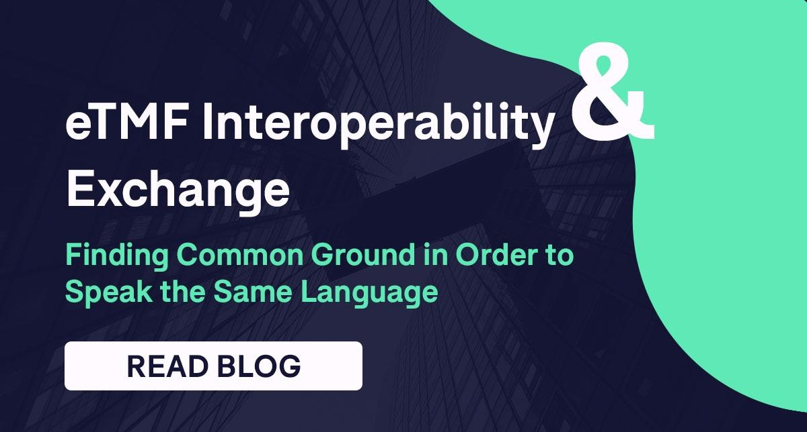

Financial markets are pivotal in the functioning of the global economy, providing a robust platform for capital allocation and risk management. They facilitate the transfer of funds between savers and borrowers, thereby enabling economic growth and stability. These markets include a variety of exchanges and institutions where financial instruments such as stocks, bonds, currencies, and derivatives are traded. The Montréal Exchange (MX) stands as a cornerstone of Canada's financial markets, specializing in the trading of equity, index, and interest rate derivatives. Founded in 1874, the MX has evolved into a vital hub for derivatives trading in North America, contributing significantly to the liquidity and stability of the financial markets in Canada.

Trading mechanisms have undergone significant evolution over the years. Traditionally, trading was executed manually on physical exchange floors, but advancements in technology have transformed these operations. Electronic trading systems have streamlined processes, enhancing speed and efficiency in order execution and reducing transaction costs. These systems accommodate various order types and strategies, catering to different investor needs. The rise of algorithmic trading represents a major evolution in trading mechanisms, using computer algorithms to automate trading processes based on pre-defined criteria.

Algorithmic trading has revolutionized modern trading activities by facilitating high-speed, high-frequency trades that human traders cannot execute manually. It involves using algorithms—sets of rules encoded in software—to automate decision-making in trading strategies. The impact of algorithmic trading is profound, as it provides traders with the ability to process vast amounts of data quickly, execute trades at optimal prices, and minimize human error. However, it also introduces challenges such as the need for advanced technology and the risk of systemic issues due to errors in the algorithms.

This article aims to provide a comprehensive understanding of the Montréal Exchange and its role in Canada's financial markets. It explores the trading mechanisms at the MX, the integration and impact of algorithmic trading, and the benefits and challenges associated with it. Readers can expect to gain insights into the fundamental aspects of trading on the MX and the importance of staying informed about technological advancements and regulatory considerations in the ever-evolving landscape of financial markets.

## Table of Contents

## Understanding the Montréal Exchange

The Montréal Exchange (MX), officially known as Bourse de Montréal, is a cornerstone of Canada's financial infrastructure and holds a rich history dating back to its founding in 1832. Initially established as a stock exchange, it has evolved to become a leading derivatives market in Canada, specializing in financial instruments such as equity, index, and interest rate derivatives. Its transformation was marked by a strategic shift in 2001 when it ceased trading traditional equities to concentrate exclusively on derivatives products, thereby carving out a unique niche in the Canadian and international markets.

The significance of the Montréal Exchange in Canada's financial landscape is underscored by its role in providing a centralized venue for derivatives trading, which is crucial for risk management and price discovery. By offering products such as options and futures contracts, the MX allows investors and corporations to hedge against price fluctuations and manage financial risk more effectively. This contributes to overall financial stability, as the ability to offset potential losses through derivatives is vital for many market participants.

The array of financial instruments traded on the Montréal Exchange includes equity options, index options, and futures, as well as [interest rate](/wiki/interest-rate-trading-strategies) derivatives. Equity options allow traders to speculate on the price movements of individual stocks, while index options and futures provide mechanisms for similar strategies or hedging on broader market indices. Interest rate derivatives are particularly significant for managing exposure to fluctuations in interest rates, a critical aspect for financial institutions and large corporations.

Promoting [liquidity](/wiki/liquidity-risk-premium) is another essential function of the Montréal Exchange. By facilitating a continuous and efficient marketplace for derivative products, the MX enhances liquidity, ensuring that participants can enter and [exit](/wiki/exit-strategy) positions with minimal friction. This efficiency is vital, as it decreases transaction costs and supports a stable pricing environment, thereby attracting more participants and generating a virtuous cycle of increased activity and deeper liquidity.

Key participants involved in trading on the Montréal Exchange include institutional investors such as pension funds, mutual funds, and insurance companies, which use derivatives for strategic asset allocation and risk management. Hedge funds are also significant players, often employing complex strategies that rely heavily on derivatives. Additionally, market makers and proprietary trading firms play a crucial role by providing liquidity and depth to the market, ensuring tighter bid-ask spreads and more efficient trading processes. These participants collectively make the Montréal Exchange a dynamic and integral part of the Canadian financial ecosystem, contributing to its standing as an important hub for derivatives trading not only in North America but globally.

## Trading Mechanisms at the Montréal Exchange

The Montréal Exchange, a cornerstone of Canada's financial industry, utilizes advanced trading systems and platforms to facilitate the smooth operation of its markets. At the heart of these systems is the SOLA® trading platform, which supports a variety of derivatives products, including equity, index, and interest rate derivatives. This platform is designed to handle high volumes of transactions while ensuring rapid order execution and low latency, which are critical elements in modern trading environments.

Order execution at the Montréal Exchange involves several steps that ensure trades are accurately processed and recorded. An order, once submitted, enters the [order book](/wiki/order-book-trading-strategies) where it can interact with existing orders. Here, orders are matched based on price and time priority using the continuous trading system. This process is facilitated by technological advancements that allow for instantaneous matching and execution, minimizing the time between order submission and trade completion. After a trade is executed, the settlement process begins, which involves the transfer of the financial instruments and associated funds between the parties involved. This is usually settled on the T+1 cycle for derivatives, ensuring that obligations are met efficiently.

Different order types are vital as they cater to varied trading strategies and objectives. Market orders, which are executed immediately at the best available price, are preferred when swift execution is prioritized. In contrast, limit orders allow traders to set a specific price at which they are willing to buy or sell, offering more control over trade execution but with no guarantee of fulfillment. Stop orders, another critical type, are used to mitigate risk by triggering a market or limit order when a pre-defined price is reached. The choice of order type directly impacts trading strategy, where market orders may suit high-frequency strategies and limit orders align with value investing tactics.

The role of technology in enhancing trading mechanisms cannot be understated. The integration of sophisticated algorithms and automation has greatly increased the efficiency and accuracy of trading operations at the Montréal Exchange. Technological infrastructure supports the swift processing of large data volumes and real-time analysis, allowing traders to execute informed decisions. Among these technologies, [machine learning](/wiki/machine-learning) and [artificial intelligence](/wiki/ai-artificial-intelligence) are gradually being integrated to optimize trading strategies and manage risk. The use of such innovations ensures the Exchange remains competitive in a rapidly evolving global financial landscape.

In summary, the trading mechanisms at the Montréal Exchange are a blend of sophisticated technology and strategic trading practices. The use of cutting-edge platforms like SOLA ensures market participants can engage in transactions that are efficient, reliable, and aligned with their trading strategies.

## The Role of Algorithmic Trading

Algorithmic trading, often referred to as algo trading, involves the use of computer algorithms to execute trading orders with speed and precision that surpasses human capabilities. These algorithms follow predefined instructions regarding variables such as timing, price, and [volume](/wiki/volume-trading-strategy) to perform transactions on financial markets. Operating within a framework defined by specific code and mathematical models, algo trading optimizes decision-making and execution, enabling traders to process a large number of trades in a short time, capitalize on market fluctuations, and manage portfolios with high efficiency.

One of the primary benefits of [algorithmic trading](/wiki/algorithmic-trading) is the enhanced speed of execution. Algorithms can analyze numerous market conditions instantaneously and execute trades within milliseconds. This capability reduces latency, which is crucial in markets where prices can change massively in fractions of a second. Precision is another significant advantage, as algorithms can adherence to exact parameters set by traders, minimizing human errors such as misentries and emotional decision-making typically seen in manual trading.

On the Montréal Exchange, various algorithmic trading strategies are employed to gain a competitive edge:

1. **Market Making:** This strategy involves placing both buy and sell limit orders at different levels to provide liquidity to the market. Markets makers profit from the bid-ask spread and benefit from the high frequency of trades executed by algorithms.

2. **Statistical Arbitrage:** This strategy uses mean-reversion principles, where the algorithm identifies temporary mispricings of correlated financial instruments and predicts a return to equilibrium to exploit price discrepancies.

3. **Trend Following:** Algorithms identify and exploit market trends based on past performance data. Through technical analysis, they spot opportunities and make trades aligned with a detected trend, either upward or downward.

4. **Volume-weighted Average Price (VWAP):** This strategy aims to execute trades in a manner that aligns the average price with the security's VWAP. Traders use it to minimize the market impact of large orders without alarming the market.

Despite their advantages, algorithmic trading systems come with their own challenges and risks. One such risk is the potential for algorithms to malfunction, leading to significant financial losses. Flash crashes, characterized by rapid and deep drops in securities prices, are instances where algo trading's vulnerabilities become evident, as seen in the U.S. stock market crash of May 2010.

Furthermore, the development of these sophisticated algorithms requires highly skilled personnel and significant technological investment. Once deployed, maintaining and updating algorithms to keep up with continually changing market conditions can be both demanding and costly.

In conclusion, while algorithmic trading provides significant benefits in terms of efficiency, speed, and precision, it must be approached with caution due to inherent risks and challenges. Understanding the trading strategies specific to the Montréal Exchange and the potential vulnerabilities in algorithmic systems is crucial for traders looking to capitalize on these technologies.

## Advantages and Challenges of Algo Trading on the Montréal Exchange

Algorithmic trading, often characterized by the use of sophisticated algorithms and high-speed computer systems, presents numerous advantages and challenges within the framework of the Montréal Exchange (MX). This section explores these advantages and challenges, alongside regulatory considerations and future prospects.

### Advantages of Algorithmic Trading Specific to the Montréal Exchange

One of the most significant advantages of algorithmic trading on the Montréal Exchange is the enhancement of market liquidity. Algorithmic trading facilitates a greater number of transactions by executing trades based on predetermined strategies at speeds unattainable by human traders. This increased activity enhances market depth and reduces bid-ask spreads, benefiting all market participants.

Moreover, the MX offers a diverse range of derivatives products, such as futures and options, which are ideal for algorithmic trading. These instruments provide greater flexibility in executing various trading strategies that benefit from the speed and precision of algorithms.

Another advantage is the reduction in transaction costs. Traditional trading involves manual processes that are often costlier and less efficient. By automating these processes, algorithmic trading significantly reduces both direct costs, such as brokerage fees, and indirect costs, such as market impact and slippage.

### Regulatory Considerations and Compliance Requirements

Algorithmic traders on the Montréal Exchange must navigate a complex regulatory environment. The Investment Industry Regulatory Organization of Canada (IIROC) sets rules to ensure fair and orderly markets. Algo traders must comply with these regulations, which include ensuring that their algorithms do not disrupt markets and have appropriate risk controls in place.

Market integrity is paramount, and traders must conduct thorough testing and monitoring of their algorithms to avoid manipulative or disruptive trading patterns. Additionally, there are stringent reporting requirements to ensure transparency in trading activities, which necessitates sophisticated compliance infrastructures.

### Potential Challenges Faced by Traders

While the advantages are considerable, algo trading on the MX is not without challenges. One primary challenge is the significant capital investment in technology and infrastructure required to develop and maintain sophisticated trading algorithms. This can be a barrier for smaller firms or individual traders.

Additionally, algorithmic traders must grapple with latency issues. Although technology has greatly reduced latency, the competition for speed is intense, with even microsecond delays potentially affecting trade outcomes.

Furthermore, algorithmic trading systems are susceptible to technical failures and bugs, which can lead to significant financial losses if not promptly addressed. The complexity of these systems also demands a high level of expertise in both trading and technology, often necessitating a multidisciplinary team of professionals.

### Future Prospects of Algorithmic Trading on the Montréal Exchange

The future outlook for algorithmic trading on the Montréal Exchange is promising, driven by advancements in technology such as artificial intelligence and machine learning. These technologies can enhance the sophistication of trading strategies, enabling more accurate predictions and improved decision-making processes.

As the regulatory landscape evolves, there may be a push towards more standardized practices and improved oversight, providing a safer trading environment. The integration of blockchain technology is another area with potential to enhance transaction transparency and security, which may further bolster confidence in algorithmic trading.

In conclusion, while algorithmic trading on the Montréal Exchange offers numerous advantages, such as improved liquidity and reduced costs, it also presents challenges, including regulatory compliance and the need for significant technological investment. Despite these challenges, the future of algorithmic trading on the MX appears bright, with technological innovations promising to further revolutionize trading practices.

## Conclusion

In conclusion, the exploration of the Montréal Exchange highlights its pivotal role in shaping Canada's financial ecosystem. As a cornerstone of Canadian financial markets, understanding the trading mechanisms employed and the integration of algorithmic trading offers profound insights into market operations. The evolution of trading systems, transitioning from traditional methods to highly sophisticated algorithmic strategies, underscores the necessity for continuous adaptation within this sector.

Algorithmic trading, characterized by its speed, precision, and efficiency, revolutionizes trading activities, providing advantages such as improved liquidity and enhanced market stability. However, it also presents notable challenges and risks, including regulatory compliance and technological complexities. As such, traders must possess a comprehensive understanding of these systems to effectively leverage their benefits while mitigating potential downsides.

The financial landscape in Canada is continuously evolving, driven by technological advancements and changing regulatory environments. As such, staying informed and adaptable is crucial for traders and investors alike. Embracing new technologies and innovative strategies will not only enhance one's ability to participate effectively in the markets but also ensure resilience in the face of ongoing changes. Ultimately, the Montréal Exchange serves as a testament to the dynamic nature of financial markets, and its continued evolution will undoubtedly play a significant role in shaping Canada's economic future.

## References & Further Reading

[1]: Biais, B., & Woolley, P. (2011). ["The Fall of a Financial Empire."](https://www.tse-fr.eu/publications/high-frequency-trading) Economic Affairs.

[2]: Gomber, P., Arndt, B., Lutat, M., & Uhle, T. (2011). ["High-frequency Trading."](https://papers.ssrn.com/sol3/papers.cfm?abstract_id=1858626) Business & Information Systems Engineering.

[3]: Davey, A. (2012). ["Algorithmic Trading: The Use of Complex Strategies Made Simple"](https://onlinelibrary.wiley.com/doi/book/10.1002/9781118778944), Library of Trading.

[4]: Narang, R. K. (2013). ["Inside the Black Box: A Simple Guide to Quantitative and High-Frequency Trading"](https://onlinelibrary.wiley.com/doi/book/10.1002/9781118662717). Wiley.

[5]: Venkataraman, K., & Waisburd, A. (2007). ["The Value of the Designated Market Maker"](https://www.jstor.org/stable/27647318), Journal of Financial and Quantitative Analysis.