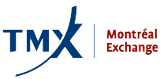

## Table of Contents

## What is the Montreal Exchange?

The Montreal Exchange, often called the MX, is a financial marketplace in Canada. It's where people and companies can buy and sell things like stocks, bonds, and options. The MX is important because it helps people invest their money and helps companies get the money they need to grow.

The Montreal Exchange started a long time ago, in 1874. Over the years, it has changed a lot. Now, it's part of a bigger company called TMX Group, which also runs the Toronto Stock Exchange. The MX is known for being a leader in trading options and other financial products in Canada.

## Where is the Montreal Exchange located?

The Montreal Exchange is located in Montreal, Quebec, Canada. It's in the heart of the city's financial district, which makes it easy for people to visit and do business there.

The exact address of the Montreal Exchange is 300 Victoria Street, in a building called the Tour de la Bourse. This building is tall and modern, and it's a big part of Montreal's skyline.

## When was the Montreal Exchange founded?

The Montreal Exchange was founded in 1874. That was a long time ago, and back then, it was just a place where people could come together to buy and sell stocks and other financial products.

Over the years, the Montreal Exchange has grown and changed a lot. Now, it's part of a bigger company called TMX Group, and it's known for being a leader in trading options and other financial products in Canada.

## What types of financial products are traded on the Montreal Exchange?

The Montreal Exchange is a place where many different types of financial products are traded. The main things you can find there are options and futures. Options give people the right, but not the obligation, to buy or sell something at a certain price in the future. Futures are agreements to buy or sell something at a set price on a specific date in the future. These products help people manage risk and make plans for the future.

In addition to options and futures, the Montreal Exchange also trades [interest rate](/wiki/interest-rate-trading-strategies) products. These are financial tools that help people and companies deal with changes in interest rates. For example, they can use these products to protect themselves if interest rates go up or down unexpectedly. This can be very important for businesses that borrow money or invest in things that are affected by interest rates.

The Montreal Exchange also used to trade stocks, but now it focuses more on options, futures, and interest rate products. Stocks are shares in companies that people can buy and sell. While the Montreal Exchange no longer trades stocks directly, it's still a big part of Canada's financial system because of the other products it offers.

## How does the Montreal Exchange contribute to the Canadian economy?

The Montreal Exchange helps the Canadian economy by providing a place for people and companies to trade financial products like options, futures, and interest rate products. This helps businesses manage their risks better. For example, a company can use futures to protect itself from price changes in the things it needs to buy or sell. This makes it easier for businesses to plan for the future and invest in new projects, which can lead to more jobs and growth in the economy.

The Montreal Exchange also brings in money from other countries. When people from around the world trade on the exchange, they bring their money into Canada. This can help make the Canadian dollar stronger and support the country's financial markets. By being part of the TMX Group, which also runs the Toronto Stock Exchange, the Montreal Exchange helps make Canada's financial system strong and trusted around the world.

## What are the trading hours of the Montreal Exchange?

The Montreal Exchange has specific times when people can trade. The main trading hours are from 9:30 AM to 4:00 PM Eastern Time, Monday to Friday. This is when most of the buying and selling happens.

There are also times before and after the main trading hours when some trading can happen. These are called pre-market and post-market sessions. The pre-market session starts at 2:00 AM and goes until 9:30 AM, and the post-market session is from 4:15 PM to 5:00 PM. These extra times give people more chances to trade if they can't do it during the regular hours.

## Who regulates the Montreal Exchange?

The Montreal Exchange is regulated by the Autorité des marchés financiers (AMF), which is the financial markets authority in Quebec. The AMF makes sure that the Montreal Exchange follows the rules and that people trading there are treated fairly. They check that the exchange is doing things the right way and that it's safe for everyone who uses it.

The AMF works together with other groups too, like the Investment Industry Regulatory Organization of Canada (IIROC). IIROC helps make sure that the people and companies that trade on the exchange are doing things properly. Together, these organizations help keep the Montreal Exchange a trustworthy place for trading financial products.

## What is the role of the Montreal Exchange in the global financial market?

The Montreal Exchange plays an important role in the global financial market by offering a place where people from around the world can trade options, futures, and interest rate products. It's part of the TMX Group, which also includes the Toronto Stock Exchange, making it a big part of Canada's financial system. Because it's connected to these other markets, the Montreal Exchange helps bring money into Canada from other countries. This can make the Canadian dollar stronger and help the country's economy grow.

The Montreal Exchange is known for being a leader in trading options and futures. These products help people and companies from different countries manage their risks better. For example, a farmer in another country might use the Montreal Exchange to protect against changes in the price of their crops. By offering these products, the Montreal Exchange helps make the global financial market more stable and gives people more tools to plan for the future.

## How has the Montreal Exchange evolved over time?

The Montreal Exchange started a long time ago, in 1874. Back then, it was just a place where people could come together to buy and sell stocks. Over the years, it grew and changed a lot. In the 1970s, the Montreal Exchange started trading options, which was a big change. Options let people buy or sell things at a certain price in the future, and this helped the exchange become more important in Canada's financial world.

In 2008, the Montreal Exchange joined with the Toronto Stock Exchange to become part of the TMX Group. This made it even bigger and more important. Now, the Montreal Exchange focuses on trading options, futures, and interest rate products instead of stocks. These products help people and companies manage their risks better. The exchange has also become more connected to the global financial market, bringing in money from other countries and helping Canada's economy grow.

## What are the major indices associated with the Montreal Exchange?

The Montreal Exchange does not have its own stock market indices like the Toronto Stock Exchange does. Instead, it focuses on trading options, futures, and interest rate products. However, it plays a role in trading options on major Canadian indices that are calculated by other exchanges.

One important index that the Montreal Exchange trades options on is the S&P/TSX 60 Index. This index includes the 60 largest companies on the Toronto Stock Exchange. People can buy options on this index at the Montreal Exchange to manage their investments in these big Canadian companies. Another index is the S&P/TSX Composite Index, which includes all the companies listed on the Toronto Stock Exchange. The Montreal Exchange offers options on this index too, helping people and businesses plan for the future by managing their risks.

## What technological advancements has the Montreal Exchange adopted?

The Montreal Exchange has used new technology to make trading easier and faster. They have a special computer system called SOLA that helps people trade options and futures quickly and safely. This system makes sure that trades happen in just a few seconds, which is very important in the fast world of trading. The Montreal Exchange also uses technology to let people trade from anywhere in the world, not just in Montreal. This means more people can use the exchange, which helps it grow and stay important in the global market.

Another big change is that the Montreal Exchange now uses electronic trading instead of the old way where people would shout and use hand signals on the trading floor. This new way is called electronic trading, and it makes things faster and more accurate. The Montreal Exchange also works with other big financial companies to share technology and ideas. This helps them keep up with new ways of doing things and stay a leader in the financial world.

## How can one invest in products listed on the Montreal Exchange?

To invest in products listed on the Montreal Exchange, you need to open an account with a brokerage firm that has access to the exchange. This can be done online or by visiting a local branch. Once your account is set up, you can start trading options, futures, and interest rate products. You'll need to decide what you want to invest in and how much risk you're willing to take. It's a good idea to do some research or talk to a financial advisor to understand the products better before you start trading.

After you've chosen what to invest in, you can place your orders through the brokerage firm's trading platform. This platform lets you buy and sell products on the Montreal Exchange from your computer or phone. You can set up different types of orders, like buying at a certain price or selling if the price goes down. Keep in mind that investing in these products can be risky, so it's important to keep learning and stay updated on the market to make smart choices.

## References & Further Reading

[1]: Croft, M., & Dixon, M. (2018). ["The Impact of Algorithmic Trading in Capital Markets."](https://www.sciencedirect.com/science/article/pii/S0957417422006479) ACM SIGKDD Explorations Newsletter, 20(1), 13-15.

[2]: Aldridge, I. (2013). ["High-Frequency Trading: A Practical Guide to Algorithmic Strategies and Trading Systems."](https://www.wiley.com/en-us/High+Frequency+Trading%3A+A+Practical+Guide+to+Algorithmic+Strategies+and+Trading+Systems%2C+2nd+Edition-p-9781118343500) John Wiley & Sons.

[3]: Hull, J. C. (2018). ["Options, Futures, and Other Derivatives."](https://www.semanticscholar.org/paper/Options%2C-Futures%2C-and-Other-Derivatives-Hull/89bdee500c8623864fc9eb7a471546aa713acc44) 10th Edition. Pearson.

[4]: Tsay, R. S. (2010). ["Analysis of Financial Time Series."](https://onlinelibrary.wiley.com/doi/book/10.1002/9780470644560) 3rd Edition. John Wiley & Sons.

[5]: Financial Markets Department. (2008). ["The Canadian Overnight Repo Rate Average (CORRA)"](https://www.bankofcanada.ca/wp-content/uploads/2010/06/zorn.pdf) Bank of Canada.

[6]: Cartea, A., Jaimungal, S., & Penalva, J. (2015). ["Algorithmic and High-Frequency Trading."](https://assets.cambridge.org/97811070/91146/frontmatter/9781107091146_frontmatter.pdf) Cambridge University Press.