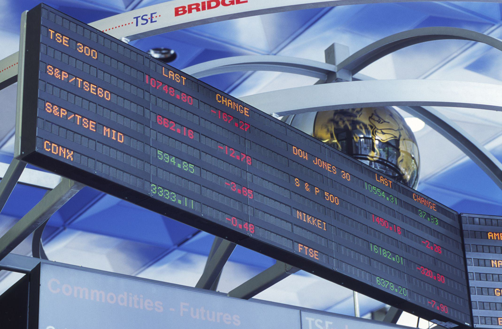

The financial markets span a broad and extensive spectrum, with the Montreal Stock Exchange (MX) holding a critical position in the field of derivatives trading. Established as a cornerstone of Canadian financial infrastructure, the MX has been pivotal in facilitating the trading of derivative contracts, which include equity options and index futures. Historically, the exchange's focus has shifted over time to embrace derivatives, transforming into a central venue for this sophisticated market segment.

Among the significant advancements shaping this landscape is algorithmic trading, often abbreviated as algo trading. In recent years, algorithmic trading has fundamentally redefined trading methodologies by integrating advanced algorithms to execute trades based on specific criteria at speeds far surpassing human capabilities. This innovation has not just streamlined trading strategies but also democratized access, offering both institutional and individual investors in Montreal and beyond the ability to participate in financial markets with previously unimaginable efficiency.

This article examines the fundamental aspects of the Montreal Stock Exchange, including its storied history, diverse product offerings, and the transformative impact of algorithmic trading. By understanding how these components intersect, traders and investors can gain critical insights into the evolution and current dynamics of the financial markets in Montreal, positioning themselves to better navigate and capitalize on emerging opportunities.

## Table of Contents

## Overview of the Montreal Stock Exchange

The Montreal Stock Exchange (MX) was founded in 1874, marking it as Canada's oldest financial exchange. It has played a crucial role in the development of financial markets within the country. Initially focused on equities trading, MX has undergone significant transformations over the decades to adapt to changing market demands and technological advancements.

In 2008, MX became a subsidiary of the TMX Group, a move that solidified its status as a major player in the derivatives market. The TMX Group, which also operates the Toronto Stock Exchange, provides a broader platform for MX to offer a wide range of derivatives products. These include financial instruments like equities, indexes, interest rates, and currency derivatives, making MX a pivotal hub for derivatives trading in Canada.

The shift towards derivatives trading commenced in 1975 when MX merged with the Canadian Stock Exchange. This strategic merger allowed MX to expand its offerings beyond traditional equity products to include derivatives. The launch of derivatives trading was a response to the growing need for financial instruments that could manage risk, a demand driven by increased market [volatility](/wiki/volatility-trading-strategies) and the globalization of financial markets.

The expansion into derivatives marked a significant evolution for MX, aligning it with global trends and enhancing its position within the financial industry. Today, MX's comprehensive suite of derivatives products attracts a diverse group of market participants who seek to hedge risks, speculate, or engage in [arbitrage](/wiki/arbitrage) across various asset classes. This repertoire of financial tools not only underscores the exchange’s adaptability but also its commitment to providing innovative solutions for contemporary trading challenges.

## A Historical Perspective

The Montreal Exchange, a key player in Canada's financial markets, underwent significant transformations at the turn of the millennium. In the year 2000, the exchange took a pivotal step by demutualizing. This transition marked the evolution from a member-owned institution to a for-profit corporation, aligning its operational model with modern financial exchanges. The process of demutualization provided the exchange with greater flexibility, allowing it to cater more efficiently to the demands of diverse market participants.

By 2001, the Montreal Exchange had fully automated its trading processes. The shift to electronic trading platforms was instrumental in enhancing trading efficiency, ensuring faster execution times, reducing errors associated with manual trading, and providing enhanced market transparency. Automation also paved the way for the development and implementation of more sophisticated trading strategies, accommodating the growing demand for complex derivatives products.

The Montreal Exchange became Canada's sole derivatives exchange in 1999, concentrating its efforts on derivatives trading. By 2005, the exchange had completely transitioned away from cash equities, focusing exclusively on derivatives. This strategic shift was indicative of its commitment to specialize in the derivatives market, positioning itself as a hub for financial instruments like options, futures, and swaps.

Throughout its history, the Montreal Exchange has been proactive in introducing innovative products to meet market demands. It offers various products, including equity options and bond futures, providing participants with tools for hedging, speculation, and risk management. More recently, the exchange introduced CORRA (Canadian Overnight Repo Rate Average) futures. These futures contracts are designed to provide effective risk management solutions in the [interest rate](/wiki/interest-rate-trading-strategies) derivatives market. CORRA futures are particularly significant, given their benchmark status, helping investors manage exposure to short-term interest rate fluctuations.

Through these developments, the Montreal Exchange has continuously adapted to the evolving financial landscape, demonstrating resilience and foresight in its strategic advancements. Its historical emphasis on innovation and specialization has solidified its position in the national and international financial markets.

## Product and Services Offerings

The Montreal Exchange (MX) provides a wide array of derivatives products designed to meet the diverse needs of traders and investors. These offerings include equity derivatives, currency options, index derivatives, and interest rate derivatives. These instruments play a crucial role in allowing market participants to hedge against risks, speculate on future price movements, and engage in arbitrage.

Equity derivatives at the Montreal Exchange encompass a variety of options and futures contracts based on individual stocks and equity indices. These products enable investors to gain exposure to the performance of specific companies or sectors without directly owning the underlying assets. Among the index derivatives, key offerings include the S&P/TSX 60 Index Futures. This contract, based on the S&P/TSX 60 Index, allows traders to speculate or hedge against the performance of the largest 60 publicly traded companies in Canada by market capitalization.

In interest rate derivatives, the Montreal Exchange provides critical tools for managing interest rate risk. The 10-year Government of Canada bond futures is a prominent product in this category. These futures contracts facilitate effective management of long-term interest rate exposure, enabling participants to mitigate potential risks associated with fluctuating interest rates. Given the importance of interest rates in financial markets, these derivatives are invaluable to institutional investors, asset managers, and corporate treasurers.

Currency options and derivatives at the Montreal Exchange offer exposure to foreign exchange markets, catering to individuals and institutions seeking to hedge against currency risk or capitalize on exchange rate movements. These options provide flexibility in executing strategies tailored to varying risk appetites and market views.

The diverse product offerings at the Montreal Exchange attract a wide range of market participants, each with unique objectives. The availability of such a variety of instruments fosters an environment conducive to hedging—allowing investors to protect against adverse price movements; speculation—offering opportunities to profit from predicted market trends; and arbitrage—enabling traders to exploit price discrepancies across correlated assets or markets. This diversity in derivatives products ensures the Montreal Exchange remains a pivotal platform for modern trading activities.

## Algo Trading: A Revolutionary Approach

Algorithmic trading, often abbreviated as algo trading, leverages pre-designed algorithms to execute trades. These algorithms follow predefined criteria, allowing trades to be conducted with precision at speeds and frequencies that are simply beyond human manual trading capabilities. This automated approach has gained substantial traction across major stock exchanges worldwide, including the Montreal Exchange, which is increasingly aligning itself with this technological advancement.

The Montreal Exchange is adopting automated trading to keep pace with global trends in financial markets. Algo trading's appeal lies in its ability to process vast amounts of market data to identify and exploit trading opportunities. With its sophisticated data analysis and rapid execution, algo trading provides a competitive edge in today's fast-paced market environments.

Various algo trading strategies are becoming fundamental components of trading activities. For instance, [trend following](/wiki/trend-following) is a strategy where the algorithm detects trends in the market and makes trades that align with the identified trends. This can involve mathematical models such as moving averages or statistical analysis to determine the strength and duration of a trend.

Another prevalent strategy is arbitrage, which involves exploiting price discrepancies in different markets or market segments for the same asset. An arbitrage algorithm might, for example, buy an asset in one market where the price is lower and sell it in another market where the price is higher, locking in a profit. These operations are typically executed within milliseconds, something unattainable through manual trading.

Algo trading also employs strategies such as mean reversion, which assumes that the price of a security will revert to its mean over time. The algorithm identifies when a price is overextended beyond its average value and trades in anticipation of a return to the norm.

The rise of algo trading on the Montreal Exchange reflects a broader industry trend toward technology-driven trading solutions. It offers a means to enhance the market's [liquidity](/wiki/liquidity-risk-premium) and efficiency, providing traders with tools to navigate complex and volatile market conditions. By embracing these advanced trading strategies, market participants on the Montreal Exchange can potentially realize increased trading opportunities and profitability.

## Benefits and Challenges of Algo Trading

Algorithmic trading, commonly known as algo trading, streamlines the trading process by utilizing pre-programmed algorithms, enabling rapid execution of trades based on specific criteria. This advancement is particularly beneficial in financial markets like those facilitated by the Montreal Stock Exchange, where speed and precision are crucial. 

One of the primary advantages of algo trading is its speed. Algorithms can process vast amounts of market data and execute trades in milliseconds or microseconds, timeframes that are beyond the capability of human traders. This rapid execution is pivotal in capitalizing on short-lived market opportunities, where delays could mean the difference between profit and loss.

Efficiency is another considerable benefit offered by algo trading. The ability to automate repetitive and complex tasks reduces the scope for human error and optimizes the allocation of time and resources. This automation allows traders to manage multiple portfolios and strategies concurrently without the need for continual manual oversight.

Moreover, algo trading significantly diminishes human biases in trading decisions. Human traders are susceptible to emotional and psychological influences, such as fear and greed, which can lead to irrational decision-making. Algorithms, on the other hand, operate purely based on logic and predefined criteria, ensuring a more disciplined approach to trading.

Despite these benefits, [algorithmic trading](/wiki/algorithmic-trading) is not without its challenges. One significant hurdle is the requirement for sophisticated technology and infrastructure. Developing, testing, and maintaining algorithms necessitate substantial investment in technology and skilled personnel. Additionally, the complexity of algorithmic systems can make them difficult to manage and monitor, especially in volatile market conditions.

Another challenge is the risk of technical failures. Even minor glitches in the algorithm or its execution system can lead to significant financial losses. High-frequency trading strategies, for instance, must be meticulously crafted and monitored to prevent errors that could spiral out of control in a matter of seconds.

In summary, while algo trading offers compelling advantages such as speed, efficiency, and objectivity, it also presents challenges that include the need for advanced technology and the potential for system failures. Despite these challenges, the ability to execute trades swiftly allows traders to effectively exploit transient market conditions, making algorithmic trading a valuable tool in the modern trading landscape.

## The Future of Financial Markets in Montreal

As technology transforms the financial landscape, the Montreal Exchange strategically positions itself to harness these advancements, notably through the adoption of algorithmic trading. This adoption is anticipated to significantly propel the growth of financial markets in Montreal, aligning with the global trend of digitalization in trading practices. Algorithmic trading, characterized by the use of pre-set algorithms to execute trades at high speeds, offers enhanced efficiency and precision, crucial elements that support the Montreal Exchange's expansion goals.

The focus of future developments will likely remain on improving liquidity, which is vital for ensuring that assets can be bought and sold swiftly without causing significant price changes. This liquidity is essential for attracting a diverse range of market participants, from institutional investors to individual traders. By enhancing liquidity, the Montreal Exchange strengthens its market robustness and attractiveness, crucial for sustained growth and competitiveness in international markets.

Efficiency improvements are also paramount as the exchange integrates more sophisticated trading strategies. These efficiency gains come from not only faster transaction times but also reduced costs and minimized human error, as algorithmic systems can process complex data at speeds far surpassing human capability. This greater efficiency contributes to tighter spreads and increased trading volumes, boosting market appeal and encouraging participation.

Access to international markets is another focal point for the Montreal Exchange as it seeks to position itself as a global trading hub. By expanding its international reach, the exchange can attract investors worldwide, diversify trading activities, and mitigate risks associated with dependence on local market conditions. This international focus not only enhances the exchange's growth prospects but also fosters cross-border investment opportunities, enriching the trading experience for domestic and foreign investors alike.

In conclusion, the future of financial markets in Montreal appears bright, driven by technological advances and strategic market positioning. As the Montreal Exchange continues to refine its offerings and harness the power of algorithmic trading, its role in the global financial ecosystem will likely grow, providing investors with efficient, liquid, and accessible trading opportunities.

## Conclusion

The Montreal Stock Exchange (MX) has established itself as a vital player in the global financial arena, with a particular focus on derivatives. This specialization supports the risk management and speculative needs of a diverse clientele, making MX a cornerstone for financial professionals engaged in derivatives trading. As the exchange increasingly integrates digital innovation and algorithmic trading, it further enhances trading efficiency. Algorithmic trading, with its capacity for executing numerous trades in fractions of a second, offers unprecedented opportunities and challenges for traders.

The shift towards algorithmic practices is not merely a trend but an ongoing transformation that MX is poised to lead. This progression facilitates better liquidity and more comprehensive market access, which are critical for maintaining competitive exchanges in the rapidly evolving financial sectors. By fostering a robust ecosystem for trading, MX not only caters to domestic needs but also plays a pivotal role in connecting the Canadian financial system to broader international markets.

For anyone interested in modern financial markets, understanding the dynamics of the Montreal Stock Exchange is essential. Given its trajectory towards integrating advanced trading technologies, participants can expect an environment conducive to sophisticated trading strategies and comprehensive market participation. As these developments unfold, MX remains at the forefront of creating inclusive and efficient financial landscapes, a testament to its enduring relevance and adaptability in global finance.

## References & Further Reading

[1]: Croft, M., & Dixon, M. (2018). ["The Impact of Algorithmic Trading in Capital Markets."](https://www.sciencedirect.com/science/article/pii/S0957417422006479) ACM SIGKDD Explorations Newsletter, 20(1), 13-15.

[2]: Aldridge, I. (2013). ["High-Frequency Trading: A Practical Guide to Algorithmic Strategies and Trading Systems."](https://www.wiley.com/en-us/High+Frequency+Trading%3A+A+Practical+Guide+to+Algorithmic+Strategies+and+Trading+Systems%2C+2nd+Edition-p-9781118343500) John Wiley & Sons.

[3]: Hull, J. C. (2018). ["Options, Futures, and Other Derivatives."](https://www.semanticscholar.org/paper/Options%2C-Futures%2C-and-Other-Derivatives-Hull/89bdee500c8623864fc9eb7a471546aa713acc44) 10th Edition. Pearson.

[4]: Tsay, R. S. (2010). ["Analysis of Financial Time Series."](https://onlinelibrary.wiley.com/doi/book/10.1002/9780470644560) 3rd Edition. John Wiley & Sons.

[5]: Financial Markets Department. (2008). ["The Canadian Overnight Repo Rate Average (CORRA)"](https://www.bankofcanada.ca/wp-content/uploads/2010/06/zorn.pdf) Bank of Canada.

[6]: Cartea, A., Jaimungal, S., & Penalva, J. (2015). ["Algorithmic and High-Frequency Trading."](https://assets.cambridge.org/97811070/91146/frontmatter/9781107091146_frontmatter.pdf) Cambridge University Press.