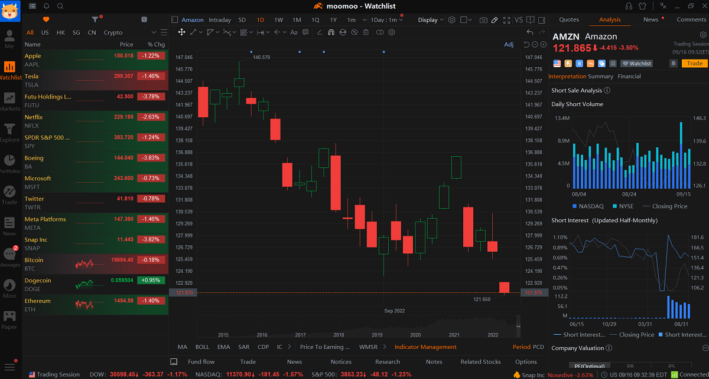

## Table of Contents

## What is the Moomoo trading platform?

Moomoo is an online trading platform that lets people buy and sell stocks, options, and other investments. It's made by a company called Futu Holdings, which is based in Hong Kong. The platform is easy to use and has a lot of tools to help people make smart choices about their investments. You can use Moomoo on your computer or on your phone with an app.

One cool thing about Moomoo is that it has a community where people can talk about investing and share ideas. This can be really helpful if you're new to investing and want to learn from others. Moomoo also gives you real-time data and charts, so you can see what's happening with your investments right away. This can help you make quick decisions if you need to.

## How can beginners start using Moomoo?

To start using Moomoo, beginners need to download the Moomoo app from the app store on their phone or visit the Moomoo website on their computer. Once the app is installed or the website is open, they should sign up for an account by providing some basic information like their name, email, and phone number. After signing up, they'll need to verify their identity, which usually involves uploading a photo of their ID and maybe a selfie. This step is important to keep the platform safe and secure.

Once their account is set up and verified, beginners can start exploring the platform. They can add money to their account using a bank transfer or other methods that Moomoo supports. After funding their account, they can start looking at different stocks and other investments. Moomoo has a lot of tools to help beginners learn, like tutorials and a community where they can ask questions and get advice from more experienced investors. It's a good idea to start small and learn as they go, using the resources Moomoo provides to make smart investment choices.

## What are the key features of Moomoo that attract users?

One of the main reasons people like Moomoo is because it's easy to use and has a lot of tools to help them make good investment choices. The platform gives you real-time data and charts, so you can see what's happening with your investments right away. This can help you make quick decisions if you need to. Moomoo also has a community where people can talk about investing and share ideas. This can be really helpful if you're new to investing and want to learn from others.

Another big feature of Moomoo is that it's available on both your phone and computer. This means you can check your investments anytime, anywhere. The app is designed to be simple and easy to navigate, so even if you're new to trading, you won't feel lost. Plus, Moomoo offers educational resources like tutorials and guides, which can help you learn more about investing and how to use the platform effectively.

## How does Moomoo compare to other trading platforms in terms of fees?

Moomoo is known for having low fees, which is a big reason why people like it. For example, Moomoo doesn't charge any commission fees for trading stocks and ETFs. This means you can buy and sell these investments without paying extra money just for the trade. However, there might be some small fees for things like options trading or if you need to use certain services, but overall, Moomoo keeps its fees pretty low.

When you compare Moomoo to other trading platforms, you'll see that some of them charge more. For instance, some platforms might charge a commission fee every time you trade, which can add up if you trade a lot. Other platforms might have higher fees for things like account maintenance or withdrawing money. Moomoo's low fees make it a good choice if you want to keep more of your money in your pocket while you invest.

Overall, Moomoo's fee structure is competitive and attractive to many users. It's especially good for people who are just starting out and want to keep their costs down. While every platform has its own set of fees, Moomoo's approach to keeping fees low is one of the reasons it stands out in the crowded world of trading platforms.

## What types of assets can be traded on Moomoo?

Moomoo lets you trade different kinds of assets. You can buy and sell stocks, which are shares in companies. You can also trade ETFs, which are like baskets of stocks that you can buy and sell as one unit. Another type of asset you can trade on Moomoo is options, which are contracts that give you the right to buy or sell a stock at a certain price.

In addition to stocks, ETFs, and options, Moomoo also lets you trade futures. Futures are agreements to buy or sell an asset at a future date for a price you agree on now. This can be useful if you want to bet on what might happen to the price of something in the future. So, with Moomoo, you have a variety of assets to choose from, depending on what you want to invest in.

## How does Moomoo's user interface enhance the trading experience?

Moomoo's user interface is designed to be easy to use, even if you're new to trading. When you open the app or website, you'll see a clean layout with clear menus and buttons. This makes it simple to find what you need, whether you're looking at your investments, checking real-time data, or joining the community to talk with other traders. The interface also has a lot of helpful tools, like charts and graphs, that you can use to understand your investments better. This can help you make smarter choices about when to buy or sell.

Another great thing about Moomoo's interface is that it works well on both your phone and computer. This means you can keep an eye on your investments no matter where you are. The app is designed to be fast and responsive, so you can make trades quickly if you need to. Plus, the interface lets you customize your experience, so you can set up your dashboard to show the information that's most important to you. This makes it easier to manage your investments and stay on top of the market.

## What advanced trading tools does Moomoo offer to experienced traders?

Moomoo offers a lot of advanced tools that can help experienced traders make smart choices. One of the main tools is the ability to use different types of charts, like candlestick and line charts, which can show you a lot of information about how a stock is doing. You can also set up custom indicators and drawing tools on these charts to help you see patterns and trends. This can be really useful if you want to make quick decisions based on what the market is doing right now.

Another important tool for experienced traders is the ability to set up different types of orders, like limit orders and stop-loss orders. These let you control when you buy or sell a stock, which can help you manage risk and make sure you get the price you want. Moomoo also has a feature called paper trading, where you can practice trading with fake money. This is a great way to test out new strategies without risking your real money. Overall, these tools make Moomoo a powerful platform for traders who know what they're doing.

## How does Moomoo ensure the security of user data and funds?

Moomoo takes the security of user data and funds very seriously. They use strong encryption to keep your information safe when you're using the app or website. This means that your personal details and financial information are protected from hackers. Moomoo also follows strict rules and regulations to make sure they're doing everything they can to keep your data secure. They have systems in place to watch for any unusual activity on your account, so if something strange happens, they can step in quickly to protect you.

In addition to protecting your data, Moomoo works hard to keep your money safe. They use separate accounts to hold your funds, which means your money is kept separate from the company's money. This is important because it helps make sure your funds are always there when you need them. Moomoo also has insurance to cover your money in case something goes wrong. So, you can feel confident that your investments and personal information are in good hands when you use Moomoo.

## What are the educational resources available on Moomoo for traders at different levels?

Moomoo has a lot of educational resources that can help traders at different levels learn more about investing. For beginners, Moomoo offers tutorials and guides that explain the basics of trading. These resources cover things like how to read stock charts, what different types of investments are, and how to make your first trade. There are also videos and articles that break down complex ideas into simple terms, so you can understand them easily. This can be really helpful if you're new to trading and want to learn the ropes.

For more experienced traders, Moomoo provides advanced tools and resources to help them improve their skills. They can find in-depth analysis and research reports that give them a deeper understanding of the market. Moomoo also has a community where traders can share ideas and learn from each other. This can be a great way to get new insights and stay up-to-date with what's happening in the world of investing. Whether you're just starting out or you've been trading for a while, Moomoo has something to help you grow as an investor.

## How does Moomoo's mobile app perform compared to its desktop version?

Moomoo's mobile app is designed to be easy to use and fast, just like its desktop version. The app lets you do everything you can do on the desktop, like buying and selling stocks, checking real-time data, and joining the community to talk with other traders. The main difference is that the mobile app is made to work well on smaller screens, so the buttons and menus are a bit bigger and easier to tap. This makes it simple to use Moomoo on your phone, even if you're on the go.

The desktop version of Moomoo has a bit more space to show you more information at once. This can be helpful if you like to keep an eye on a lot of different stocks or if you want to use more advanced tools. But, the mobile app is just as fast and responsive as the desktop version, so you won't miss out on anything important. Whether you're using the app or the desktop, Moomoo makes sure you have a smooth and easy trading experience.

## What are the latest updates or features added to Moomoo in 2024?

In 2024, Moomoo added some cool new features to make trading even better. One big update is the new AI-powered analysis tool. This tool uses smart technology to help you understand the market better. It can give you ideas about which stocks might do well and why. This can be really helpful if you want to make smarter choices about your investments. Another new feature is the improved community section, where you can now join live webinars and workshops. This means you can learn from experts and other traders in real-time, which can help you improve your skills.

Moomoo also made some changes to make the app easier to use. They added a new feature called "Quick Trade," which lets you buy and sell stocks with just a few taps. This can save you time if you need to make a trade quickly. They also improved the way you can customize your dashboard. Now, you can set it up to show you exactly the information you want to see, like your favorite stocks or the latest news. These updates make Moomoo a better place for both new and experienced traders to manage their investments.

## How does Moomoo plan to evolve its services in the future?

Moomoo wants to keep making its platform better for everyone. They plan to add more tools that use smart technology, like AI, to help you understand the market even better. They're also thinking about adding new types of investments you can trade, like cryptocurrencies. This would give you more choices and help you build a bigger and better investment plan. Moomoo also wants to make the app easier to use, so they'll keep updating it to make sure it's fast and simple, no matter if you're using it on your phone or computer.

Another big focus for Moomoo is helping you learn more about investing. They plan to add more educational resources, like more videos, articles, and even interactive lessons. This will help both new and experienced traders improve their skills. Moomoo also wants to make the community part of the platform even better. They're thinking about adding more ways for you to connect with other traders, like more live events and group discussions. This way, you can learn from each other and stay up-to-date with what's happening in the world of investing.

## References & Further Reading

[1]: ["Advances in Financial Machine Learning"](https://www.amazon.com/Advances-Financial-Machine-Learning-Marcos/dp/1119482089) by Marcos Lopez de Prado

[2]: ["Machine Learning for Algorithmic Trading"](https://github.com/PacktPublishing/Machine-Learning-for-Algorithmic-Trading-Second-Edition) by Stefan Jansen

[3]: ["Evidence-Based Technical Analysis: Applying the Scientific Method and Statistical Inference to Trading Signals"](https://www.amazon.com/Evidence-Based-Technical-Analysis-Scientific-Statistical/dp/0470008741) by David Aronson

[4]: ["Quantitative Trading: How to Build Your Own Algorithmic Trading Business"](https://books.google.com/books/about/Quantitative_Trading.html?id=j70yEAAAQBAJ) by Ernest P. Chan

[5]: Bergstra, J., Bardenet, R., Bengio, Y., & Kégl, B. (2011). ["Algorithms for Hyper-Parameter Optimization."](https://proceedings.neurips.cc/paper/2011/file/86e8f7ab32cfd12577bc2619bc635690-Paper.pdf) Advances in Neural Information Processing Systems 24.