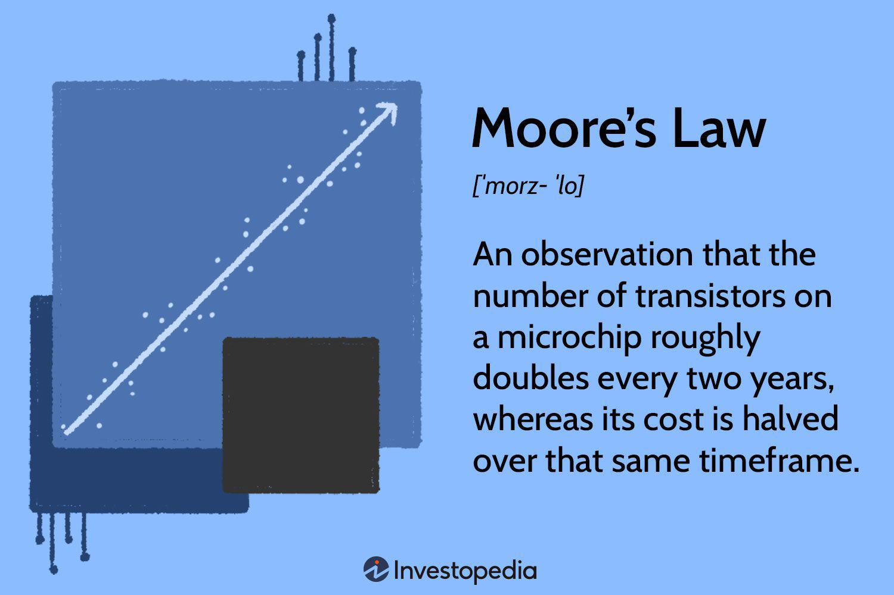

## Table of Contents

## What is Moore's Law?

Moore's Law is a prediction made by Gordon Moore in 1965. He said that the number of transistors on a microchip would double about every two years. This means that computers would get faster and smaller over time. This prediction has been very important for the technology industry. It has helped companies plan how to make better and cheaper computers.

Even though it's called a law, Moore's Law is more of a trend. It's not a rule that must happen, but it has been pretty accurate for a long time. Recently, it has become harder to keep up with this trend. Making transistors smaller is getting more difficult and expensive. But Moore's Law has still been a big influence on how technology has grown and changed over the years.

## Who is Gordon Moore and why did he propose this law?

Gordon Moore is a scientist and businessman. He was born in 1929. He helped start a big company called Intel, which makes computer chips. In 1965, he wrote an article where he talked about how the number of transistors on a chip was growing fast. He said it would keep doubling every two years. This idea became known as Moore's Law.

Moore proposed this law because he saw a pattern in how technology was changing. He noticed that engineers were finding ways to put more and more transistors on a chip. This made computers faster and cheaper. He thought this trend would continue for a long time. His prediction helped companies plan for the future and push the limits of what was possible in technology.

## How was Moore's Law originally stated?

Gordon Moore first talked about what we now call Moore's Law in 1965. He wrote an article where he said that the number of transistors on a chip would double every year. At the time, he was working at a company called Fairchild Semiconductor. He saw that technology was improving quickly and thought it would keep getting better at a fast pace.

Later, in 1975, Moore updated his prediction. He changed it to say that the number of transistors would double every two years instead of every year. This change made his prediction more realistic and it became the version of Moore's Law that most people know today. His idea helped guide the tech industry and showed how fast technology could grow.

## What is the mechanism behind Moore's Law?

The mechanism behind Moore's Law is about making computer chips better. It's all about fitting more tiny parts called transistors onto a chip. Transistors are like switches that control the flow of electricity in a computer. When you can put more transistors on a chip, the computer can do more work faster. This happens because engineers find new ways to make transistors smaller and pack them closer together.

To make this happen, engineers use special tools and techniques. They use very small machines to carve out tiny circuits on a piece of silicon. Over time, these machines and methods have gotten better, allowing more transistors to fit in the same space. But it's getting harder to keep making transistors smaller. It costs a lot of money and needs very advanced technology. Still, this is the main way that computers have kept getting faster and cheaper, following Moore's Law.

## How has the semiconductor industry used Moore's Law as a guiding principle?

The semiconductor industry has used Moore's Law as a roadmap for growth and development. Companies in this industry have worked hard to make sure they could keep doubling the number of transistors on a chip every two years. This goal helped them plan their research and development. They knew they needed to keep making transistors smaller and more efficient. This push led to big improvements in technology, making computers faster and cheaper for everyone.

But following Moore's Law has not been easy. It has become harder and more expensive to make transistors even smaller. The industry has had to spend a lot of money on new tools and techniques. Despite these challenges, Moore's Law has been a big motivator. It has encouraged companies to keep innovating and finding new ways to improve their products. This has helped the semiconductor industry stay at the forefront of technology and continue to grow.

## What are the key technological advancements that have driven Moore's Law?

The key technological advancements that have driven Moore's Law are mainly about making transistors smaller and more efficient. One big advancement is photolithography, which is a way to draw tiny circuits on silicon chips using light. Over time, engineers have made this process better by using shorter wavelengths of light, like ultraviolet and even extreme ultraviolet light, to make even smaller and more precise circuits. Another important advancement is the development of new materials, like high-k dielectrics, which help make transistors work better even when they are very small.

Another crucial advancement is the use of three-dimensional (3D) transistor designs, like FinFETs. These designs allow more transistors to be packed into the same space by stacking them vertically instead of just spreading them out flat. This has helped keep the number of transistors on a chip growing. Additionally, improvements in manufacturing processes, like better control over impurities in the silicon and more precise etching techniques, have also been vital. These advancements have all worked together to keep Moore's Law going, making computers faster and more powerful year after year.

## How has Moore's Law impacted the development of computer hardware?

Moore's Law has had a big impact on computer hardware. It has pushed companies to make computers faster and smaller. Because of Moore's Law, engineers have worked hard to fit more and more transistors onto chips. This means computers can do more work in less time. It also means that computers have become cheaper, so more people can buy them. This has helped computers become a big part of everyday life.

But it hasn't been easy to keep up with Moore's Law. Making transistors smaller and smaller is getting harder and more expensive. Engineers have had to come up with new ways to do it, like using different materials and building transistors in 3D. Even though it's tough, the push to follow Moore's Law has led to a lot of new ideas and inventions. This has made computers keep getting better, even if the pace is slowing down a bit.

## What are the economic implications of Moore's Law?

Moore's Law has had a big impact on the economy. It has made computers cheaper and more powerful. This means businesses can do more work with less money. They can use computers to do things faster and better. This has helped the economy grow because companies can make more money and create more jobs. Also, because computers are cheaper, more people can buy them. This has made the computer industry very big and important.

But keeping up with Moore's Law is getting harder and more expensive. Companies have to spend a lot of money on new technology to make transistors smaller. This can make it tough for smaller companies to compete. They might not have enough money to keep up. Also, if it gets too hard to make computers better, it could slow down the economy. But so far, the push to follow Moore's Law has led to a lot of new ideas and inventions. This has helped the economy keep growing.

## How has Moore's Law influenced the growth of the internet and digital technologies?

Moore's Law has played a big role in making the internet and digital technologies grow. It has helped make computers faster and cheaper. Because of this, more people can use the internet. They can do things like sending emails, using social media, and watching videos online. Companies can also use the internet to sell things and do business all over the world. This has made the internet a very important part of our lives.

But it's not just about the internet. Moore's Law has also helped make other digital technologies better. Things like smartphones, tablets, and smart home devices have all gotten faster and cheaper. This means more people can use them. These devices help us do more things, like staying connected with friends and family, working from home, and even controlling our homes with our voices. All of this has made our lives easier and more connected.

## What are the current challenges to sustaining Moore's Law?

Keeping up with Moore's Law is getting harder. The main problem is that it's tough to make transistors even smaller. Transistors are the tiny parts inside computer chips that do the work. When they get too small, they can start to have problems. They might not work as well or they might be too hard to make. It also costs a lot of money to build the machines and find the new ways to make these tiny transistors.

Another challenge is that the cost of making new chips is going up. Companies have to spend a lot of money on research and new technology. This can be hard for smaller companies because they might not have enough money to keep up. Also, there are physical limits to how small transistors can get. Scientists are trying to find new materials and ways to build chips, but it's not easy. Even though it's tough, people are still working hard to keep making computers better, even if it's slower than before.

## What are potential future technologies that could extend Moore's Law?

One way to keep Moore's Law going is by using new materials. Right now, we use silicon to make computer chips. But scientists are looking at other materials, like graphene and carbon nanotubes. These materials can be made very thin and can [carry](/wiki/carry-trading) electricity really well. This could help make transistors even smaller and faster. Another idea is to use new ways of making chips, like 3D stacking. Instead of spreading transistors out flat, we can stack them on top of each other. This can fit more transistors in the same space, making chips more powerful.

Another future technology is quantum computing. Quantum computers use the strange rules of quantum physics to do calculations in a totally different way. They could solve problems much faster than today's computers. But they are very hard to build and need to be kept very cold. If we can make them work well, they could be a big step forward. Also, new types of memory, like phase-change memory and memristors, could help. These can store data faster and use less power. All these ideas are still being worked on, but they show that there are still ways to keep making computers better, even if it's not easy.

## How do experts predict the long-term viability of Moore's Law?

Experts think that Moore's Law might not keep going the way it has been. It's getting really hard to make transistors smaller and smaller. The machines and techniques needed to do this are getting more expensive. Some people think that we might be reaching the limits of what we can do with current technology. They say that we might need to find totally new ways to make computers faster and better.

But there is still hope. Scientists are working on new ideas like using different materials and building chips in 3D. They are also looking at totally different types of computers, like quantum computers. These new technologies could help keep computers improving, even if it's not in the same way as before. So, while it's tough to say exactly what will happen, many experts believe that with new ideas and inventions, we can keep making progress in computer technology.

## References & Further Reading

[1]: Moore, G. E. (1965). ["Cramming more components onto integrated circuits."](https://ieeexplore.ieee.org/document/658762) Electronics, 38(8).

[2]: Lopez de Prado, M. (2018). ["Advances in Financial Machine Learning."](https://www.amazon.com/Advances-Financial-Machine-Learning-Marcos/dp/1119482089) Wiley.

[3]: Aronson, D. R. (2006). ["Evidence-Based Technical Analysis: Applying the Scientific Method and Statistical Inference to Trading Signals."](https://www.amazon.com/Evidence-Based-Technical-Analysis-Scientific-Statistical/dp/0470008741) Wiley.

[4]: Jansen, S. (2020). ["Machine Learning for Algorithmic Trading."](https://github.com/stefan-jansen/machine-learning-for-trading) Packt Publishing.

[5]: Chan, E. P. (2009). ["Quantitative Trading: How to Build Your Own Algorithmic Trading Business."](https://github.com/ftvision/quant_trading_echan_book) Wiley.