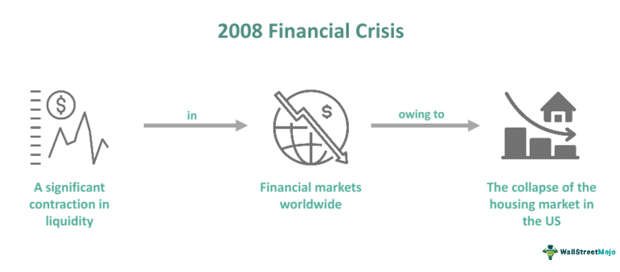

The financial crisis of 2008 marked a pivotal moment in global economic history, shaking the foundation of financial institutions worldwide. This catastrophic event was not the result of a single cause but rather a confluence of various elements that, when combined, led to significant economic turmoil. Among the key contributors to this crisis were a myriad of economic factors, compounded by moral hazards and the burgeoning of algorithmic trading, each playing a crucial role in the catastrophe that unfolded.

Economic factors laid the groundwork for instability, as low interest rates and a booming real estate market encouraged risky financial behaviors. Complex financial instruments, such as mortgage-backed securities, were over-leveraged and misjudged, creating a fragile economic landscape ripe for collapse. These instruments, often underpinned by subprime mortgages, spread risk globally and significantly contributed to the crisis. Moreover, the reckless pursuit of higher profits led to a widespread imbalance that made the financial system vulnerable to shocks.

Moral hazard significantly intensified the crisis, as financial institutions engaged in high-risk activities, operating under the assumption that they were 'too big to fail.' Such beliefs encouraged reckless lending and investment practices, causing systemic vulnerabilities. This mindset was bolstered by the expectation of government bailouts, which, although deemed necessary at the time, perpetuated a cycle of risky behavior without sufficient accountability.

The evolution of algorithmic trading further complicated the financial landscape. While these high-frequency trading algorithms brought about increased market efficiencies, they also introduced new vulnerabilities, amplifying market volatility during periods of stress. This dual nature of algorithmic trading made it both a tool of progress and a challenge that called for regulatory attention. Such complexities underscore the intricate web of decisions and consequences at play during the financial downturn.

Understanding these aspects is crucial not only for historical context but also for crafting strategies to prevent future economic crises. The lessons learned from the 2008 financial crisis emphasize the need for continuous vigilance, balanced regulation, and prudent risk management in financial systems. As we proceed with this examination, we aim to illuminate the decisions and consequences that shaped the 2008 economic downturn, offering insights to build more resilient financial frameworks for the future.

## Table of Contents

## Economic Factors Leading to the 2008 Financial Crisis

The 2008 financial crisis was precipitated by a confluence of economic factors, most notably low interest rates, an overheated real estate market, and the proliferation of intricate financial instruments. Following the burst of the Dotcom bubble in the early 2000s, investors were lured to the real estate market, seeking refuge in what was perceived as a more stable investment. This migration of capital inflated housing prices, creating a bubble destined to burst.

Subprime mortgages constituted a significant element within this scenario. These types of mortgages were offered to borrowers with suboptimal credit histories, under the premise of spreading homeownership. Financial institutions, driven by the pursuit of short-term profits, issued these loans without stringent credit checks. To mitigate the associated risks, these subprime mortgages were bundled into mortgage-backed securities (MBS) and further into complex instruments like collateralized debt obligations (CDOs). These securities, despite their underlying high-risk loans, were often given triple-A ratings by credit rating agencies, misleading investors about their true risk.

The global distribution of these securities spread financial risk across banks and financial institutions worldwide. The interconnectedness of the global financial system meant that the failure of these instruments in one region reverberated across borders, creating a ripple effect. This distribution was facilitated by the belief that the bundling of diverse mortgages would inherently decrease the overall risk (based on the assumption of non-correlated defaults among borrowers), a hypothesis that proved fatally flawed.

In essence, these factors cultivated a precarious financial environment, fragile and primed for a crisis. The underestimation of risk, compounded by inadequate regulatory oversight and the overvaluation of financial products, set the stage for a financial implosion once the housing bubble burst. The resulting collapse of major financial institutions necessitated unprecedented government interventions and underscored the systemic vulnerabilities inherent in contemporary financial systems.

## Moral Hazard and Its Role in Exacerbating the Crisis

Moral hazard was a pivotal [factor](/wiki/factor-investing) in intensifying the 2008 financial crisis. This economic concept occurs when a party engages in risk-taking, secure in the knowledge that any adverse outcomes will be borne by another entity. During the financial crisis, moral hazard was evident in several critical ways.

Financial institutions, emboldened by the belief that they were "too big to fail," adopted excessive risk-taking in their lending practices. Banks, convinced of their indispensability to the financial system, presumed that government interventions would rescue them if their risk strategies backfired. This sense of security led to reckless lending, particularly in the housing sector, where institutions extended credit without adequate assessment of borrowers' repayment capabilities. They assumed that if the situation worsened, governmental bodies would provide necessary bailouts to stabilize the economy.

Another significant aspect of moral hazard during this period was the practice of selling mortgage loans to third parties. Financial institutions sold these loans in the form of mortgage-backed securities to investors worldwide. By doing so, they transferred the risk associated with these loans away from themselves. This detachment from the original loan ownership reduced the incentive for banks to properly scrutinize and vet borrowers before loan approval. Consequently, many financially unqualified individuals received loans, contributing to a cascade of defaults that would later unravel the financial system.

Government bailouts were indeed necessary to prevent a complete economic collapse, yet they inadvertently reinforced the moral hazard concept. By stepping in to save floundering institutions, governments set a precedent of shielding these bodies from the full consequences of their imprudent financial decisions. This interventionist approach suggested that financial institutions could continue operating hazardously, anticipating future bailouts instead of learning from past errors.

The intertwining of moral hazard and financial instability during the 2008 crisis highlighted the need for tighter regulation to mitigate such risk-taking behavior. Addressing moral hazard is critical in ensuring that financial institutions do not engage in strategies that jeopardize the broader economic landscape, with the expectation of being rescued when those strategies fail.

## Algorithmic Trading: A Double-Edged Sword

The rise of [algorithmic trading](/wiki/algorithmic-trading) marked a significant transformation in the financial markets, offering a paradoxical blend of increased efficiency and heightened vulnerability. This form of trading, which relies on sophisticated algorithms to execute trades at speeds and volumes beyond human capability, has reshaped how markets operate. High-frequency trading ([HFT](/wiki/high-frequency-trading-strategies)), a subset of algorithmic trading, exemplifies this phenomenon. Using powerful algorithms, HFT enables the execution of thousands of trades within fractions of a second, greatly enhancing market [liquidity](/wiki/liquidity-risk-premium) by ensuring the rapid buying and selling of assets.

However, the benefits of HFT are paralleled by considerable risks, particularly concerning market [volatility](/wiki/volatility-trading-strategies). During periods of market stress, the algorithms that drive HFT can accelerate price movements rather than stabilize them. Their reliance on pre-determined strategies without human discretion can lead to a cascade of trades amplifying market swings. This was evidenced during events such as the Flash Crash of May 6, 2010, when the Dow Jones Industrial Average plummeted about 1,000 points within minutes, primarily due to HFT activities.

The role of algorithmic trading in the 2008 financial crisis is multifaceted. While it was not the primary cause of the crisis, it illustrated the potential for technological innovations to exacerbate existing market vulnerabilities. The reliance on complex algorithms without equally sophisticated regulatory oversight underscored the risks inherent in such technological advancement. Algorithmic trading’s impact during the crisis period led to calls for more robust regulatory frameworks, aimed at creating a balanced environment that harnesses the benefits of algorithmic trading while mitigating its risks.

To address these challenges, it has become imperative for regulators to develop comprehensive strategies that encompass the monitoring and management of algorithmic trading systems. This involves setting limits on the types of strategies that can be employed, establishing minimum latency periods, and implementing "circuit breakers" to pause trading in extremely volatile conditions. Ongoing adaptation of regulatory approaches is crucial to anticipate technological advancements in trading practices, ensuring that the financial markets remain resilient against potential exploitations and systemic disruptions.

## Lessons Learned and Future Implications

The financial crisis of 2008 illuminated the profound consequences of unchecked financial innovation and insufficient regulatory oversight. One of the significant lessons centers around the realization that novel financial products, while potentially lucrative, [carry](/wiki/carry-trading) inherent risks that necessitate vigilant monitoring and management. The crisis underscored the perils of allowing complex financial instruments, such as mortgage-backed securities and derivatives, to proliferate without comprehensive understanding or control of their systemic impacts.

In response to the crisis, global efforts have been made to address the moral hazard that beleaguered the financial system. Regulators introduced stricter lending standards designed to ensure that borrowers possess the necessary creditworthiness and ability to repay their debts. Enhanced oversight of financial markets was also implemented to promote transparency and accountability among financial institutions. The introduction and strengthening of capital requirements, notably through frameworks like Basel III, aimed to fortify banks by ensuring they hold an adequate capital buffer to weather financial turbulences.

Algorithmic trading, which played a notable role during the crisis, continues to pose both challenges and opportunities for financial markets. While it enhances market efficiency by enabling rapid execution of trades and improving liquidity, it also increases market volatility and susceptibility to flash crashes. Consequently, continuous monitoring and adaptation by regulators are imperative to prevent exploitation and ensure that these technological advancements contribute positively to market stability. Regulatory measures such as circuit breakers and limitations on high-frequency trading are examples of steps taken to mitigate potential negative impacts.

Ultimately, establishing a stable financial environment requires a balanced approach that embraces innovation while maintaining prudent risk management practices. This entails fostering a culture of responsible lending, enhancing regulatory frameworks, and promoting financial literacy among consumers and investors. By doing so, future economic crises can be mitigated, safeguarding the global financial system and ensuring sustainable economic growth. The crisis serves as a constant reminder of the importance of vigilant oversight and adaptive policies in the ever-evolving landscape of global finance.

## Conclusion

The 2008 financial crisis serves as a stark reminder of the complexities that characterize modern financial systems. This crisis was the result of a confluence of economic factors, moral hazards, and the evolution of algorithmic trading, which together created a perfect storm capable of destabilizing global financial markets. The interplay of these components illustrated the vulnerabilities inherent in the financial architecture of the time, setting off a cascade of failures across institutions.

Economic factors like low interest rates, the bursting of housing bubbles, and the proliferation of complex financial instruments played a central role in the crisis. These were further compounded by moral hazards prevalent in the financial sector, where risky financial behavior was often encouraged by the belief that some institutions were simply "too big to fail." Additionally, the emergence of algorithmic trading, while bringing efficiencies, also introduced new risks that exacerbated market volatility during periods of stress.

The 2008 crisis underscored the necessity of deriving lessons to build resilient financial systems that can withstand future economic shocks. While regulatory frameworks have since been strengthened, incorporating stricter lending standards and enhanced market oversight, these steps alone are not sufficient. Continuous vigilance and the capacity for adaptation remain essential in safeguarding our economic future. The crisis emphasized the importance of finding a balance between financial innovation and the prudent management of risk to ensure stability. Understanding these dynamics is crucial for preventing history from repeating itself and for fostering a secure financial environment for future generations.

## References & Further Reading

[1]: Friedman, B. M. (2009). ["The Moral Consequences of Economic Growth."](https://scholar.harvard.edu/files/bfriedman/files/the_moral_consequences_of_economic_growth.pdf) Vintage.

[2]: Lewis, M. (2010). ["The Big Short: Inside the Doomsday Machine."](https://www.amazon.com/Big-Short-Inside-Doomsday-Machine/dp/0393338827) W. W. Norton & Company.

[3]: Roubini, N., & Mihm, S. (2010). ["Crisis Economics: A Crash Course in the Future of Finance."](https://books.google.com/books/about/Crisis_Economics.html?id=oQoNLVqZzQYC) Penguin Press.

[4]: Engle, R. F., & Weidman, S. (2010). ["Volatility and Time Series Econometrics: Essays in Honor of Robert Engle."](https://academic.oup.com/book/5659) Oxford University Press.

[5]: Patterson, S. (2012). ["Dark Pools: High-Speed Traders, A.I. Bandits, and the Threat to the Global Financial System."](https://dl.acm.org/doi/10.5555/2385786) Crown Business.