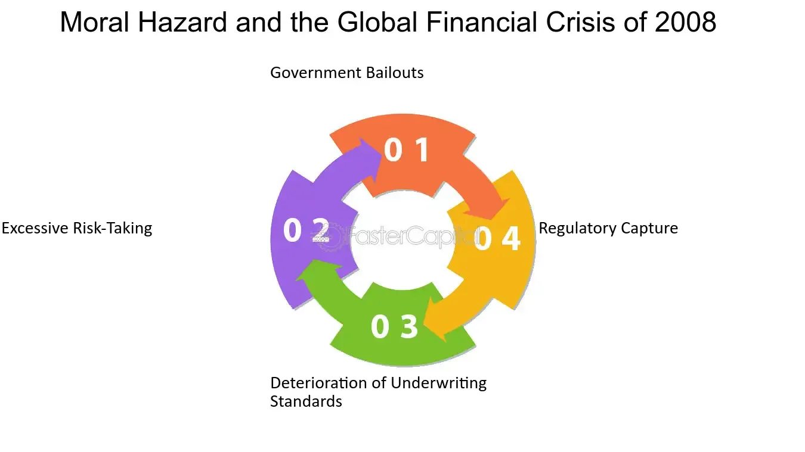

## Table of Contents

## What is moral hazard?

Moral hazard is when someone takes more risks because they know they won't have to deal with the bad results. Imagine you have insurance that covers everything if your house burns down. You might not be as careful with things like candles or leaving the stove on because you know the insurance will pay for the damage.

This problem can happen in many places, not just with insurance. For example, big banks might make risky investments if they believe the government will bail them out if things go wrong. It's a tricky issue because while we want to help people and businesses in tough situations, we also don't want to encourage them to take unnecessary risks.

## How does moral hazard relate to the financial sector?

Moral hazard in the financial sector happens when banks or financial institutions take bigger risks because they think they will be rescued if things go wrong. For example, if a bank believes the government will bail it out during a crisis, it might invest in riskier projects or loans, hoping to make big profits. They feel safer taking these risks because they think they won't have to face the full consequences if their investments fail.

This can lead to problems for the whole economy. When many banks take on too much risk, it can cause a financial crisis. If banks fail and need government help, taxpayers might have to pay for the bailouts. This can make people angry and feel it's unfair. To reduce moral hazard, governments and regulators try to set rules and keep a close watch on banks, making sure they don't take too many risks and have enough money to cover losses if things go wrong.

## What were the key events leading up to the 2008 financial crisis?

The 2008 financial crisis was caused by many things happening over time. One big reason was the housing market. Banks were giving out loans to people who couldn't really afford them, called subprime mortgages. These loans let people buy houses they couldn't normally afford. Banks then sold these loans to other investors as mortgage-backed securities. People thought these securities were safe because housing prices were always going up. But when housing prices started to fall, many people couldn't pay their loans back, and the value of these securities dropped a lot.

Another reason was the way banks were behaving. They took big risks because they thought they would be saved if things went wrong. This is called moral hazard. Also, there wasn't enough watching over the banks. The government and other groups didn't do a good job making sure banks were safe and not taking too many risks. When the housing market crashed, it caused a chain reaction. Banks lost a lot of money, and they couldn't lend to each other anymore. This led to a big financial crisis that affected the whole world.

In the end, the government had to step in to stop the crisis from getting worse. They gave money to banks to keep them from failing, and they tried to help people who were losing their homes. But it was a tough time, and it took years for things to get better. The crisis showed how important it is to keep an eye on the financial system and make sure banks are not taking too many risks.

## How did moral hazard contribute to the 2008 financial crisis?

Moral hazard played a big role in the 2008 financial crisis. Banks and financial institutions took more risks because they believed they would be rescued if things went wrong. For example, they gave out risky loans called subprime mortgages to people who couldn't afford them. Banks thought they could sell these loans to other investors and make money, without worrying about the loans going bad. They felt safe because they believed the government would bail them out if the loans failed.

This risky behavior led to a big problem. When housing prices started to fall, many people couldn't pay their loans back. The value of the mortgage-backed securities that banks sold also dropped a lot. Banks lost a lot of money, and it caused a chain reaction that led to the financial crisis. Because banks thought they wouldn't face the full consequences of their risky actions, they took too many chances, which made the crisis worse. In the end, the government had to step in with bailouts to stop the crisis from getting even worse.

## What role did government policies play in creating moral hazard before the crisis?

Government policies before the 2008 financial crisis helped create moral hazard by making banks feel safe taking big risks. The government had bailed out banks in the past, like during the savings and loan crisis in the 1980s. This made banks think the government would help them out again if they got into trouble. Also, the government pushed banks to give loans to more people, even if they couldn't afford them. This was done to help more people own homes, but it made banks take more risks.

Another way government policies added to moral hazard was through lax regulations. The government didn't watch banks closely enough to make sure they were being safe with their money. Banks were allowed to take big risks and make risky investments without much oversight. This let banks think they could do whatever they wanted without facing big consequences. When the housing market crashed, it showed how these policies had encouraged banks to take too many risks, leading to the big financial crisis.

## Can you explain the concept of 'too big to fail' in relation to moral hazard?

The idea of 'too big to fail' means that some banks or companies are so important to the economy that the government can't let them go bankrupt. If they fail, it could cause a lot of problems for everyone. This idea makes these big banks feel like they can take more risks because they think the government will step in to save them if things go wrong. This is a big part of moral hazard because it encourages risky behavior without worrying about the bad results.

When banks believe they are 'too big to fail,' they might make risky investments or loans, thinking they won't have to deal with the full consequences if they lose money. This can lead to bigger problems for the whole economy. For example, during the 2008 financial crisis, many big banks took too many risks because they thought they would be bailed out. When things went wrong, the government had to step in to stop the crisis from getting worse, which showed how the 'too big to fail' idea can create moral hazard and lead to big financial problems.

## How did financial instruments like mortgage-backed securities contribute to moral hazard?

Mortgage-backed securities were a big part of the moral hazard problem before the 2008 financial crisis. Banks would give out loans to people who couldn't afford them, called subprime mortgages. Then, they would package these loans into securities and sell them to other investors. Because these securities were thought to be safe, banks felt they could make risky loans without worrying about the consequences. They believed that if the loans went bad, it would be the investors' problem, not theirs. This encouraged banks to take more risks because they thought they wouldn't have to deal with the fallout if things went wrong.

The way these securities were traded also added to the moral hazard. Investors thought the securities were safe because they were rated highly by credit rating agencies. But these ratings were often wrong because the agencies didn't fully understand the risks involved. This false sense of security made everyone feel okay with taking more risks. When the housing market crashed and people couldn't pay their loans back, the value of these securities dropped a lot. Banks and investors lost a lot of money, showing how the use of mortgage-backed securities had encouraged risky behavior and contributed to the financial crisis.

## What were the consequences of moral hazard on the banking industry during the 2008 crisis?

Moral hazard had big effects on the banking industry during the 2008 crisis. Banks took too many risks because they thought they would be saved if things went wrong. They gave out risky loans and made risky investments, thinking they could make a lot of money without facing the bad results. When the housing market crashed, these risky moves led to huge losses. Many banks failed or were in big trouble, and this caused a big financial crisis that hurt the whole economy.

Because of moral hazard, the government had to step in and help the banks. They gave money to banks to keep them from failing completely, which was called a bailout. This made people angry because they felt it was unfair that banks could take risks and then get help from taxpayers when things went wrong. The crisis showed how dangerous moral hazard can be. It made banks take too many risks and led to a lot of problems for everyone. After the crisis, the government tried to make new rules to stop this from happening again, but it was a hard lesson about the dangers of moral hazard in the banking industry.

## How did regulatory responses to the crisis attempt to address moral hazard?

After the 2008 financial crisis, the government and other groups made new rules to stop moral hazard from causing more problems. One big change was the Dodd-Frank Act, which made banks have more money saved up, called capital requirements. This was to make sure banks could handle losses if their risky investments failed. The act also created a new group called the Financial Stability Oversight Council to watch over the financial system and make sure big banks weren't taking too many risks. These rules were meant to make banks think twice before making risky moves, knowing they would have to face the consequences if things went wrong.

Another way the government tried to fix moral hazard was by making it harder for banks to be bailed out. They set up a system called "orderly liquidation authority" to handle big banks that were failing without using taxpayer money. This was to stop banks from thinking they could take big risks and then get saved by the government. The government also made rules about how much risk banks could take and how they had to be more open about their risky investments. These changes were all about making the financial system safer and stopping banks from taking too many chances because they thought they would be rescued if things went bad.

## What are the long-term effects of moral hazard on financial stability?

Moral hazard can make the financial system less stable over time. When banks and other financial companies think they can take big risks without facing bad results, they might do things that are too risky. This can lead to problems like the 2008 financial crisis. If everyone is taking too many risks, it can cause a big mess that hurts the whole economy. When banks fail and need help, taxpayers might have to pay for bailouts, which can make people angry and feel it's unfair. This can also make it harder for the economy to grow because people and businesses might not trust banks as much.

To stop moral hazard from causing more problems, governments and regulators need to keep a close eye on the financial system. They need to make rules that make banks save more money and be more careful with their investments. If banks know they have to face the consequences of their risky actions, they might be less likely to take big chances. But it's a tricky balance because we also want to help banks and businesses when they're in trouble. The long-term goal is to make the financial system safer and more stable so that big crises like the one in 2008 don't happen again.

## How can future financial crises potentially be mitigated by addressing moral hazard?

To help prevent future financial crises, it's important to tackle moral hazard. This means making sure banks and other financial companies don't feel safe taking big risks because they think they'll be saved if things go wrong. Governments and regulators can do this by making rules that make banks keep more money saved up. This way, if banks make risky investments and lose money, they have enough to cover the losses without needing a bailout. Also, watching banks closely and being strict about how much risk they can take can stop them from making dangerous moves. If banks know they'll face the consequences of their actions, they'll be more careful.

Another way to address moral hazard is to make sure that if big banks fail, they can be handled without using taxpayer money. This can be done by setting up systems that let big banks fail in a way that doesn't hurt the whole economy. By making it clear that banks won't be bailed out, it encourages them to be more responsible with their investments. It's also important to be open about the risks banks are taking so everyone knows what's going on. By doing these things, we can make the financial system safer and reduce the chances of another big crisis like the one in 2008.

## What are the current debates among economists about moral hazard and its impact on financial systems?

Economists are still talking a lot about moral hazard and how it affects financial systems. Some economists think that strict rules and close watching can stop banks from taking too many risks. They believe that if banks know they have to face the bad results of their actions, they'll be more careful. These economists argue for things like higher capital requirements, where banks have to keep more money saved up, and strong oversight to make sure banks aren't doing anything too risky. They think these measures can make the financial system safer and prevent big crises.

On the other hand, some economists worry that being too strict might hurt the economy. They think that if banks are too scared to take any risks, they might not lend money to businesses and people who need it. This can slow down growth and make it harder for the economy to do well. These economists argue for a balance where banks can take some risks but are still held responsible for their actions. They believe in finding ways to help banks when they're in trouble without making them think they'll always be saved. The debate is about finding the right way to keep the financial system safe while still letting it help the economy grow.

## References & Further Reading

[1]: Friedman, B. M. (2009). ["The Moral Consequences of Economic Growth."](https://scholar.harvard.edu/files/bfriedman/files/the_moral_consequences_of_economic_growth.pdf) Vintage.

[2]: Lewis, M. (2010). ["The Big Short: Inside the Doomsday Machine."](https://www.amazon.com/Big-Short-Inside-Doomsday-Machine/dp/0393338827) W. W. Norton & Company.

[3]: Roubini, N., & Mihm, S. (2010). ["Crisis Economics: A Crash Course in the Future of Finance."](https://books.google.com/books/about/Crisis_Economics.html?id=oQoNLVqZzQYC) Penguin Press.

[4]: Engle, R. F., & Weidman, S. (2010). ["Volatility and Time Series Econometrics: Essays in Honor of Robert Engle."](https://academic.oup.com/book/5659) Oxford University Press.

[5]: Patterson, S. (2012). ["Dark Pools: High-Speed Traders, A.I. Bandits, and the Threat to the Global Financial System."](https://dl.acm.org/doi/10.5555/2385786) Crown Business.