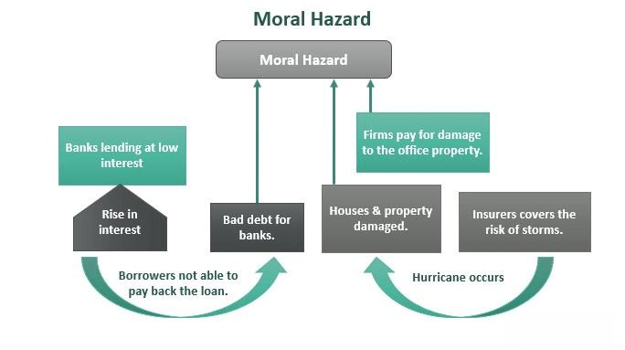

Moral hazard, a term widely used in economic theory, refers to situations where individuals or institutions are insulated from the consequences of their risky decisions. In the context of financial risk, it arises when entities do not bear the full cost of their actions, often due to protective measures like insurance or government bailouts, potentially leading them to engage in riskier behavior than they otherwise would. This concept is closely linked to significant issues in financial markets, exemplified by the 2008 financial crisis, where excessive risk-taking by banks was partially attributed to the expectation of government intervention.

In contrast, morale hazard pertains to the psychological and behavioral aspects of decision-making under risk. It focuses on how attitudes, such as overconfidence or complacency, affect economic actions. While moral hazard is driven by external protections, morale hazard is internally influenced by perceived safety or assurances, potentially leading to imprudent risk-taking as well. Both concepts, though distinct, shape the landscape of financial decision-making.

Algorithmic trading, characterized by the automated execution of orders via sophisticated algorithms, has rapidly transformed financial markets. It offers increased speed and efficiency but introduces unique risks, such as heightened market volatility and events like flash crashes. The prevalence of algorithmic trading necessitates a reevaluation of traditional financial risks, including moral and morale hazards.

The interplay between moral hazard, morale hazard, and algorithmic trading is a critical facet of modern financial risk. Algorithmic trading can magnify these hazards by facilitating risky behaviors and altering market dynamics through automated processes. Understanding this triad is essential for regulators, financial institutions, and investors to navigate the complexities of contemporary markets.

This article aims to provide a comprehensive examination of these interconnected concepts. It will first delve into the foundations of moral and morale hazards, followed by a detailed exploration of algorithmic trading and its associated risks. We will then analyze the interplay of these elements in financial markets, investigate regulatory strategies to mitigate these risks, and propose best practices for ensuring sustainable market stability. By shedding light on these issues, the goal is to foster greater awareness and contribute to effective risk management in the ever-evolving financial landscape.

## Table of Contents

## Understanding Moral Hazard

Moral hazard is a foundational concept in economic theory, referring to situations where an individual or institution is insulated from the full consequences of their actions and, consequently, may take on excessive risks. The term originated in the insurance industry, where it was recognized that individuals with insurance coverage might exhibit less caution in safeguarding their insured assets compared to their uninsured assets. In financial markets, moral hazard becomes particularly salient when parties engage in risky behaviors because they anticipate that any negative repercussions will be mitigated by others, such as taxpayers, governments, or financial institutions themselves.

Moral hazard typically arises when there is an asymmetry of information or a misalignment of incentives between parties involved. This can occur when one party, typically the decision-maker, has more information about their intentions or actions than the other party responsible for bearing the risk. In finance, common examples of moral hazard include situations where banks or financial institutions undertake high-risk investments, confident that they will be bailed out in the event of failure—commonly referred to as the "too big to fail" syndrome. In insurance, moral hazard might be observed when policyholders engage in negligent behavior knowing that their losses are covered by their insurance policies.

The 2008 financial crisis serves as a profound illustration of moral hazard at play. Leading up to the crisis, financial institutions engaged in aggressive lending practices, offering subprime mortgages to borrowers with poor credit histories. The securitization of these risky loans, coupled with the creation of complex financial products such as mortgage-backed securities and their sale to investors, exacerbated the risk. The anticipation that government interventions would mitigate potential losses contributed to reckless behavior. Indeed, when the housing bubble burst, resulting in widespread financial instability, many large institutions received substantial government bailouts, reinforcing the notion of moral hazard by validating expectations of external rescue during financial distress.

In response to the significant role of moral hazard in the financial crisis, regulatory efforts have intensified to curtail its effects. Measures such as the Dodd-Frank Wall Street Reform and Consumer Protection Act aim to increase the resilience of financial systems by imposing stricter regulations, increasing transparency, and enhancing accountability. Regulatory frameworks now often include stress testing, higher capital requirements, and living wills—plans for orderly bankruptcy—to discourage excessive risk-taking and ensure that financial institutions can withstand adverse economic conditions without external support.

Overall, recognizing and addressing moral hazard is critical to maintaining the stability of financial markets. The development of regulations and oversight mechanisms seeks to ensure that institutions bear a greater share of the risk associated with their decisions, thereby aligning incentives more closely with prudent risk management practices.

## Exploring Morale Hazard

Morale hazard is a concept that refers to the attitudes and behaviors of individuals or institutions which influence their approach to risk. Unlike moral hazard, which involves situations where entities do not bear the full consequences of their actions, morale hazard is rooted in psychological and behavioral aspects that affect decision-making and risk-taking. It is crucial to differentiate morale hazard from moral hazard. While moral hazard typically involves a misalignment of incentives due to the presence of insurance or guarantees, morale hazard is more related to the complacency or overconfidence that stems from an existing safety net, leading to more careless or aggressive risk behaviors without necessarily an intention of exploitation.

Morale hazard affects investor confidence and market stability by instilling a false sense of security. This can result in excessive risk-taking, where investors or institutions engage in financial activities that they perceive as safer than they truly are. The false confidence that certain protections or conditions offer can destabilize markets if these assumptions prove incorrect. For instance, during periods of prolonged market growth, investors might become overly optimistic, assuming that the trends will continue indefinitely. This could lead to inflated asset prices and eventual market corrections when reality sets in.

Examples of morale hazard can be observed in situations where investors or companies take on excessive leverage, believing that government bailouts or other safety mechanisms will shield them from potential losses. This behavior was notably prevalent during the lead-up to the 2008 financial crisis, where the assumption that housing prices would continue to rise led to risky mortgage lending practices. The collapse of these practices underscored the dangers of morale hazard, as investors and institutions faced the harsh realities of their misjudged risks.

The impact of morale hazard on market psychology and investor behavior is significant. It can lead to herd behavior, where the actions of a few overconfident market participants influence others to follow suit, often exacerbating market bubbles or downturns. As investors collectively adjust their risk perceptions based on the apparent safety of their ventures, market [volatility](/wiki/volatility-trading-strategies) can increase, affecting overall economic stability. Recognizing and addressing the psychological underpinnings of morale hazard is essential for developing more resilient financial systems and enhancing investor education and risk awareness.

## Algorithmic Trading and Financial Risks

Algorithmic trading refers to the use of computer algorithms to execute securities transactions with minimal human intervention. These algorithms can analyze vast datasets, identify trading opportunities, and execute orders at speeds and frequencies impossible for human traders. Over recent years, [algorithmic trading](/wiki/algorithmic-trading) has grown to constitute a significant portion of trading activities in financial markets, particularly in equities and foreign exchange markets. The Financial Times reported that in 2021, algorithmic trading accounted for approximately 60-73% of total trading [volume](/wiki/volume-trading-strategy) in U.S. equity markets.

### Advantages of Algorithmic Trading

The primary advantage of algorithmic trading is its speed. Algorithms can process vast quantities of data and execute complex calculations to identify trading opportunities within milliseconds. This can result in competitive advantages regarding pricing and market entry or [exit](/wiki/exit-strategy). 

Efficiency is another significant benefit. Algorithms eliminate human errors and biases, ensuring trades are executed with precision according to pre-set criteria. Additionally, algorithmic trading allows for consistent strategy implementation without the emotional influence that human traders might experience.

### Potential Risks of Algorithmic Trading

Despite its benefits, algorithmic trading introduces several risks. Market volatility can be exacerbated due to the rapid execution of trades, contributing to events such as flash crashes. For instance, the Flash Crash of May 6, 2010, witnessed the Dow Jones Industrial Average plummeting nearly 1,000 points within minutes, partly attributed to high-frequency trading algorithms reacting to market conditions.

Another risk is the potential for systemic errors within algorithmic trading systems. A minor coding error can result in significant financial losses, as evidenced by the infamous case of Knight Capital Group in 2012. A software glitch led to erratic trading activity, costing the firm $440 million in just 45 minutes and ultimately leading to its collapse.

### Influence on Moral and Morale Hazards

Algorithmic trading can exacerbate moral hazards by automating and scaling risky behaviors inherent in trading strategies. Traders may rely on algorithms to execute high-risk, high-reward strategies, assuming they will not bear the full consequences of potential market disruptions. This reliance can diminish the perceived need for stringent oversight and risk management.

Morale hazard relates to the attitudes and behaviors affecting risk perception, often leading to a false sense of security. The use of sophisticated algorithms can provide traders and institutions with overconfidence in market stability and their ability to manage risk, potentially leading to complacency and inadequate risk assessment.

### Case Studies of Market Disruptions

There have been several notable incidents where algorithmic trading contributed to market disruptions. Aside from the 2010 Flash Crash, the 2012 Knight Capital incident serves as a key example. Errors in trading algorithms not only led to significant financial losses but also highlighted vulnerabilities in market structure and the interconnectedness of trading systems.

The 2014 "LinkedIn Flash Crash" is another instance where algorithmic trading played a role. During this event, LinkedIn’s stock experienced a sudden and unexpected drop due to an erroneous sell-off, exacerbated by algorithmic trading activities that had been triggered by the unusual price movement.

These incidents underscore the potential for algorithmic trading to amplify market disruptions when automated systems malfunction or interact unpredictably with market environments.

In summary, while algorithmic trading provides distinct advantages in terms of speed and efficiency, it also presents significant risks, particularly concerning market stability and ethical considerations. Understanding these risks is crucial for stakeholders in financial markets to manage and mitigate the potential adverse effects of algorithmic trading systems.

## Interconnection Between Moral Hazard, Morale Hazard, and Algorithmic Trading

Moral and morale hazards are integral to understanding the complexities of algorithmic trading and its associated risks in financial markets. Moral hazard arises when parties are insulated from the consequences of their risky actions. In the context of algorithmic trading, the automation of trading decisions can exacerbate these hazards by embedding potentially risky behaviors into algorithms. These algorithms, operating at speeds and efficiencies beyond human capabilities, may engage in behaviors that disregard the risk-to-reward balance, primarily when the responsible parties do not bear the full brunt of adverse outcomes. For instance, algorithmic trading can lead to a moral hazard if traders develop algorithms that prioritize short-term gains without adequate considerations for long-term risk, knowing they might not directly face any repercussions.

Morale hazard, on the other hand, emerges from the attitudes and behaviors that influence risk-taking. In algorithmic trading, the feedback loop between morale hazard and algorithm-driven market trends can be particularly potent. When investors or traders develop an overconfidence due to algorithmic tools, believing them to be infallible, they might adopt riskier strategies. This false sense of security can lead markets into volatility, amplified by the algorithms that reflect and reinforce market trends. If, for example, a significant number of traders use similar algorithms, their collective behavior could inadvertently lead to market movements based on unfounded optimism or pessimism.

Regulatory and risk management strategies play a crucial role in addressing these interconnected risks. Regulators must develop guidelines and frameworks that ensure algorithmic trading is conducted transparently and with accountability. One such approach is the implementation of circuit breakers, which temporarily halt trading if extreme volatility is detected, thereby preventing flash crashes induced by algorithmic misbehavior. Additionally, stringent stress testing and scenario analysis should be mandated for algorithmic strategies to evaluate their behavior under different market conditions.

Moreover, risk management in algorithmic trading requires robust frameworks that include regular audit and review processes for algorithms. Financial institutions should establish oversight committees tasked with monitoring the development, deployment, and performance of their algorithms, ensuring they align with the institution's risk appetite and compliance requirements.

Looking forward, the dynamics between moral hazard, morale hazard, and algorithmic trading suggest a need for continuous adaptation in regulatory approaches. As algorithmic trading evolves with advancements in [artificial intelligence](/wiki/ai-artificial-intelligence) and [machine learning](/wiki/machine-learning), the potential for these hazards may increase, necessitating more dynamic and adaptive regulatory mechanisms. Future implications for global financial markets include the possibility of more sophisticated algorithms that could potentially mitigate these hazards through advanced risk management capabilities. However, this also demands a global regulatory alignment to ensure that such innovations do not inadvertently contribute to systemic risks.

In summary, understanding the interplay between moral and morale hazards and algorithmic trading is crucial for safeguarding market stability. A balanced approach, incorporating enhanced transparency, accountability, and adaptive regulation, is essential to manage and mitigate the risks of modern algorithmic trading.

## Mitigating risks: Solutions and Best Practices

Mitigating the risks associated with moral and morale hazards in algorithmic trading requires a multifaceted approach involving regulation, transparency, ethical considerations, and best practices. These measures are essential to ensure that financial markets remain stable and secure while adapting to increasingly complex technologies.

### Regulation and Oversight

Regulatory bodies play a crucial role in reducing financial risks associated with algorithmic trading. Effective regulation can help mitigate moral hazard by imposing constraints and accountability on financial institutions. Regulatory measures include setting limits on leverage and risk exposure, requiring detailed disclosures of trading algorithms, and mandating robust risk management frameworks. A critical aspect is the monitoring of trades and systemic risks through regular audits and stress tests, ensuring that institutions can withstand significant market changes without destabilizing the broader financial system.

### Transparency and Accountability

Transparency in trading algorithms is vital to reduce both moral and morale hazards. Financial institutions should provide clear and comprehensive disclosures about the workings and objectives of their trading algorithms. This involves sharing the strategies employed, risk parameters used, and the decision-making processes in trading operations. Such transparency not only builds trust among stakeholders but also ensures that algorithms are designed to operate within ethical and regulatory boundaries. Institutions should implement robust internal controls to ensure accountability, verifying that algorithms comply with pre-established risk limits and ethical standards.

### Ethical Considerations and Responsibilities

Financial institutions have the responsibility to prioritize ethical considerations in their operations. It involves developing algorithms with a focus on fairness, preventing exploitation and manipulation of market conditions. Institutions should establish a code of ethics for algorithmic trading, covering aspects like preventing market manipulation, ensuring market integrity, and promoting fair competition. Educating employees and traders on ethical considerations can further reinforce a culture of responsibility and integrity.

### Best Practices for Technological Advancement

Aligning technological advancement with market stability involves the adoption of best practices that encompass risk management, code diligence, and continuous monitoring. Key practices include:

1. **Robust Testing and Simulation**: Prior to deployment, algorithms must undergo rigorous testing and simulation to predict behavior under various market conditions. This can include backtesting using historical data and simulating potential market disruptions to ensure resilience.

2. **Risk Management Protocols**: Establishing comprehensive risk management protocols is essential. This could involve setting strict stop-loss limits, ensuring adequate liquidity, and maintaining capital reserves to guard against potential losses.

3. **Periodic Reviews and Updates**: Algorithms should be reviewed and updated regularly to adapt to changing market dynamics and regulatory requirements. Review processes can identify potential vulnerabilities and areas for improvement, ensuring ongoing compliance and performance efficiency.

4. **Cross-disciplinary Collaboration**: Collaboration between technology and finance professionals is crucial in the design and implementation of algorithms. Such collaboration ensures a holistic approach, blending technical expertise with market insights and regulatory knowledge.

5. **Stakeholder Engagement**: Continuous dialogue with stakeholders, including regulators, investors, and market participants, can provide valuable insights and feedback, facilitating the development of strategies that address emerging risks effectively.

Implementing these strategies can help mitigate the risks posed by moral and morale hazards in algorithmic trading, contributing to a more resilient and trustworthy financial market environment. By fostering an ecosystem of transparency, accountability, and ethical responsibility, stakeholders can promote technological innovation while safeguarding market integrity.

## Conclusion

Moral hazard, morale hazard, and algorithmic trading represent critical facets of contemporary financial risk, each contributing uniquely to market dynamics. Moral hazard underscores situations where entities engage in riskier behavior because they do not bear the full brunt of potential negative outcomes. For instance, during the 2008 financial crisis, financial institutions took excessive risks with the expectation of governmental bailouts, accentuating the adverse effects of moral hazard.

Morale hazard, though less discussed, reflects how attitudes and perceptions towards risk can alter behavior and decision-making. This phenomenon can lead to overconfidence and a false sense of security, driving investors to make irrational choices without fully comprehending potential repercussions. Understanding the nuances of morale hazard is essential for maintaining investor confidence and ensuring market stability.

Algorithmic trading, characterized by the automated execution of trades using complex algorithms, has significantly impacted financial markets. While offering efficiency and speed, it poses risks such as increased market volatility and potential flash crashes. This technological evolution can amplify existing hazards as algorithms may automate risk-prone behaviors, exacerbating the effects of moral and morale hazards.

For stakeholders in financial markets, comprehending these interconnected risks is imperative. Moral hazard necessitates a framework where risk-takers remain accountable, while acknowledging morale hazard requires vigilance against factors that might distort investor perspectives. Algorithmic trading should be harnessed with careful consideration of potential vulnerabilities and impacts on market behavior.

A balanced approach to technology and risk management is essential. This involves developing robust regulatory frameworks that ensure transparency and accountability in algorithm design and implementation. Moreover, ongoing research and dialogue among policymakers, technologists, and market participants are crucial to devise effective risk mitigation strategies.

Looking forward, the future of financial risk management must align with innovation, ensuring technological advancements contribute positively to market stability. The pace of technological advancement demands an agile and proactive stance towards managing new and evolving risks, striving for a dynamic equilibrium between innovation and regulation.

## References & Further Reading

[1]: Bernanke, B. S. (2010). ["The Supervisory Capital Assessment Program"](https://www.federalreserve.gov/newsevents/speech/bernanke20100506a.htm). Speech at the Federal Reserve Bank.

[2]: Geithner, T. (2010). ["The Dodd-Frank Act: A Year Later"](https://en.wikipedia.org/wiki/Subprime_mortgage_crisis_solutions_debate). U.S. Department of the Treasury.

[3]: Gorton, G. B. (2009). ["Slapped in the Face by the Invisible Hand: Banking and the Panic of 2007"](https://papers.ssrn.com/sol3/papers.cfm?abstract_id=1401882). Federal Reserve Bank of Atlanta.

[4]: Haldane, A. G. (2011). ["The Race to Zero"](https://www.bankofengland.co.uk/speech/2011/the-race-to-zero-speech-by-andy-haldane). Bank of England.

[5]: Lewis, M. (2014). ["Flash Boys: A Wall Street Revolt"](https://en.wikipedia.org/wiki/Flash_Boys). W.W. Norton & Company.

[6]: Poole, W. (2010). ["Causes and Consequences of the Financial Crisis of 2007-2009"](https://www.semanticscholar.org/paper/Causes-and-Consequences-of-the-Financial-Crisis-of-Poole/61b4245f30f42fb473b1e2a78d66ac5d6bd5c92c). Federal Reserve Bank of St. Louis Review.

[7]: Stiglitz, J. E. (2010). ["Risk and Global Economic Architecture: Why Full Financial Integration May Be Undesirable"](https://business.columbia.edu/sites/default/files-efs/imce-uploads/Joseph_Stiglitz/2010_Risk_and_Global_Economic.pdf). National Bureau of Economic Research.

[8]: Taleb, N. N. (2007). ["The Black Swan: The Impact of the Highly Improbable"](https://www.jstor.org/stable/23045073). Random House.

[9]: U.S. Securities and Exchange Commission. (2010). ["Findings Regarding the Market Events of May 6, 2010"](https://www.sec.gov/news/studies/2010/marketevents-report.pdf). SEC and CFTC Joint Report.