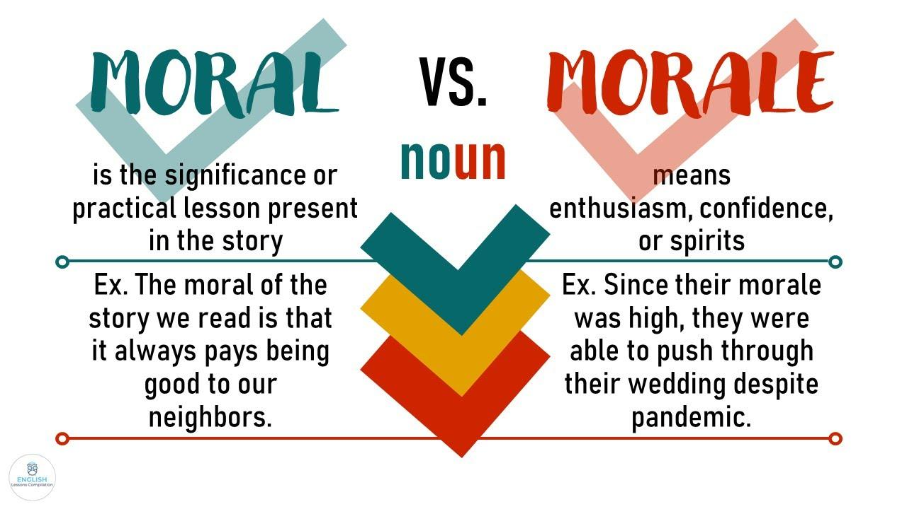

## Table of Contents

## What is moral hazard?

Moral hazard is when someone takes more risks because they know they won't have to deal with the bad results. Imagine if you had insurance that covered everything, no matter what happened. You might start doing risky things because you know you're protected. This is a problem because it can lead to more accidents and higher costs for everyone.

For example, if a bank knows it will be bailed out by the government if it fails, it might make riskier loans. The bank doesn't worry about losing money because the government will help them. This can cause big problems in the economy. To reduce moral hazard, it's important to make sure people still face some consequences for their actions, even if they have insurance or other protections.

## What is morale hazard?

Morale hazard is different from moral hazard. It happens when someone doesn't do their best because they feel they won't be rewarded or punished for their efforts. For example, if an employee thinks they won't get a raise no matter how hard they work, they might not try as hard. This can lead to lower productivity and a less motivated team.

To deal with morale hazard, it's important to make sure people feel their hard work is noticed and rewarded. This can be done through fair pay, recognition, and clear communication about how their efforts contribute to the team's success. When people see that their efforts matter, they are more likely to stay motivated and perform well.

## How do moral hazard and morale hazard differ?

Moral hazard and morale hazard are two different concepts that can affect how people behave. Moral hazard happens when someone takes more risks because they know they won't have to deal with the bad results. For example, if a person has insurance that covers everything, they might do risky things because they know they're protected. This can lead to more accidents and higher costs for everyone. On the other hand, morale hazard is when someone doesn't do their best because they feel their efforts won't be rewarded or noticed. If an employee thinks they won't get a raise no matter how hard they work, they might not try as hard, leading to lower productivity.

The key difference between the two is what drives the behavior. Moral hazard is driven by the protection from negative outcomes, while morale hazard is driven by a lack of motivation due to perceived lack of rewards. To manage moral hazard, it's important to make sure people still face some consequences for their actions, even if they have insurance or other protections. For morale hazard, it's crucial to ensure that people feel their hard work is recognized and rewarded, which can be done through fair pay, recognition, and clear communication about how their efforts contribute to the team's success.

## Can you provide examples of moral hazard in insurance?

Moral hazard in insurance happens when people take more risks because they know their insurance will cover the costs. For example, imagine someone who has health insurance that covers all medical expenses. They might not take good care of their health, like eating unhealthy food or not exercising, because they know the insurance will pay for any health problems that come up. This can lead to more health issues and higher costs for the insurance company.

Another example is car insurance. If someone has a policy that covers all damages, they might drive more recklessly. They might speed or not wear a seatbelt because they know that if they get into an accident, the insurance will pay for the repairs and medical bills. This can lead to more accidents on the road and higher premiums for everyone who has car insurance.

## What are some examples of morale hazard in the workplace?

In the workplace, morale hazard can happen when employees feel their hard work won't be rewarded. For example, imagine a worker who always stays late to finish projects but never gets a raise or a thank you. Over time, they might stop working extra hours because they see no point in trying harder. This can lead to lower productivity and a less motivated team.

Another example is when a company doesn't recognize the efforts of its employees. If a team member comes up with a great idea that helps the company, but they never get credit or a bonus, they might stop sharing ideas. This can make the whole team less creative and less willing to go the extra mile. When people feel their efforts are not noticed, they are less likely to do their best work.

## How does moral hazard affect economic behavior?

Moral hazard affects economic behavior by making people take more risks because they know they won't have to deal with the bad results. Imagine if a bank knows it will be bailed out by the government if it fails. The bank might make riskier loans because it doesn't worry about losing money. This can cause big problems in the economy, like a financial crisis, because too many risky loans can lead to a lot of debt that can't be paid back.

In another example, if someone has insurance that covers everything, they might not take good care of their things or themselves. They might drive recklessly or not eat healthy because they know the insurance will pay for any damage or health issues. This can lead to more accidents and health problems, which makes insurance more expensive for everyone. Moral hazard can make the whole economy less stable because people and companies take bigger risks without worrying about the consequences.

## What strategies can be used to mitigate moral hazard?

One way to reduce moral hazard is by making sure there are still some consequences for risky behavior, even if someone has insurance or other protections. For example, insurance companies can have deductibles, which means the person has to pay a certain amount before the insurance kicks in. This makes people think twice before taking risks because they know they will have to pay something if things go wrong. Another way is through co-payments, where the person pays a part of the cost every time they use the insurance. This encourages people to be more careful because they know they will have to pay a little bit each time.

Another strategy is to use monitoring and regulation. For example, banks can be watched closely by government agencies to make sure they are not taking too many risks. If a bank knows it will be checked, it might be less likely to make risky loans. Also, having clear rules and laws can help. If people and companies know they will be punished for risky behavior, they might be more careful. By using these methods, we can make sure people think about the risks and consequences of their actions, which can help keep the economy more stable.

## How can organizations address morale hazard to improve employee performance?

Organizations can address morale hazard by making sure employees feel their hard work is noticed and rewarded. This can be done by giving fair pay, bonuses, and saying thank you for a job well done. When employees see that their efforts lead to rewards, they are more likely to keep working hard. It's also important to have clear goals and show how each person's work helps the whole team. If people understand their role and see that it matters, they will feel more motivated to do their best.

Another way to tackle morale hazard is through good communication and feedback. When managers talk openly with their team, it helps everyone feel valued and heard. Regular check-ins and feedback sessions can show employees that their work is important and that the company cares about their growth. By creating a positive work environment where people feel appreciated, organizations can boost morale and encourage everyone to perform better.

## What are the psychological underpinnings of morale hazard?

Morale hazard happens when people don't try their best because they feel their hard work won't be rewarded. This can be because they don't think they'll get a raise, a bonus, or even a simple thank you. The psychological reason behind this is that people need to feel like their efforts matter. If they don't see any reward or recognition, they might lose motivation. They might think, "Why should I work harder if it doesn't make a difference?" This feeling can lead to lower productivity and a less motivated team.

To understand morale hazard better, think about how humans need to feel valued and appreciated. When people believe their work is important and noticed, they are more likely to stay motivated and perform well. But if they feel ignored or think their efforts are wasted, they might give up trying. This is why it's important for organizations to create a positive work environment where everyone feels their contributions are valued. By doing this, they can reduce morale hazard and help everyone do their best.

## How do regulatory frameworks address moral hazard in financial markets?

Regulatory frameworks help reduce moral hazard in financial markets by setting rules that make banks and other financial institutions think twice before taking big risks. For example, after the 2008 financial crisis, governments around the world made new rules. One important rule is that banks have to keep more money on hand, called capital requirements. This means if a bank makes a risky loan and it fails, the bank has enough money to cover the loss without needing a bailout. By having these rules, banks are less likely to take big risks because they know they will have to deal with the consequences themselves.

Another way regulatory frameworks address moral hazard is by having agencies watch over banks and other financial companies. These agencies, like the Federal Reserve in the U.S., check to make sure banks are following the rules and not taking too many risks. If a bank is found to be doing something risky, the agency can step in and make the bank fix the problem. This helps keep the financial system stable because banks know they are being watched and will be held accountable for their actions. By using these methods, regulators can make sure that financial institutions think about the risks and consequences of their actions, which helps prevent big problems in the economy.

## What role does information asymmetry play in moral and morale hazards?

Information asymmetry happens when one person knows more than another. In moral hazard, this can make things worse. Imagine a bank that knows more about its risky loans than the government that might bail it out. The bank might take bigger risks because it knows the government doesn't have all the information. This can lead to big problems in the economy because the government might not see the risks coming. To fix this, regulators need to get more information and keep a close eye on banks to make sure they don't take too many risks.

In morale hazard, information asymmetry can also cause problems. If employees feel like they don't know how their hard work is being judged or rewarded, they might not try as hard. For example, if workers don't know how their performance is measured, they might think their efforts don't matter. This can lead to lower productivity because they don't see the link between their work and any rewards. To improve morale, companies need to share clear information about goals, how performance is measured, and how rewards are given. This way, everyone knows what to expect and feels motivated to do their best.

## How have recent economic theories expanded our understanding of moral and morale hazards?

Recent economic theories have helped us understand moral hazard better by looking at how it affects different parts of the economy. One new idea is that moral hazard isn't just about banks and insurance companies. It can happen in any situation where one group is protected from risk while another group has to deal with the consequences. For example, if a company knows the government will help it if things go wrong, it might take bigger risks. This can lead to problems in industries like healthcare or energy, not just finance. By understanding this, economists can think of new ways to make sure everyone thinks about the risks and consequences of their actions.

Morale hazard has also been looked at more closely in recent economic theories. These theories show that morale hazard can affect more than just workers in a company. It can also happen in schools, where students might not try hard if they think their efforts won't be rewarded. Or in sports, where athletes might not give their best if they feel they won't be recognized. By studying these different situations, economists have learned that to reduce morale hazard, it's important to make sure everyone feels their efforts are noticed and valued. This can lead to better performance and a more motivated community, whether it's in a workplace, school, or sports team.

## References & Further Reading

[1]: Bernanke, B. S. (2010). ["The Supervisory Capital Assessment Program"](https://www.federalreserve.gov/newsevents/speech/bernanke20100506a.htm). Speech at the Federal Reserve Bank.

[2]: Geithner, T. (2010). ["The Dodd-Frank Act: A Year Later"](https://en.wikipedia.org/wiki/Subprime_mortgage_crisis_solutions_debate). U.S. Department of the Treasury.

[3]: Gorton, G. B. (2009). ["Slapped in the Face by the Invisible Hand: Banking and the Panic of 2007"](https://papers.ssrn.com/sol3/papers.cfm?abstract_id=1401882). Federal Reserve Bank of Atlanta.

[4]: Haldane, A. G. (2011). ["The Race to Zero"](https://www.bankofengland.co.uk/speech/2011/the-race-to-zero-speech-by-andy-haldane). Bank of England.

[5]: Lewis, M. (2014). ["Flash Boys: A Wall Street Revolt"](https://en.wikipedia.org/wiki/Flash_Boys). W.W. Norton & Company.

[6]: Poole, W. (2010). ["Causes and Consequences of the Financial Crisis of 2007-2009"](https://www.semanticscholar.org/paper/Causes-and-Consequences-of-the-Financial-Crisis-of-Poole/61b4245f30f42fb473b1e2a78d66ac5d6bd5c92c). Federal Reserve Bank of St. Louis Review.

[7]: Stiglitz, J. E. (2010). ["Risk and Global Economic Architecture: Why Full Financial Integration May Be Undesirable"](https://business.columbia.edu/sites/default/files-efs/imce-uploads/Joseph_Stiglitz/2010_Risk_and_Global_Economic.pdf). National Bureau of Economic Research.

[8]: Taleb, N. N. (2007). ["The Black Swan: The Impact of the Highly Improbable"](https://www.jstor.org/stable/23045073). Random House.

[9]: U.S. Securities and Exchange Commission. (2010). ["Findings Regarding the Market Events of May 6, 2010"](https://www.sec.gov/news/studies/2010/marketevents-report.pdf). SEC and CFTC Joint Report.