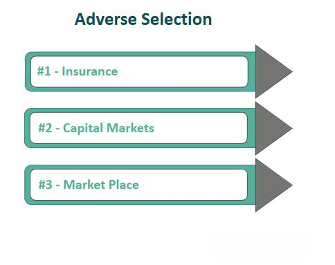

The intersection of insurance economics and algorithmic trading presents unique challenges and opportunities. Central to understanding these fields are the concepts of moral hazard and adverse selection, which significantly influence their dynamics. Moral hazard arises when one party in a contract changes their behavior to the detriment of the other after the agreement is finalized, often due to the insulation that the contract provides. For instance, in insurance, once a policyholder is covered, they might engage in riskier behaviors because they no longer bear the full cost of these risks. 

Adverse selection, on the other hand, occurs when there is asymmetric information between the parties before entering into a contract, leading to an inefficient market outcome. This is frequently observed in insurance when individuals with a higher risk of claiming, such as those with risky lifestyles, are more inclined to seek insurance coverage than lower-risk individuals, potentially skewing the risk pool. Understanding these phenomena is crucial for anyone looking to navigate the economic landscapes of insurance and finance efficiently.

In algorithmic trading, these concepts manifest rather distinctively. The rapid and automated nature of trades executed through pre-set algorithms is vulnerable to information asymmetries. For example, adverse selection in algorithmic trading might occur when algorithms misprice assets due to inaccurate or incomplete information, resulting in suboptimal trading decisions. Similarly, moral hazard can manifest when traders or firms use algorithmic strategies that prioritize short-term gains over market stability, exploiting transient market information.

This article seeks to elucidate how moral hazard and adverse selection manifest both in insurance and finance, with a particular focus on their impact on algorithmic trading. We will also explore solutions to mitigate the risks posed by these phenomena, enhancing market efficiency and safeguarding participants against unfair practices. To lay the groundwork, we will begin with a detailed examination of each concept as it applies to insurance and finance. Understanding the nuances of moral hazard and adverse selection not only aids in mitigating their adverse effects but also opens avenues for leveraging these insights to gain competitive advantages within markets.

## Table of Contents

## Understanding Moral Hazard in Insurance Economics

Moral hazard is a concept that emerges within contracts where one party, the insured, may alter their behavior to the disadvantage of the other party, typically the insurer, particularly after the contract is finalized. This behavior shift is often sparked by the insured gaining protection from negative outcomes due to the coverage provided by insurance. In practical terms, this might manifest when policyholders engage in riskier activities or neglect precautions because they feel insulated from the repercussions by their insurance policy.

For instance, the decision to forgo installing a home security system after obtaining homeowner's insurance exemplifies moral hazard. The presence of insurance may lead homeowners to deprioritize security measures they might otherwise consider essential if they bore the potential financial loss themselves.

Historically, the term 'moral hazard' was coined by insurance [agents](/wiki/agents) to describe fraudulent activities undertaken by policyholders that would increase the likelihood of a claim. Over time, its definition has evolved. In modern economics, moral hazard is understood as any post-contractual behavior change by the insured that may alter the insured event's probability, not merely actions that might be construed as deceitful.

The economic implications of moral hazard are significant and warrant vigilant oversight and strategic policy adjustments to maintain a balanced insurance market. If unchecked, moral hazard can lead to increased claims, driving up premiums and potentially resulting in the inefficient allocation of resources. Insurers often counteract moral hazard through measures like higher deductibles, co-insurance clauses, or monitoring mechanisms to ensure policyholders maintain certain predetermined levels of behavior. These methods align the interests of the insurer and the insured, promoting behaviors that minimize unnecessary risks and thus safeguarding the insurance model's sustainability.

## Adverse Selection Dynamics in Insurance

Adverse selection is a critical concept in insurance economics, characterized by a scenario where asymmetric information between buyers and sellers leads to suboptimal market conditions. In the context of insurance, adverse selection typically manifests when individuals with higher risk are more inclined to purchase insurance compared to those with lower risk, primarily because they anticipate greater benefit from the coverage.

A quintessential example of adverse selection is observed in the health insurance sector. Here, individuals with pre-existing conditions or unhealthy lifestyles, who expect to incur higher medical expenses, are more likely to seek insurance. Conversely, healthier individuals might perceive the cost of premiums as disproportionately high relative to their expected health care needs and may choose to forgo insurance. This results in a risk pool that is, on average, riskier than the general population, potentially leading to higher overall costs for the insurer.

To mitigate adverse selection, insurers employ various strategies aimed at achieving better information symmetry and tailoring insurance offerings to accurately reflect individual risk levels. One common approach is the adjustment of premium structures based on detailed risk assessments. By segmenting customers into different risk categories, insurers can price premiums more accurately, discouraging high-risk individuals from disproportionately affecting the risk pool. For example, using lifestyle factors such as smoking status, exercise frequency, and medical history, insurers can better predict risk levels and set premiums accordingly.

In addition to adjusting premiums, insurers also leverage data-driven analysis to combat adverse selection. Advanced data analytics and [machine learning](/wiki/machine-learning) techniques enable insurers to process vast amounts of information, identifying patterns and predicting individual risk factors with greater precision. This allows for more refined underwriting processes, where policies are designed to match the risk profile of each applicant closely.

Furthermore, robust underwriting processes are pivotal in mitigating adverse selection. These processes involve detailed evaluation of an applicant’s profile to determine their risk level accurately. By incorporating medical examinations, lifestyle questionnaires, and historical data into the underwriting process, insurers can make more informed decisions about coverage and pricing, limiting the potential impact of adverse selection.

In conclusion, adverse selection poses a significant challenge to the insurance industry by potentially skewing the risk pool and elevating costs. Through strategic premium adjustments, enhanced information gathering, and advanced risk assessment techniques, insurers attempt to balance the information asymmetry that fuels adverse selection. These efforts are critical in maintaining the sustainability and fairness of insurance markets, ensuring that coverage remains accessible and affordable for all participants.

## Algorithmic Trading and Information Asymmetry

Algorithmic trading, commonly referred to as algo trading, utilizes sophisticated automated systems to execute trades based on predefined criteria. This approach offers significant speed and efficiency advantages over traditional trading methods, allowing for rapid response to market changes. However, it also presents vulnerabilities to information asymmetry, where one party possesses more or better information than the other in a transaction.

Moral hazard in [algorithmic trading](/wiki/algorithmic-trading) can manifest when traders or firms program algorithms to capitalize on fleeting inconsistencies in market data. Such exploitative behavior may result in short-term financial gains but can destabilize markets and erode trust among participants. For instance, high-frequency trading ([HFT](/wiki/high-frequency-trading-strategies)), a subset of algorithmic trading, often leverages various strategies to profit from minor price differences occurring over milliseconds, which may trigger moral hazard concerns. 

Adverse selection is another critical issue within the algorithmic trading landscape. This occurs when there is an imbalance in the knowledge available to different market participants, often leading to incorrect asset valuations. Consequently, trades might be executed based on skewed perceptions of asset worth, resulting in suboptimal market decisions. In such situations, traders with less sophisticated algorithms or access to inferior data may consistently lose out to better-informed participants, perpetuating a cycle of inequality and inefficiency.

To address these challenges, market participants are increasingly leveraging technological advancements to enhance the parity of information access and refine algorithmic strategies. The integration of [artificial intelligence](/wiki/ai-artificial-intelligence) and machine learning technologies into trading algorithms can help in modeling more nuanced market behaviors and in predicting asset value fluctuations more accurately. By incorporating larger and more diverse datasets, algorithms can become more adept at identifying true asset values, thus reducing the risk of adverse selection.

Regulatory bodies play a crucial role in maintaining fairness and transparency within algorithmic trading environments. By implementing policies that promote data sharing and standardize market practices, regulators can mitigate the risks associated with information asymmetry. Regulations such as the European Union's Markets in Financial Instruments Directive II (MiFID II) seek to increase transparency and oversight in financial markets, ensuring that all participants adhere to fair trading practices. These efforts help create an equitable trading landscape, reducing the negative impacts of moral hazard and adverse selection.

In conclusion, while algorithmic trading brings significant efficiencies, it also introduces complex challenges related to information asymmetry. Addressing these challenges requires both technological innovation within market systems and robust regulatory frameworks to ensure equitable and transparent market conditions.

## Strategies for Mitigating Moral Hazard and Adverse Selection

To address moral hazard, insurers and companies can adopt co-payment structures and usage-based pricing models. Co-payment structures ensure that the insured party shares the financial responsibility for a claim, thus discouraging careless behavior that could lead to a loss. Usage-based pricing, particularly prevalent in vehicle and health insurance, aligns insurance costs more closely with individual behavior, thereby promoting risk-reducing conduct. For example, telematics devices in vehicles can monitor driving habits, allowing insurers to adjust premiums based on the actual risk exhibited by the driver.

Enhancing transparency and improving the quality of shared information are crucial steps to address adverse selection. By making pertinent information readily available and conducting thorough assessments of risk applicants, insurers can better differentiate between high-risk and low-risk individuals. This can include things like more detailed claim histories shared in a centralized database or requiring additional data points during the application process. The use of data analytics and machine learning algorithms can help evaluate potential risks more accurately, creating more equitable insurance offerings.

In trading, employing robust algorithms that incorporate comprehensive external information can mitigate information asymmetry. These algorithms should be designed to evaluate large volumes of market data, including both structured data like financial statements and unstructured data such as news reports and analyst opinions. By doing so, trading systems can better anticipate market movements and price assets more accurately.

Continual innovation, policy reform, and regulations are essential to developing sustainable solutions within insurance and trading sectors. Emerging technologies such as blockchain can enhance transparency and reduce fraud by providing immutable records of transactions and claims. Regulatory frameworks must evolve to address these technological advancements, ensuring markets remain fair and competitive.

Ultimately, aligning incentives between parties is key to mitigating the negative impacts of moral hazard and adverse selection. This alignment can be achieved by designing financial products and algorithms that reflect the true risk levels and by fostering cooperation between stakeholders to ensure transparency and shared goals. These strategies promote a more stable economic environment, reducing inefficiencies and improving fairness across insurance economics and algorithmic trading domains.

## Conclusion

Moral hazard and adverse selection are critical challenges in the fields of insurance economics and algorithmic trading. These phenomena disrupt market efficiency and lead to inequitable outcomes unless effectively managed. Moral hazard in insurance can result in policyholders engaging in riskier behavior due to the protective cushion of insurance, while adverse selection can lead to imbalanced risk pools due to asymmetric information. In algorithmic trading, both issues can lead to distortions in asset valuation and market actions, jeopardizing market fairness.

Understanding and mitigating these issues is vital for stakeholders aiming to enhance market fairness and efficiency. Technological advancements in data analytics and algorithm design play a pivotal role in this process, offering innovative solutions to reduce information asymmetries. For instance, data-driven underwriting in insurance and sophisticated algorithms in trading are examples where technology is making strides in addressing these challenges.

The pursuit of future solutions requires a cross-disciplinary approach that integrates economics, technology, and policy. Economists, technologists, and policymakers must collaborate to develop frameworks that effectively balance incentives and foster transparency. This collaboration could lead to innovative policy instruments and improved market mechanisms that align interests and diminish the likelihood of moral hazard and adverse selection.

Continuous research and dialogue among industry stakeholders remain crucial. Such engagement encourages the sharing of insights, the development of standardized practices, and the formulation of regulations conducive to sustainable and equitable economic systems. As these fields evolve, ongoing discourse will ensure that challenges are met with adaptive strategies, ultimately contributing to robust economic environments capable of withstanding the complexities of moral hazard and adverse selection.

## References & Further Reading

[1]: Arrow, K.J. (1963). ["Uncertainty and the Welfare Economics of Medical Care,"](https://www.jstor.org/stable/1812044) The American Economic Review, 53(5), 941-973.

[2]: Akerlof, G.A. (1970). ["The Market for 'Lemons': Quality Uncertainty and the Market Mechanism."](https://www.jstor.org/stable/1879431) The Quarterly Journal of Economics, 84(3), 488-500.

[3]: Pauly, M.V. (1968). ["The Economics of Moral Hazard: Comment."](https://www.jstor.org/stable/1813785) The American Economic Review, 58(3), 531-537.

[4]: MacMinn, R.D. (1987). ["Insurance and Corporate Risk Management."](https://www.jstor.org/stable/253115) Journal of Financial and Quantitative Analysis, 22(2), 279-299.

[5]: Chan, E.P. (2009). ["Quantitative Trading: How to Build Your Own Algorithmic Trading Business."](https://github.com/ftvision/quant_trading_echan_book) Wiley-Blackwell.

[6]: Lopez de Prado, M. (2018). ["Advances in Financial Machine Learning."](https://www.amazon.com/Advances-Financial-Machine-Learning-Marcos/dp/1119482089) Wiley.

[7]: Jarrow, R.A., & Protter, P. (2012). ["A Short History of Stochastic Integration and Mathematical Finance: The Early Years, 1880-1970."](https://www.jstor.org/stable/4356300) European Financial Management, 18(4), 614-649.