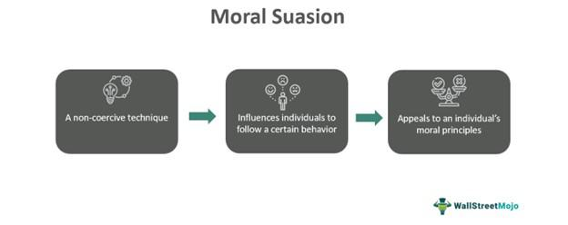

The interconnectedness of economic policy tools and trading practices is an influential force in the modern financial landscape, playing a crucial role in shaping global economies. Central banks, as pivotal entities within financial systems, have increasingly relied on non-traditional methods, such as moral suasion and jawboning, to influence economic conditions. These strategies involve guiding markets and investor behaviors through communication and persuasion rather than direct intervention. By signaling intentions or providing guidance, central banks aim to stabilize economies, manage expectations, and maintain investor confidence.

Algorithmic trading represents a significant advancement in financial markets, automating investment decisions and leveraging quantitative models to execute trades at unprecedented speeds. This technology enhances market liquidity and efficiency but also raises concerns over fairness, transparency, and the potential for exacerbating financial instability. The algorithms process vast amounts of data to quickly identify and exploit market opportunities, creating a dynamic interplay between market signals and trading activity.

In today's markets, the interaction between non-coercive economic influences, like moral suasion and jawboning, and algorithmic trading is profound. Central bank announcements and signals can lead to immediate and widespread reactions due to the responsiveness of automated trading systems. This interaction underscores the importance of understanding how these elements converge to shape market behavior.

By exploring the economic influence of these factors, investors are better positioned to navigate the complexities of modern financial systems. Recognizing the subtleties of central bank communications and the swift reactions they can prompt in algorithm-driven markets is essential for making informed investment decisions. As the financial landscape continues to evolve, the ability to interpret and adapt to these dynamics will become increasingly critical for investors and policymakers alike.

## Table of Contents

## Understanding Moral Suasion and Jawboning

Moral suasion is a strategic tool employed by central banks and regulators to influence economic behaviors and expectations through non-mandatory means, primarily communication. Unlike traditional economic policy instruments such as interest rate adjustments or direct regulations, moral suasion seeks to guide market participants by shaping perceptions and expectations through persuasive dialogue rather than coercive measures.

Historically, jawboning, a form of moral suasion, has been utilized to stabilize markets during economic distress. Jawboning involves public officials making verbal statements intended to sway market behavior without enacting formal policy changes. One of the primary objectives is to influence market sentiment and expectations, a tactic particularly evident during economic turmoil when immediate policy interventions might not be feasible or desirable.

The effectiveness of jawboning can be tied to the credibility of the speaker and the context within which the statements are made. In periods of market instability, investors often scrutinize central bank communications for cues that may indicate future policy actions, making these verbal interventions crucial. For example, during times of financial uncertainty, central banks may use jawboning to signal future [interest rate](/wiki/interest-rate-trading-strategies) cuts or increases, thereby managing market expectations and attempting to preempt adverse economic conditions.

However, the pitfalls of jawboning are notable. If communication strategies lack consistency or central bank credibility is in question, jawboning may lead to increased market [volatility](/wiki/volatility-trading-strategies). Miscommunications or ambiguous statements can create uncertainty, leading to counterproductive outcomes. This was evident during the taper tantrum of 2013 when the U.S. Federal Reserve's mere suggestion of tapering its asset purchases led to significant volatility in global financial markets.

Verbal interventions through jawboning can significantly impact investor sentiment and subsequently, market volatilities. Sentiments can be quantified through metrics like the VIX, often referred to as the "fear index," which measures market volatility expectations. Changes in investor sentiment, driven by central bank communications, typically manifest as fluctuations in this index.

Overall, while moral suasion and jawboning are powerful tools, their success heavily relies on the precision and clarity of communication. The potential for these strategies to cause unintended market disruptions poses a challenge for policymakers. To mitigate this, careful crafting of messages and maintaining a consistent narrative with observable policy actions can help align market expectations with desired economic outcomes.

## The Role of Algorithmic Trading in Modern Finance

Algorithmic trading has transformed modern financial markets by automating investment decisions. This process utilizes computer algorithms based on quantitative models to execute trades at high speeds, often faster than any human trader could achieve. This approach not only enhances market [liquidity](/wiki/liquidity-risk-premium) but also improves overall market efficiency by narrowing bid-ask spreads and increasing the [volume](/wiki/volume-trading-strategy) of trades.

However, the rapid adoption of [algorithmic trading](/wiki/algorithmic-trading) has introduced significant challenges related to fairness and transparency. Given its reliance on technology and speed, algorithmic trading can create a playing field that favors those with superior technological infrastructure. This can lead to unfair advantages for larger financial institutions over smaller firms or individual investors who may not afford such advanced technology. Moreover, the opaque nature of some algorithms raises questions about transparency, as the exact workings of these algorithms are often not disclosed, leading to a lack of understanding and trust among market participants.

Ethical implications also arise from algorithmic trading, particularly concerning potential biases embedded within algorithms and the heavy reliance on technological infrastructure. Algorithms, designed and coded by humans, can unintentionally incorporate biases present in historical data or reflect the subjective choices of their creators. This introduces the risk of perpetuating or even exacerbating existing market inequities. To mitigate these concerns, it's crucial for traders to integrate ethical responsibility into their practices by scrutinizing the data and models used in algorithm development.

Additionally, the reliance on technology raises concerns about the robustness of trading systems. Technical glitches or algorithm malfunctions can lead to significant market disruptions, as seen in various "flash crashes" over recent years. Consequently, traders must implement stringent oversight mechanisms, combining algorithmic efficiency with human intervention to monitor and correct anomalous trading behaviors.

To maintain fairness, transparent regulations are necessary. Regulatory bodies globally are stepping up to ensure that algorithms comply with standardized practices promoting fair competition and protecting investors. This includes mandating greater transparency about the algorithms' nature and requiring fail-safes in their design to avert market disruptions.

Overall, while algorithmic trading offers substantial benefits to modern markets, it requires a balanced approach, combining technological prowess with ethical considerations and robust oversight, to ensure it contributes positively to market dynamics.

## Interplay Between Moral Suasion, Jawboning, and Algorithmic Trading

Algorithmic trading systems, which rely on complex algorithms to automate trading processes, have the capability to react almost instantaneously to information disseminated by central banks through practices like moral suasion and jawboning. This rapid responsiveness can significantly amplify the effects of these non-coercive economic tools. When central banks provide signals—whether intentionally or inadvertently—through speeches or policy statements, algorithms can quickly interpret these cues, making the trading environment highly volatile.

The synchronization of algorithmic trading practices with central bank communications poses potential systemic risks. For instance, if a central bank hints at economic tightening or easing, trading algorithms might interpret these signals as actionable insights, leading to massive, quick adjustments in asset prices that might not be justified by underlying fundamentals. Such reactions can create feedback loops where market behaviors, driven by algorithmic interpretations, encourage further communication from central banks, potentially leading to self-fulfilling prophecies.

One example of this dynamic is when a central bank indicates through jawboning that it wants to maintain low inflation rates. Traders' algorithms, designed to maximize profits on perceived emerging trends, might respond by short-selling bonds, expecting yields to rise in anticipation of tightening policies. This could inadvertently elevate yields, escalating borrowing costs, and inadvertently prompting the central bank to take actions it might not have undertaken otherwise.

Policymakers must understand these nuanced feedback mechanisms when crafting their communication strategies. The interdependencies between algorithmic trading and central bank messaging necessitate careful consideration of wording and timing to avoid undesired market panics or euphoria. Furthermore, regulators need to recognize that algorithmic trading systems, with their reliance on vast amounts of historical data and programmed logic, can exacerbate the impact of even minor verbal cues on financial markets.

In summary, while moral suasion and jawboning remain effective policy tools, their influence is magnified in a market dominated by algorithmic trading. This intersection highlights the need for central banks to anticipate and mitigate the potential impacts of their communications in a technologically sophisticated trading environment.

## Case Studies and Examples

### Case Studies and Examples

Jawboning, a practice where leaders use rhetorical skills to influence market perceptions without direct policy implementations, has seen varying degrees of success. A notable example lies in the events leading to the 1998 Long-Term Capital Management (LTCM) crisis. In this instance, the U.S. Federal Reserve utilized moral suasion rather than direct monetary intervention to stabilize the financial system. LTCM, a [hedge fund](/wiki/hedge-fund-trading-strategies) with significant leverage, was on the brink of collapse. Concerned about a broader financial crisis, the Federal Reserve convened a meeting with major financial institutions, imploring them to provide a private bailout to LTCM. This action, primarily based on persuasion, effectively contained the crisis, as the institutions collaborated to prevent a systemic failure without the Fed injecting funds directly into the market. 

Examining this case highlights moral suasion's power to influence market actors' decisions, urging voluntary cooperation to maintain financial stability. However, jawboning does not always yield successful outcomes. A failed instance of jawboning occurred during the 2013 "taper tantrum" when Federal Reserve Chairman Ben Bernanke's announcement regarding the potential tapering of asset purchases led to massive market sell-offs. Despite attempts to clarify intentions, the initial communication triggered volatility, showcasing jawboning's limitations when miscommunication occurs or when market expectations are misaligned with policymakers' intentions.

Algorithmic trading's responsiveness to central bank communications offers more contemporary examples. Algorithms rely on parsing economic indicators and news in milliseconds, adjusting trading strategies accordingly. A significant recent case was the European Central Bank's (ECB) approach during the COVID-19 pandemic. When ECB President Christine Lagarde stated they were "not here to close spreads," the market quickly reacted negatively, leading to increased volatility. Algorithms, designed to interpret such signals, exacerbated movements, highlighting the need for precision in central bank communications. Conversely, the ECB's later clarifications successfully steadied markets, reflecting the importance of coherent messaging and the rapid adaptation of algorithmic systems to verbal cues.

These examples emphasize the complex dynamic between moral suasion, jawboning, and algorithmic trading, underscoring the combined effects of communication strategies and high-speed trading in shaping financial markets. The intricacies involved necessitate a careful crafting of central bank statements and a deeper understanding of algorithmic reactions to maintain market stability.

## Critiques and Ethical Considerations

Critics argue that an overreliance on jawboning, a strategy where policymakers attempt to influence markets through verbal persuasion rather than direct action, can introduce significant risks of increased volatility, particularly when communication is ambiguous or misinterpreted. The primary challenge with jawboning lies in the potential for market participants to misread the intent or commitment level behind policymakers' statements. This misalignment can result in sharp market movements if expectations are suddenly adjusted, either up or down, leading to unexpected volatility. Historical instances demonstrate that when central banks or policymakers fail to convey a clear or consistent message, markets may react unpredictably, which can undermine the credibility of the institutions involved and destabilize financial ecosystems.

Furthermore, the rise of algorithmic trading amplifies these concerns. Algorithmic systems rely heavily on speed and massive data processing to make split-second trading decisions. While these algorithms can enhance market efficiency and liquidity, they also pose ethical and practical issues related to market equality. The reliance on speed and comprehensive data access allows entities with advanced computing capabilities to potentially gain advantages over those without, raising concerns about fairness. Additionally, the need for continuous data flow raises privacy issues, as trading algorithms often operate on vast datasets to predict market movements, which may contain sensitive information.

To mitigate these critiques, transparency and regulatory oversight are crucial in both policy communication and trading technologies. Establishing clear guidelines for central bank communication can help reduce the risks associated with jawboning by ensuring that market participants have a consistent understanding of the intended policy direction. This could involve standardizing the language used in public statements and improving the timing and forums for communication to reach a broad audience effectively.

For algorithmic trading, increased oversight is necessary to ensure that trading practices remain ethical and do not disadvantage smaller market participants. Regulatory frameworks could mandate greater transparency in how algorithms operate and make decisions, potentially requiring disclosures on the types of data used and how it is sourced. Moreover, regulators may establish rules to protect information privacy, ensuring that the processing of data by algorithms complies with privacy standards and does not exploit proprietary information.

In summary, while jawboning and algorithmic trading represent powerful tools in modern finance, their integration into the economic landscape requires careful management to avoid destabilizing market effects and ethical pitfalls. Enhanced transparency and regulatory measures can help balance these tools' benefits with their potential risks, supporting a fair and stable financial environment.

## Future Outlook and Conclusion

The future of economic influence is set to be shaped by a nuanced integration of traditional methods and modern technological advancements. Central banks, as pivotal players in the economic sphere, will increasingly employ a blend of classic tools such as moral suasion with contemporary strategies like algorithmic trading. This synthesis aims to effectively manage and stabilize financial markets, especially as they become more digital and complex.

Central banks need to refine their communication strategies to adapt to the rapid pace of information dissemination and the immediate market reactions often driven by algorithmic traders. These traders can swiftly process and act on central bank communications, which necessitates precise and transparent messaging to prevent unnecessary market volatility. The challenge lies in conveying intentions and policy directions clearly and effectively to guide market expectations without causing unintended disturbances.

The equilibrium between technological advancement in trading practices and ethical considerations will be critical in shaping the future of financial markets. Algorithmic trading, with its potential to enhance market liquidity and efficiency, simultaneously poses challenges concerning fairness and transparency. These concerns necessitate a thoughtful approach to regulatory frameworks that can address biases, ensure market equality, and protect information privacy. Traders and policymakers must collaborate to foster an environment where technological benefits are harnessed responsibly and equitably.

Investors and policymakers must remain vigilant and informed about these evolving dynamics to make sound economic decisions. Understanding the interplay between central bank communications and algorithmic trading is essential for navigating an increasingly interconnected financial landscape. By anticipating potential risks and opportunities brought about by these developments, stakeholders can better advocate for policies and practices that promote market stability and integrity.

In conclusion, the trajectory of economic influence is poised to integrate the strengths of moral suasion and emerging technologies, offering both opportunities and challenges. The ability of central banks to adapt their strategies, coupled with the commitment of traders and regulators to uphold ethical standards, will play a decisive role in shaping the stability and sustainability of modern financial markets.

## References & Further Reading

[1]: ["Advances in Financial Machine Learning"](https://www.amazon.com/Advances-Financial-Machine-Learning-Marcos/dp/1119482089) by Marcos Lopez de Prado

[2]: Acharya, V. V., & Naqvi, H. (2012). ["The Seeds of a Crisis: A Theory of Bank Liquidity and Risk Taking over the Business Cycle."](https://www.sciencedirect.com/science/article/pii/S0304405X12000967) Review of Financial Studies, 25(3), 575-601.

[3]: Barroso, P. (2012). ["High-Frequency Trading and its Impact on Market Quality."](https://conference.nber.org/confer/2010/MMf10/Brogaard.pdf) Journal of Investment Strategies.

[4]: ["Machine Learning for Algorithmic Trading"](https://github.com/PacktPublishing/Machine-Learning-for-Algorithmic-Trading-Second-Edition) by Stefan Jansen

[5]: King, M. (2000). ["Moral Suasion: A Political Economy Approach."](https://www.journals.uchicago.edu/doi/abs/10.1086/695642?journalCode=apt) Swiss Journal of Economics and Statistics, 136(3), 369-395.

[6]: ["Quantitative Trading: How to Build Your Own Algorithmic Trading Business"](https://www.amazon.com/Quantitative-Trading-Build-Algorithmic-Business/dp/1119800064) by Ernest P. Chan

[7]: Hendershott, T., Jones, C. M., & Menkveld, A. J. (2011). ["Does Algorithmic Trading Improve Liquidity?"](https://onlinelibrary.wiley.com/doi/full/10.1111/j.1540-6261.2010.01624.x) The Journal of Finance, 66(1), 1-33.

[8]: Woodford, M. (2012). ["Methods of Policy Accommodation at the Interest-Rate Lower Bound."](https://www.columbia.edu/~mw2230/JHole2012final.pdf) In The Changing Policy Landscape, Jackson Hole Economic Policy Symposium 2012.

[9]: Carlson, M., & Wheelock, D. C. (2018). ["The Federal Reserve and Financial Regulation: The First 100 Years."](https://www.semanticscholar.org/paper/The-Lender-of-Last-Resort%3A-Lessons-from-the-Fed's-Carlson-Wheelock/3e2e5dd4a4ba1d1e4874575445ec505bc58174f5) Federal Reserve Bank of San Francisco, Working Paper 2018-4150.