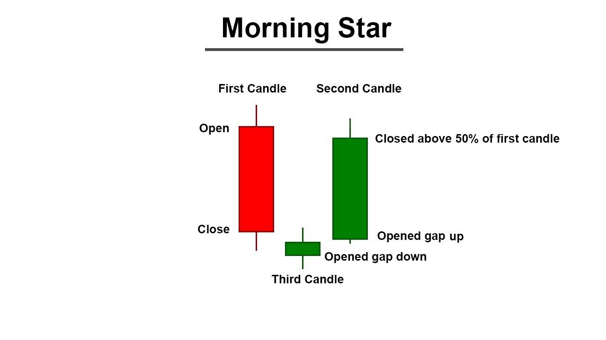

## Table of Contents

## What is a Morning Star candlestick pattern?

A Morning Star is a pattern you can see on a stock chart. It shows that the price of a stock might start going up after it has been going down. The pattern has three candles. The first candle is long and shows the price going down a lot. The second candle is small and can go up or down a little. It shows that the price is not changing much. The third candle is long and goes up a lot, showing that the price is starting to go up.

This pattern is important because it can help people who invest in stocks to make decisions. When they see a Morning Star, they might think it's a good time to buy the stock because the price could keep going up. But, it's not perfect. Sometimes the price might not go up after a Morning Star. So, it's good to look at other things too before deciding to buy or sell.

## How does a Morning Star pattern form on a chart?

A Morning Star pattern forms on a chart when the price of a stock goes through a specific sequence over three days. First, you see a long red or black candle, which means the price dropped a lot that day. This shows that sellers were in control and the price was going down strongly. The next day, the candle is small, and it can be either red or green. This small candle shows that the price didn't change much, and it means the sellers are losing their power, and buyers are starting to come in.

On the third day, you see a long green or white candle. This candle shows that the price went up a lot, and it means the buyers have taken control. The long green candle often goes up past the middle of the first long red candle, which is a strong sign that the price might keep going up. Together, these three candles make the Morning Star pattern, which suggests that the price might start to go up after being down for a while.

## What are the key components of a Morning Star pattern?

The Morning Star pattern is made up of three candles on a chart. The first candle is long and red, showing that the price went down a lot on that day. This tells us that sellers were strong and in control. The second candle is small and can be either red or green. It means the price didn't change much that day, showing that the sellers are starting to lose their power and the buyers are beginning to step in.

The third candle is long and green, showing that the price went up a lot. This candle often goes above the middle of the first red candle, which is a good sign that the price might keep going up. Together, these three candles form the Morning Star pattern, suggesting that the price might start to rise after being down for a while.

## Can you explain the significance of the first candlestick in a Morning Star pattern?

The first candlestick in a Morning Star pattern is very important. It is a long red candle, which means the price of the stock went down a lot on that day. This shows that the sellers were strong and in control. They were able to push the price down, which makes people think that the price might keep going down.

But, this long red candle is also the start of something new. It shows the last big push by the sellers before things start to change. When you see this candle, it's like seeing the end of a downward trend. It sets the stage for the small candle that comes next, which can show that the sellers are losing their power and the buyers are starting to come back.

## What does the second candlestick in a Morning Star pattern indicate?

The second candlestick in a Morning Star pattern is small and can be either red or green. This small candle shows that the price of the stock did not change much on that day. It means that the strong downward movement from the first candle is starting to slow down. The sellers are losing their power, and the buyers are beginning to step in, but they are not strong enough yet to push the price up a lot.

This small candle is like a pause in the action. It shows that the market is unsure and is trying to figure out what to do next. It's a sign that the sellers are not as strong as they were, and it gives hope that the buyers might take over soon. This sets the stage for the third candle, which will show if the buyers can really take control and push the price up.

## How does the third candlestick confirm a Morning Star pattern?

The third candlestick in a Morning Star pattern is a long green candle. This candle shows that the price of the stock went up a lot on that day. It means the buyers have taken control and are strong enough to push the price higher. When you see this long green candle, it often goes up past the middle of the first long red candle. This is a strong sign that the price might keep going up.

This long green candle confirms the Morning Star pattern because it shows that the buyers are now in charge. After the first red candle showed the sellers were strong, and the small second candle showed a pause, the third green candle shows a clear change. It tells us that the downward trend is likely over, and a new upward trend might start. This is why the third candlestick is so important in confirming the Morning Star pattern.

## In what market conditions is a Morning Star pattern most reliable?

A Morning Star pattern is most reliable when the stock market has been going down for a while. If the price of a stock has been dropping and then you see a Morning Star, it can be a good sign that the price might start to go up. This is because the pattern shows that the sellers, who were pushing the price down, are losing their power, and the buyers are starting to take over.

The pattern works best when it happens after a clear downward trend. If the market is just moving up and down a little bit, the Morning Star might not mean as much. But if the price has been going down strongly for a while, and then you see the three candles of the Morning Star, it's a stronger sign that the price might start to go up. It's always a good idea to look at other things in the market too, to make sure the Morning Star is a good sign for buying.

## How can traders use the Morning Star pattern to make trading decisions?

Traders can use the Morning Star pattern to help them decide when to buy a stock. When they see this pattern after the price of a stock has been going down for a while, it can be a sign that the price might start to go up. The pattern shows that the sellers, who were pushing the price down, are losing their power, and the buyers are starting to take over. So, if a trader sees a Morning Star, they might think it's a good time to buy the stock because the price could keep going up.

But, traders should not just rely on the Morning Star pattern alone. It's important to look at other things in the market too, like the overall trend, other chart patterns, and news about the company. Sometimes, the price might not go up after a Morning Star, so it's good to use this pattern along with other signs to make a smarter decision about buying or selling.

## What are common mistakes traders make when identifying a Morning Star pattern?

One common mistake traders make when identifying a Morning Star pattern is not waiting for the third candlestick to confirm the pattern. They might see the first long red candle and the second small candle and think it's a Morning Star, but they should wait for the third long green candle to make sure. If they don't wait, they might think the price will go up too soon and make a bad trading decision.

Another mistake is not looking at the bigger picture. The Morning Star pattern works best when it happens after the price has been going down for a while. If traders don't check the overall trend and just see the three candles, they might think the pattern means the price will go up even if the market is not really changing. It's important to see if the pattern fits with what's happening in the market overall.

Traders also sometimes ignore the size of the candles. The first candle should be long and red, the second should be small, and the third should be long and green. If the candles are not the right sizes, it might not be a real Morning Star pattern. Traders need to pay attention to these details to make sure they are looking at the right pattern.

## How does the Morning Star pattern differ from the Evening Star pattern?

The Morning Star and Evening Star patterns are both three-candle patterns that show a change in the price trend of a stock, but they mean opposite things. The Morning Star pattern shows that the price might start going up after it has been going down. It starts with a long red candle, showing that the price dropped a lot. Then comes a small candle, which can be red or green, showing that the price didn't change much. The third candle is a long green one, showing that the price went up a lot. This pattern means the sellers are losing power and the buyers are taking over.

The Evening Star pattern, on the other hand, shows that the price might start going down after it has been going up. It starts with a long green candle, showing that the price went up a lot. The second candle is small, showing that the price didn't change much. The third candle is a long red one, showing that the price dropped a lot. This pattern means the buyers are losing power and the sellers are taking over. So, while the Morning Star suggests a bullish reversal, the Evening Star suggests a bearish reversal.

## What technical indicators complement the Morning Star pattern for better analysis?

To get a better understanding of what the Morning Star pattern means, traders can use other technical indicators along with it. One helpful indicator is the Relative Strength Index (RSI). The RSI shows if a stock is overbought or oversold. If the RSI is low when you see a Morning Star, it can be a stronger sign that the price might go up because the stock was oversold and might be ready for a price increase.

Another useful indicator is the Moving Average Convergence Divergence (MACD). The MACD helps traders see the strength and direction of a trend. If the MACD line crosses above the signal line around the same time as a Morning Star pattern, it can confirm that the price might start to go up. Using these indicators together with the Morning Star pattern can give traders more confidence in their decisions about when to buy a stock.

## Can you discuss any advanced strategies for trading using the Morning Star pattern?

When trading with the Morning Star pattern, one advanced strategy is to combine it with [volume](/wiki/volume-trading-strategy) analysis. If the volume is high during the first long red candle, it shows that many people were selling. But if the volume drops during the small second candle and then goes up again during the long green third candle, it can be a stronger sign that the price might go up. This is because the high volume on the third candle shows that many people are buying the stock, which can push the price higher. Traders can use this volume information to feel more confident about buying after seeing a Morning Star.

Another strategy is to use the Morning Star pattern along with support and resistance levels. If the Morning Star forms near a strong support level, it can be a good sign that the price will go up. Support levels are prices where the stock has stopped going down before, so it might stop there again. If the third green candle of the Morning Star breaks above a resistance level, it can be an even stronger sign that the price will keep going up. Traders can use these levels to decide when to buy and set their price targets for selling later.

## References & Further Reading

[1]: Nison, S. (1991). ["Japanese Candlestick Charting Techniques: A Contemporary Guide to the Ancient Investment Techniques of the Far East."](https://www.amazon.com/Japanese-Candlestick-Charting-Techniques-Contemporary/dp/0139316507) New York Institute of Finance.

[2]: Murphy, J. J. (1999). ["Technical Analysis of the Financial Markets: A Comprehensive Guide to Trading Methods and Applications."](https://www.amazon.com/Technical-Analysis-Financial-Markets-Comprehensive/dp/0735200661) New York Institute of Finance.

[3]: Bulkowski, T. N. (2008). ["Encyclopedia of Candlestick Charts."](https://onlinelibrary.wiley.com/doi/book/10.1002/9781119202288) Wiley Trading.

[4]: Pring, M. J. (2002). ["Technical Analysis Explained: The Successful Investor's Guide to Spotting Investment Trends and Turning Points."](https://www.amazon.com/Technical-Analysis-Explained-Fifth-Successful/dp/0071825177) McGraw-Hill Education.

[5]: Steenbarger, B. N. (2003). ["The Psychology of Trading: Tools and Techniques for Minding the Markets."](https://www.amazon.com/Psychology-Trading-Techniques-Minding-Markets/dp/0471267619) Wiley.