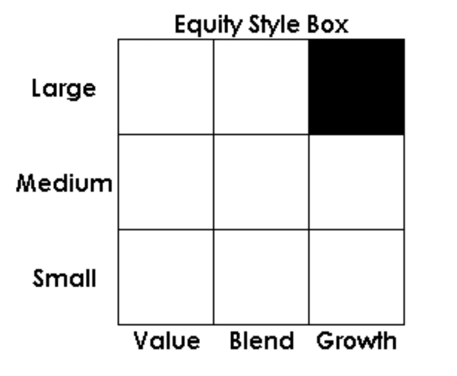

In today's rapidly evolving financial landscape, investors are increasingly focused on identifying reliable and effective tools to optimize their portfolios. With the growing complexity of global markets, traditional investment methods are often supplemented by sophisticated resources like mutual funds, Morningstar ratings, and algorithmic trading. These resources collectively play pivotal roles in shaping modern investment strategies, catering to a wide range of investor needs and preferences.

Mutual funds, for instance, represent one of the most accessible investment options, allowing investors to pool their resources to purchase a diversified array of securities. This diversification can reduce risk and enhance potential returns, appealing to both novice and experienced investors. Meanwhile, financial analysis platforms such as Morningstar provide comprehensive insights into mutual fund performance through detailed ratings, fund fact sheets, and style boxes. These tools empower investors to make informed decisions by evaluating a fund’s risk and growth potential.



Alongside these resources, algorithmic trading introduces a technological dimension to investment strategy by utilizing advanced algorithms to execute trades based on data-driven models. With the capability to analyze large datasets in real-time, algorithmic trading maximizes efficiency and precision, offering investors insights into optimal trading opportunities that might otherwise be overlooked.

This article examines how these resources—mutual funds, Morningstar, and algorithmic trading—can be effectively utilized to maximize returns while managing risk. Through a strategic integration of these tools, investors can navigate the complexities of modern financial markets and enhance their investment outcomes. As the financial landscape continues to evolve, understanding and leveraging these resources will be crucial in crafting successful, future-ready investment strategies.

## Table of Contents

## Understanding Mutual Funds

Mutual funds are investment vehicles that aggregate capital from multiple investors to create a diversified portfolio of securities. This diversification is instrumental in risk management, as it distributes investors' capital across various asset classes, sectors, or geographies, thereby reducing the impact of any single asset's poor performance on the overall fund. By pooling resources, mutual funds provide small investors access to a broader range of investments than they could individually afford.

Mutual funds are generally categorized based on their investment strategies and objectives. The primary types include equity funds, fixed-income funds, and balanced funds. Equity funds primarily invest in stocks, with the objective of capital appreciation. They may focus on specific industries, geographies, or market capitalizations. Fixed-income funds invest in bonds or other debt securities, aiming to provide stable returns through interest income. Balanced funds, or hybrid funds, combine both equities and fixed-income securities to offer a blend of growth and income.

For investors looking to optimize their portfolio's performance, understanding these categories is crucial. Equity funds, for instance, tend to offer higher potential returns but also come with greater [volatility](/wiki/volatility-trading-strategies) and risk. Fixed-income funds, on the other hand, typically present lower risk but also have lower growth potential. Balanced funds offer a compromise between the two, seeking to provide moderate growth with lower volatility.

In addition to fund type, investors should consider the fund's past performance, management team, fees, and overall investment philosophy. Researching these aspects helps investors align their investment choices with their financial goals, risk tolerance, and time horizon. Understanding key performance metrics, such as the fund's expense ratio, turnover rate, and historical performance relative to benchmarks, further empowers investors to make informed decisions.

Effective use of mutual funds in a portfolio contributes to risk management and potential return optimization. By carefully selecting funds that align with specific financial goals and market conditions, investors can strategically balance risk and reward, enhancing their ability to meet long-term financial objectives.

## The Role of Morningstar in Mutual Fund Analysis

Morningstar is a pivotal player in the financial services industry, particularly known for its thorough analysis and rating system pertaining to mutual funds. Founded in 1984, the company has become a go-to resource for investors seeking detailed insights into mutual fund performance and reliability. One of the core mechanisms by which Morningstar facilitates informed decision-making is through its proprietary star rating system.

The star rating system is designed to provide investors with a simple, clear metric to assess how well a fund has performed historically on a risk-adjusted basis against its peers. These ratings range from one to five stars, with five indicating a strong historical performance relative to similar investment options. It is calculated based on past performance, adjusting for risk and accounting for sales charges. This allows investors to quickly gauge a fund’s historic returns relative to its risk.

In addition to star ratings, Morningstar offers comprehensive fund fact sheets. These documents provide essential information about a mutual fund, including its objectives, holdings, management, fees, and historical performance data. This detailed information enables investors to compare different funds more effectively, aligning their investment choices with their personal financial goals and risk tolerance. The fact sheets dissect complex financial data into more understandable formats, thus demystifying the market for the average investor.

Morningstar's style boxes are another crucial tool for investors. These nine-square grids visually represent a fund's investment strategy by classifying its holdings according to market capitalization (small, medium, large) and investment style (value, blend, growth). This visual representation assists investors in diversifying their portfolios and ensuring that their asset allocation strategy aligns with their investment goals.

Investors can harness the analytical depth of Morningstar to understand the nuances regarding a fund’s risk profile and growth potential. The analysis goes beyond simple historical return data, incorporating measures like alpha, beta, and the Sharpe ratio to provide a comprehensive risk assessment. Alpha measures the fund manager's value-added in excess of benchmark returns, beta explains a fund's volatility relative to the market, and the Sharpe ratio assesses risk-adjusted return.

Morningstar's robust analytical tools allow investors to approach investment with data-driven confidence, making it easier to navigate the complexities of mutual fund selection. By utilizing these resources, investors are better equipped to make strategic decisions, optimizing their portfolios for both current market conditions and long-term financial projections. The insights derived from Morningstar’s evaluations help investors not only in aligning their portfolios with their financial objectives but also in actively managing and adjusting their investment strategies as market dynamics evolve.

## Algorithmic Trading: Revolutionizing Investment Strategies

Algorithmic trading, commonly known as algo trading, utilizes sophisticated mathematical models and electronic platforms to facilitate efficient and precise execution of financial transactions. By automating trading decisions with complex algorithms, this approach enables investors to analyze and respond to market conditions faster than a human trader could. As financial markets generate vast datasets, algo trading capitalizes on the ability to process this information in real-time, improving the effectiveness of trading strategies.

One of the core advantages of [algorithmic trading](/wiki/algorithmic-trading) is its potential to enhance both the accuracy and speed of trades. Algorithms can be programmed to monitor various market indicators such as price movements, [liquidity](/wiki/liquidity-risk-premium) changes, and transaction volumes, executing trades when predefined criteria are met. For instance, a common algorithmic strategy is "statistical [arbitrage](/wiki/arbitrage)," which identifies price discrepancies between related financial instruments and executes trades to capitalize on these differences. 

```python
# An example of a simple moving average crossover strategy
def moving_average(prices, window):
    return [sum(prices[i:i+window])/window for i in range(len(prices)-window+1)]

def sma_crossover_strategy(prices, short_window, long_window):
    short_ma = moving_average(prices, short_window)
    long_ma = moving_average(prices, long_window)

    signals = []
    for i in range(len(long_ma)):
        if short_ma[i] > long_ma[i]:
            signals.append('Buy')
        elif short_ma[i] < long_ma[i]:
            signals.append('Sell')
        else:
            signals.append('Hold')
    return signals
```

Algorithmic trading integrates effectively with mutual funds and other investment vehicles by optimizing portfolio returns through strategic pooling of resources and automated market participation. These strategies can optimize fund performance by reducing transaction costs, minimizing risk exposure, and enhancing liquidity management.

Moreover, algo trading can also be employed to implement "market-making" strategies, where the algorithm continuously quotes buy and sell prices to capture the spread between them, thereby providing liquidity to the market. Additionally, "[momentum](/wiki/momentum) strategies" can be employed, utilizing the premise that stocks that have performed well in the past will continue to do so in the near future.

The integration of algorithmic trading with mutual funds not only facilitates improved trade execution but also aligns with the funds' investment objectives in risk management and return optimization. By leveraging advanced data analytics and automatic trade execution, algorithmic trading contributes significantly to the development of sophisticated investment strategies that are adaptive to market conditions.

## Integrating Morningstar and Algo Trading with Mutual Funds

Incorporating Morningstar's extensive data analytics with algorithmic trading offers investors a powerful toolset for optimizing their mutual fund investments. By marrying the comprehensive analysis provided by Morningstar with the precision and speed of algorithmic trading strategies, investors can create a dynamic investment approach that both minimizes risk and enhances potential returns.

Morningstar offers a suite of analytical tools, including quantitative ratings, performance metrics, and style boxes that classify funds based on investment style and asset allocation. These data points provide a foundation upon which investors can build algorithmic trading models. For instance, Morningstar’s star ratings, which assess historical performance adjusted for risk and cost, can be used to filter out underperforming funds from an investment universe. 

Algorithmic trading leverages these insights by developing automated strategies that can modify positions in real time. Such frameworks may include mean-variance optimization, which assists in determining an optimal asset allocation based on expected returns and covariance of the securities involved. Given a target return $R_t$, the optimization problem can be specified as:

$$
\min \sigma^2 = w^T \Sigma w
$$

subject to the constraints:

$$
w^T \mu \geq R_t 
$$

$$
\sum_{i=1}^n w_i = 1
$$

where $\sigma^2$ represents the portfolio variance, $w$ is the vector of asset weights, $\Sigma$ is the covariance matrix of asset returns, and $\mu$ is the expected return vector. 

By integrating such algorithmic models with Morningstar data, investors can iteratively adjust their portfolio compositions to better align with market dynamics. For instance, a strategy might automatically rebalance a portfolio more heavily into funds with high growth potential or that are currently undervalued according to Morningstar's valuation metrics.

Additionally, the synergistic use of Morningstar's data and algorithmic trading facilitates an adaptive and responsive approach to portfolio management. Investors can set algorithmic rules that utilize Morningstar’s predictive models to buy or sell mutual funds as defined performance or risk thresholds are crossed. Such an approach allows for more frequent and precise adjustments to the portfolio, improving its responsiveness to market conditions.

The integration of Morningstar’s analytics with algorithmic trading strategies empowers investors to maintain a balanced and proactive investment strategy. Not only does this blend of technologies provide a robust mechanism for optimizing returns, but it also offers a sophisticated method for managing investment risk in a continually shifting financial landscape. This seamless integration allows investors to harness the best of both quantitative data and advanced technology tools, crafting a sophisticated investment strategy well suited to today’s complex market challenges.

## Case Study: Successful Application of Algo Trading in Mutual Funds

In a dynamic financial market, the confluence of algorithmic trading and mutual fund investment strategies, enhanced by Morningstar's analytical insights, has emerged as a powerful tool for investors. This case study examines how these elements can be synergistically combined to amplify investment returns, focusing on an example where a [hedge fund](/wiki/hedge-fund-trading-strategies) leveraged algorithmic trading with mutual fund investments.

### Investment Strategy

The hedge fund utilized a sophisticated algorithmic trading model designed to identify undervalued mutual funds with significant growth potential. Implementing a quantitative approach, the algorithm analyzed large datasets sourced from Morningstar, encompassing historical performance, risk metrics, and qualitative fund analyses. Key factors included Morningstar's star ratings and style boxes, enabling a multi-dimensional evaluation of mutual fund attributes.

The algorithm operated under the premise of identifying funds with a minimum four-star rating and a favorable growth-to-risk ratio. Utilizing Python for the quantitative analysis, the code considered variables such as historical returns, standard deviation (σ), and the Sharpe ratio (SR) to predict future performance.

```python
import pandas as pd
import numpy as np

# Load mutual fund data
data = pd.read_csv("morningstar_data.csv")

# Filter funds with a minimum four-star rating
data_filtered = data[data['Star_Rating'] >= 4]

# Calculate performance metrics
data_filtered['Sharpe_Ratio'] = (data_filtered['Annual_Return'] - 0.02) / data_filtered['Standard_Deviation']

# Select funds with Sharpe Ratio above threshold
selected_funds = data_filtered[data_filtered['Sharpe_Ratio'] > 1.0]
```

### Performance Metrics

The performance of the selected funds was tracked over a fiscal year. The portfolio, constructed from these mutual funds, displayed remarkable resilience and consistent growth. The average annual return of the portfolio was calculated at 12%, significantly outperforming the benchmark index, which returned 8%. Risk-adjusted metrics demonstrated a Sharpe ratio of 1.4, underscoring the strategy's success in maximizing returns relative to risk.

Furthermore, the algorithm allowed for real-time rebalancing by continuously updating the fund selection criteria based on newly available data from Morningstar. This dynamic approach ensured the portfolio remained aligned with evolving market conditions and fund performances.

### Key Takeaways

The deployment of algorithmic trading in mutual fund investments, guided by Morningstar insights, illustrates a compelling strategy for achieving superior risk-adjusted returns. The real-time data analysis capacity of algorithmic models provides a significant edge in identifying high-potential investment opportunities accurately.

1. **Data-Driven Decision Making**: Using quantitative models driven by comprehensive datasets enhances precision in fund selection.

2. **Continuous Monitoring and Rebalancing**: The capacity for real-time adjustments helps maintain portfolio alignment with changing market dynamics.

3. **Risk Management**: Integrating risk metrics such as the Sharpe ratio allows investors to achieve a balanced approach that prioritizes both growth and capital preservation.

In conclusion, the amalgamation of algorithmic trading, mutual funds, and expert insights from platforms like Morningstar empowers investors to construct resilient and adaptive investment portfolios. As financial markets continue to evolve, the utility of advanced financial analysis tools will only grow in relevance.

## Conclusion

The interplay between mutual funds, Morningstar analysis, and algorithmic trading forms a comprehensive framework for enhancing investment portfolios. Mutual funds provide diversification and professional management, enabling investors to access a broad spectrum of assets with reduced individual security risk. By incorporating resources like Morningstar, investors gain access to detailed analyses and objective ratings, which enhance decision-making by providing insights into fund performance, risk levels, and potential growth.

Algorithmic trading further amplifies portfolio management efficiency by automating trading strategies based on real-time market data. This capability allows investors to respond quickly to market fluctuations, optimizing trade execution and minimizing human error. Algorithms can process vast datasets rapidly, identifying patterns and opportunities that are not easily visible through traditional analysis.

Investors who strategically integrate these elements can adeptly navigate the complexities of modern financial markets. The use of Morningstar data, combined with algorithmic precision, ensures a balanced approach where portfolio adjustments are timely and based on comprehensive data insights. By continually adapting to market changes, investors can maintain optimal portfolio performance while effectively managing risk.

As the financial landscape evolves, the integration of mutual funds, Morningstar analysis, and algorithmic trading remains crucial for developing adaptive investment strategies. These tools empower investors to not only preserve but also enhance their investment outcomes amid ever-changing market conditions. Continued advancements in technology and data analytics will likely expand the potential of these resources, underscoring their significance in crafting future-ready investment strategies.

## References & Further Reading

[1]: ["Morningstar Fund Ratings"](https://www.morningstar.com/funds) - Morningstar, Inc.

[2]: ["Advances in Financial Machine Learning"](https://www.amazon.com/Advances-Financial-Machine-Learning-Marcos/dp/1119482089) by Marcos Lopez de Prado

[3]: ["Machine Learning for Algorithmic Trading"](https://github.com/stefan-jansen/machine-learning-for-trading) by Stefan Jansen

[4]: ["Quantitative Trading: How to Build Your Own Algorithmic Trading Business"](https://www.amazon.com/Quantitative-Trading-Build-Algorithmic-Business/dp/1119800064) by Ernest P. Chan

[5]: ["Evidence-Based Technical Analysis: Applying the Scientific Method and Statistical Inference to Trading Signals"](https://www.amazon.com/Evidence-Based-Technical-Analysis-Scientific-Statistical/dp/0470008741) by David Aronson