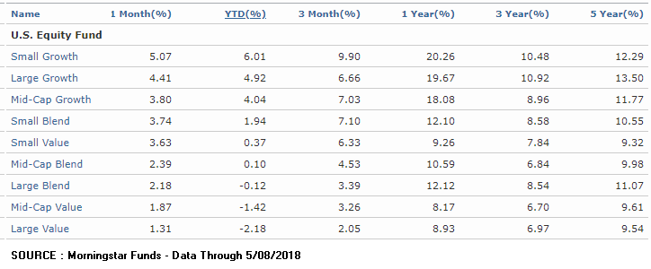

Mutual funds are vital components in modern investment strategies, providing investors with opportunities to diversify their portfolios across different asset classes. They pool resources from numerous investors to invest in a wide array of securities such as stocks, bonds, and other assets, thereby mitigating risks associated with individual investments. This diversification is crucial as it allows investors to spread their risk across a broader spectrum, potentially yielding higher returns over the long term. The accessibility and professionally managed nature of mutual funds make them particularly appealing to both novice and seasoned investors.

Investment ratings are essential tools that help investors assess the potential risks and returns of mutual funds. These ratings provide an easy-to-understand metric, typically derived from past performance, risk assessment, and management quality, enabling investors to make informed decisions. High investment ratings often enhance investor confidence, leading to increased inflows into highly rated funds, which could, in turn, bolster fund performance through greater capital availability.



Morningstar stands out as a leading provider of mutual fund ratings. It offers a comprehensive evaluation system that has become an industry standard. By analyzing various aspects of mutual funds, such as historical performance, risk, cost structures, and management, Morningstar provides ratings that help investors navigate the complex landscape of mutual fund investing. The precision and credibility of Morningstar's ratings make them a critical resource for investors looking to make well-informed fund choices.

Algorithmic trading represents a transformative force in the management of investment funds. This involves using computer algorithms to automate trading decisions based on pre-defined criteria, which can enhance the speed and accuracy of trade execution. Algorithmic trading has become increasingly prevalent due to technological advancements, enabling fund managers to implement sophisticated trading strategies that were once impossible.

The purpose of this article is to explore the intersection of mutual fund ratings and algorithmic trading. By examining how Morningstar ratings can inform and enhance algorithmic trading strategies, we aim to shed light on the benefits and challenges of integrating these two powerful tools. Through this exploration, readers will gain insights into how ratings can influence algorithmic decision-making and the potential future developments at this exciting intersection of finance and technology.

## Table of Contents

## Understanding Mutual Funds and Investment Ratings

Mutual funds are collective investment vehicles that pool funds from multiple investors to purchase a diversified portfolio of securities such as stocks, bonds, or other assets. They play a crucial role in individual and institutional portfolios by offering diversification, professional management, and liquidity. This diversification helps reduce the risk associated with investing in a single security, along with providing access to a range of asset classes and market sectors that may be difficult for individual investors to access independently.

Investors rely on mutual fund ratings to assess potential risks and returns. These ratings are pivotal in guiding investment decisions, as they offer insights into a fund’s past performance, its risk level, and the quality of its management. Mutual fund ratings serve as a barometer for measuring a fund's viability compared to its peers. A high rating often suggests that a mutual fund has performed well on risk-adjusted returns compared to its category. Consequently, high ratings can significantly bolster investor confidence and positively influence fund performance by attracting new investments. The inflow of investor capital often results in economies of scale, reducing the expense ratio and potentially enhancing the fund's performance over time.

Morningstar is renowned for its comprehensive mutual fund rating system. Morningstar evaluates mutual funds using a dual approach, encompassing both quantitative and qualitative analyses. The quantitative component, known as the "Star Rating," assigns funds between one and five stars based on past performance metrics adjusted for risk and cost within fund categories. This star rating system helps investors compare the relative risk-adjusted performance of funds over three, five, and ten-year periods, with five stars indicating the highest rating.

In addition to quantitative assessments, Morningstar provides Analyst Ratings, qualitative evaluations assessing a fund’s future potential. These assessments consider the fund's investment process, performance, management, parent company, and other factors. Analyst Ratings are designated as Gold, Silver, Bronze, Neutral, or Negative, indicating varying levels of confidence in the fund's ability to outperform its peers.

There are several types of mutual funds, each potentially subject to different ratings criteria based on their underlying assets and investment strategies. For instance, equity funds focus on stocks and may be judged on metrics like price-to-earnings ratios and market sectors, while bond funds are assessed based on interest rates and credit quality. Index funds, which aim to replicate the performance of a specific index rather than to outperform it, are rated by their tracking error and expense ratio. Each type of fund carries unique risks and benefits, which are reflected in how rating agencies evaluate them.

Overall, mutual fund ratings, especially those provided by Morningstar, play an integral role in shaping the investment decisions of both retail and institutional investors by providing a detailed evaluation of past performance, potential risks, and managerial quality.

## The Morningstar Rating System

The Morningstar Rating System, also known as the Star Rating, is a pivotal tool for investors seeking to understand the performance of mutual funds. It provides a reliable and straightforward assessment of a fund's past returns relative to its risk and expenses, allowing for a comparative analysis across similar funds.

### Methodology Used by Morningstar

The methodology behind Morningstar's rating system is rooted in quantitative measures. Funds are categorized into peer groups based on similar investment styles and strategies. The star ratings, ranging from one to five, are assigned based on a fund's historical risk-adjusted performance compared to its peer group.

The primary measure used is the Morningstar Risk-Adjusted Return (MRAR), which accounts for the [volatility](/wiki/volatility-trading-strategies) of the fund's return. The formula for MRAR is:

$$
MRAR = \frac{\text{Fund's Return} - \text{Risk-Free Rate}}{\text{Standard Deviation of the Fund's Return}}
$$

Funds in the top 10% of their category receive five stars, those in the next 22.5% receive four stars, the middle 35% receive three stars, the next 22.5% receive two stars, and the bottom 10% earn one star.

### Importance of Qualitative and Quantitative Assessments

While the star rating is primarily quantitative, Morningstar also provides qualitative assessments through its Analyst Ratings. These ratings, expressed as Gold, Silver, Bronze, Neutral, and Negative, incorporate analyst expertise and judgement, giving a more comprehensive view of the fund's prospects.

Quantitative analysis ensures an objective comparison based on past performance data, while qualitative assessments add insights into future performance potential by evaluating factors such as the fund manager's skill, investment process, and firm resources.

### Role of Analyst Expertise

Analyst expertise is integral to Morningstar’s broader evaluation process. Analysts conduct in-depth research, considering factors like a fund's strategy, its management team, and the parent company's principles. This process aims to predict a fund's ability to outperform over the long term, beyond just past performance metrics. Analysts utilize various tools and information, often engaging directly with fund managers and reviewing detailed reports to substantiate their ratings.

### Updating Ratings and Their Relevance

Morningstar updates its ratings regularly to reflect any changes in a fund's performance or underlying characteristics. These updates can result from shifts in market conditions, changes in fund management, or adjusted expense ratios, which all impact a fund's risk and performance profiles.

The relevance of these ratings to investors is significant. They serve as a quick reference for assessing the quality and consistency of mutual funds, influencing investment decisions and enabling investors to make informed choices that align with their risk tolerance and financial goals.

The Morningstar Rating System, therefore, not only demystifies mutual fund performance for individual investors but also enhances their capacity to make prudent investment choices. Through a blend of quantitative rigor and qualitative insight, Morningstar’s ratings provide an essential tool for evaluating the landscape of mutual fund investments.

## Algorithmic Trading: An Overview

Algorithmic trading, often referred to as algo trading, is a method of executing trades in financial markets using pre-programmed instructions or algorithms. These algorithms can scrutinize market variables like price, timing, and [volume](/wiki/volume-trading-strategy), enabling rapid decision-making and trade execution. The integration of technology into trading processes has marked a significant shift in how financial markets operate, contributing to the growing presence of [algorithmic trading](/wiki/algorithmic-trading).

**Benefits of Algorithmic Trading**

The primary benefits of algorithmic trading include speed, accuracy, and reduced transaction costs. Algorithms can execute orders at speeds and frequencies that are impossible for human traders. This rapid execution can capitalize on fleeting market conditions and price differences. Additionally, algorithms can precisely adhere to predefined criteria, reducing human error and emotional decision-making. By efficiently executing trades, transaction costs are minimized, potentially improving overall returns.

**Types of Algorithms in Trading Strategies**

Several types of algorithms are employed in trading strategies, each serving different purposes:

1. **Trend-following Algorithms**: These algorithms exploit market trends by analyzing moving averages and other technical indicators to identify opportunities. They buy when a security is trending upwards and sell when it is trending downwards.

2. **Arbitrage Algorithms**: These capitalize on price discrepancies between different markets or assets. Algorithms identify and exploit these differences to generate profit through simultaneous buying and selling.

3. **Market-making Algorithms**: These provide liquidity by continuously offering buy and sell quotes. Profit is made through the spread between the bid and ask prices.

4. **Mean Reversion Algorithms**: These are based on the assumption that prices return to their mean value. When prices deviate significantly from their average, the algorithm executes trades anticipating a reversal.

5. **Sentiment Analysis Algorithms**: These analyze news, social media, and other sources to gauge market sentiment, making trades based on the perceived sentiment impact on prices.

**Technological Advancements Enabling Effective Algorithmic Trading**

Recent technological advancements have significantly facilitated algo trading. High-frequency trading ([HFT](/wiki/high-frequency-trading-strategies)) platforms utilize advanced computer systems and networks to execute trades at extremely high speeds. Machine learning and [artificial intelligence](/wiki/ai-artificial-intelligence) have enhanced the development of more sophisticated algorithms capable of learning from past data to predict future price movements. Additionally, improvements in big data analytics allow the processing of vast amounts of market data, enhancing decision-making processes.

**Risks and Challenges of Algo Trading in Mutual Funds**

Despite the benefits, algorithmic trading poses several risks, especially when applied to mutual funds. One of the main challenges is overfitting, where an algorithm performs well on historical data but fails in real-world conditions. There is also the risk of technical glitches or malfunctions that could lead to significant financial losses. Market volatility can be exacerbated by the mass execution of trades in a short period, leading to flash crashes. Furthermore, mutual funds engaging in algo trading must be cautious of [liquidity](/wiki/liquidity-risk-premium) risk, as even small deviations from expectations can result in substantial impacts due to the scale of trading involved.

In summary, algorithmic trading presents a transformative approach to executing trades, leveraging technology for enhanced speed, accuracy, and efficiency. However, its implementation also requires careful risk management to mitigate the potential challenges it introduces, especially in the context of mutual fund management.

## The Intersection of Morningstar Ratings and Algo Trading

Mutual fund ratings, such as those provided by Morningstar, play a crucial role in shaping algorithmic trading strategies. These ratings offer a concise assessment of a fund's past performance, risk levels, and predicted future behavior, empowering automated systems to make informed trading decisions.

### Informing Algorithmic Trading Strategies

Morningstar ratings serve as a foundational tool for algorithmic trading by delivering essential data metrics that algorithms can process. Traders develop algorithms that incorporate these ratings to filter and prioritize mutual funds. Morningstar's comprehensive analysis, which includes star ratings based on historical risk-adjusted performance, acts as a significant determinant within these trading systems.

### Advanced Data Analytics and Mutual Fund Selection

Advanced data analytics techniques, such as [machine learning](/wiki/machine-learning) algorithms and natural language processing, significantly enhance mutual fund selection. These technologies enable the analysis of vast datasets beyond mere star ratings, including fund manager performance, market trends, and economic indicators. For example, machine learning models can be trained using historical data to predict future fund performance, integrating Morningstar ratings to refine these predictions. 

A sample Python implementation using pandas and scikit-learn might look like this:

```python
import pandas as pd
from sklearn.model_selection import train_test_split
from sklearn.ensemble import RandomForestRegressor

# Load dataset
data = pd.read_csv('fund_data.csv')

# Prepare data
features = data[['morningstar_rating', 'manager_experience', 'expense_ratio']]
target = data['future_return']

# Split data
X_train, X_test, y_train, y_test = train_test_split(features, target, test_size=0.2, random_state=42)

# Train model
model = RandomForestRegressor(n_estimators=100, random_state=42)
model.fit(X_train, y_train)

# Predict future returns based on new data
predictions = model.predict(X_test)
```

This predictive model harnesses Morningstar ratings alongside other variables to forecast fund returns, guiding decisions on whether to buy or sell fund shares.

### Optimizing Trading Decisions with Morningstar Insights

Algorithmic trading systems utilize Morningstar insights to optimize trading decisions by leveraging ratings to assess and re-balance portfolios continually. These systems monitor changes in ratings and adjust holdings to maintain optimal risk and return profiles. Algorithms programmed to react to changes in Morningstar ratings allow for faster, more efficient portfolio adjustments compared to human-only strategies.

### Case Studies: Morningstar Ratings Influencing Algorithms

Several asset management firms have successfully integrated Morningstar ratings into their algorithmic strategies. One such firm reportedly increased its portfolio's return by 2% annually through an algorithm that adjusted fund allocations in response to upgrades in Morningstar star ratings. This highlights the tangible benefits of incorporating trusted third-party ratings into automated investment strategies.

### Future Potential and Developments

The future intersection of Morningstar ratings and algorithmic trading promises further advancements as technology and data analytics evolve. Emerging technologies, such as artificial intelligence and blockchain, could enable real-time ratings updates and broader data sets for even more robust algorithms. Additionally, more personalized investor experiences may be facilitated through algorithms that tailor mutual fund recommendations based on individual risk tolerance and investment goals.

In summary, the convergence of Morningstar ratings and algorithmic trading represents a powerful synergy in the investment landscape. It enhances the capability of trading systems to make informed and efficient decisions, paving the way for more sophisticated and adaptive investment strategies.

## Benefits and Risks of Integrating Ratings with Algorithmic Trading

Integrating mutual fund ratings with algorithmic trading offers a range of advantages that can significantly enhance investment strategies. The primary benefit is the enhancement of decision-making and efficiency. By incorporating ratings, algorithms can leverage structured qualitative and quantitative insights, potentially leading to more informed and timely trading decisions. This integration allows traders to filter vast amounts of fund data, prioritize investments with higher ratings, and consequently capitalize on anticipated performance trends backed by proven historical metrics.

However, the combination of mutual fund ratings and algorithmic trading is not without risks. One major risk is the potential for over-reliance on ratings. While ratings are significant indicators of fund performance, they are not infallible and do not account for all market variables. Algorithms, if overly dependent on these ratings, may fail to consider other critical factors like geopolitical events or sudden market shifts. This can lead to data misinterpretation, where algorithms might execute trades based on outdated or incomplete information, resulting in suboptimal investment decisions.

To address these risks, human oversight remains crucial. Despite the precision and speed offered by algorithmic systems, human judgment is essential to interpret nuanced situations that an algorithm might overlook. Regular monitoring and auditing of algorithmic processes can ensure that trading strategies remain aligned with the current market environment and organizational investment goals.

To mitigate risks while fully leveraging the benefits of this integration, traders can adopt several strategies. Firstly, developing adaptive algorithms that [factor](/wiki/factor-investing) in real-time data updates and broader market conditions can help balance reliance on ratings. Secondly, incorporating a feedback loop where algorithms are continually refined based on their performance outcomes can enhance their decision-making capabilities. Finally, it is beneficial to use a diversified set of data inputs, instead of relying solely on ratings, to provide a well-rounded basis for trading decisions, thus reducing the risk of misinterpretation.

In conclusion, while the integration of mutual fund ratings and algorithmic trading presents numerous benefits, it necessitates a balanced approach. By maintaining vigilant oversight and adopting strategies to enhance the robustness of trading algorithms, investors can effectively harness the potential of this powerful integration.

## Conclusion

Mutual fund ratings have become an essential tool for investors aiming to craft well-informed investment strategies. These ratings provide crucial insights into the risk and potential return of various funds, enabling investors to make decisions grounded in quantitative and qualitative analyses. Among the prominent rating systems, Morningstar stands out for its comprehensive and dynamic evaluations, which play a pivotal role in shaping investment activities.

Morningstar ratings enhance algorithmic trading strategies by offering a layer of refined data that algorithms can process to optimize decision-making. By interpreting numerical scores and qualitative assessments, algorithms can implement strategies that align with high-performing mutual funds, potentially increasing returns. The integration of these ratings into algorithmic models allows for more precise execution of trades, thus leveraging the predictive capabilities of well-researched data.

Nonetheless, it is crucial to balance technological advancements with human expertise. While algorithms excel in processing vast datasets with speed and consistency, they lack the nuanced understanding and adaptability that experienced human analysts bring to the table. This underscores the necessity of a collaborative approach where algorithms are used as tools to augment human judgment rather than replace it.

Continued education and exploration of this integration's potential can further refine investment strategies. As financial markets evolve, understanding how to effectively utilize mutual fund ratings within algorithmic frameworks will become increasingly valuable. Investors and fund managers are encouraged to stay updated with advancements in technology and methodologies to harness the full potential of these tools.

Looking ahead, the synergy between mutual fund ratings and algorithmic trading holds considerable promise for the future of investment strategies. As data analytics and machine learning continue to evolve, the capacity to enhance decision-making in financial markets will grow, offering new avenues for optimization and risk management. Embracing both ratings and algotrading as complementary elements will allow for diversified and resilient investment portfolios.

## Additional Resources

For investors looking to deepen their understanding of mutual funds and investment ratings, the following resources offer valuable insights and educational opportunities:

### Links to Morningstar

- **Morningstar's Official Website**: For comprehensive data, insights, and updates on mutual fund ratings, visit [Morningstar](https://www.morningstar.com). They provide detailed fund reports and the latest news in investment ratings.

### Educational Resources on Mutual Funds and Investment Ratings

- **Investor.gov**: The U.S. Securities and Exchange Commission’s website offers a straightforward guide on mutual funds, explaining key concepts and practical advice for investors. Visit [Investor.gov Mutual Funds](https://www.investor.gov/introduction-investing/investing-basics/investment-products/mutual-funds) for more information.

- **Investopedia**: For a thorough overview and educational articles on mutual funds, including their benefits and risks, see [Investopedia's Guide to Mutual Funds](https://www.investopedia.com/mutual-funds-4427685).

### Recommended Readings on Algorithmic Trading

- **"Algorithmic Trading: Winning Strategies and Their Rationale" by Ernie Chan**: This book provides an in-depth look at the algorithms behind successful trading strategies.

- **Research Papers and Articles**: Websites like [SSRN](https://www.ssrn.com) and [arXiv](https://arxiv.org) host extensive libraries of research papers on various aspects of algorithmic trading.

### Online Courses or Webinars

- **Coursera**: Offers a course titled "Machine Learning for Trading" which covers algorithmic trading strategies and their implementation. [Enroll here](https://www.coursera.org/learn/machine-learning-trading).

- **EdX**: Provides courses like "Algorithmic Trading and Finance Models with Python, R, and Stata." Start learning at [EdX](https://www.edx.org/course/algorithmic-trading-and-finance-models-with-python-r-and-stata).

### Contacting Financial Advisors

- **Certified Financial Planner (CFP) Board**: To find certified financial planners who specialize in mutual funds, visit the [CFP Board's website](https://www.letsmakeaplan.org).

- **Financial Planning Association (FPA)**: A resource for locating professional financial advisors who can offer personalized guidance on mutual funds and investment ratings. Check their [FPA Find a Planner](https://www.plannersearch.org) tool for a list of experts.

These resources provide a gateway to expanding knowledge in mutual funds, investment ratings, and algorithmic trading, helping investors make informed decisions.

## References & Further Reading

[1]: Morningstar. ["The Morningstar Rating for Funds."](https://www.morningstar.com/funds) Morningstar Methodology Paper.

[2]: Chan, E. P. (2009). ["Quantitative Trading: How to Build Your Own Algorithmic Trading Business"](https://github.com/ftvision/quant_trading_echan_book). Wiley.

[3]: Jansen, S. (2018). ["Machine Learning for Algorithmic Trading."](https://github.com/stefan-jansen/machine-learning-for-trading) Packt Publishing.

[4]: Chen, Y., & Lee, C. (2021). ["Algorithmic Trading: Winning Strategies and Their Rationale"](https://www.wiley.com/en-us/Algorithmic+Trading%3A+Winning+Strategies+and+Their+Rationale-p-9781118460146) by Ernie Chan. Wiley.

[5]: Lopez de Prado, M. (2018). ["Advances in Financial Machine Learning."](https://www.amazon.com/Advances-Financial-Machine-Learning-Marcos/dp/1119482089) Wiley.

[6]: Aronson, D. R. (2006). ["Evidence-Based Technical Analysis: Applying the Scientific Method and Statistical Inference to Trading Signals."](https://www.amazon.com/Evidence-Based-Technical-Analysis-Scientific-Statistical/dp/0470008741) Wiley.

[7]: Investopedia. ["How Morningstar Rates Funds."](https://www.investopedia.com/articles/investing/102115/how-morningstar-rates-and-ranks-mutual-funds.asp)