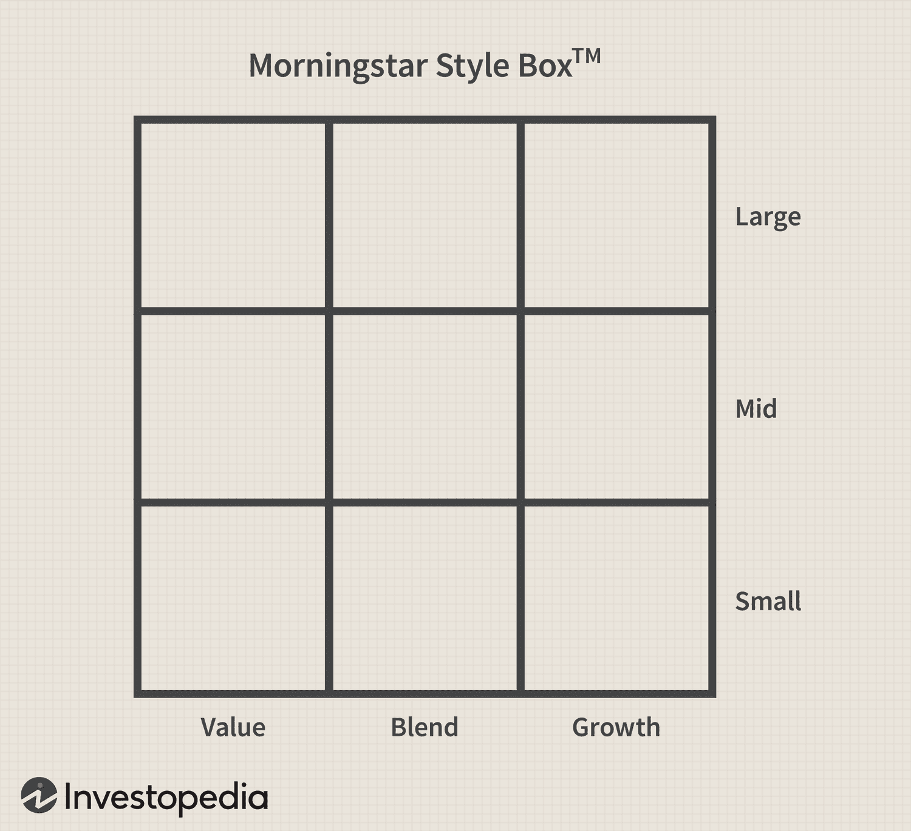

## Table of Contents

## What is the Morningstar Risk Rating?

The Morningstar Risk Rating is a way to measure how risky an investment is. It looks at how much the investment's value goes up and down over time. Morningstar gives a rating from one to five, where one means the investment is less risky, and five means it's more risky. This helps people understand the risk before they decide to invest their money.

The rating is based on the investment's past performance, usually looking back over the last five years. It compares the investment to others in the same category to see how it behaves. If an investment's value changes a lot, it gets a higher risk rating. This can be useful for investors who want to know if an investment might be too risky for them, or if it fits with how much risk they are willing to take.

## How is the Morningstar Risk Rating calculated?

The Morningstar Risk Rating is calculated by looking at how much an investment's value goes up and down over time. They use a measure called standard deviation, which shows how much the investment's returns change from the average. Morningstar looks at the past five years of data to see how much the investment has moved around. They compare this to other investments in the same category to see if it's more or less risky.

After figuring out the standard deviation, Morningstar gives the investment a score from one to five. A score of one means the investment is less risky because its value doesn't change much. A score of five means it's more risky because its value can go up and down a lot. This helps people see how much risk they might be taking with their money.

## What are the different levels of Morningstar Risk Rating?

The Morningstar Risk Rating has five levels, from one to five. Each level shows how much risk an investment might have. A rating of one means the investment is less risky. It doesn't change much in value. A rating of two means it's still pretty safe but can change a bit more than a one. A rating of three is in the middle, meaning it's an average amount of risk. Investments with this rating can go up and down but not too wildly.

A rating of four means the investment is more risky. Its value can change a lot, which can be good or bad depending on what happens in the market. A rating of five is the highest level of risk. Investments with this rating can change a lot in value, so they can be very exciting but also very scary. Knowing these levels helps people choose investments that match how much risk they want to take.

## Why is the Morningstar Risk Rating important for investors?

The Morningstar Risk Rating is important for investors because it helps them understand how risky an investment might be. When you're thinking about where to put your money, you want to know if it's going to be safe or if it might go up and down a lot. The rating gives you a simple number from one to five, so you can quickly see if an investment is less risky or more risky. This can help you decide if it's the right choice for you, based on how much risk you're okay with.

Knowing the risk level can also help you plan better. If you see that an investment has a high risk rating, you might decide to put less money into it or look for other options that are safer. On the other hand, if you're okay with taking more risk and you want the chance to make more money, you might choose investments with a higher rating. Either way, the Morningstar Risk Rating gives you important information to make smarter choices with your money.

## How does the Morningstar Risk Rating compare to other risk assessment tools?

The Morningstar Risk Rating is one of many tools that help people figure out how risky an investment might be. It uses a simple scale from one to five, which makes it easy for anyone to understand. Other tools, like the Sharpe Ratio, also look at risk but do it in a different way. The Sharpe Ratio measures risk by comparing an investment's return to a risk-free investment, like a government bond, and gives you a number that shows how much extra return you're getting for the risk you're taking. Both tools help investors, but they give different kinds of information.

Another tool, the Standard & Poor's (S&P) Risk Rating, focuses on the credit risk of bonds and other debt investments. It uses letters like AAA, AA, A, and so on, to show how likely it is that the borrower will pay back the money. This is different from the Morningstar Risk Rating, which looks at how much an investment's value might go up and down. Each tool has its own way of helping investors understand risk, so some people might use more than one to get a full picture of their investments.

## Can the Morningstar Risk Rating be used for all types of investments?

The Morningstar Risk Rating is mostly used for mutual funds, exchange-traded funds (ETFs), and some other types of investments that have a lot of data about how they've done in the past. It looks at how much an investment's value has gone up and down over the last five years. This helps people see if an investment is less risky or more risky. But, it might not work well for things like stocks or bonds that don't have enough past data to look at.

For investments like individual stocks or bonds, other tools might be better. These investments can be harder to rate because they might not have the same kind of data that mutual funds and ETFs do. So, while the Morningstar Risk Rating is a good tool for many types of investments, it's not perfect for everything. People should use it along with other tools to get a full picture of the risks they might be taking.

## What are the limitations of the Morningstar Risk Rating?

The Morningstar Risk Rating is a helpful tool, but it has some limits. It only looks at how an investment has done in the past, usually over the last five years. This means it might not tell you what will happen in the future. The world of money can change a lot, and what happened before might not happen again. Also, it's best for things like mutual funds and ETFs that have a lot of past data. It might not work well for single stocks or bonds because they don't always have enough past information to look at.

Another thing to know is that the Morningstar Risk Rating only looks at one kind of risk: how much an investment's value goes up and down. But there are other kinds of risks, like the chance that a company might not pay back its debts or that a whole market might crash. The rating doesn't tell you about these other risks. So, while the Morningstar Risk Rating can be a good starting point, you should use it along with other tools to get a full picture of the risks you might be taking with your money.

## How often is the Morningstar Risk Rating updated?

The Morningstar Risk Rating is updated every month. This means that every month, Morningstar looks at the latest data for the last five years and changes the risk rating if they need to. This helps keep the rating up to date with how the investment has been doing recently.

Even though it's updated monthly, the rating might not change every month. If the investment's value has been moving around in the same way, the rating might stay the same. But if there have been big changes in how much the investment goes up and down, you might see a different risk rating when it's updated.

## How can investors use the Morningstar Risk Rating in their investment strategy?

Investors can use the Morningstar Risk Rating to help pick investments that fit their comfort with risk. If you don't like taking big chances with your money, you might look for investments with a lower risk rating, like a one or two. These investments don't change in value as much, so they might be safer. But, if you're okay with more risk and want the chance to make more money, you could choose investments with a higher risk rating, like a four or five. These investments can go up and down a lot, which can be exciting but also scary.

The Morningstar Risk Rating can also help you balance your whole investment plan. If you have a lot of high-risk investments, you might want to add some lower-risk ones to even things out. This way, if the high-risk investments go down, the lower-risk ones might not go down as much, helping to protect your money. Remember, the rating is just one tool, so it's good to use it along with other information to make the best choices for your money.

## What historical data is used in the calculation of the Morningstar Risk Rating?

The Morningstar Risk Rating uses the past five years of data to figure out how risky an investment is. They look at how much the investment's value has gone up and down during this time. This helps them see if the investment has been moving around a lot or staying pretty steady. By looking at this past data, they can give the investment a risk rating from one to five, where one means it's less risky and five means it's more risky.

The data they use is called standard deviation, which is a way to measure how much the investment's returns change from the average. Morningstar compares this standard deviation to other investments in the same category to see how it's doing. This comparison helps them decide if the investment is more or less risky than others like it. But remember, just because an investment has done something in the past doesn't mean it will do the same in the future.

## How does the Morningstar Risk Rating adjust for different market conditions?

The Morningstar Risk Rating uses the past five years of data to figure out how risky an investment is. This means it looks at how the investment did during different times, like when the market was going up or down. If the market was really up and down a lot during those five years, the rating might show that the investment is riskier. But if the market was pretty calm, the investment might get a lower risk rating. So, the rating kind of takes into account different market conditions by looking at what happened in the past.

Even though the Morningstar Risk Rating uses past data, it can't predict the future. If the market starts doing something very different from what it did in the last five years, the rating might not be as helpful. That's why it's good to keep checking the rating every month when it gets updated. This way, you can see if the investment's risk has changed because of new market conditions.

## What advanced statistical methods are employed in the Morningstar Risk Rating model?

The Morningstar Risk Rating uses a statistical measure called standard deviation to figure out how much an investment's value goes up and down. Standard deviation shows how much the investment's returns change from the average over the past five years. By looking at this, Morningstar can see if the investment has been moving around a lot or staying pretty steady. They compare this standard deviation to other investments in the same category to decide if it's more or less risky. This helps them give the investment a risk rating from one to five, where one means it's less risky and five means it's more risky.

Even though the Morningstar Risk Rating uses standard deviation, it's not the only thing they look at. They also use something called a peer group comparison. This means they see how the investment did compared to others like it. If an investment's value changes a lot more than others in its group, it might get a higher risk rating. This way, the rating takes into account not just how the investment did by itself, but also how it did compared to others. This helps give a fuller picture of the risk involved.

## References & Further Reading

[1]: Kacperczyk, M., & Seru, A. (2007). ["Fund Manager Use of Public Information: New Insights from Technology."](https://www.semanticscholar.org/paper/Fund-Manager-Use-of-Public-Information%3A-New-on-Kacperczyk-Seru/09ce6747f7e9397cad3491f293ca8e5bf7ddd7e9) The Quarterly Journal of Economics, 122(4), 1731–1770.

[2]: ["The Little Book That Still Beats the Market"](https://www.amazon.com/Little-Book-Still-Beats-Market/dp/0470624159) by Joel Greenblatt

[3]: de Prado, M. L. (2018). ["Advances in Financial Machine Learning."](https://www.amazon.com/Advances-Financial-Machine-Learning-Marcos/dp/1119482089) John Wiley & Sons.

[4]: Farrell, J. L. (1997). ["Portfolio Management: Theory and Application."](https://archive.org/details/portfoliomanagem0000farr) McGraw Hill International Edition.

[5]: Aldridge, I. (2013). ["High-Frequency Trading: A Practical Guide to Algorithmic Strategies and Trading Systems."](https://books.google.com/books/about/High_Frequency_Trading.html?id=6l0DDQAAQBAJ) John Wiley & Sons.

[6]: Esch, L., Kieckler, R. M., Mitra, G., & Lucas, C. (2018). ["Risk Management: Approaches for Fixed Income Markets."](https://www.amazon.com/Asset-Risk-Management-Louis-Esch/dp/0471491446) Springer.

[7]: ["Algorithmic Trading and DMA: An Introduction to Direct Access Trading Strategies"](https://www.amazon.com/Algorithmic-Trading-DMA-introduction-strategies/dp/0956399207) by Barry Johnson