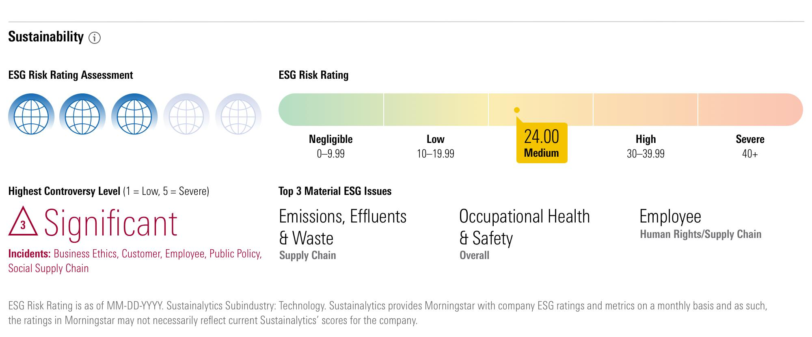

In a rapidly changing world, sustainability has become a focal point in investment strategies. Environmental, social, and governance (ESG) principles are increasingly critical as investors seek to align their portfolios with sustainable values. ESG factors encompass a broad range of considerations, including climate change impact, social responsibility, and corporate governance practices. By incorporating these factors, investors aim to mitigate long-term risks and identify opportunities that contribute to sustainable development.

One prominent tool in assessing the sustainability of investment funds is the Morningstar Sustainability Rating. Launched in 2016, this rating system offers a comprehensive framework for evaluating mutual funds and exchange-traded funds (ETFs) based on their ESG risk exposure. Utilizing a five-globe system, the rating provides a straightforward means for investors to understand and compare the ESG characteristics of different funds. The highest rating—five globes—indicates superior adherence to ESG standards and minimal overall risk from ESG factors.



This article explores the significance of sustainability ratings like the Morningstar Sustainability Rating and their impact on investment analysis and algorithmic trading. As sustainable investing strategies gain traction, these ratings play a crucial role in guiding investors toward funds that align with their ethical and environmental values. Understanding and leveraging such tools become increasingly important in a financial landscape where ESG criteria are becoming more salient benchmarks for responsible investments.

## Table of Contents

## Understanding the Morningstar Sustainability Rating

The Morningstar Sustainability Rating serves as a pivotal tool for evaluating mutual funds and exchange-traded funds (ETFs) based on environmental, social, and governance (ESG) criteria. Launched in 2016, this rating system introduced a five-globe scale, with five globes indicating the highest ESG standards within a given fund. Designed to facilitate informed investment decisions, the Morningstar Sustainability Rating assists investors in gauging the ESG risk exposure embedded in a fund’s holdings.

To derive these ratings, Morningstar aggregates ESG scores sourced from Sustainalytics, a leading ESG research and ratings company. The Sustainalytics scores assess various indicators under each ESG category, including carbon emissions, board diversity, and policies on human rights. These scores collectively provide an overarching assessment of the sustainability of a company's operations and policies, which in turn reflect the risk associated with investing in such companies.

The calculation of the Sustainability Rating for a fund involves aggregating the ESG scores of the companies within the fund’s portfolio. This is achieved by conducting a weighted average, considering the market capitalization of each holding. By evaluating the fund’s overall ESG risk, the rating helps investors understand the potential long-term impacts of ESG factors on the fund’s performance.

Morningstar's five-globe system offers a user-friendly visualization of the [ESG](/wiki/esg-investing) risk level, simplifying the comparison of funds. Investors aiming to align their portfolios with their ESG values can leverage these ratings to identify funds that not only adhere to high sustainability standards but also mitigate potential investment risks associated with ESG issues. As ESG considerations become increasingly critical in investment strategies, the Morningstar Sustainability Rating provides a robust mechanism to navigate these dynamics effectively.

## Rating Methodology

The Morningstar Sustainability Rating methodology is structured to provide a comprehensive assessment of a mutual fund's or [ETF](/wiki/etf-trading-strategies)'s alignment with environmental, social, and governance (ESG) principles. The process involves several steps to ensure the rating's accuracy and relevance.

First, fund eligibility is determined. A fund must hold a minimum percentage of sustainable investments to qualify for a sustainability rating. Typically, Morningstar requires that at least 67% of a fund’s assets under management be covered by a sustainability score to be rated.

The core of the methodology lies in calculating sustainability scores. These scores are derived from corporate and sovereign sustainability assessments, which measure the ESG risks associated with a company's or country's operations and governance. This involves evaluating each entity's exposure to and management of ESG risks and opportunities.

To ensure robust and accurate ratings, historical analysis plays a crucial role. Morningstar uses a 12-month weighted average to smooth out short-term [volatility](/wiki/volatility-trading-strategies) and provide a more stable view of a fund’s ESG performance. Calculating this involves assigning weights to monthly sustainability scores, with recent months typically receiving a higher weight.

Python code can be used to perform this 12-month weighted average calculation as follows:

```python
def weighted_average(scores, weights):
    weighted_sum = sum(s * w for s, w in zip(scores, weights))
    total_weight = sum(weights)
    return weighted_sum / total_weight

# Example usage
monthly_scores = [4.2, 4.0, 4.3, 4.5, 4.1, 4.4, 4.6, 4.2, 4.3, 4.0, 4.1, 4.5]
weights = [1, 2, 3, 4, 5, 6, 7, 8, 9, 10, 11, 12]
average_score = weighted_average(monthly_scores, weights)
```

Finally, funds are ranked and rated within their respective Morningstar categories based on these sustainability scores. This ranking system ensures that the ratings are benchmarked against similar investment options, providing investors with a clearer context of a fund's ESG performance relative to its peers. The top 10% of funds receive a five-globe rating, the next 22.5% four globes, the middle 35% three globes, the next 22.5% two globes, and the bottom 10% one globe.

This structured approach allows investors to make informed decisions by illuminating the ESG risks and performances associated with various investment opportunities.

## Morningstar Star Rating vs. Sustainability Rating

Both the Morningstar Star Rating and the Sustainability Rating serve as crucial tools for evaluating investment funds, yet their focus diverges significantly. The Star Rating primarily assesses a fund's historical performance by analyzing risk-adjusted returns. This involves calculating the fund's return above a risk-free rate and adjusting for the volatility of those returns over a specific period. The formula for calculating a risk-adjusted return can be expressed as:

$$

\text{Risk-Adjusted Return} = \frac{\text{Average Return of the Fund} - \text{Risk-Free Rate}}{\text{Standard Deviation of the Fund's Return}} 
$$

In contrast, the Morningstar Sustainability Rating shifts the focus to how a fund's holdings align with environmental, social, and governance (ESG) principles. Instead of historical returns, this rating evaluates the potential ESG risks that might influence a fund's future performance. The methodology involves scrutinizing the ESG practices of the companies within the fund's portfolio and determining their impact on the fund's risk profile.

A notable differentiation arises when a fund with robust traditional metrics, as reflected by a high Star Rating, exhibits poor sustainability practices, resulting in a low Sustainability Rating. This discrepancy highlights the need for investors to consider both quantitative and qualitative aspects of a fund. A high Star Rating indicates historical financial success, while a low Sustainability Rating suggests potential future risks related to ESG factors that might not immediately impact financial performance but could pose long-term challenges.

Investors seeking to balance traditional performance metrics with responsible investment principles must recognize these distinctions. Employing both ratings allows for a more comprehensive evaluation, facilitating an investment strategy that aligns with both financial goals and sustainable development objectives.

## Sustainable, Responsible, and Impact Investing Alternatives

Sustainable investing strategies have gained prominence as investors look for ways to align their portfolios with environmental, social, and governance (ESG) values. These strategies provide alternatives to conventional investment approaches by incorporating ESG factors into decision-making processes.

Morningstar's sustainability ratings play a pivotal role in this domain by offering detailed insights that help investors select funds conforming to ESG principles. These ratings go beyond the traditional metrics by evaluating how well a fund integrates ESG criteria into its investment strategy. For instance, while socially responsible investing primarily focuses on the exclusion or avoidance of "bad" stocks—such as those in tobacco, fossil fuels, or weapons industries—sustainability ratings provide a more nuanced assessment. They consider the overall ESG risk profile of a fund's holdings, allowing investors to understand how potential risks and opportunities related to ESG factors may impact a fund's performance.

The differentiation between merely avoiding certain industries and positively selecting investments based on ESG criteria is crucial. Sustainability ratings assist investors in identifying funds that not only exclude negative ESG elements but also proactively include companies demonstrating positive ESG practices. This method aligns with broader responsible investing approaches, such as impact investing, where the focus is on generating both financial return and positive social or environmental impact.

Overall, sustainable investing strategies, bolstered by tools like Morningstar's sustainability ratings, empower investors to make informed decisions that reflect their ESG commitments while potentially enhancing their investment performance.

## The Role of Algorithmic Trading in ESG Investment

Algorithmic trading, also known as algo trading, employs computer algorithms to execute trades, making decisions based on predetermined criteria. Within the context of ESG (Environmental, Social, and Governance) investment strategies, [algorithmic trading](/wiki/algorithmic-trading) offers the capability to efficiently process vast datasets that include ESG metrics, enhancing precision in investment decisions. By leveraging ESG data, algorithms can optimize portfolios for better alignment with sustainability goals, taking into account the risk and potential returns associated with ESG factors.

A critical component in ESG-focused algorithmic trading is the integration of ESG ratings, such as the Morningstar Sustainability Ratings, into the decision-making process. These ratings provide a comprehensive assessment of a fund’s ESG risk exposure, which can be incorporated into algorithmic models to select funds with favorable ESG profiles. For instance, algorithms can use these ratings to filter investments, prioritize those with higher ESG scores, and construct portfolios that not only meet financial objectives but also adhere to sustainability principles.

Consider a simple example where an algorithm sorts funds based on their ESG scores. Given a list of funds with their respective ratings, an algorithm can efficiently identify the top-performing funds according to sustainability criteria:

```python
import pandas as pd

# Sample data: Fund Name and Sustainability Rating (out of 100)
data = {'Fund': ['Fund A', 'Fund B', 'Fund C', 'Fund D'],
        'Sustainability Rating': [85, 92, 78, 88]}

# Create a DataFrame
funds_df = pd.DataFrame(data)

# Sort funds by Sustainability Rating
sorted_funds = funds_df.sort_values(by='Sustainability Rating', ascending=False)

# Display the sorted funds
print(sorted_funds)
```

This Python code snippet demonstrates sorting funds by their sustainability ratings, allowing investors to easily identify which funds align best with ESG values. The efficiency and accuracy of algorithmic trading, combined with robust ESG datasets, present investors with enhanced opportunities to optimize their portfolios for both financial performance and sustainability compliance.

Incorporating ESG considerations into algorithms also involves continuously updating models with real-time data. This dynamic integration ensures that investment strategies remain consistent with evolving ESG standards and market conditions. As ESG criteria become increasingly influential in market behavior, algorithmic trading's ability to adapt and integrate these variables will be vital in advancing sustainable investment practices.

## Conclusion

Sustainability ratings, particularly those developed by Morningstar, have significantly influenced the way investors engage with ESG investments. By providing a comprehensive evaluation framework, these ratings allow investors to incorporate sustainability considerations systematically into their investment strategies. The integration of Morningstar's Sustainability Ratings into investment decisions and algorithmic trading processes not only helps align portfolios with ESG objectives but also offers a methodical approach to risk assessment associated with ESG factors.

As ESG criteria become increasingly pivotal in influencing market dynamics, it is essential for investors to comprehend and utilize sustainability ratings effectively. These tools enable a deeper understanding of the non-financial elements that may impact a fund’s future performance. Furthermore, algorithmic trading platforms that leverage sustainability data can optimize investment choices, enhancing the alignment with sustainability goals. The continuous refinement and adoption of ESG metrics in financial analysis exemplify a shift towards more informed and responsible investing, paving the way for strategies that are both financially rewarding and socially conscious.

## References & Further Reading

[1]: "Morningstar Sustainability Rating" [https://www.morningstar.com/lp/sustainability](https://www.morningstar.com/sustainable-investing/morningstar-sustainability-rating)

[2]: "Sustainalytics: Leading ESG and Corporate Governance Research and Ratings" [https://www.sustainalytics.com/](https://www.thegoodlobby.eu/wp-content/uploads/2024/12/TGL-Scorecard-Sustainalytics.pdf)

[3]: Khan, M., Serafeim, G., & Yoon, A. (2015). "Corporate Sustainability: First Evidence on Materiality." The Accounting Review, 91(6), 1697-1724.

[4]: Friede, G., Busch, T., & Bassen, A. (2015). "ESG and financial performance: aggregated evidence from more than 2000 empirical studies." Journal of Sustainable Finance & Investment, 5(4), 210-233.

[5]: "The Role of ESG Ratings in Sustainable Investments." Harvard Business Review. [https://hbr.org](https://hbr.org/2019/05/the-investor-revolution)