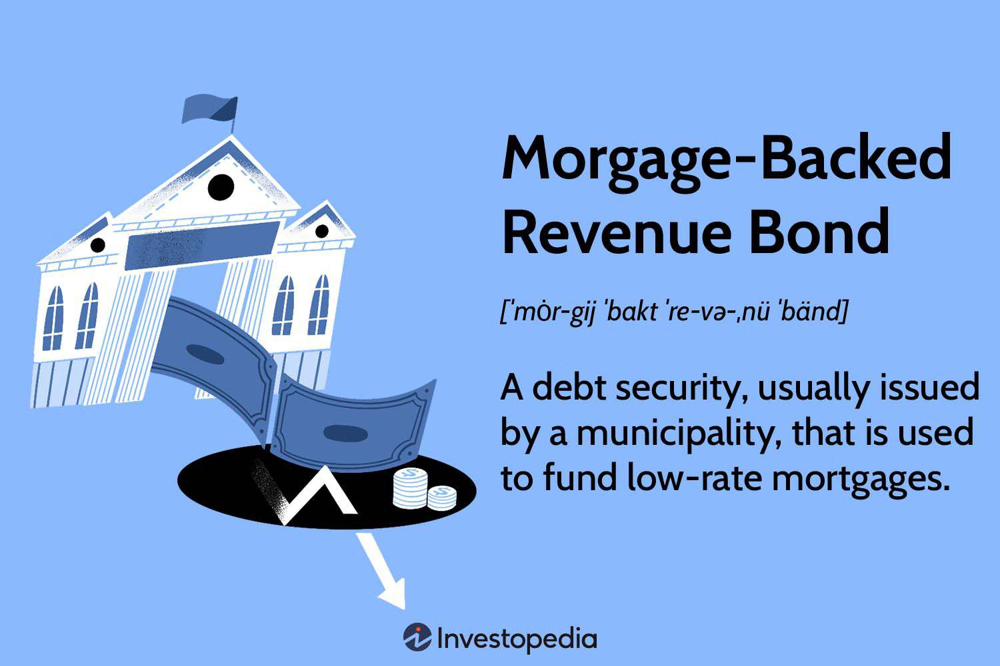

In the complex world of finance, bond investments are a cornerstone for both individual and institutional investors. Bonds offer a range of opportunities and are essential for diversifying investment portfolios. This article focuses on mortgage-backed bonds, revenue bonds, and the transformative role of algorithmic trading in bond markets. Mortgage-backed bonds are debt securities supported by pools of mortgage loans, providing liquidity and promoting social benefits such as affordable housing. Revenue bonds, on the other hand, are distinct municipal bonds used to fund revenue-generating projects. Understanding the operational mechanics, advantages, and associated risks of these bonds is imperative.

Algorithmic trading, characterized by the use of automated systems to execute high-volume trades, is making a significant impact on the bond market landscape. It enhances trading efficiency, reduces costs, and bolsters market liquidity. The inclusion of algorithmic trading in bond investments represents a notable trend, reshaping the way bonds are bought and sold, thus requiring investors to stay informed and adaptive. Acquiring knowledge of these financial instruments and trading methodologies is vital for making educated investment decisions in today's fast-paced financial environment.



## Table of Contents

## Mortgage-Backed Bonds: An Overview

Mortgage-backed bonds are a type of debt security that is collateralized by a pool of mortgage loans. These bonds are integral to facilitating homeownership by allowing municipalities to offer low-rate mortgages. This not only stimulates the housing market but also provides social benefits, such as enabling low-income individuals to purchase homes.

A mortgage-backed bond operates by aggregating home loans into a bundle, which is then sold to investors. The interest and principal payments from the individual mortgage loans are passed through to the bondholders, thus providing the revenue needed to pay the bond's interest, known as the coupon payment.

One of the attractive features of mortgage-backed bonds is their tax-exempt status. Typically, these bonds do not incur federal taxes, and in some instances, they are also exempt from state and local taxes. This tax advantage can make them particularly appealing to investors in higher tax brackets who seek to minimize taxable income.

Investors must also be aware of the underlying structures and potential risks associated with mortgage-backed bonds. These instruments are subject to prepayment risk, as homeowners may refinance or pay off their mortgages sooner than expected, thereby affecting the bond's cash flow. Moreover, they carry default risk, which occurs if a significant number of borrowers within the mortgage pool fail to meet their payment obligations. Consequently, assessing the quality of the mortgage pool and the creditworthiness of the issuer is essential.

To model the cash flow from a mortgage-backed bond, consider the following Python snippet that estimates payments based on a simplified prepayment model:

```python
def calculate_mbs_cash_flow(principal, rate, term, prepayment_rate):
    monthly_rate = rate / 12 / 100
    payments = []
    remaining_principal = principal

    for month in range(term * 12):
        interest_payment = remaining_principal * monthly_rate
        principal_payment = (remaining_principal / term / 12) + (remaining_principal * prepayment_rate)
        total_payment = interest_payment + principal_payment
        payments.append(total_payment)
        remaining_principal -= principal_payment
        if remaining_principal <= 0:
            break

    return payments

principal = 1000000  # Principal amount of the bond
rate = 4  # Interest rate
term = 30  # Term in years
prepayment_rate = 0.01  # Monthly prepayment rate

cash_flows = calculate_mbs_cash_flow(principal, rate, term, prepayment_rate)
print(cash_flows)
```
Understanding these components and risks involved in mortgage-backed bonds is essential for determining their potential as part of an investment portfolio. These bonds can offer a reliable income stream and tax advantages, but they require careful consideration and analysis of their structure and the associated risks.

## Revenue Bonds: Financing Through Income Generation

Revenue bonds are a form of municipal bond specifically designated to fund projects that generate their own revenue streams. Unlike general obligation bonds, which are supported by the issuing entity's ability to tax, revenue bonds are secured by the income produced by the particular project they are set to finance. This structure means the repayment of the bond's principal and interest is directly tied to the success of the funded project.

These bonds often present a higher risk to investors compared to their general obligation counterparts. This increased risk stems from the dependency on a single source of income, which may fluctuate based on economic conditions or the project's inherent viability. However, due to this focused repayment source, revenue bonds can offer better yields, attracting investors seeking higher returns for a commensurate level of risk.

Common projects financed through revenue bonds include public utilities, toll roads, and housing developments. For instance, a city might issue revenue bonds to construct a new toll road. The funds generated from the collected tolls are then used to pay back bondholders. If the toll road sees heavy usage and generates substantial revenue, bondholders are likely to receive their scheduled payments. Conversely, if usage is lighter than expected, bondholders might face delayed or reduced payments.

Investors considering revenue bonds must thoroughly evaluate the income potential and the risks associated with the project. This evaluation often involves analyzing the project's feasibility studies, revenue projections, and previous performance records of similar initiatives. Factors like competitive pressures, regulatory changes, and economic downturns can significantly impact the anticipated revenue streams, influencing the bond's risk and potential yield. Consequently, diligent research and risk assessment are vital for making informed investment decisions in revenue bonds.

## The Impact of Algorithmic Trading on Bond Markets

Algorithmic trading has emerged as a transformative force in bond markets, integrating advanced technology to facilitate high-frequency trading and enhance market operations. Characterized by the use of complex algorithms, this approach automates the bond trading process, optimizing execution speed and efficiency. By enabling high-[volume](/wiki/volume-trading-strategy) transactions at significantly reduced costs, [algorithmic trading](/wiki/algorithmic-trading) has improved the overall trading ecosystem.

A notable impact of algorithmic trading on bond markets is the enhancement of trading efficiency. By leveraging sophisticated algorithms, traders can process large volumes of orders with maximum precision and minimum latency. This efficiency not only benefits traders with faster execution times but also reduces the transaction costs traditionally associated with manual trading operations. As a result, the adoption of algorithmic trading has made participation in bond markets more accessible and cost-effective for investors.

US banks have increasingly embraced algorithmic trading, leading to a surge in their bond portfolios and significant improvements in revenue streams. This strategic shift aligns with the broader trend of financial institutions adopting electronic trading platforms to capture the benefits of automation and enhanced data analytics capabilities. By transitioning to algorithmic trading, banks have not only optimized their trading processes but also unlocked new revenue potential by expanding their trading activities into additional asset classes such as loans and municipal bonds.

Investors have reaped substantial benefits from the integration of algorithmic trading into bond markets. One key advantage is the achievement of tighter bid-offer spreads, which refers to the difference between the price at which a market maker is willing to buy (bid) and sell (offer) a bond. Narrow bid-offer spreads are indicative of improved pricing accuracy and reduced transaction costs for investors, leading to more favorable trading terms.

Additionally, algorithmic trading has contributed to enhanced market [liquidity](/wiki/liquidity-risk-premium), an essential [factor](/wiki/factor-investing) for the healthy functioning of bond markets. Improved liquidity ensures that investors can buy or sell bonds with greater ease and at more predictable prices, fostering an environment conducive to robust trading activity. This increased liquidity is particularly beneficial during times of market stress or [volatility](/wiki/volatility-trading-strategies), as it helps stabilize bond prices and reduces the impact of large trades on the market.

As the technological landscape continues to evolve, the role of algorithmic trading in bond markets will likely expand further, driving continued improvements in trading efficiency and market dynamics. Investors keen to capitalize on these advancements should remain informed about the latest algorithmic trading technologies and strategies, positioning themselves to harness the benefits of this powerful tool in bond investments.

## Integrating Algo Trading with Bond Investments

Integrating algorithmic trading with bond investments can significantly enhance portfolio performance by leveraging technology to react swiftly to market fluctuations. Algorithmic trading enables the rapid adjustment of bond portfolios, responding to changes in interest rates, credit spreads, or economic indicators. This adaptability is crucial in dynamic financial markets, allowing for timely investment decisions that can mitigate risks and capitalize on new opportunities.

Large-scale portfolio trades benefit from algo trading through improved pricing advantages and execution efficiency. Algorithms can analyze vast datasets in real time to identify optimal entry and [exit](/wiki/exit-strategy) points for bonds, ensuring that trades are executed at the best possible prices. This computational power allows for more precise pricing strategies, minimizing the impact of market fluctuations on portfolio returns.

For investors, understanding technological infrastructure is vital to successfully integrate algo trading into their bond strategies. The implementation of high-frequency trading systems, data analytics platforms, and advanced algorithms requires significant investment in technology and skilled personnel. Costs associated with these operations, such as hardware, software, and technical expertise, must be carefully considered to ensure that the benefits outweigh the expenditures.

The shift towards digital markets marks a future-oriented direction for bond trading. As traditional trading mechanisms give way to automated systems, investors who adopt algorithmic strategies stand to gain a competitive edge. The integration of technology not only improves trade execution but also enhances overall market transparency and liquidity, benefiting all market participants.

In an environment where technological advancements continually reshape financial markets, staying informed and adaptable is key to successful bond investment. By embracing algorithmic trading, investors can navigate the complexities of bond markets with greater accuracy and confidence, securing their position in an increasingly digital financial landscape.

## Conclusion

Mortgage-backed bonds and revenue bonds offer investors unique opportunities, each accompanied by distinct risk profiles. Mortgage-backed bonds, backed by collections of mortgage loans, allow municipalities to fund low-rate mortgages, often providing social benefits, such as supporting low-income homebuyers. The income from mortgage interest payments typically funds these bonds' coupon payments, and their tax-exempt status appeals to certain investors. On the other hand, revenue bonds finance revenue-generating projects, with repayment tied to specific income streams, such as public utilities and toll roads. While they may [carry](/wiki/carry-trading) higher risks, they also promise potentially better yields.

Algorithmic trading is playing an increasingly prominent role in bond markets. By automating the trading process, it enhances trading efficiency, lowers transaction costs, and increases trading volume. This evolving technology is not only reshaping traditional trading methods but also providing new strategies for investors seeking to maximize returns. Algorithmic trading allows for rapid adjustments to market conditions, offering significant benefits, such as tighter bid-offer spreads and improved market liquidity.

As technology continues to advance, staying informed and adaptable is critical for investors. Understanding both the characteristics of various bonds and the mechanisms of algorithmic trading is essential for making informed investment decisions. Mastery of these elements can significantly enhance an investor's ability to navigate the intricacies of bond markets. By leveraging both technological innovation and a solid understanding of bond investments, investors can confidently manage and potentially enhance their portfolios in today's complex financial landscape.

## References & Further Reading

[1]: ["Advances in Financial Machine Learning"](https://www.amazon.com/Advances-Financial-Machine-Learning-Marcos/dp/1119482089) by Marcos Lopez de Prado

[2]: ["Machine Learning for Algorithmic Trading"](https://www.amazon.com/Machine-Learning-Algorithmic-Trading-alternative/dp/1839217715) by Stefan Jansen

[3]: ["Quantitative Trading: How to Build Your Own Algorithmic Trading Business"](https://www.amazon.com/Quantitative-Trading-Build-Algorithmic-Business/dp/1119800064) by Ernest P. Chan

[4]: ["Fixed Income Analysis"](https://en.wikipedia.org/wiki/Fixed_income_analysis) by Barbara S. Petitt

[5]: Fabozzi, Frank J. (1999). ["The Handbook of Mortgage-Backed Securities"](https://api.pageplace.de/preview/DT0400.9780191088773_A30390474/preview-9780191088773_A30390474.pdf). McGraw-Hill.

[6]: Chance, Don M. (2003). ["An Introduction to Derivatives and Risk Management"](https://www.amazon.com/Introduction-Derivatives-Management-Stock-Trak-Coupon/dp/130510496X). South-Western College Publishing.