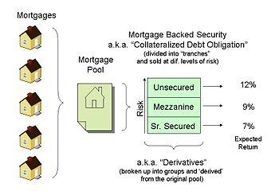

## Table of Contents

## What are mortgage-backed securities (MBS)?

Mortgage-backed securities (MBS) are investments that are secured by home loans. Banks take many home loans and bundle them together into one big package. They then sell this package to investors. The investors earn money from the monthly payments that homeowners make on their mortgages.

These securities can be a good way for investors to make money, but they also come with risks. If many homeowners stop making their mortgage payments, the value of the MBS can drop. This happened during the 2008 financial crisis, when a lot of people couldn't pay their home loans, and it caused big problems for the economy. So, while MBS can be profitable, they need to be managed carefully.

## How do mortgage-backed securities work?

Mortgage-backed securities work by taking a bunch of home loans and putting them together into one big group. This group is then sold to investors as a single investment. When people who borrowed money for their homes make their monthly payments, that money goes to the investors who bought the mortgage-backed security. This way, the investors earn money from the homeowners' mortgage payments.

But there's a risk involved. If a lot of homeowners can't pay their mortgages, the value of the mortgage-backed security can go down. This happened in 2008 when many people couldn't pay their home loans, and it caused big problems for the economy. So, while mortgage-backed securities can be a good way to make money, they need to be watched carefully to make sure they don't cause trouble.

## What are the different types of mortgage-backed securities?

There are two main types of mortgage-backed securities: pass-through securities and collateralized mortgage obligations (CMOs). Pass-through securities are the simplest type. They work by taking the payments from a pool of mortgages and passing them directly to investors. If someone pays their mortgage, that money goes straight to the investors who own the security. This type is easy to understand but can be risky if a lot of homeowners stop paying their loans.

The second type, collateralized mortgage obligations, or CMOs, are more complex. They take the pool of mortgages and split it into different parts, called tranches. Each tranche has a different level of risk and return. Some tranches get paid back first and are safer, while others get paid later and are riskier but might offer higher returns. CMOs are designed to appeal to different kinds of investors, depending on how much risk they want to take.

## Who are the typical investors in mortgage-backed securities?

Typical investors in mortgage-backed securities include large financial institutions like banks and insurance companies. These big organizations often have a lot of money to invest and they look for ways to earn steady returns. Mortgage-backed securities can be a good fit for them because they offer regular payments from homeowners' mortgage payments.

Individual investors, like people saving for retirement, might also invest in mortgage-backed securities. They might do this through mutual funds or exchange-traded funds (ETFs) that include these securities. These investors are looking for ways to diversify their investments and earn income over time, but they need to be aware of the risks, like what happened during the 2008 financial crisis when many homeowners couldn't pay their mortgages.

## What are the risks associated with investing in mortgage-backed securities?

Investing in mortgage-backed securities can be risky because they depend on homeowners making their mortgage payments. If a lot of homeowners can't pay their loans, the value of the mortgage-backed security can drop a lot. This happened during the 2008 financial crisis when many people lost their homes and couldn't pay their mortgages. It caused big problems for the economy and for investors who had put their money into these securities.

Another risk is that mortgage-backed securities can be hard to understand, especially the more complex types like collateralized mortgage obligations (CMOs). These securities are split into different parts with different levels of risk and return. If investors don't fully understand what they're buying, they might end up with more risk than they expected. It's important for investors to do their homework and maybe talk to a financial advisor before investing in these securities.

## How do mortgage-backed securities impact the housing market?

Mortgage-backed securities can have a big impact on the housing market. When banks sell home loans to investors as mortgage-backed securities, it gives the banks more money to lend out to other people who want to buy homes. This can make it easier for people to get loans and can help more people buy houses. If lots of investors want to buy these securities, it can also push down interest rates on home loans, making it cheaper for people to borrow money to buy a house.

But there are also risks. If investors think mortgage-backed securities are too risky, they might stop buying them. This can make it harder for banks to sell their loans, and they might not have as much money to lend out. This could make it harder for people to get home loans and slow down the housing market. Also, if a lot of people can't pay their mortgages, it can cause problems for the whole economy, like what happened during the 2008 financial crisis.

## What role did mortgage-backed securities play in the 2008 financial crisis?

Mortgage-backed securities played a big part in the 2008 financial crisis. Banks were making a lot of home loans and selling them as mortgage-backed securities to investors. These securities were seen as safe investments because they were backed by home loans. But many of these loans were given to people who couldn't afford them. When housing prices started to drop, a lot of these people couldn't pay their mortgages. This caused the value of the mortgage-backed securities to fall, and investors lost a lot of money.

As more and more people defaulted on their loans, the problems spread. Many big banks and financial institutions had invested heavily in these securities. When the value of the securities crashed, these institutions faced huge losses. This led to a domino effect where banks stopped lending money, businesses couldn't get loans, and the whole economy went into a crisis. The 2008 financial crisis showed how risky mortgage-backed securities can be if not managed carefully.

## How are mortgage-backed securities rated and what does it mean for investors?

Mortgage-backed securities are rated by special companies called credit rating agencies. These agencies look at how likely it is that the homeowners will keep paying their mortgages. They give the securities a grade, like AAA, AA, or B, with AAA being the safest and B being riskier. The rating helps investors know how safe their investment might be. If a security has a high rating, it means it's less likely to lose value because the homeowners are expected to keep paying their loans.

For investors, the rating of a mortgage-backed security is important because it tells them about the risk they are taking. If an investor wants a safe investment, they might choose a security with a high rating, like AAA. But these might not offer as much return as riskier securities with lower ratings. On the other hand, if an investor is willing to take more risk for a chance at higher returns, they might choose a security with a lower rating. The rating helps investors make choices that fit their goals and how much risk they are comfortable with.

## What are the tax implications of investing in mortgage-backed securities?

Investing in mortgage-backed securities can have tax implications that investors need to be aware of. When you earn money from these securities, it's usually considered taxable income. The payments you get from the homeowners' mortgages are often treated as interest income, which is taxed at your regular income tax rate. This means you'll need to report this income on your tax return and pay taxes on it.

There are also other tax considerations. If you buy and sell mortgage-backed securities, you might have to pay capital gains tax on any profit you make from selling them. The tax rate on these gains depends on how long you held the securities before selling them. If you held them for a year or less, it's a short-term capital gain and taxed at your regular income tax rate. If you held them for more than a year, it's a long-term capital gain, which usually has a lower tax rate. It's important to keep good records and maybe talk to a tax advisor to understand all the tax rules that apply to your investments.

## How can investors evaluate the performance of mortgage-backed securities?

Investors can evaluate the performance of mortgage-backed securities by looking at several key things. First, they should check the [interest rate](/wiki/interest-rate-trading-strategies) the securities are paying. If the rate is high, it might mean the security is riskier, but it could also mean more income for the investor. Second, they need to look at how many homeowners are paying their mortgages on time. If a lot of people are missing payments, it could lower the value of the security. Finally, investors should keep an eye on the overall housing market. If home prices are going up, it's usually good for mortgage-backed securities, but if prices are falling, it could be bad news.

Another way to evaluate these securities is by looking at their credit ratings. Credit rating agencies give grades to mortgage-backed securities based on how safe they think the investment is. A high rating, like AAA, means the security is seen as very safe, while a lower rating means it's riskier. Investors should also compare the performance of their securities to other investments, like bonds or stocks, to see if they are doing well or not. By keeping track of these things, investors can get a good idea of how their mortgage-backed securities are performing and make smart choices about their investments.

## What are some advanced strategies for investing in mortgage-backed securities?

One advanced strategy for investing in mortgage-backed securities is to use a technique called "trading the yield curve." This means looking at how interest rates are expected to change in the future and buying securities that will benefit from those changes. For example, if you think interest rates will go down, you might buy securities with longer maturities because they will become more valuable. This strategy requires a good understanding of the economy and interest rates, but it can help investors make more money if they get it right.

Another strategy is to invest in different tranches of collateralized mortgage obligations (CMOs). CMOs are split into different parts, each with its own level of risk and return. By choosing the right tranches, investors can balance their risk and reward. For example, if you want a safer investment, you might choose the tranches that get paid back first. If you're willing to take more risk for a chance at higher returns, you might choose the tranches that get paid back later. This strategy can help investors tailor their investments to their own goals and risk tolerance.

## How do global economic factors influence the performance of mortgage-backed securities?

Global economic factors can really affect how well mortgage-backed securities do. If the world economy is doing well, people might feel more confident about buying homes and paying their mortgages on time. This can make mortgage-backed securities more valuable because investors think they are less risky. On the other hand, if the global economy is struggling, like during a recession, people might lose their jobs and not be able to pay their mortgages. This can cause the value of mortgage-backed securities to drop because investors see them as riskier.

Interest rates around the world also play a big part. If interest rates in other countries go up, it might make investors move their money to those places to get better returns. This can mean less money coming into mortgage-backed securities, which can lower their value. But if interest rates in other countries go down, more investors might want to buy mortgage-backed securities because they can get better returns compared to other investments. So, keeping an eye on what's happening in the global economy is really important for anyone investing in these securities.

## References & Further Reading

[1]: Ashcraft, A. B., & Schuermann, T. (2008). ["Understanding the Securitization of Subprime Mortgage Credit."](https://papers.ssrn.com/sol3/papers.cfm?abstract_id=1071189) Foundations and Trends in Finance, 2(3), 191-309.

[2]: Fabozzi, F. J. (Ed.). (2016). ["The Handbook of Mortgage-Backed Securities."](https://academic.oup.com/book/7943) Oxford University Press.

[3]: Goodman, L. S., Li, J., Lucas, D., Zimmerman, T., & Fabozzi, F. J. (2008). ["Subprime Mortgage Credit Derivatives."](https://onlinelibrary.wiley.com/doi/book/10.1002/9781118267165) The Journal of Fixed Income, 17(4), 18-31.

[4]: Hull, J. (2018). ["Options, Futures, and Other Derivatives."](https://www.amazon.com/Options-Futures-Other-Derivatives-10th/dp/013447208X) Pearson Education.

[5]: Shiller, R. J. (2008). ["The Subprime Solution: How Today's Global Financial Crisis Happened, and What to Do about It."](https://www.jstor.org/stable/j.cttq94jd) Princeton University Press.

[6]: Vink, D., & Fabozzi, F. J. (2012). ["Non-US Asset-Backed Securities: Spread Determinants and Over-Reliance on Credit Ratings."](https://papers.ssrn.com/sol3/papers.cfm?abstract_id=1431994) The Journal of Fixed Income, 22(1), 6-26.