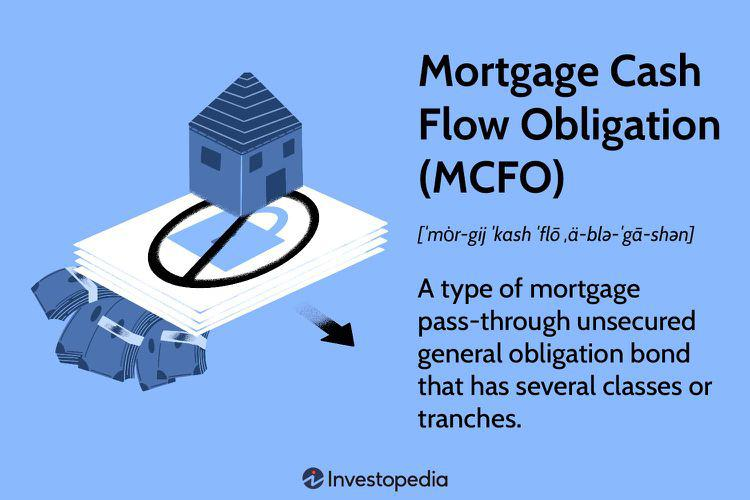

## Table of Contents

## What is a Mortgage Cash Flow Obligation (MCFO)?

A Mortgage Cash Flow Obligation (MCFO) is a type of financial product that involves pooling together a bunch of mortgages and then selling pieces of that pool to investors. These pieces are called securities, and they give investors a share of the payments that homeowners make on their mortgages. This way, instead of buying a whole mortgage, investors can buy smaller parts of many mortgages, which can help spread out the risk.

MCFOs are useful because they help banks and other lenders free up money. When a bank sells parts of its mortgages to investors, it gets cash that it can then use to make more loans. This can be good for the economy because it means more people can borrow money to buy homes. However, MCFOs can also be risky because if a lot of homeowners stop making their mortgage payments, the value of the securities can drop, and investors might lose money.

## How does a Mortgage Cash Flow Obligation work?

A Mortgage Cash Flow Obligation (MCFO) works by taking a bunch of home loans, or mortgages, and putting them together into one big group. This group of mortgages is then divided into smaller pieces, called securities, which are sold to investors. When people who borrowed money to buy their homes make their monthly mortgage payments, that money is collected and shared among the investors who bought the securities. This way, instead of owning a whole mortgage, an investor can own a small part of many mortgages.

This system helps banks because when they sell these securities, they get money back that they can use to make more loans to other people. It's like turning the mortgages they already have into cash they can lend out again. But it's not without risks. If a lot of homeowners can't pay their mortgages, the money coming in drops, and the value of the securities can go down. This means investors might not get back as much money as they expected, which can be a problem for them and for the whole financial system.

## What are the basic components of an MCFO?

A Mortgage Cash Flow Obligation (MCFO) is made up of a bunch of home loans, or mortgages, that are put together into one big group. This group of mortgages is the main part of an MCFO. When people pay their mortgages every month, that money goes into this group.

The group of mortgages is then split into smaller pieces called securities. These securities are sold to investors. When investors buy these securities, they get a share of the money that comes from the mortgage payments. This way, the money from the homeowners' payments is shared among the investors.

## Who typically invests in Mortgage Cash Flow Obligations?

People who invest in Mortgage Cash Flow Obligations (MCFOs) are usually big organizations like banks, insurance companies, and pension funds. These groups have a lot of money to invest and they're looking for ways to make their money grow. They like MCFOs because they can buy a piece of many home loans at once, which can be less risky than buying just one loan.

Sometimes, regular people can also invest in MCFOs, but it's not very common. They might do this through special funds that let them buy into these kinds of investments. But most of the time, it's the big organizations that are the main investors in MCFOs because they have the money and the know-how to handle these kinds of investments.

## What are the benefits of investing in MCFOs?

Investing in Mortgage Cash Flow Obligations (MCFOs) can be a good way for big organizations like banks and pension funds to make their money grow. When they buy pieces of many home loans at once, they spread out their risk. Instead of putting all their money into one loan, they can own small parts of lots of loans. This means if one homeowner can't pay their mortgage, it won't hurt the investor as much because they have money coming in from lots of other homeowners.

Another benefit is that MCFOs can give investors a steady stream of income. When homeowners make their monthly mortgage payments, that money gets shared among the investors. This can be really helpful for organizations like pension funds that need to pay out money to retirees every month. They can count on this regular income to help them meet their obligations.

## What are the risks associated with MCFOs for investors?

Investing in Mortgage Cash Flow Obligations (MCFOs) can be risky for investors. One big risk is that if a lot of homeowners can't pay their mortgages, the money coming into the MCFO drops. This can make the value of the securities go down, and investors might lose money. It's like if you own a piece of many homes but a lot of people stop paying their rent, you won't get as much money as you expected.

Another risk is that MCFOs can be hard to understand. They are made up of many different home loans, and knowing how each loan is doing can be tricky. If the loans inside the MCFO are not as good as investors thought, the whole thing can be worth less than expected. It's like buying a box of chocolates without knowing what's inside; you might get some good ones, but you might also get some bad ones.

Lastly, MCFOs can be affected by changes in the economy. If interest rates go up, homeowners might have a harder time paying their mortgages, and this can hurt the value of the MCFO. Also, if the housing market goes down, the value of the homes behind the mortgages can drop, which can make the MCFO less valuable. It's important for investors to keep an eye on these things to manage their risks.

## How is the cash flow structured in an MCFO?

In a Mortgage Cash Flow Obligation (MCFO), the cash flow comes from the monthly mortgage payments that homeowners make. When people pay their mortgages, all that money goes into a big pool. This pool of money is then divided up among the investors who bought pieces of the MCFO, called securities. So, if you're an investor, you get a share of the money that comes in from all the homeowners' payments.

But the way the money is shared can be a bit tricky. The MCFO might be split into different parts, called tranches, and each part gets paid in a certain order. Some investors might get their money first, while others have to wait. If some homeowners can't pay their mortgages, the people at the end of the line might not get as much money as they hoped. This structure is meant to help manage risk, but it can also make things more complicated for investors trying to figure out what they might earn.

## What role do credit ratings play in MCFOs?

Credit ratings are really important for Mortgage Cash Flow Obligations (MCFOs). They are like a report card that tells investors how safe or risky it is to invest in an MCFO. A credit rating agency looks at all the home loans inside the MCFO and decides if they think most homeowners will keep paying their mortgages. If the agency thinks the loans are good and the homeowners will pay, they give the MCFO a high rating. This makes investors feel more confident because a high rating means there's a lower chance they'll lose money.

But if the credit rating agency thinks a lot of homeowners might not pay their mortgages, they give the MCFO a lower rating. A lower rating means it's riskier for investors, and they might want a higher return to make up for that risk. Credit ratings can change over time too. If the economy gets worse or more homeowners start missing their payments, the rating might go down. This can make the value of the MCFO drop, and investors might lose money. So, keeping an eye on credit ratings is a big part of investing in MCFOs.

## How do interest rate changes affect MCFOs?

Interest rate changes can have a big impact on Mortgage Cash Flow Obligations (MCFOs). When interest rates go up, it can be harder for homeowners to make their mortgage payments. This is because their monthly payments might go up too. If a lot of homeowners can't pay, the money coming into the MCFO drops, which can make the value of the MCFO go down. Investors might not get as much money as they expected, and this can be a problem for them.

On the other hand, when interest rates go down, it can be easier for homeowners to pay their mortgages. Their monthly payments might go down, so more of them can keep up with their payments. This means more money comes into the MCFO, which can make it more valuable. Investors might get more money back than they thought, which is good for them. But, interest rates can be hard to predict, so they add another layer of risk to investing in MCFOs.

## What are the tax implications of investing in MCFOs?

Investing in Mortgage Cash Flow Obligations (MCFOs) can have different tax effects depending on where you live and how the MCFO is set up. Usually, the money you get from the MCFO, which comes from homeowners paying their mortgages, is considered taxable income. This means you have to pay taxes on it, just like you would on money you earn from a job. The tax rate can be different depending on your country's tax laws, and sometimes there might be special rules for this kind of income.

Another thing to think about is if you sell your part of the MCFO for more money than you paid for it, you might have to pay capital gains tax. This is a tax on the profit you make from selling something for more than you bought it. The rules for capital gains tax can be different depending on how long you owned the MCFO and the laws in your country. It's a good idea to talk to a tax expert to understand all the tax rules that apply to your MCFO investment.

## How can an investor mitigate the risks involved with MCFOs?

One way to make MCFOs less risky is by spreading out your investments. Instead of putting all your money into one MCFO, you can buy pieces of many different ones. This way, if one MCFO doesn't do well because a lot of homeowners can't pay their mortgages, it won't hurt you as much because you have money coming in from other MCFOs. It's like not putting all your eggs in one basket. Another way to lower the risk is to pay attention to the credit ratings of the MCFOs you're thinking about buying. A high credit rating means the people who rate these investments think most homeowners will keep paying their mortgages. If you stick to MCFOs with good ratings, you're less likely to lose money.

It's also smart to keep an eye on interest rates. When interest rates go up, it can be harder for homeowners to make their payments, which can hurt the value of your MCFO. So, if you think interest rates might go up, you might want to be careful about buying new MCFOs or maybe even sell some of what you already own. Also, understanding the structure of the MCFO can help. Some MCFOs are split into different parts, called tranches, and some parts get paid before others. If you buy the parts that get paid first, you're less likely to lose money if some homeowners can't pay their mortgages. Talking to a financial advisor can help you understand all these things and make better choices about your investments.

## What advanced strategies can be used to optimize returns from MCFOs?

One way to get more money from MCFOs is by using a strategy called "tranche selection." MCFOs are split into different parts called tranches, and each part gets paid in a certain order. If you pick the tranches that get paid first, you're more likely to get your money back quickly and safely. But if you want to take more risk for a chance at higher returns, you can choose the tranches that get paid last. These tranches might offer higher interest rates because they're riskier, but if things go well, you can make more money.

Another strategy is to use "[interest rate](/wiki/interest-rate-trading-strategies) hedging." This means you can buy other financial products that help protect your MCFO investment from changes in interest rates. For example, if you think interest rates might go up and hurt your MCFO, you can buy something like an interest rate swap or a cap. These can help you make money or lose less money if interest rates do go up. It's like having insurance for your investment, and it can help you keep more of your returns even when the market changes.

Lastly, you can try "diversification across different MCFOs." Instead of putting all your money into one MCFO, you can spread it out over many different ones. This way, if one MCFO doesn't do well because a lot of homeowners can't pay their mortgages, it won't hurt you as much because you have money coming in from other MCFOs. By choosing MCFOs with different kinds of loans or from different parts of the country, you can lower your risk and maybe even get better returns over time.

## What is Understanding Mortgage Cash Flow?

In today's financial landscape, mortgages play a crucial role for both individuals and businesses, serving as significant long-term financial commitments. They represent a primary method for individuals to acquire residential properties and for corporations to finance commercial real estate ventures. Understanding the cash flow generated from these mortgage investments is essential for evaluating their profitability and identifying potential risks.

Mortgage cash flow refers to the stream of payments made by borrowers to lenders which typically include components such as interest payments and principal repayments. The structure of mortgage cash flow can vary based on several factors including mortgage type (fixed-rate, adjustable-rate), loan term, and the borrower's repayment behavior. 

Interest payments constitute a significant portion of the cash flow, particularly in the initial phases of a mortgage. For a fixed-rate mortgage, the borrower's payments remain constant over time, with the interest component gradually decreasing as more of the principal is repaid. This is typically illustrated through an amortization schedule, which details each payment's division between interest and principal over the life of the loan.

Principal repayments are the portions of the payment that reduce the outstanding loan balance. For instance, in an amortizing mortgage, each payment reduces the principal, thus affecting the subsequent interest calculations. The relationship between interest payments and principal repayments over time can be explored through the formula for loan amortization, which is as follows:

$$
M = P \frac{r(1+r)^n}{(1+r)^n - 1}
$$

where $M$ is the monthly payment, $P$ is the principal loan amount, $r$ is the monthly interest rate, and $n$ is the number of payments.

Understanding Mortgage Cash Flow Obligations (MCFOs) is essential as they reflect the periodic cash flows expected from a portfolio of mortgage assets over time. These obligations require diligent analysis to ensure effective management and to ascertain their potential profitability. Beyond the basic components, other factors such as prepayment rates and default risks can impact these cash flows by altering the expected timing or amount of payments. 

Investors and financial managers must stay aware of these variables to forecast cash flows accurately and manage investments prudently. By comprehensively analyzing these mortgage cash flows, stakeholders can better assess the value and risk associated with mortgage investments, ensuring well-informed financial decisions.

## What is the importance of financial structure?

Financial structure is a crucial component of corporate finance, encompassing the specific combination of debt and equity a company employs to fund its operations. This structure significantly influences a business's risk exposure and its capacity for growth. Debt, often in the form of loans or bonds, and equity, typically represented by shareholders' capital, are the primary instruments that shape this structure.

A sound understanding of financial structure is essential for evaluating a company's financial health and strategic potential. The debt-to-equity ratio, a key indicator, measures a company's leverage by calculating the proportion of debt financing relative to equity. It is expressed as:

$$
\text{Debt-to-Equity Ratio} = \frac{\text{Total Debt}}{\text{Total Equity}}
$$

This ratio provides insight into the level of financial risk to which a business is exposed. A high ratio indicates greater reliance on debt, which might suggest increased risk, particularly if the company faces economic downturns or rising interest rates. Conversely, a lower ratio could indicate a more conservative approach but may also suggest underutilization of financial leverage that could potentially fuel growth.

Balancing financial structure is vital for optimizing cash flow and ensuring sustainable growth. Companies must strike a balance between debt and equity to maintain the flexibility needed to invest in opportunities and weather financial challenges. An optimal structure minimizes the cost of capital, thus maximizing the company's value. The Weighted Average Cost of Capital (WACC) is a useful measure in this context, as it represents the average rate of return a company is expected to pay its security holders to finance its assets. 

$$
\text{WACC} = \left( \frac{E}{V} \cdot Re \right) + \left( \frac{D}{V} \cdot Rd \cdot (1 - T) \right)
$$

where:
- $E$ = Market value of equity
- $D$ = Market value of debt
- $V = E + D$ = Total market value of the company’s financing (equity + debt)
- $Re$ = Cost of equity
- $Rd$ = Cost of debt
- $T$ = Corporate tax rate

The impact of financial structure extends to decision-making processes and investor confidence. A well-structured balance sheet enhances investor trust by demonstrating financial stability and sound risk management, which in turn can lead to improved access to investment capital. Desired capital structures vary across industries, influenced by factors such as market [volatility](/wiki/volatility-trading-strategies), regulatory requirements, and economic conditions. For instance, technology firms might favor equity financing to fund rapid innovation and growth, while utility companies might maintain a higher proportion of debt due to stable cash flows and lower business risk.

In summary, a company's financial structure is a pivotal [factor](/wiki/factor-investing) in its financial strategy, with profound effects on risk management, growth potential, and investor relations. Understanding this structure and making informed adjustments in response to evolving market conditions is a key aspect of effective financial management.

## References & Further Reading

[1]: ["Mortgage Valuation Models: Embedded Options, Risk, and Uncertainty"](https://academic.oup.com/book/12132) by Andrew Davidson, Anthony Sanders, Lan-Ling Wen, and Anne Ching

[2]: Fabozzi, F. J., & Mann, S. V. (2010). ["Introduction to Nonprofit Mortgages and Mortgage-Backed Securities"](https://onlinelibrary.wiley.com/doi/book/10.1002/9781118266649). 

[3]: ["Advances in Financial Machine Learning"](https://www.amazon.com/Advances-Financial-Machine-Learning-Marcos/dp/1119482089) by Marcos Lopez de Prado

[4]: ["Fixed Income Securities: Tools for Today's Markets"](https://www.amazon.com/Fixed-Income-Securities-Markets-Finance/dp/1119835550) by Bruce Tuckman and Angel Serrat

[5]: Brigo, D., & Mercurio, F. (2007). ["Interest Rate Models - Theory and Practice."](https://link.springer.com/book/10.1007/978-3-662-04553-4) Springer Finance.

[6]: ["The Handbook of Mortgage-Backed Securities"](https://www.amazon.com/Handbook-Mortgage-Backed-Securities-7th/dp/0198785771) by Frank J. Fabozzi

[7]: ["The Handbook of Fixed Income Securities"](https://www.amazon.com/Handbook-Fixed-Income-Securities-Ninth/dp/1260473899) by Frank J. Fabozzi