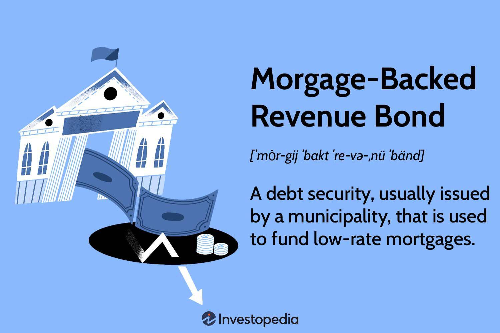

## Table of Contents

## What is a Mortgage Revenue Bond (MRB)?

A Mortgage Revenue Bond (MRB) is a type of bond that helps people buy homes. It is issued by a government agency, like a state or local housing finance agency. The money raised from selling these bonds is used to make loans to people who might not be able to afford a home otherwise. These loans often have lower interest rates, which makes buying a home more affordable for the borrowers.

When someone buys an MRB, they are essentially lending money to the government agency. In return, the buyer gets regular interest payments until the bond matures. The interest earned on these bonds is usually exempt from federal taxes, and sometimes from state and local taxes too. This tax advantage makes MRBs attractive to investors, which helps keep the cost of borrowing low for homebuyers.

## How does a Mortgage Revenue Bond work?

A Mortgage Revenue Bond (MRB) is a way for the government to help people buy homes. A state or local housing agency issues these bonds and uses the money to give out loans to people who want to buy a home but might not be able to afford it. These loans usually have lower interest rates, which makes it easier for people to pay back the money they borrowed.

When someone buys an MRB, they are lending money to the housing agency. In return, the buyer gets regular interest payments until the bond reaches its maturity date. The cool thing about these bonds is that the interest you earn is often not taxed by the federal government, and sometimes not by state and local governments either. This makes MRBs a good choice for investors, and it helps keep the cost of the loans low for homebuyers.

## Who issues Mortgage Revenue Bonds?

Mortgage Revenue Bonds are issued by government agencies, usually state or local housing finance agencies. These agencies use the money they get from selling the bonds to help people buy homes. They do this by giving out loans that have lower interest rates, which makes it easier for people to afford a home.

When someone buys a Mortgage Revenue Bond, they are lending money to the housing agency. In return, the buyer gets regular interest payments until the bond matures. The interest earned on these bonds is often not taxed by the federal government, and sometimes not by state and local governments either. This makes the bonds attractive to investors and helps keep the cost of the loans low for homebuyers.

## What are the primary uses of funds from Mortgage Revenue Bonds?

The main use of money from Mortgage Revenue Bonds is to help people buy homes. A state or local housing agency uses the money to give out loans to people who might not be able to afford a home otherwise. These loans usually have lower interest rates, which makes it easier for people to pay back the money they borrowed.

When someone buys a Mortgage Revenue Bond, they are lending money to the housing agency. In return, the buyer gets regular interest payments until the bond reaches its maturity date. The interest earned on these bonds is often not taxed by the federal government, and sometimes not by state and local governments either. This makes the bonds attractive to investors and helps keep the cost of the loans low for homebuyers.

## How do Mortgage Revenue Bonds benefit homebuyers?

Mortgage Revenue Bonds help homebuyers by giving them loans with lower interest rates. A state or local housing agency uses the money from these bonds to make it easier for people to afford a home. When someone buys a house with one of these loans, they pay less interest over time, which means they can save money and have smaller monthly payments.

These bonds are good for homebuyers because they make buying a home more affordable. People who might not be able to buy a home otherwise can get help from the government through these bonds. This way, more people can become homeowners and build a stable life for themselves and their families.

## What are the tax advantages of investing in Mortgage Revenue Bonds?

When you invest in Mortgage Revenue Bonds, you get a big tax break. The interest you earn from these bonds is usually not taxed by the federal government. This means you keep more of the money you make from the bonds, which can be a big help when you're trying to save or invest.

Sometimes, the interest from these bonds is also not taxed by state and local governments. This makes them even more attractive to investors. Because of these tax advantages, more people want to buy Mortgage Revenue Bonds, which helps keep the cost of the loans low for people who are trying to buy a home.

## How do Mortgage Revenue Bonds impact the housing market?

Mortgage Revenue Bonds help more people buy homes by giving them loans with lower interest rates. When a state or local housing agency uses the money from these bonds to help people, it makes it easier for them to afford a home. This means more people can become homeowners, which is good for the housing market because it increases the demand for homes.

When more people can buy homes, it can also help keep home prices stable. If fewer people could afford homes, there might be too many empty houses, and that could make prices go down. But with Mortgage Revenue Bonds helping more people buy homes, the housing market stays healthy and more people can live in stable homes.

## What are the risks associated with investing in Mortgage Revenue Bonds?

Investing in Mortgage Revenue Bonds can have some risks. One risk is that the people who borrow the money to buy homes might not be able to pay it back. If a lot of people can't pay their loans, the housing agency might not have enough money to pay back the investors. This can make the bonds worth less, and investors could lose money.

Another risk is that interest rates might change. If interest rates go up after you buy a bond, new bonds might pay more interest than yours. This can make your bond less valuable because people might want to buy the new bonds instead. Also, if the economy gets worse, it could be harder for people to pay their loans, which would affect the value of the bonds.

## How are Mortgage Revenue Bonds different from other types of municipal bonds?

Mortgage Revenue Bonds are a special kind of municipal bond that helps people buy homes. A state or local housing agency issues these bonds and uses the money to give out loans to people who might not be able to afford a home otherwise. These loans usually have lower interest rates, which makes it easier for people to pay back the money they borrowed. When someone buys a Mortgage Revenue Bond, they are lending money to the housing agency and get regular interest payments until the bond matures. The interest earned on these bonds is often not taxed by the federal government, and sometimes not by state and local governments either.

Other types of municipal bonds, like general obligation bonds or revenue bonds, work differently. General obligation bonds are backed by the full faith and credit of the issuing government, meaning they can use taxes to pay back the bondholders. Revenue bonds, on the other hand, are paid back using money from a specific project, like a toll road or a water treatment plant. Unlike Mortgage Revenue Bonds, these other municipal bonds don't directly help people buy homes, and the tax benefits might be different. While Mortgage Revenue Bonds focus on housing, other municipal bonds can fund a wide range of public projects.

## What criteria must borrowers meet to qualify for a loan funded by a Mortgage Revenue Bond?

To qualify for a loan funded by a Mortgage Revenue Bond, borrowers need to meet certain rules set by the housing agency. These rules can change depending on where you live, but usually, you need to earn less than a certain amount of money. This is to make sure the loans help people who really need them. You also need to be a first-time homebuyer, which means you haven't owned a home in the last three years. Sometimes, there are special programs for people who already own a home but want to buy a new one in a certain area.

Another important thing is that the home you want to buy must be your main home, not a vacation home or rental property. The home also has to meet certain standards, like being safe and in good condition. You'll need to show the housing agency that you can afford the loan payments, which means they'll look at your income and credit history. If you meet all these criteria, you can get a loan with a lower [interest rate](/wiki/interest-rate-trading-strategies), which makes buying a home more affordable.

## How are Mortgage Revenue Bonds structured and what are their key features?

Mortgage Revenue Bonds are special bonds that help people buy homes. They are issued by state or local housing agencies, which use the money to give out loans with lower interest rates. When someone buys a Mortgage Revenue Bond, they are lending money to the housing agency. In return, the buyer gets regular interest payments until the bond reaches its maturity date. The interest earned on these bonds is often not taxed by the federal government, and sometimes not by state and local governments either. This makes the bonds attractive to investors and helps keep the cost of the loans low for homebuyers.

These bonds have some key features that make them different from other types of bonds. First, they are specifically used to help people buy homes, so the money from the bonds goes directly into home loans. Second, the loans given out through these bonds usually have lower interest rates, which makes it easier for people to afford a home. Finally, the tax benefits of these bonds are a big draw for investors, as the interest earned is often tax-free. This combination of features helps more people become homeowners and keeps the housing market healthy.

## What role do Mortgage Revenue Bonds play in affordable housing initiatives?

Mortgage Revenue Bonds help make homes more affordable for people. They are special bonds that state or local housing agencies use to give out loans with lower interest rates. When someone buys a Mortgage Revenue Bond, they are lending money to the housing agency. In return, the buyer gets regular interest payments until the bond reaches its maturity date. The interest earned on these bonds is often not taxed by the federal government, and sometimes not by state and local governments either. This makes the bonds attractive to investors and helps keep the cost of the loans low for homebuyers.

These bonds play a big role in affordable housing initiatives because they help more people buy homes. By offering loans with lower interest rates, Mortgage Revenue Bonds make it easier for people who might not be able to afford a home otherwise. This means more families can become homeowners, which is good for communities and the housing market. When more people can buy homes, it helps keep the market stable and supports the goal of providing affordable housing to those who need it.

## References & Further Reading

[1]: ["Mortgage Revenue Bonds: Sources of Data."](https://www.ncsha.org/wp-content/uploads/Homeownership-Financing-101-Mortgage-Revenue-Bonds-Susan-Jun.pdf) HUD User.

[2]: ["Advances in Financial Machine Learning"](https://www.amazon.com/Advances-Financial-Machine-Learning-Marcos/dp/1119482089) by Marcos Lopez de Prado

[3]: ["Machine Learning for Algorithmic Trading"](https://github.com/stefan-jansen/machine-learning-for-trading) by Stefan Jansen

[4]: ["Quantitative Trading: How to Build Your Own Algorithmic Trading Business"](https://www.amazon.com/Quantitative-Trading-Build-Algorithmic-Business/dp/1119800064) by Ernest P. Chan

[5]: Louie, J. N. (1998). ["The Tax Exemption of Mortgage Revenue Bonds: A Study of Subsidized Housing."](https://www.ncsha.org/wp-content/uploads/Financing-Affordable-Mortgages-101-Presentation.pdf) Lewis & Clark Law Review, 9(2).