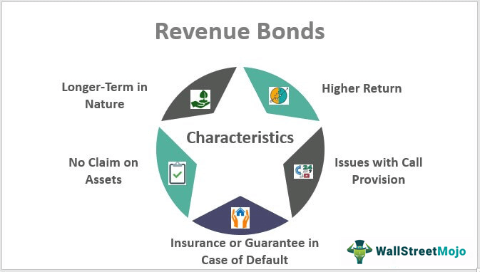

In the constantly evolving financial landscape, various instruments help address diverse economic challenges, including housing finance. Mortgage Revenue Bonds (MRBs) play a critical role in supporting affordable housing for low-income and first-time homebuyers. These bonds, typically issued by state and local housing authorities, provide a mechanism to fund mortgages at below-market interest rates. By doing so, they enhance the affordability of homeownership, a crucial aspect in tackling the housing crisis faced by many communities.

The financial markets have undergone significant transformations with the integration of technology, most notably through algorithmic trading. This technological advancement has reshaped how markets function, contributing to increased market liquidity and efficiency. For mortgage revenue bonds, algorithmic trading offers new opportunities for optimizing investment strategies and managing risks. Algorithms can swiftly analyze complex data sets, providing insights and triggering trades that align with market dynamics and investor goals. 



This article explores the intersecting worlds of MRBs, housing finance, and algorithmic trading, shedding light on their benefits and implications. It aims to provide a comprehensive understanding of how these elements interact and support the broader objectives of economic development and social welfare. Additionally, we will discuss how bond investments and trading strategies can contribute to broader economic goals, underscoring their potential to drive sustainable growth and enhance financial inclusion. Through this examination, the article aims to offer insights into how stakeholders can effectively leverage MRBs and algorithmic trading for maximum economic and social returns.

## Table of Contents

## Understanding Mortgage Revenue Bonds

Mortgage Revenue Bonds (MRBs) are a specialized type of municipal bond issued by state or local housing authorities. These bonds are instrumental in funding mortgages for qualified buyers, primarily targeting those with low incomes. Unlike conventional bonds, MRBs are tax-exempt, offering a benefit to investors in terms of avoiding federal income tax on the interest earned. This tax-exempt status is a key factor that compensates for their generally lower interest rates compared to taxable bonds, making them an attractive investment opportunity.

The principal advantage of MRBs lies in their ability to provide mortgage funds at below-market interest rates. This is achieved by using the proceeds from the bond sales to offer mortgages to eligible homebuyers at reduced rates, effectively lowering the overall cost of purchasing a home for individuals who may find it challenging to secure conventional financing. By reducing the financial barriers to homeownership, MRBs help address significant housing affordability issues in various communities.

Each year, all U.S. states issue MRBs, adhering to population-based limits established by the federal government. These limits are in place to ensure that the allocation of bond funds is proportionately distributed across states, reflecting the varying levels of housing needs and market conditions. The issuance and distribution of MRBs are thus strategically regulated to maximize their impact on expanding access to affordable housing, supporting the overarching goal of community development and economic sustainability.

## Benefits of Mortgage Revenue Bonds

Mortgage Revenue Bonds (MRBs) provide a dual advantage corresponding to both investors and the broader community. Investors benefit primarily from the tax-exempt status of the interest earned on these bonds. This tax-free nature is particularly attractive to individuals in higher tax brackets, as it can result in a higher effective yield compared to taxable bonds. For instance, if a typical taxable bond has a yield of 5% and the tax rate is 30%, the after-tax yield is only 3.5%. In contrast, a tax-free MRB with a yield of 4% provides a better return for the investor.

Housing agencies, which issue these bonds, gain access to a reliable stream of funds. These funds are earmarked for providing below-market rate mortgages to qualified buyers, often translating to significant savings for low-income and first-time homebuyers. The reduction in mortgage costs can be a decisive [factor](/wiki/factor-investing) for individuals hesitant to step onto the property ladder due to financial constraints. 

Moreover, MRBs contribute substantially to community development. By facilitating increased homeownership, these bonds help stabilize neighborhoods, leading to revitalization efforts. Enhanced homeownership rates often correlate with decreased crime rates, improved local schools, and stronger community bonds. The economic ripple effect is evident as property values increase, resulting in heightened municipal tax revenues. This influx of revenue can be reinvested into community services such as infrastructure, education, and public safety, thus fostering an environment of sustained economic growth and improved quality of life for residents. 

Overall, Mortgage Revenue Bonds forge a beneficial nexus between financial markets and socio-economic objectives, making them an instrumental tool in addressing housing affordability and community betterment.

## Role of Algorithmic Trading in Housing Finance

Algorithmic trading involves the use of automated, pre-programmed instructions to execute trades, capitalizing on speed and precision. These algorithms process large volumes of financial data with enhanced efficiency, ensuring that trades occur almost instantaneously as market conditions fluctuate. For instruments such as Mortgage Revenue Bonds (MRBs), [algorithmic trading](/wiki/algorithmic-trading) serves as a robust tool for optimizing portfolio management. By continuously analyzing market trends and economic indicators, algorithms are able to make informed decisions that aim to minimize risks and maximize returns.

The ability of algorithmic systems to predict [interest rate](/wiki/interest-rate-trading-strategies) changes is particularly beneficial for MRB portfolios. Interest rates have a significant impact on bond valuation; hence, anticipating changes allows traders to proactively adjust their portfolios. For example, if an algorithm forecasts an interest rate hike, it may suggest offloading certain MRBs before their value depreciates. Conversely, if a drop in rates is expected, the system could advise acquiring more bonds to capitalize on the potential appreciation.

To illustrate, consider a simplified Python simulation that predicts bond price movement based on interest rate fluctuations:

```python
def predict_bond_price(current_price, interest_rate_change):
    # Assuming a 1% increase in interest rate decreases bond price by 1%
    sensitivity = 0.01
    new_price = current_price * (1 - sensitivity * interest_rate_change)
    return new_price

current_price = 1000  # Example initial bond price
predicted_interest_rate_change = 0.02  # Predicted 2% interest rate increase

predicted_price = predict_bond_price(current_price, predicted_interest_rate_change)
print(f"The predicted bond price is: ${predicted_price:.2f}")
```

In this example, the predicted bond price decreases based on a forecasted interest rate increase, guiding the decision to possibly sell before the decline in valuation.

This proactive rebalancing enhances the stability and potential profitability of MRBs within a portfolio. Algorithmic trading supports more strategic asset allocation, allowing for real-time adjustments that align with market predictions. However, the deployment of such technology must be approached with caution, as rapid decision-making systems also bear the risk of exacerbating market [volatility](/wiki/volatility-trading-strategies) during abrupt downturns. Consequently, incorporating robust regulatory frameworks and ethical trading practices is critical to leveraging the benefits of algorithmic trading in housing finance effectively.

## Challenges and Risks

Mortgage Revenue Bonds (MRBs) are instrumental in supporting affordable housing; however, they come with inherent challenges and risks that require careful consideration. Key among these are credit and interest rate risks. The stability of MRBs is closely linked to the economic conditions and financial health of borrowers. When the economy falters, borrowers become more susceptible to financial strain, increasing the potential for defaults on mortgage payments. This heightened risk can impact the reliability of MRB securities, reducing their appeal to investors.

Interest rate fluctuations present another prominent risk for MRBs. As interest rates rise, the value of fixed-rate MRBs may decrease, making them less attractive compared to newer issues with higher yields. This interest rate risk is particularly relevant in an environment where monetary policy shifts towards tightening. Mathematical models, such as duration and convexity, are often employed to quantify and manage these risks. Duration estimates the sensitivity of a bond's price to changes in interest rates, while convexity measures the rate of change of duration itself.

Algorithmic trading, which involves the use of automated systems to execute trading strategies, introduces additional complexities. While this form of trading can enhance efficiency and decision-making through the rapid processing of data, it can also exacerbate market volatility during sudden economic downturns. The speed and [volume](/wiki/volume-trading-strategy) of trades executed algorithmically can lead to significant price shifts in a short period, creating a feedback loop that amplifies market movements.

Moreover, algorithmic trading systems must be meticulously designed and monitored to avoid unintended consequences, such as market manipulation or the triggering of systemic risks. The importance of implementing robust regulatory frameworks cannot be overstated. Regulatory bodies must ensure that algorithmic trading practices adhere to ethical standards and do not compromise the stability of the financial markets.

In summary, while MRBs offer valuable opportunities for addressing housing affordability, they are accompanied by significant challenges that stakeholders must navigate. Addressing credit and interest rate risks, alongside the potential pitfalls of algorithmic trading, is essential to maintain the integrity and effectiveness of MRBs as financial instruments.

## Conclusion

Mortgage Revenue Bonds (MRBs) serve as essential instruments in addressing the pressing issue of affordable housing. These bonds provide a dual benefit by promoting housing affordability for low-income and first-time homebuyers and offering tax-exempt investment opportunities. The strategic advantage of MRBs lies in their ability to channel investment into housing markets, encouraging homeownership and fostering community development.

The integration of algorithmic trading into the management of MRBs presents advanced opportunities to optimize these investments. By employing algorithmic methods, stakeholders can efficiently manage vast data sets to predict market shifts more accurately. This technological advancement allows for enhanced portfolio management, adapting to interest rate changes, and maximizing returns while mitigating risks. As algorithms continuously analyze market conditions, they provide a significant advantage in crafting responsive and adaptive trading strategies.

However, with these advancements come associated risks that stakeholders must carefully negotiate. The intrinsic risks of MRBs, such as credit and interest rate exposure, combined with the potential volatility introduced by algorithmic trading, underscore the need for caution and robust regulatory oversight. Ensuring that ethical considerations and regulatory frameworks are in place is crucial to maintaining market stability and investor confidence.

By leveraging the strengths of MRBs and integrating algorithmic trading, issuers, investors, and policymakers have a powerful toolset to collaboratively transform the housing finance landscape. This collaborative effort can lead to significant economic and social returns, as increasing access to affordable housing not only addresses a fundamental societal need but also revitalizes communities through improved property values and heightened tax revenues. As stakeholders navigate these complex yet promising dynamics, the potential to enhance both individual and collective economic outcomes becomes a shared objective, thereby maximizing the impact of MRBs within the broader financial ecosystem.

## References & Further Reading

[1]: ["Mortgage Revenue Bonds: Sources of Data."](https://www.ncsha.org/wp-content/uploads/Homeownership-Financing-101-Mortgage-Revenue-Bonds-Susan-Jun.pdf) HUD User.

[2]: ["Advances in Financial Machine Learning"](https://www.amazon.com/Advances-Financial-Machine-Learning-Marcos/dp/1119482089) by Marcos Lopez de Prado

[3]: ["Machine Learning for Algorithmic Trading"](https://github.com/stefan-jansen/machine-learning-for-trading) by Stefan Jansen

[4]: ["Quantitative Trading: How to Build Your Own Algorithmic Trading Business"](https://www.amazon.com/Quantitative-Trading-Build-Algorithmic-Business/dp/1119800064) by Ernest P. Chan

[5]: Louie, J. N. (1998). ["The Tax Exemption of Mortgage Revenue Bonds: A Study of Subsidized Housing."](https://www.ncsha.org/wp-content/uploads/Financing-Affordable-Mortgages-101-Presentation.pdf) Lewis & Clark Law Review, 9(2).