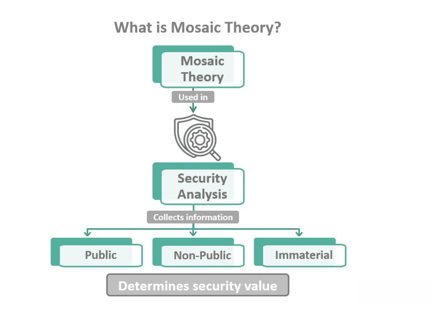

The financial landscape is constantly evolving, as various innovative methods emerge to provide investors with a competitive edge. One such method is the Mosaic Theory, which offers a distinctive approach to investment analysis by integrating nuanced data from multiple sources while maintaining ethical standards. This theory involves assembling disparate pieces of both public and non-material information to construct a comprehensive picture of potential investment opportunities. The uniqueness of Mosaic Theory lies in its ability to adhere to legal boundaries, distinguishing it from insider trading while still providing valuable insights.

The significance of Mosaic Theory has grown as the financial industry navigates the complexities of modern research, investment strategies, and algorithmic trading. Through the careful collection and analysis of diverse data sources, such as corporate filings, social media activity, and industry reports, investors can obtain a multi-dimensional understanding of the markets. This approach not only aids in identifying valuable trends but also ensures that analysis remains within the confines of ethical and legal guidelines.



In this article, we explore Mosaic Theory in depth, examining how its mechanics function and how it compares to similar methodologies. We consider its legal implications and the potential enhancements it offers to investment strategies. By understanding the facets of Mosaic Theory, investors can harness its full potential, using it as a powerful tool to gain comprehensive insights into market movements and investment opportunities without crossing ethical boundaries.

## Table of Contents

## Understanding Mosaic Theory

Mosaic Theory integrates various data types to facilitate informed investment decisions by constructing a cohesive analytical framework. This approach involves assembling elements from both public and non-public non-material information to obtain a thorough understanding of a company's or market's position. By maintaining a strict adherence to legal boundaries, Mosaic Theory ensures that the investment research remains within the confines of ethical and legal standards, distinguishing it from insider trading practices that involve utilizing confidential, material information.

Key components of Mosaic Theory include the meticulous analysis of public corporate filings like 10-K and 10-Q reports, industry reports, and market analyses. These documents offer a wealth of quantitative data, essential for evaluating a company's financial health and operational trajectory. Beyond conventional sources, Mosaic Theory also advocates the incorporation of unconventional data streams, such as insights gleaned from social media platforms, blog discussions, and satellite imagery. For instance, satellite data can provide real-time insights into retail foot traffic by estimating car volumes in parking lots, offering a tangible proxy for consumer activity without the need for direct disclosure from the company.

Social media and other crowd-sourced platforms, while less traditional, serve as valuable sources of qualitative information. Investor forums, expert blogs, and consumer reviews present a mosaic of sentiments, opinions, and experiences that might not be reflected in financial statements but are pivotal in understanding consumer behavior and market perception. These sources, when critically analyzed, can forecast potential shifts in market trends before they become evident in conventional financial data.

The integration of these disparate data pieces into a coherent and actionable framework requires a multifaceted approach. Each piece of information contributes a unique perspective to the analytical mosaic, enhancing its reliability and depth. Analysts employing Mosaic Theory meticulously synthesize this data, applying analytical models and advanced data-processing techniques to uncover insights that might otherwise remain obscured in isolated datasets.

In summary, Mosaic Theory's strength lies in its ability to bridge conventional financial analysis with innovative data sources. By ensuring compliance with legal standards and harnessing a wide array of data, it facilitates a richer and more nuanced understanding of market dynamics, thereby improving the decision-making process in investment strategies.

## Operational Mechanics and Data Sources

Mosaic Theory relies on an intricate assembly of data from varied sources, enabling investors to form a detailed view of a company's potential. This methodology emphasizes a comprehensive approach by integrating both conventional and unconventional data types.

Key traditional data sources include 10-K reports, which are critical for understanding a company's financial health and business strategy. These periodic filings offer exhaustive insight into corporate financial performance, risks, and operational conditions. Analysts often compare financial ratios and metrics derived from these reports with industry standards to assess a company’s competitiveness and stability.

Beyond conventional data, Mosaic Theory innovatively incorporates insights from unconventional sources like social media platforms such as LinkedIn and Glassdoor. LinkedIn data helps evaluate employee sentiment and talent acquisition trends, while Glassdoor provides an inside look into employee satisfaction and organizational culture, which are vital for assessing organizational strength and potential weaknesses. Google Trends, another unconventional data source, reveals consumer interest dynamics and brand popularity, offering predictive insights into market trends.

A burgeoning approach within Mosaic Theory is the use of satellite imagery and geospatial data, including retail parking lot imagery, to assess consumer behavior. By analyzing the [volume](/wiki/volume-trading-strategy) and changes in parking activity over time, investors can infer consumer traffic and gauge sales performance for retail outlets. This type of information, coupled with economic indicators, enhances the predictive capacity of traditional financial analyses.

Furthermore, the integration of these data sources requires sophisticated data synthesis techniques. Technologies such as [machine learning](/wiki/machine-learning) and data visualization play crucial roles in deciphering these vast datasets. For instance, clustering algorithms can be employed to detect patterns in employment data across LinkedIn profiles, while time-series analysis might be used to track and forecast Google Trends data. Here's a simple Python example demonstrating how to aggregate data for analysis:

```python
import pandas as pd
import numpy as np

# Load datasets from various sources
financial_data = pd.read_csv('10K_reports.csv')
linkedin_data = pd.read_csv('linkedin_data.csv')
google_trends_data = pd.read_csv('google_trends.csv')

# Merge datasets on common attribute, e.g., company_id
merged_data = pd.merge(financial_data, linkedin_data, on='company_id')
merged_data = pd.merge(merged_data, google_trends_data, on='company_id')

# Perform a simple analysis, such as computing a composite score
merged_data['composite_score'] = np.mean([merged_data['financial_metric'], 
                                          merged_data['employee_sentiment'], 
                                          merged_data['consumer_interest']], axis=0)

# Analyze composite scores across companies
composite_analysis = merged_data.groupby('company_id').composite_score.mean()
print(composite_analysis)
```

By synthesizing these diverse data inputs, Mosaic Theory creates a multidimensional analytical framework, unveiling insights that are often obscured in siloed analyses. This comprehensive perspective is essential for investors seeking to anticipate market shifts and identify sustainable investment opportunities.

## Mosaic Theory vs. Other Analysis Methods

Mosaic Theory is often juxtaposed with the Scuttlebutt Method, each offering distinct pathways for investment analysis. The Mosaic Theory primarily relies on compiling disparate pieces of public, non-public, and non-material information to form a cohesive analysis without crossing into insider trading territory. This approach allows for the integration of various data, from regulatory filings and market reports to innovative sources like social media and satellite imagery, thereby building a comprehensive view of investment opportunities.

The Scuttlebutt Method, spearheaded by Philip Fisher, emphasizes gathering qualitative insights through direct interactions with company insiders, suppliers, customers, and competitors. This methodology leans heavily on personal networks and subjective assessments to gain a deeper understanding of a company's prospects.

Each method presents its strengths and limitations. Mosaic Theory's primary advantage is its legality and the breadth of data encompassing various sources, which can offer a more objective and quantifiable analysis. However, it risks overlooking the nuanced, qualitative insights best captured by the Scuttlebutt Method. On the other hand, the Scuttlebutt Method offers deeper, anecdotal insights that can uncover information not readily available through public data. Its limitation lies in the potential bias and subjectivity introduced by relying on personal interviews and assessments.

Integrating elements of both methods can yield robust analysis without breaching ethical boundaries. For instance, while Mosaic Theory can provide a foundational quantitative framework, incorporating qualitative insights from the Scuttlebutt Method could enhance understanding of aspects such as company culture and management quality, which are typically less tangible. By merging these approaches, analysts can cross-verify gathered insights, stratify the derived data, and potentially develop more holistic investment strategies that leverage both subjective and objective information without resorting to unethical practices. This synthesis can lead to a more balanced investment decision-making process, optimizing the strengths of both methodologies.

## Legal and Ethical Considerations

Navigating the legal landscape is crucial for those employing Mosaic Theory in investment analysis. At its core, Mosaic Theory emphasizes the collection of public, non-public, and non-material information to form an investment picture. However, distinguishing between material and non-material information is key to compliance with securities laws, particularly the laws governing insider trading.

Material information is any detail that could influence an investor's decision to buy or sell a security. If an investor were to gain access to this information before it becomes public, it would constitute insider trading, which is illegal. Mosaic Theory strategically skirts this boundary by utilizing non-material and legally obtained public information, ensuring that the research remains on the right side of the law.

The Securities and Exchange Commission (SEC) plays a pivotal role in defining what constitutes material versus non-material information and establishing regulations that govern how data can be used in investment decisions. The SEC mandates transparency and fairness in the markets, punishing those who partake in insider trading or misleading practices. Therefore, analysts using Mosaic Theory must be acutely aware of these boundaries to avoid legal repercussions.

Transparency and trustworthiness are vital components of maintaining integrity in financial markets. As analysts gather extensive data points across various sources, it's essential to honestly interpret and communicate findings without inflating claims or obscuring risks. This ensures that market participants have accurate information to make informed decisions.

Ethical considerations also arise when aggregating data from unconventional sources, like social media or satellite imagery. Analysts must consider the privacy rights of individuals involved and ensure that their data collection methods do not infringe upon these rights.

In summary, while Mosaic Theory offers a robust framework for generating insights from diverse data sets, its legal and ethical execution requires diligent attention to securities laws and ethical standards. Compliance with these standards sustains market fairness and protects investors from the perils of misinformation and unverified data.

## Advanced Techniques and Algorithmic Trading

Technological advancements have substantially refined the application of Mosaic Theory in investment analysis. Central to this evolution is the integration of machine learning, which has fundamentally altered how investors can aggregate and analyze diverse datasets. Machine learning algorithms can sift through vast amounts of information, identifying patterns that might not be immediately obvious to human analysts. For instance, unsupervised learning methods such as clustering can categorize data points into distinct groups, highlighting underlying trends and relationships.

Data visualization further enhances the interpretation of complex information by representing it in intuitive formats. Interactive dashboards allow analysts to manipulate datasets, dynamically adjusting the view to uncover insights obscured by traditional static analysis. The synergy between visualization tools and machine learning fosters a deeper understanding of financial data, facilitating more informed decision-making.

Algorithmic trading has benefited significantly from these enhancements in data handling and interpretation. By employing Mosaic Theory, [algorithmic trading](/wiki/algorithmic-trading) systems can make more sophisticated decisions based on a multi-faceted dataset. Algorithms ingest data from diverse sources in real-time, continually updating trading strategies to optimize performance. This dynamic approach allows traders to rapidly respond to market changes, minimizing risks and capitalizing on opportunities more effectively than traditional methods.

Blockchain technology presents additional potential for enhancing Mosaic Theory's application. By providing a decentralized ledger, blockchain ensures that data used in analysis is both transparent and immutable. This increase in data integrity reduces the likelihood of misinformation affecting trading decisions. Furthermore, smart contracts can automate parts of the investment process, further streamlining operations while maintaining a high level of security and transparency.

The integration of these technologies represents a shift towards more efficient, data-driven financial strategies. By harnessing the capabilities of machine learning, visualization, and blockchain, Mosaic Theory is poised to offer greater insights and more robust outcomes in investment analysis and algorithmic trading.

## Applying Mosaic Theory to Enhance Portfolio Strategies

Mosaic Theory can significantly enhance portfolio performance by providing a comprehensive market analysis that integrates diverse data sources. This approach enables investors to make informed decisions based on a holistic understanding of both macroeconomic and company-specific factors. The implementation of Mosaic Theory in investment strategies involves systematically gathering and synthesizing data from various public and non-material sources, resulting in a nuanced perspective on potential opportunities and risks.

To incorporate Mosaic Theory into investment processes, one effective strategy is to develop a diversified analytical framework. This framework should encompass qualitative and quantitative data, ranging from traditional financial metrics to unconventional data sources such as consumer sentiment analysis from social media or retail foot traffic estimates derived from satellite imagery. By evaluating these data points collectively, investors can identify trends that are not immediately apparent through conventional analysis alone.

Diversification in data inputs leads to diversification in strategic insight, which can significantly impact long-term investment decisions. A well-rounded analytical approach mitigates the risks associated with over-reliance on any single type of data or indicator. For instance, combining industry reports with employee reviews from platforms like Glassdoor provides insight into both the operational efficiency and the internal sentiment of a company, which are critical for assessing its future performance.

In practice, the application of Mosaic Theory has already demonstrated tangible benefits across numerous case studies. For example, an investment firm might leverage data from Google Trends to gauge rising consumer interest in a particular product category. Coupled with financial performance data from 10-K filings, this insight can inform an investment in a company poised for growth in that sector. Furthermore, algorithmic trading systems can enhance their data-driven decision-making capabilities by incorporating these multifaceted analytical outputs into their models, optimizing trade execution strategies based on real-time, comprehensive market intelligence.

Moreover, the application of machine learning techniques can further advance the potential of Mosaic Theory. Machine learning models can process vast amounts of diverse data simultaneously, identifying correlations and patterns that might not be evident through manual analysis. These models can continuously learn and adapt from new data inputs, providing a dynamic tool for managing investment portfolios.

In summary, strategies that utilize Mosaic Theory effectively blend traditional financial analysis with novel data sources, providing investors with a robust mechanism to manage risks and capitalize on emerging market opportunities. By fostering a diversified analytical environment, investors not only enhance their understanding of market dynamics but also position themselves advantageously in a competitive financial landscape.

## Limitations and Risks

Mosaic Theory, while offering profound insights into investment analysis, is not without its limitations and risks. One of the primary challenges associated with this method is the potential for data misinterpretation. As analysts collect vast amounts of information from diverse sources like public corporate filings or unconventional channels such as social media, there is an inherent risk of drawing incorrect conclusions. This can occur when data is cherry-picked to fit a preconceived hypothesis, leading to confirmation bias. Confirmation bias occurs when individuals favor information that confirms their existing beliefs or hypotheses, potentially skewing analysis outcomes and leading to poor investment decisions.

The reliance on nonmaterial information further complicates the application of Mosaic Theory. While nonmaterial data can provide useful context or enhance the understanding of a company's operations, it may not always be reliable or accurate. For instance, consumer sentiment extracted from social media trends might not reflect actual purchasing behavior, leading to misguided investment strategies.

Addressing these challenges requires robust mitigation strategies and the application of rigorous critical thinking skills. Analysts must approach data collection and interpretation with a skeptical mindset, questioning not only the validity of the sources but also their relevance to the investment decision-making process. Employing statistical and machine learning tools can aid in refining data analysis, ensuring patterns are not solely the product of noise or random variations in the data set.

For those developing investments based on Mosaic Theory, it is crucial to maintain skepticism about the insights derived. Techniques such as sensitivity analysis can be employed to test how changes in key assumptions affect conclusions. This involves adjusting variables and examining the impact on forecasts or valuation models. By rigorously stress-testing assumptions, analysts can gain confidence in their findings and reduce the risk of overreliance on potentially spurious data points.

Ultimately, the successful application of Mosaic Theory hinges on the user's ability to critically evaluates all pieces of information and weave them into a coherent analytical narrative, balancing qualitative insights with quantitative rigor.

## Conclusion

Mosaic Theory provides substantial insights into investment analysis by assembling diverse data fragments into a coherent picture, which grants investors a significant advantage in recognizing market trends and identifying potential opportunities. By integrating both traditional data sources and innovative technologies like machine learning, it presents a holistic approach to financial strategies. This amalgamation enables more precise and adaptive decision-making, thereby enhancing the effectiveness of investment strategies in a rapidly changing financial landscape.

However, applying Mosaic Theory involves navigating legal and ethical constraints meticulously. The Securities and Exchange Commission (SEC) delineates clear lines between material and non-material information to avoid insider trading. Maintaining transparency and accountability is crucial to uphold market integrity. Investors must ensure their analyses do not breach legal boundaries while maintaining ethical standards.

When applied judiciously, Mosaic Theory can serve as a powerful tool for investors aiming to attain comprehensive market insights. By balancing the integration of varied information sources with regulatory compliance, Mosaic Theory not only fortifies investment strategies but also fosters informed and responsible market participation. This dual emphasis on innovation and ethics establishes Mosaic Theory as a valuable asset for those seeking to enhance their portfolio's performance in today's multifaceted financial environment.

## References & Further Reading

[1]: Bergstra, J., Bardenet, R., Bengio, Y., & Kégl, B. (2011). ["Algorithms for Hyper-Parameter Optimization."](https://dl.acm.org/doi/10.5555/2986459.2986743) Advances in Neural Information Processing Systems 24.

[2]: ["Advances in Financial Machine Learning"](https://www.amazon.com/Advances-Financial-Machine-Learning-Marcos/dp/1119482089) by Marcos Lopez de Prado

[3]: ["Evidence-Based Technical Analysis: Applying the Scientific Method and Statistical Inference to Trading Signals"](https://www.amazon.com/Evidence-Based-Technical-Analysis-Scientific-Statistical/dp/0470008741) by David Aronson

[4]: ["Machine Learning for Algorithmic Trading"](https://github.com/stefan-jansen/machine-learning-for-trading) by Stefan Jansen

[5]: ["Quantitative Trading: How to Build Your Own Algorithmic Trading Business"](https://www.amazon.com/Quantitative-Trading-Build-Algorithmic-Business/dp/1119800064) by Ernest P. Chan