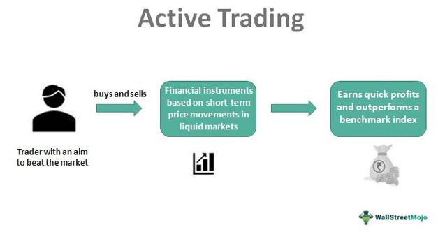

## Table of Contents

## What is meant by 'most active trading'?

'Most active trading' refers to the stocks or securities that have the highest trading volume on a particular day or over a specific period. Trading volume means the number of shares or contracts traded in a market during a given time. When people talk about the most active trading, they are usually looking at which stocks are being bought and sold the most.

This information is important for investors and traders because it can show where the market's attention is focused. If a stock is among the most actively traded, it might mean that something important is happening with that company, like a new product release or a change in leadership. By watching these stocks, investors can get clues about market trends and make better decisions about where to put their money.

## Why is it important to know about the most active trading stocks?

Knowing about the most active trading stocks is important because it helps you see where a lot of people are putting their money. When a stock is traded a lot, it means many people are buying and selling it. This can tell you that something big might be happening with that company, like good news or bad news. By watching these stocks, you can learn about what's hot in the market and maybe find good chances to invest your money.

Also, looking at the most active trading stocks can help you understand the overall mood of the market. If many stocks are being traded a lot and their prices are going up, it might mean that people are feeling good about the market. But if the prices are going down, it could mean people are worried. This information can help you decide if it's a good time to buy or sell stocks.

## How can someone identify the most active stocks in the market?

To find the most active stocks, you can use a website or app that shows stock market information. These websites often have a section called "most active" or "top [volume](/wiki/volume-trading-strategy)" where you can see which stocks are being bought and sold the most. You can also use a stock screener tool, which lets you set filters to find stocks with high trading volume. Many financial news websites and trading platforms like Yahoo Finance, Google Finance, or your broker's website will show you this information easily.

Once you're on these websites, look for a list or table that shows the stocks with the highest trading volume for the day or the week. This list will usually show the stock's name, the number of shares traded, and sometimes the stock's price change. By checking this list regularly, you can keep track of which stocks are the most active and see if there are any patterns or changes in the market. This can help you make better decisions about where to invest your money.

## What are the common characteristics of stocks that are frequently traded?

Stocks that are frequently traded often belong to big, well-known companies. These companies are usually in the news a lot, so people hear about them and want to buy or sell their stocks. They might be in exciting industries like technology or health care, where new things are always happening. When a company has news like a new product or a change in how it's run, more people want to trade its stock.

Another common characteristic is that these stocks can have a lot of ups and downs in their price. Because so many people are buying and selling, the price can change a lot in a short time. This can make them interesting to traders who like to take risks and try to make money from quick changes in the market. But it can also be risky because the price can go down as fast as it goes up.

## How does trading volume affect stock prices?

Trading volume can have a big effect on stock prices. When a lot of people are buying and selling a stock, it means the trading volume is high. This often leads to bigger changes in the stock's price. If more people want to buy the stock than sell it, the price can go up because there's more demand. On the other hand, if more people want to sell than buy, the price can go down because there's more supply.

High trading volume can also make the stock more interesting to other investors. When they see that a lot of people are trading a stock, they might think something important is happening with the company. This can make even more people want to buy or sell the stock, which can push the price up or down even more. So, trading volume is like a signal that tells investors to pay attention to what's going on with a stock.

## What are the risks associated with trading the most active stocks?

Trading the most active stocks can be risky because these stocks often have big price swings. When a lot of people are buying and selling a stock, its price can go up and down a lot in a short time. This means you could make money quickly if the price goes up, but you could also lose money fast if the price goes down. It's like riding a roller coaster – exciting but scary.

Another risk is that the high trading volume might be because of rumors or news that isn't true. Sometimes people trade a lot because they hear something about a company, but it might not be real. If you buy the stock based on that news and it turns out to be false, the stock price could drop, and you could lose money. It's important to check the news carefully and not just follow what everyone else is doing.

## Can most active trading be used as a strategy for short-term gains?

Yes, trading the most active stocks can be used as a strategy for short-term gains. When a stock is among the most active, it means a lot of people are buying and selling it. This can make the stock's price move up and down a lot in a short time. If you can guess which way the price will go, you can buy the stock when it's low and sell it when it goes up, making a quick profit. This is called short-term trading because you're not holding onto the stock for a long time.

However, this strategy is risky. Because the prices of the most active stocks can change so quickly, you could lose money just as fast as you can make it. Also, if you're not careful, you might get caught up in the excitement and make decisions based on rumors or news that isn't true. It's important to do your homework and be ready for the ups and downs if you want to try this strategy.

## How do market conditions influence the list of most active stocks?

Market conditions can change which stocks are the most active. When the economy is doing well, people might be more likely to buy stocks from big companies in industries like technology or health care. These stocks might become very active because everyone wants a piece of the good news. On the other hand, if the economy is not doing well, people might sell stocks from companies that are struggling, making those stocks more active as everyone tries to get out.

Also, big events like changes in interest rates or new laws can make certain stocks more active. For example, if the government says it will spend more money on green energy, stocks from companies in that industry might become more active because people want to invest in them. So, the list of most active stocks can tell you a lot about what's happening in the economy and what people think will happen next.

## What tools and resources are available for tracking the most active stocks?

You can use many tools and resources to keep track of the most active stocks. Websites like Yahoo Finance and Google Finance have sections that show the stocks with the highest trading volume. These sections are often called "most active" or "top volume." You can also use apps from your stock broker, like Robinhood or E*TRADE, which show you which stocks are being traded the most. Another useful tool is a stock screener, which lets you set filters to find stocks with high trading volume. Websites like Finviz and TradingView offer these screeners for free.

Financial news websites and apps are also great for tracking the most active stocks. Websites like CNBC, Bloomberg, and MarketWatch update their lists of the most active stocks throughout the day. They often include information about why these stocks are being traded so much, like news about the company or changes in the market. You can also set up alerts on these websites or apps to get notifications when certain stocks become very active. This way, you can stay on top of what's happening in the market without having to check all the time.

## How do professional traders use information about most active stocks in their strategies?

Professional traders use information about most active stocks to spot trends and make quick decisions. When they see a stock with high trading volume, they know it's important and many people are paying attention to it. They might look at why the stock is so active, like if there's news about the company or if something big is happening in the market. This helps them decide if they should buy or sell the stock. They might also use this information to guess where the market is heading and adjust their trading strategies accordingly.

Another way professional traders use this information is to find short-term trading opportunities. Since most active stocks often have big price swings, traders can try to make money from these quick changes. They might buy the stock when it's low and sell it when it goes up, or they might short sell it if they think the price will go down. By keeping an eye on the most active stocks, professional traders can jump on these opportunities and make profits in a short amount of time.

## What are the differences between most active trading in different markets, such as stocks, forex, and commodities?

Most active trading looks different in stocks, [forex](/wiki/forex-system), and commodities. In the stock market, most active trading usually means the stocks that have the highest trading volume, like shares of big companies. People might be buying and selling these stocks a lot because of news about the company or because the whole market is moving. In the forex market, most active trading means the currency pairs that are being traded the most. This can happen because of big news in a country's economy or because traders think one currency will get stronger or weaker compared to another. Commodities, like oil or gold, also have most active trading, but it's often driven by supply and demand. If there's a big change in how much of a commodity is available or how much people want it, the trading volume can go up a lot.

Even though most active trading can be found in all these markets, the reasons behind it can be different. In stocks, it's often about company news or market trends. In forex, it's more about what's happening in different countries' economies. And in commodities, it's about how much of the commodity there is and how much people need it. Understanding these differences helps traders and investors know why certain stocks, currencies, or commodities are being traded so much and how they can use this information to make better decisions.

## How can one analyze the historical data of most active stocks to predict future trends?

To analyze the historical data of most active stocks and predict future trends, you can look at past trading volumes and price movements. By studying how a stock's trading volume has changed over time, you can see if there are patterns. For example, if a stock often has high trading volume around the same time each year, like when the company reports its earnings, you might expect the same thing to happen in the future. You can also look at what happened to the stock's price when the trading volume was high. If the price usually goes up when the volume is high, that might happen again next time.

Another way to use historical data is to compare it with what's happening in the market now. If you see that a stock's trading volume is getting higher and higher, and it's similar to what happened before a big price change, you might guess that the same thing will happen again. But remember, the past doesn't always tell you what will happen in the future. There are always new things that can change how a stock acts, like new news about the company or changes in the economy. So, while looking at historical data can help you make better guesses, it's not a sure way to predict the future.

## References & Further Reading

[1]: ["Advances in Financial Machine Learning"](https://www.amazon.com/Advances-Financial-Machine-Learning-Marcos/dp/1119482089) by Marcos Lopez de Prado

[2]: ["Evidence-Based Technical Analysis: Applying the Scientific Method and Statistical Inference to Trading Signals"](https://www.amazon.com/Evidence-Based-Technical-Analysis-Scientific-Statistical/dp/0470008741) by David Aronson

[3]: ["Machine Learning for Algorithmic Trading"](https://github.com/stefan-jansen/machine-learning-for-trading) by Stefan Jansen

[4]: ["Quantitative Trading: How to Build Your Own Algorithmic Trading Business"](https://www.amazon.com/Quantitative-Trading-Build-Algorithmic-Business/dp/1119800064) by Ernest P. Chan

[5]: Bergstra, J., Bardenet, R., Bengio, Y., & Kégl, B. (2011). ["Algorithms for Hyper-Parameter Optimization."](https://proceedings.neurips.cc/paper/2011/file/86e8f7ab32cfd12577bc2619bc635690-Paper.pdf) Advances in Neural Information Processing Systems 24.