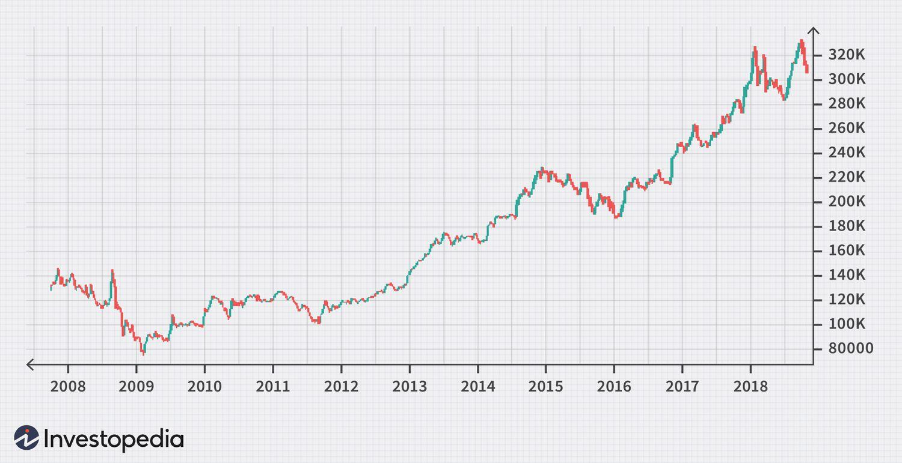

The stock market can initially appear overwhelming due to its intricate array of numbers and specialized terminology. It serves as a crucial platform for investors aiming to grow their wealth but requires a certain degree of understanding to navigate effectively. Key to simplifying this complexity is a grasp of historical stock prices, which provide valuable insights into market trends and company performance over time. By examining past data, investors can identify patterns, assess a company's stability, and anticipate future market movements—vital steps in informed decision-making.

Moreover, understanding what makes a stock expensive helps investors assess investment opportunities. Various factors, including market capitalization, supply and demand dynamics, and corporate performance, play a role in determining stock prices. Companies such as Berkshire Hathaway exemplify high stock prices through strategic financial practices and consistent profitability. Recognizing these factors and their influence on stock valuation equips investors to evaluate the potential and exclusivity of various stocks.



Additionally, modern trading techniques like algorithmic trading have revolutionized the stock market, introducing new paradigms for efficiency and speed. Such trading relies on complex algorithms that execute trades based on pre-defined criteria, significantly impacting market liquidity and volatility. As algorithmic trading grows, its effects on traditional trading methods become more pronounced, offering both advantages and challenges that traders and investors need to adapt to.

Through the exploration of these components—historical stock prices, expensive stocks, and algorithmic trading—this article aims to equip you with a deeper understanding of the stock market. By the conclusion, you should have a comprehensive understanding of historical trends and practical insights into making strategic investment decisions moving forward.

## Table of Contents

## Understanding Historical Stock Prices

Historical stock prices serve as a valuable resource for understanding a company’s past performance, gauging market trends, and making informed investment decisions. By examining the historical prices of a stock, investors can identify patterns that might indicate future market movements. For instance, consistent upward trends may suggest a company’s robust fundamentals, while frequent fluctuations could point to volatility and potential risk.

Price history analysis is essential for evaluating a stock's volatility and stability over time. Volatility measures how much a stock's price fluctuates, often using standard deviation as a metric. A higher standard deviation indicates more significant fluctuations, providing insights into risk levels. Stability, on the other hand, reflects how consistently a stock’s price holds over a period, often revealed through long-term trends and averages. 

Investors rely on various tools and indices to track historical stock prices. Common tools include platforms like Bloomberg and Yahoo Finance, which provide detailed historical data and analytical capabilities. These platforms allow investors to view time series data on stock prices and apply technical analysis to forecast future movements. Indices like the S&P 500 and the Dow Jones Industrial Average offer a broader market view, as they track the historical performance of leading companies. By comparing a specific company’s stock prices with these indices, investors can assess how well it performs relative to the market.

For those interested in coding their own analyses, Python offers numerous libraries, such as `pandas` and `numpy`, which can be used to retrieve and analyze historical stock data. The `yfinance` package, for example, makes it easy to download historical prices directly from Yahoo Finance. Here’s a simple example of how to fetch historical stock prices using Python:

```python
import yfinance as yf

# Retrieve historical data for a specific stock, e.g., Apple
data = yf.download('AAPL', start='2010-01-01', end='2023-01-01')

# Display the first few rows of the data
print(data.head())
```

This script downloads and prints historical stock prices for Apple (AAPL) from January 1, 2010, to January 1, 2023. From this data, investors can perform further analyses to evaluate performance over the specified period.

In conclusion, understanding historical stock prices plays a crucial role in investing, offering insights into a company's past and future potential. By leveraging available tools and data, investors can make better-informed decisions that align with their financial strategies.

## Why Some Stocks Are Expensive

Stock prices are driven by a confluence of factors including market capitalization, supply and demand, and company performance. The interplay of these elements determines whether a stock becomes expensive or remains relatively affordable. 

Market capitalization is a key determinant of a company's stock price. It is calculated as the product of a company's share price and the total number of its outstanding shares. Mathematically, it can be represented as:

$$
\text{Market Capitalization} = \text{Share Price} \times \text{Outstanding Shares}
$$

A high market capitalization typically suggests a substantial company presence and investor confidence, often leading to higher stock prices. Companies with significant market capitalizations, like Apple and Microsoft, usually reflect these characteristics.

Supply and demand dynamics are crucial in stock pricing. When there is a higher demand for a stock than there is availability, prices tend to increase. Conversely, an oversupply with dwindling demand can lead to lower prices. This basic economic principle is also evident in stock markets, where investor perception and market sentiment play pivotal roles in shaping demand.

Company performance is another critical [factor](/wiki/factor-investing) influencing stock prices. Financial health, profitability, and growth prospects provide investors with an indication of the company's future potential. Companies that consistently report strong earnings and growth projections—such as those in technology or consumer staples—tend to have higher stock valuations.

Some companies maintain high stock prices through strategic financial decisions, avoiding measures like stock splits that could dilute share prices. For example, Berkshire Hathaway, known for its lofty stock price, employs a strategy that avoids stock splits, thereby maintaining share exclusivity and prestige. This strategy not only underscores the financial strength of the company but also reflects a premium on investor confidence and profitability.

Expensive stocks often signify exclusivity; only a certain class of investors may afford them, thereby maintaining a level of prestige and implied value. Companies with expensive stocks generally exude investor confidence and demonstrate robust governance and strategic growth. 

In summary, stock prices, especially for expensive stocks, are influenced by the combined effects of market capitalization, the balance of supply and demand, and overall company performance. Understanding these relationships provides insights into why some stocks become expensive and how they continue to evolve within financial markets.

## Algo Trading: Revolutionizing Stock Markets

Algorithmic trading, commonly known as algo trading, utilizes sophisticated mathematical models and software programs to execute trades in financial markets with speed and precision. This form of trading capitalizes on the ability of algorithms to analyze multiple market variables simultaneously and make trading decisions in fractions of a second. The advent of algo trading has had a profound impact on market dynamics, influencing both [liquidity](/wiki/liquidity-risk-premium) and [volatility](/wiki/volatility-trading-strategies).

One of the primary benefits of algo trading is its capacity to enhance market liquidity. By executing large volumes of trades rapidly, algorithms facilitate continuous market activity, ensuring that stocks can be bought and sold with ease. This increased liquidity often leads to tighter bid-ask spreads, benefiting all market participants by lowering transaction costs. Furthermore, algo trading is instrumental in the process of [market making](/wiki/market-making), where it helps maintain market order and stability by providing liquidity.

However, the speed and scale at which algorithms operate can also contribute to increased market volatility. For instance, in scenarios like the "Flash Crash" of May 6, 2010, rapid, automated trading exacerbated market fluctuations, leading to significant temporary declines in stock prices. This event highlighted some of the risks associated with high-frequency trading, a subset of algo trading, wherein algorithms execute a large number of orders at incredibly high speeds.

Despite these risks, the adaptive potential of traders and investors in response to algo trading is considerable. Traders can develop strategies to exploit the rapid execution capabilities of algorithms, such as [arbitrage](/wiki/arbitrage) opportunities where price inefficiencies between markets or securities are identified and acted upon promptly. Institutional investors can utilize algorithmic strategies for optimizing portfolio management, seeking to minimize trading costs while implementing large-scale investment strategies.

For individual investors, embracing technological advancements becomes essential. They can use algorithmic platforms designed for retail trading, which provide tools and insights previously accessible only to large institutions. These platforms often come with features such as automated trade execution, [backtesting](/wiki/backtesting) capabilities, and access to market data analytics, allowing retail investors to craft and implement strategies aligned with their risk tolerance and investment goals.

The role of algo trading in modern financial markets continues to evolve, as both its advantages and inherent challenges push towards a more technologically integrated trading environment. Staying abreast of developments in algorithmic strategies and related technological tools will empower traders and investors to navigate these changes effectively, optimizing their participation in the ever-more complex world of stock trading.

## Top Companies with Expensive Stocks

When examining the stock market, certain companies are recognized for their exceptionally high stock prices, notably Berkshire Hathaway and NVR. These companies' stock prices reflect not only their market position but also the distinct strategies that contribute to their valuation. 

Berkshire Hathaway, led by renowned investor Warren Buffett, is famous for its high stock price, often considered the most expensive stock in the world. One primary reason is Berkshire's policy of avoiding stock splits, which keeps the stock price high and limits the number of shares available. This scarcity can contribute to driving up demand among investors. In addition, the conglomerate boasts a diversified portfolio across various sectors, enhancing its financial stability and growth prospects. The company’s long-term strategy of acquiring and holding a diverse range of subsidiaries and investments contributes substantially to its valuation.

NVR, a major player in the construction and homebuilding industries, also maintains a notably high stock price. Unlike many of its peers, NVR follows a unique business model that focuses on land acquisition options rather than ownership. This strategy reduces capital expenditure and allows the company to better navigate market fluctuations. NVR’s prudent financial management, along with strong performance metrics in a competitive industry, underpins its stock price.

Comparisons with stocks from different industries reveal interesting trends and performance insights. For instance, technology giants such as Alphabet (Google's parent company) and Amazon, although having lower individual share prices compared to Berkshire Hathaway and NVR, have substantial market capitalizations due to a high [volume](/wiki/volume-trading-strategy) of shares. These companies prioritize innovation and rapid growth, often reflected in their market strategies and significantly high market caps, rather than prohibitively expensive individual share prices.

When assessing what makes these stocks expensive, market strategies play a crucial role. Companies that avoid stock splits often maintain a higher price per share. Meanwhile, financial health, represented by consistent profitability, low debt levels, and strong cash flow, also contributes to maintaining high stock valuations. Furthermore, factors such as industry position, growth potential, and investor perceptions about future performance significantly influence stock prices.

In summary, while the stock price of companies like Berkshire Hathaway and NVR might appear daunting at first glance, it serves as an indicator of various strategic decisions and financial health that underline their economic prowess. Comparisons with companies across different sectors further illuminate the diverse factors driving stock prices, highlighting both the strategies employed and the market's valuation dynamics.

## The Role of Market Cap in Determining Value

Market capitalization, often referred to as market cap, is a pivotal metric in assessing a company's overall market value. It is calculated by multiplying the current share price by the total number of outstanding shares. This metric offers an insight into the size and potential of a company, and is instrumental in comparative analyses among firms within the same industry or sector.

Market cap allows investors to gauge the relative size of a company, which can indicate its stability and level of development. Companies are typically categorized into large-cap (greater than $10 billion), mid-cap ($2 billion to $10 billion), and small-cap (less than $2 billion) segments. Large-cap companies, such as Apple Inc. and Microsoft Corporation, are often seen as more stable with robust earnings and dividend histories. Their substantial influence on the stock market can cause significant ripples in market indices like the S&P 500 and NASDAQ.

Apple and Microsoft, due to their massive market caps, not only influence stock indices, but also investor sentiment globally. Apple's market cap surpassed $2 trillion in August 2020, underscoring its technological and financial might. Similarly, Microsoft's diversified business model and continual innovation have pushed its market cap to remarkable heights. These companies' market values are bolstered by high investor confidence and consistent performance, which can lead to a perceived safe-haven status during market volatility.

Understanding the interaction between market cap and stock price is crucial. While stock price is an indicator of investor sentiment and potential profitability, market cap provides a more stable measure of a company’s size. For example, a company might have a high stock price due to a lower number of outstanding shares, resulting in a lower market cap relative to another firm with more shares outstanding but a lower share price.

```python
# Example calculation of market cap in Python
def calculate_market_cap(share_price, number_of_shares):
    return share_price * number_of_shares

# For illustration purposes, say a company has a share price of $150 and 1 billion shares outstanding
share_price = 150
number_of_shares = 1_000_000_000

market_cap = calculate_market_cap(share_price, number_of_shares)
print("Market Capitalization: $", market_cap)
```
In this illustration, a company with a share price of $150 and 1 billion shares outstanding would have a market cap of $150 billion, categorizing it as a large-cap company.

Market cap serves as a cornerstone in financial analysis, providing a stable reference point across market fluctuations. It reflects a company's potential and competitiveness by taking both stock price and share volume into account, allowing investors to make informed decisions aligned with their risk preferences and financial goals.

## Conclusion

The stock market's complexity is underscored by the interplay between historical stock prices, expensive stocks, and [algorithmic trading](/wiki/algorithmic-trading). Understanding these elements equips investors with tools to better develop strategies that are aligned with their specific financial objectives. Historical stock prices provide essential insights into the past performance of stocks and help anticipate future fluctuations. This understanding of past trends allows investors to predict potential volatilities and market movements, crucial for constructing robust investment portfolios.

Appreciating why some stocks maintain high prices offers an additional layer of strategic foresight. Factors such as market capitalization, company performance, and strategic financial decisions—like the avoidance of stock splits—are critical in shaping the stock's market presence and perceived value. Recognizing these factors allows investors to gauge the exclusivity and profitability potential of stocks, aiding in optimal asset allocation.

Algorithmic trading presents both opportunities and challenges in modern investing. It optimizes trading efficiency and impacts market liquidity and volatility. Investors who understand algorithmic trading can harness its speed and precision to their advantage. However, awareness of its complexities and potential drawbacks is necessary for effectively incorporating this tool into investment strategies.

To make informed investment decisions, staying abreast of market trends and technological innovations is crucial. Rapid changes in technology and financial markets demand continuous learning. By dedicating efforts to ongoing education, investors can maintain confidence and adaptability in their investment approaches. This commitment to learning fosters a proactive investment mindset that is indispensable in navigating the ever-evolving landscape of the stock market.

## References & Further Reading

[1]: ["The Intelligent Investor"](https://en.wikipedia.org/wiki/The_Intelligent_Investor) by Benjamin Graham

[2]: ["Security Analysis"](https://www.wallstreetmojo.com/security-analysis/) by Benjamin Graham and David Dodd

[3]: ["Algorithmic Trading: Winning Strategies and Their Rationale"](https://www.amazon.com/Algorithmic-Trading-Winning-Strategies-Rationale-ebook/dp/B00CY5HC0U) by Ernest P. Chan

[4]: ["Flash Boys: A Wall Street Revolt"](https://en.wikipedia.org/wiki/Flash_Boys) by Michael Lewis

[5]: ["Common Stocks and Uncommon Profits and Other Writings"](https://www.amazon.com/Common-Stocks-Uncommon-Profits-Writings/dp/0471445509) by Philip A. Fisher

[6]: ["High-Frequency Trading: A Practical Guide to Algorithmic Strategies and Trading Systems"](https://www.amazon.com/High-Frequency-Trading-Practical-Algorithmic-Strategies/dp/1118343506) by Irene Aldridge