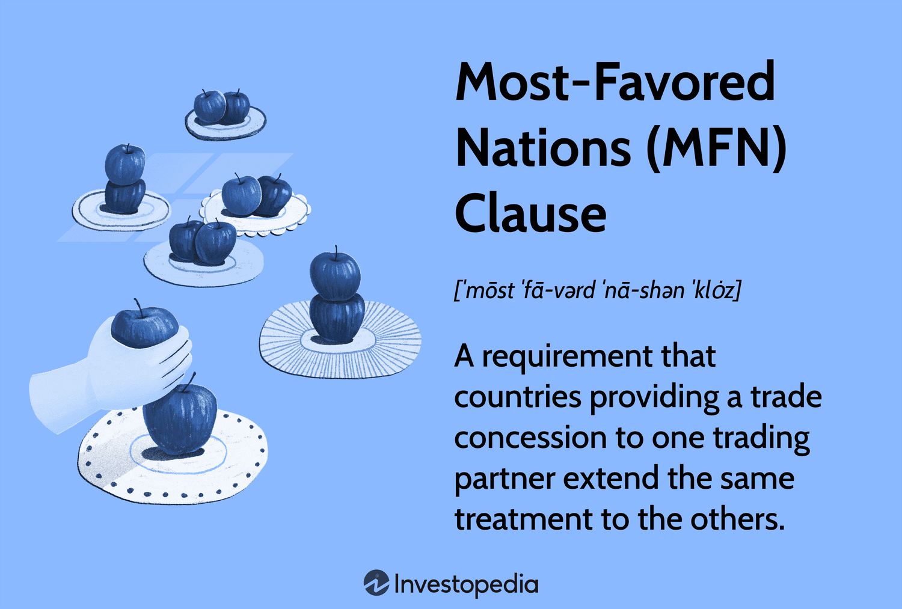

International trade is a critical component of global economic relations, enabling countries to exchange goods and services across borders to achieve mutual economic benefits. Trade policy is a crucial mechanism through which governments manage these exchanges, using tools such as tariffs, trade agreements, and regulations to influence trade flows and balance national interests. A well-structured trade policy can foster economic growth, enhance competitiveness, and promote diversified and sustainable economic development.

A cornerstone of many trade agreements is the Most-Favored-Nation (MFN) clause, a principle that mandates that any advantage, favor, or privilege granted by one country to another in trade must be extended to all other countries. Its historical significance stems from its role in establishing non-discriminatory trade practices. Originating in the 18th century, the MFN clause aimed to create a level-playing field among trading nations by preventing preferential treatment. This principle became a foundational aspect of the General Agreement on Tariffs and Trade (GATT) in 1947 and continues to underpin the World Trade Organization (WTO) framework, facilitating a more inclusive and fair global trading system.

Technological advancements, particularly algorithmic trading, have further transformed the landscape of international trade. Algorithmic trading, or algo trading, refers to the use of computer algorithms to automate trading decisions in financial markets. It has revolutionized the speed and efficiency of trading operations but also introduced complex dynamics into global trade, impacting pricing, market access, and economic stability. The interplay between algo trading and trade policy presents new challenges and opportunities for regulatory frameworks aiming to maintain equitable and competitive international markets.

The purpose of this article is to explore the intricate relationships between trade policy, MFN clauses, and algorithmic trading, highlighting their collective impact on modern international trade. Understanding these components is crucial, as they collectively influence the economic strategies of nations, the operation of multinational corporations, and the livelihoods of individuals globally. As international trade continues to be a driving force in the global economy, addressing these topics becomes increasingly relevant to ensure a balanced and equitable trading environment that can adapt to technological innovations while upholding fair trade practices.

## Table of Contents

## Understanding Trade Policy

Trade policy is a comprehensive framework governing international trade activities, playing a pivotal role in shaping the economic relations between countries. It encompasses regulations and agreements that dictate how countries engage in trade, hereby affecting the flow of goods and services across borders. The primary objective of trade policy is to ensure a balance between protecting domestic industries and promoting international trade, thus fostering economic growth and development.

Trade agreements, as components of trade policy, are categorized into bilateral, regional, and multilateral agreements. Bilateral trade agreements involve two countries negotiating trade terms exclusive to these countries’ economic interests. Regional trade agreements are broader, including multiple nations within a specific geographical area, such as the European Union or the North American Free Trade Agreement (NAFTA). Multilateral agreements, governed mainly by the World Trade Organization (WTO), involve multiple countries from different regions, aiming to establish globally accepted trade standards and practices.

Trade policy directly influences tariffs, trade barriers, and market access. Tariffs, as taxes imposed on imported goods, can protect domestic industries from foreign competition but may also lead to increased prices for consumers. Non-tariff barriers, such as quotas, import licenses, and standards, are used to regulate the [volume](/wiki/volume-trading-strategy) of trade and ensure the quality of imported goods. Market access is crucial for promoting exports, determining how easily domestic products can enter global markets under specific trade agreements.

Recent trends in global trade policy reveal a dynamic shift between protectionism and liberalization. Protectionism, aimed at shielding domestic industries from foreign competition, has been marked by the rise of tariffs and trade barriers in various countries. This trend can be seen in events like Brexit and the U.S.-China trade tensions. On the contrary, trade liberalization advocates for reducing trade barriers to stimulate free trade, promote economic integration, and enhance cooperation amongst nations. The emergence of mega-regional trade agreements, such as the Comprehensive and Progressive Agreement for Trans-Pacific Partnership (CPTPP), highlights efforts towards liberalization by reducing tariffs and encouraging economic collaboration.

These evolving dynamics in trade policy are indicative of the complexities involved in balancing national economic security with active participation in the global economy. Effective trade policy must adapt to geopolitical shifts and technological advancements, maintaining a stable yet progressive approach to international trade relations.

## The Most-Favored-Nation Clause

The Most-Favored-Nation (MFN) clause is a cornerstone provision within international trade agreements, essential for advancing the principles of non-discriminatory trade. It ensures that any advantage, favor, or privilege granted by a country to the products or services of another country must be extended to all other countries. This clause is pivotal in maintaining equality among trading partners, thereby fostering a stable and predictable trading environment.

Historically, the MFN principle has been a fundamental element of trade policy. It gained prominence with the establishment of the General Agreement on Tariffs and Trade (GATT) in 1947, which served as a precursor to the World Trade Organization (WTO). The MFN clause is embedded in Article I of the GATT, highlighting its significance in creating a multilateral trading system based on fairness and reciprocity.

The principle of non-discriminatory trade under the MFN clause mandates that a WTO member cannot discriminate between its trading partners. For example, if one member reduces tariffs on certain goods for one trading partner, it is obliged to extend the same tariff reduction to all other WTO members. This uniformity helps prevent preferential treatment and promotes equality in trade relations, making it easier for smaller countries to compete on an equal footing with larger economies.

The application of the MFN clause is not without exceptions and criticisms. Notable exceptions include free trade agreements (FTAs) and customs unions, where members can offer each other preferential treatment not extended to the rest of the WTO members. Additionally, the Generalized System of Preferences (GSP) allows developed countries to grant unilateral tariff reductions to developing countries, deviating from the MFN principle to support development objectives.

Critics of the MFN clause argue that it may limit the ability of countries to negotiate mutually beneficial trade terms. Furthermore, the strict non-discrimination rule can be challenged by economic and political considerations, as countries navigate complex global relationships.

In summary, the MFN clause is vital in maintaining a level playing field in international trade, promoting equitable access to markets and ensuring that trading relationships are governed by fairness and predictability. Despite its exceptions and criticisms, the clause remains a central pillar of the WTO's multilateral trading system, underpinning the organization's efforts to facilitate free and fair global trade.

## Impact of MFN Clauses on International Trade

The Most-Favored-Nation (MFN) clause is a cornerstone of international trade agreements, playing a crucial role in ensuring equal treatment among trading nations. For smaller exporting countries, the MFN clause offers several benefits. Primarily, it guarantees these countries access to larger markets on the same terms as more significant players. This equal treatment under MFN provisions means that smaller exporters can compete more effectively without the need to negotiate numerous bilateral trade agreements. As a result, they can leverage the existing agreements of larger economies to expand their trade potential, facilitating economic growth and diversification.

However, the enforcement of MFN clauses presents notable challenges and limitations. One significant challenge is the potential for conflicts between national policies and international commitments. Countries may resort to using non-tariff barriers or erecting technical standards to circumvent MFN obligations without explicitly breaching them. Furthermore, the interpretation and application of MFN clauses can lead to disputes, often requiring intervention by international bodies such as the World Trade Organization (WTO). These enforcement challenges underscore the need for robust dispute resolution mechanisms and clear guidelines.

MFN clauses are instrumental in promoting global trade liberalization. By extending the best available trading terms from one country to all WTO members, the MFN principle discourages protectionist measures and encourages a more open and competitive trade environment. This leads to a cascade of reduced tariffs and aligned trade regulations worldwide, fostering a cohesive global trading system that benefits all participating nations.

Political relations significantly influence the application and implications of MFN status in global trade. Diplomatic tensions or strategic interests might lead countries to reconsider their trade relationships, even within the framework of MFN clauses. In some cases, countries may seek to influence the interpretation of MFN provisions to favor their domestic industries or geopolitical interests. Consequently, political dynamics play a pivotal role in shaping trade policies, affecting the consistency and predictability of trade relations under MFN agreements.

In conclusion, while the MFN clause plays a vital role in facilitating equitable and liberalized trade, its effectiveness is moderated by challenges in enforcement and political factors. Smaller countries benefit significantly from the MFN model, but continuous vigilance and international cooperation are essential to overcome the challenges and sustain the gains achieved through this trade principle.

## Integration of Algorithmic Trading in International Trade

Algorithmic trading, often referred to as algo trading, involves the use of computer algorithms to manage trading processes, execute orders, and make trading decisions with minimal human intervention. This form of trading leverages technological advancements and sophisticated mathematical models to analyze market data and capitalize on trading opportunities at speeds and frequencies that are unattainable for human traders. Over the past few decades, algo trading has gained significant traction in global financial markets, revolutionizing the way transactions are conducted.

The influence of algo trading on international trade dynamics is multifaceted. Firstly, by automating trading strategies, algo trading increases the speed and efficiency of executing trades, thereby reducing transaction costs and improving [liquidity](/wiki/liquidity-risk-premium). This enhanced liquidity facilitates smoother and more predictable trade flows between countries, potentially enhancing global trade volumes. Additionally, the capability of algos to process and react to real-time market information can lead to more informed pricing decisions on a global scale, which could result in more equitable trading conditions for all market participants.

The relationship between trade policy and the use of technology in trading is intricate. Trade policies are traditionally designed to govern how countries interact economically, primarily through regulations on tariffs, quotas, and trade barriers. With the growing prevalence of algo trading, regulatory bodies face novel challenges to ensure that these automated systems comply with existing trade laws. Furthermore, there is a necessity to adapt current trade policies to accommodate new technological paradigms. The integration of technology in trading processes creates a demand for policies that balance fostering innovation while safeguarding market integrity.

Despite its benefits, algo trading carries inherent risks, particularly in terms of market efficiency and fairness. While algorithmic systems can enhance market efficiency by ensuring that prices more accurately reflect available information, they can also contribute to market [volatility](/wiki/volatility-trading-strategies). Instances of flash crashes, where market prices plummet in mere seconds due to algorithmic errors, underscore this risk. Moreover, there are concerns about fairness, as not all market participants have equal access to the sophisticated technology and data required to implement algo trading. This disparity can exacerbate inequalities among traders and trading nations, potentially skewing perceived benefits towards more technologically advanced economies.

The integration of [algorithmic trading](/wiki/algorithmic-trading) into international trade necessitates a comprehensive understanding of its potential and limitations. While it offers promising avenues for enhanced efficiency and expanded market participation, it simultaneously presents regulatory challenges and ethical considerations that must be addressed to ensure equitable and stable trading environments. As such, ongoing collaboration between policymakers, technologists, and market participants is crucial to fully harness the benefits of algo trading while mitigating its risks.

## The Role of MFN Clauses in Algo Trading

The interaction between Most-Favored-Nation (MFN) clauses and algorithmic trading (algo trading) presents a complex dynamic in international trade. MFN clauses, which are designed to ensure non-discriminatory trade practices by mandating equal treatment among trading partners, can influence the operations of algo traders. These traders, who often operate based on rapid and automated decision-making processes, must adapt to the regulatory environments shaped by such clauses.

Algo trading can impact the equality envisioned by MFN clauses by altering the competitive landscape in unexpected ways. Given the speed and precision of algo trading, there is potential for disparities in market access and influence, even under MFN conditions that nominally ensure equal treatment. For instance, if an algorithm is designed to exploit market inefficiencies, it might inadvertently create scenarios where countries with advanced trading technologies gain disproportionate advantages, potentially undermining the spirit of MFN provisions. 

In terms of regulatory considerations, the intersection of MFN clauses and algo trading presents new challenges. Regulators must ensure that the benefits of technological advancements do not compromise the fairness sought by MFN clauses. This could involve developing frameworks to monitor algorithmic activities and ensuring that they do not lead to unjust market manipulation or discrimination. The regulatory environment must balance encouraging innovation in trading technology while safeguarding the equitable principles inherent to MFN clauses. 

Case studies have illustrated scenarios where algo trading has interacted with MFN provisions. For instance, in markets where algo trading has become prevalent, issues have arisen concerning the equitable distribution of market opportunities. A hypothetical example could involve a trading firm utilizing algorithms to rapidly exploit price differences across markets, leading to perceptions of inequity among countries without similar technological capabilities. These situations highlight the necessity for ongoing dialogue between policymakers and market participants to adapt traditional trade principles like MFN to modern trading practices. 

Ultimately, the role of MFN clauses in algo trading underscores the need for ongoing regulation and oversight. Ensuring that these technological advancements do not erode the fairness and equality that MFN clauses aim to preserve is critical for sustaining balanced international trade relations. Further research and adaptation of legal frameworks may be necessary to address evolving challenges at the intersection of technology and trade policy.

## Conclusion

The Most-Favored-Nation (MFN) clause remains a cornerstone in today’s trade policies, facilitating non-discriminatory trade practices by ensuring that every nation receives equal treatment in trade agreements. Its role is pivotal in promoting global trade liberalization and fostering fair competition among countries of varying sizes and economic strength. By eliminating discriminatory tariffs and trade barriers, the MFN clause enhances market access and encourages nations to engage in mutually beneficial trade relationships.

Technological advancements, particularly algorithmic trading (algo trading), are profoundly shaping the future of international trade. Algo trading, characterized by executing trades using complex algorithms at high speeds, has introduced both efficiency and complexity to financial markets. It can significantly influence trade dynamics by optimizing currency and commodity exchanges, which are integral to international trade activities. However, this technological progress comes with its challenges. There is a growing concern regarding the potential for algo trading to disrupt market stability and fairness, potentially conflicting with the equitable trade principles espoused by the MFN clause.

Policy implications of these advancements are significant. To balance technological progress with fair trade practices, regulatory frameworks must adapt to evolving trading landscapes. Policymakers should consider implementing regulations that ensure transparency and accountability in algorithmic trading activities without stifling innovation. Collaboration between governments and international institutions, such as the World Trade Organization (WTO), is crucial in developing guidelines that can uphold the MFN principle while accommodating technological evolution.

Furthermore, ongoing research and monitoring are vital to maintaining equitable trade practices. This involves analyzing the impacts of algo trading on different economies and ensuring that smaller and developing nations are not disadvantaged by the rapid technological shifts. Continuous dialogue and adjustment of trade policies will be necessary to safeguard the principles of fairness and equality, ensuring that all nations can benefit from an increasingly interconnected global economy.

## References & Further Reading

[1]: Jackson, J. K. (2018). ["Trade Agreements: Impact on the U.S. Economy."](https://www.researchgate.net/publication/323814516_Trade_agreements_Impact_on_the_US_economy) Congressional Research Service.

[2]: Irwin, D. A. (1995). ["The GATT in Historical Perspective."](https://www.jstor.org/stable/pdf/2117941.pdf) American Economic Review, 85(2), 323-328.

[3]: Milgrom, P., North, D. C., & Weingast, B. R. (1990). ["The Role of Institutions in the Revival of Trade: The Law Merchant, Private Judges, and the Champagne Fairs."](https://www.semanticscholar.org/paper/The-role-of-institutions-in-the-revival-of-trade:-Milgrom-North/3bddb1c63b2632a0131403f70633e25c3962ac50) Economics & Politics, 2(1), 1-23.

[4]: Menkveld, A. J. (2013). ["High Frequency Trading and the New Market Makers."](https://www.sciencedirect.com/science/article/pii/S1386418113000281) Journal of Financial Markets, 16(4), 712-740.

[5]: Lopez de Prado, M. (2018). ["Advances in Financial Machine Learning."](https://www.amazon.com/Advances-Financial-Machine-Learning-Marcos/dp/1119482089) Wiley.

[6]: WTO. (2011). ["World Trade Report 2011: The WTO and Preferential Trade Agreements: From Co-Existence to Coherence."](https://www.wto-ilibrary.org/content/books/9789287044983)

[7]: Hoekman, B. M., & Kostecki, M. M. (2009). ["The Political Economy of the World Trading System: The WTO and Beyond."](https://academic.oup.com/book/1467) Oxford University Press.