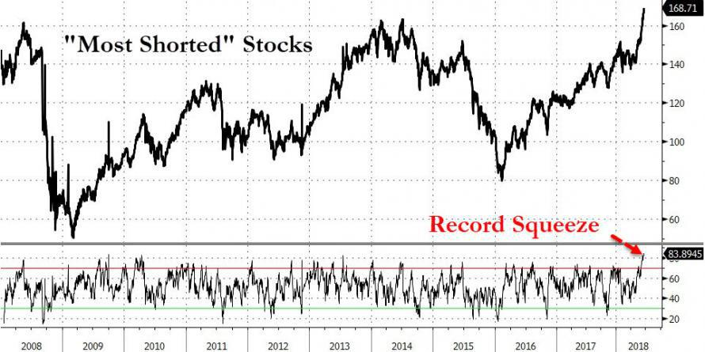

Algorithmic trading has revolutionized the financial industry by enabling traders to execute transactions with superior precision and speed. This approach uses sophisticated mathematical models and algorithms to make decisions in fractions of a second, far faster than human traders. On the New York Stock Exchange (NYSE), algorithmic trading is particularly prevalent, with many traders employing these algorithms to navigate the complexities of shorted stocks. Heavily shorted stocks present unique challenges and opportunities, as they are often characterized by bearish market sentiment and volatile price movements.

This article will examine the dynamics of shorted stocks on the NYSE and how algorithmic trading strategies can be effectively applied to capitalize on these situations. Short selling, the process of selling borrowed stocks with the intention of repurchasing them at a lower price, inherently carries significant risks and rewards. Traders who master these techniques can optimize their strategies to maximize returns while managing risk effectively. By gaining a comprehensive understanding of these market factors, traders can enhance their strategies and improve their potential returns.



## Table of Contents

## What is Short Selling?

Short selling is a trading strategy involving the sale of borrowed stocks with the expectation of buying them back at a lower price in the future. The primary aim is for traders to profit from the decline in the stock price. Here is a step-by-step explanation of the process:

1. **Borrowing Stocks**: A trader initiates a short sale by borrowing shares from a broker. This arrangement usually requires a margin account, where the trader pledges collateral to cover the borrowed shares.

2. **Selling Borrowed Shares**: Once the shares are borrowed, the trader sells them on the open market at the current market price. This sale generates cash proceeds for the trader.

3. **Anticipation of Price Decline**: The trader hopes that the stock price will decrease over time. A decline in price allows the trader to repurchase the shares at a lower rate than the selling price.

4. **Repurchasing Shares (Covering the Short)**: If the stock price does fall as anticipated, the trader repurchases the shares at the decreased price. This action is known as "covering the short position."

5. **Returning Borrowed Shares**: After buying back the shares, the trader returns them to the broker. The profit from the trade is the difference between the higher selling price and the lower repurchase price, minus any associated fees or interest on the margin.

The strategy's profit potential comes with significant risks. Specifically, if the stock price rises instead of falls, the trader must still buy back the shares to close the position, potentially incurring substantial losses. Unlike standard buy-and-hold investments where losses are capped at the initial investment, short selling carries theoretically unlimited loss potential because a stock's price can continue to increase indefinitely.

Traders engaging in short selling should have a keen understanding of market dynamics and trends. This understanding is essential to accurately predict stock price movements and manage the inherent risks associated with short selling. Proper risk management strategies and continuous market analysis are vital to executing successful short trades.

## Understanding Heavily Shorted Stocks

A stock is considered heavily shorted when a substantial percentage of its available shares are sold short, reflecting a general bearish sentiment among investors. This sentiment can stem from various factors, including adverse financial data, challenging market environments, or company-specific issues. Analyzing heavily shorted stocks allows traders to gauge investor confidence and potential price movements, which can be pivotal in crafting effective trading strategies.

As of mid-2024, five notable stocks identified as heavily shorted on the New York Stock Exchange (NYSE) include Albemarle Corporation, Builders FirstSource Inc., Dayforce Inc., DaVita Inc., and Campbell Soup Company. Each of these companies represents distinct industries with unique challenges, influencing investor sentiment and leading to increased shorting activity.

**Albemarle Corporation** is a global leader in the production of specialty chemicals, including lithium compounds critical for electric vehicles. Despite the growing demand for lithium, the company faces challenges such as fluctuating lithium prices and competition, contributing to its status as a heavily shorted stock.

**Builders FirstSource Inc.,** a supplier of building materials, has experienced the impact of fluctuating housing market conditions. Concerns over interest rate hikes and potential downturns in construction activity have led investors to adopt a more bearish outlook, resulting in substantial short interest.

**Dayforce Inc.** operates in the technology sector, offering human capital management solutions. Rapid technological advancements and intense competition in the tech market might deter investors, creating opportunities for short selling. Any setbacks in their innovation or strategic execution increase the risk perception among investors.

**DaVita Inc.,** a healthcare provider focusing on kidney dialysis, operates in an industry characterized by regulatory scrutiny and reimbursement challenges. These factors, along with potential policy changes affecting healthcare, can contribute to the company's vulnerability to short selling.

**Campbell Soup Company,** a staple in the consumer goods sector, faces pressures from changing consumer preferences and rising ingredient costs. The competitive environment in the food industry and the company's adaptation efforts affect investor confidence, making it one of the heavily shorted stocks.

Understanding the underlying reasons for heavy shorting is vital for traders aiming to anticipate market movements and potential short squeezes. A short squeeze occurs when a heavily shorted stock experiences a sharp price increase, prompting short sellers to buy back shares to cover their positions, further amplifying the stock's price rise. Identifying heavily shorted stocks enables traders to position themselves advantageously, potentially profiting from these rapid price corrections. 

Recognizing the diverse challenges and sentiments associated with heavily shorted stocks aids traders in assessing risk, formulating strategies, and optimizing their trading decisions amid the dynamic landscape of the NYSE.

## Algorithmic Trading and Shorted Stocks

Algorithmic trading employs advanced algorithms to automate transactions, enhancing the efficiency of trading processes, particularly within high-frequency trading environments. In the context of shorted stocks, this technology can rapidly identify potential trading opportunities by analyzing market data and conditions at a remarkable speed and precision. These algorithms are adept at processing large datasets, a capability that human traders cannot match, thus enabling them to quickly react to price fluctuations and capitalize on trading opportunities.

For stocks that are heavily shorted, algorithmic systems are particularly beneficial due to their ability to anticipate market reversals. One common strategy used by these systems involves back-testing, where historical data is used to simulate potential trading scenarios. This approach helps in predicting short squeezes—situations where a heavily shorted stock's price rises sharply, forcing short sellers to buy shares to cover their positions, further driving up the price. By constructing algorithms that can recognize patterns indicative of impending squeezes, traders aim to engage in profitable trades that require swift execution.

To illustrate, consider a Python implementation of a basic [algorithmic trading](/wiki/algorithmic-trading) strategy oriented towards shorted stocks:

```python
import pandas as pd
import numpy as np

def moving_average_strategy(prices, short_window, long_window):
    signals = pd.DataFrame(index=prices.index)
    signals['signal'] = 0.0

    # Create short and long simple moving averages
    signals['short_mavg'] = prices['Close'].rolling(window=short_window, min_periods=1, center=False).mean()
    signals['long_mavg'] = prices['Close'].rolling(window=long_window, min_periods=1, center=False).mean()

    # Create signals
    signals['signal'][short_window:] = np.where(signals['short_mavg'][short_window:] > signals['long_mavg'][short_window:], 1.0, 0.0)

    # Generate trading orders
    signals['positions'] = signals['signal'].diff()

    return signals

# Example data usage
# prices = pd.read_csv('historical_stock_prices.csv', parse_dates=True, index_col='Date')
# signals = moving_average_strategy(prices, short_window=40, long_window=100)
```

This basic moving average crossover strategy generates buy signals when the short-term moving average exceeds the long-term moving average, potentially indicating a bullish market reversal. Such strategies can be further refined to cater specifically to heavily shorted stocks.

While algorithmic trading offers significant advantages, it is imperative that these systems are tested under real-time market conditions to assess their effectiveness in managing risks, such as market [volatility](/wiki/volatility-trading-strategies). Without real-time testing and continuous refinement, algorithms may fail when confronted with actual trading conditions that differ from historical data.

Moreover, the importance of emotion-free trading cannot be understated. Algorithms, devoid of human emotions, can make consistent, unbiased decisions, thus reducing the potential for panic-induced errors that may occur in volatile markets.

However, one must note the necessity of vigilant oversight. Algorithms should not operate autonomously without human supervision; instead, they should be continuously monitored and adjusted to ensure they remain in alignment with current market dynamics. This approach not only mitigates risks but also ensures that algorithmic strategies continue to offer a competitive edge in the trading of shorted stocks.

## Common Mistakes in Algorithmic Trading

Over-optimizing an algorithm for historical data often results in reduced effectiveness when applied to live trading environments. This is primarily due to market dynamics that are not fully captured during [backtesting](/wiki/backtesting). Traders may unintentionally optimize their algorithms to perform well on past data, thereby losing generality and adaptability to new market conditions. Such practices can lead to strategies that seem effective during testing but falter upon deployment.

One major pitfall is the neglect of real-time data quality, which can have serious financial implications. Algorithms that rely on inaccurate or delayed data can execute trades based on outdated information, potentially leading to erroneous trades and significant losses. Ensuring data integrity and employing robust mechanisms for data verification is crucial to maintaining the accuracy of trading algorithms.

Market [liquidity](/wiki/liquidity-risk-premium) and slippage are significant concerns that can have a substantial impact on trade execution. Slippage occurs when a trade is executed at a price different from the expected price due to market movements. To mitigate this, algorithmic strategies should incorporate factors such as average trading [volume](/wiki/volume-trading-strategy) and expected market volatility to adjust trade sizes and timings appropriately.

Continuous monitoring of algorithmic trading systems is essential to catch any deviations from expected performance or market conditions. An unmonitored system may miss crucial trading opportunities or exacerbate losses during unexpected market shifts. Regular system checks and timely alerts can help traders respond swiftly to market changes.

Relying on a single trading strategy poses risks, especially when market conditions shift. Diversification of trading strategies can protect against losses by distributing risk across various market scenarios. By employing multiple, complementary strategies, traders can hedge against adverse market movements and enhance overall stability and performance in trading operations.

Overall, acknowledging and addressing these common mistakes can vastly improve the robustness and adaptability of algorithmic trading systems, safeguarding against unplanned financial exposure and enhancing long-term success.

## Best Practices for Using Algorithmic Trading

To optimize algorithmic trading strategies effectively, it is essential to focus on key best practices that enhance decision-making and risk management.

Firstly, ensuring algorithms are constructed using high-quality, real-time data is fundamental for making informed trading decisions. Real-time data allows traders to track market changes instantly, thereby capitalizing on fleeting opportunities. This involves subscribing to reliable data feeds that offer granular market data, enabling precise analysis and reaction.

Diversification of trading strategies is another critical practice to hedge against market volatility. By employing a variety of strategies, traders can mitigate risk and capitalize on different market conditions. For instance, a mix of trend-following and mean-reversion strategies can provide balance; where one underperforms, the other may excel, thus stabilizing returns.

Regular back-testing on both historical and out-of-sample data is imperative for validating the robustness and adaptability of trading strategies. Back-testing involves simulating a strategy using past data to understand its potential performance. It helps identify weaknesses and refine strategies before they are applied in live markets. Utilizing out-of-sample data avoids the trap of overfitting, ensuring the strategy can handle unexpected real-world conditions.

Consistent monitoring of trading systems is crucial for addressing anomalies and deviations from expected performance metrics swiftly. Systematic monitoring detects issues such as latency, data lags, or hardware malfunctions that could compromise execution. Tools and dashboards that provide real-time updates and alerts are valuable for maintaining operational integrity.

Lastly, integrating trading platforms with robust data Application Programming Interfaces (APIs) enhances algorithmic capabilities. APIs facilitate seamless data transfer and interaction with multiple market platforms, allowing for more comprehensive strategy deployment and execution. Engaging with platforms that offer extensive API support can streamline trading operations and enable quick adaptations to market changes.

Incorporating these best practices ensures that algorithmic traders can maintain an edge in the fast-paced markets by reinforcing their strategies with solid data analysis, diversification, thorough testing, vigilant system monitoring, and efficient technological integration.

## Conclusion

Algorithmic trading in heavily shorted stocks presents unique opportunities for experienced traders prepared to manage inherent risks. Achieving success in this field necessitates a comprehensive understanding of both short selling strategies and the functionality of trading algorithms. This knowledge is essential for effectively leveraging the nuances of ever-shifting market dynamics.

A critical element of successful algorithmic trading is employing the right strategies. The integration of precise algorithms enables traders to exploit market inefficiencies. By ensuring data quality and system oversight, traders can significantly enhance the performance of their strategies. Such diligence ensures that market movements are captured accurately, which is vital for informed decision-making and optimizing returns.

As markets continually change, ongoing education and strategic adaptation are essential to maintaining a competitive trading edge. The landscape of financial markets is inherently dynamic, requiring traders to keep abreast of new developments, technologies, and methodologies. Incorporating new insights into existing strategies can bolster effectiveness and resilience against unexpected market shifts.

Algorithmic trading holds remarkable potential to transform trading outcomes, but its success is contingent upon informed development, execution, and adaptive management. Traders must engage in continuous learning and methodical strategy refinement. By doing so, they can harness the full potential of algorithmic trading to achieve superior results in heavily shorted stock environments.

## References & Further Reading

[1]: Bergstra, J., Bardenet, R., Bengio, Y., & Kégl, B. (2011). ["Algorithms for Hyper-Parameter Optimization."](https://dl.acm.org/doi/10.5555/2986459.2986743) Advances in Neural Information Processing Systems 24.

[2]: ["Advances in Financial Machine Learning"](https://www.amazon.com/Advances-Financial-Machine-Learning-Marcos/dp/1119482089) by Marcos Lopez de Prado

[3]: ["Evidence-Based Technical Analysis: Applying the Scientific Method and Statistical Inference to Trading Signals"](https://www.amazon.com/Evidence-Based-Technical-Analysis-Scientific-Statistical/dp/0470008741) by David Aronson

[4]: ["Machine Learning for Algorithmic Trading"](https://github.com/PacktPublishing/Machine-Learning-for-Algorithmic-Trading-Second-Edition) by Stefan Jansen

[5]: ["Quantitative Trading: How to Build Your Own Algorithmic Trading Business"](https://books.google.com/books/about/Quantitative_Trading.html?id=j70yEAAAQBAJ) by Ernest P. Chan