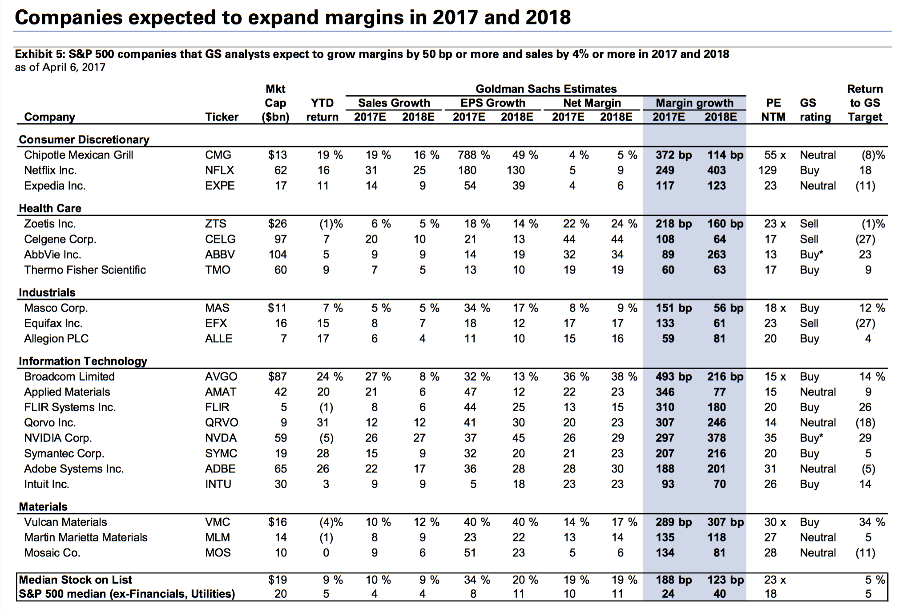

In today's global economy, understanding the performance of top companies is crucial for investors and stakeholders. This article focuses on the financial aspects of some of the world's most profitable companies, examining their earnings, market influence, and the role of algorithmic trading in effectively managing investments.

Technology and innovation are key drivers of market changes, enabling global corporations to leverage algorithmic trading to optimize returns and reduce risks. Algorithmic trading involves the use of complex mathematical models and high-speed, automated trades to maximize efficiency and profitability in financial markets. These advanced techniques allow companies to execute trades at speeds and scales unimaginable in traditional trading environments.

Algorithmic trading not only enhances precision and efficiency in transactions but also plays a substantial role in revenue generation for major corporations. By analyzing vast amounts of data to identify optimal trading opportunities, these technologies contribute significantly to the earnings of leading firms.

We'll explore the list of the most profitable companies, focusing on net income and market strategies. Companies like Apple, Microsoft, and Alphabet have consistently shown formidable financial performance, largely attributed to their strategic use of technology and innovation. These corporations set benchmarks in market dynamics through their adaptive practices and diversified investment portfolios.

Algorithmic trading has revolutionized how these companies approach the stock market, providing them with tools to adapt to volatile financial environments and capitalize on emerging trends. As algorithmic solutions advance with the integration of artificial intelligence and machine learning, the capability to adjust swiftly to market fluctuations becomes even more pronounced. This evolution represents a significant leap towards a future where continuous technological progression shapes market dynamics and corporate success.

## Table of Contents

## Overview of Profitable Global Corporations

The technology sector stands at the forefront of global profitability, with leading firms like Apple, Microsoft, and Alphabet setting the pace through their innovative products and services. These companies have successfully tapped into a global consumer base, leveraging both their cutting-edge technology and strong market presence to drive substantial revenues. Apple's consistent innovation in consumer electronics, Microsoft's foothold in software and cloud services, and Alphabet's dominance in search and advertising exemplify how tech companies harness diverse streams of income to sustain high profitability levels.

In parallel, the financial sector remains a pivotal contributor to the list of most profitable global corporations. Institutions like JPMorgan Chase and the Industrial and Commercial Bank of China (ICBC) rank prominently among the top earners worldwide. These financial behemoths benefit from extensive banking networks and diversified financial services portfolios, which include investment banking, wealth management, and retail banking. Their ability to integrate automated solutions, such as [algorithmic trading](/wiki/algorithmic-trading), into their operations has further strengthened their competitive position and adaptability in volatile markets.

Diversification strategies are instrumental in these corporations' paths to sustained success. By exploring various sectors and adopting innovative technologies, these companies can mitigate risks and exploit opportunities in the global market. Algorithmic trading, in particular, provides a strategic advantage by allowing firms to execute high-frequency trades that optimize returns and manage risks more efficiently than traditional trading methods. This technological integration has become vital for maintaining economic stability and ensuring long-term success.

Analyzing these corporations' financial reports and earnings statements offers significant insights into their economic stability. Such documents reveal the intricacies of their revenue streams, profitability margins, and strategic investments. Understanding their financial health is crucial for investors and stakeholders who seek to gauge future performance and identify promising investment prospects. In summary, the interplay of technology and finance has enabled these global giants to sustain their positions at the summit of profitability, underscoring the importance of innovation and strategic diversification in today's competitive market.

## Algorithmic Trading and Company Earnings

Algorithmic trading has become a fundamental aspect of financial strategies for numerous major corporations, allowing them to automate complex trading processes with efficiency and precision. This sophisticated technology employs algorithms to execute trading decisions at speeds and frequencies unattainable by human traders, thus offering a competitive edge in the fast-paced financial markets. 

One of the core advantages of algorithmic trading is its ability to enhance market efficiency. By automating trades, these systems can analyze multiple market variables in real time and execute orders with minimal delay. This leads to improved [liquidity](/wiki/liquidity-risk-premium), as the continuous and rapid execution of trades helps keep prices accurate and reflective of market conditions. Furthermore, algorithmic trading significantly reduces transaction costs by minimizing manual intervention and optimizing the timing of trades to achieve the best possible prices.

However, the benefits of algorithmic trading are accompanied by certain risks. One potential risk is systemic in nature. The rapid execution of a large number of transactions can lead to market [volatility](/wiki/volatility-trading-strategies), especially in volatile conditions where trading algorithms may react to short-term price movements rather than underlying market fundamentals. This capability can exacerbate price swings and contribute to events such as "flash crashes", where market prices plummet precipitously before quickly recovering.

The integration of [artificial intelligence](/wiki/ai-artificial-intelligence) (AI) and [machine learning](/wiki/machine-learning) into trading algorithms is propelling a new paradigm in financial markets. These technologies enable the development of highly adaptive algorithms capable of learning from historical data and improving their trading strategies over time. Machine learning models can identify intricate patterns and correlations in vast datasets that are beyond human comprehension, thereby facilitating more informed and strategic market decisions. This evolution not only increases the sophistication of trading strategies but also enhances the overall profitability potential for global corporations.

In summary, algorithmic trading offers significant advantages by optimizing trading strategies and maximizing earnings for major corporations. It brings efficiency, cost reduction, and advanced analytical capabilities to the trading process. Nonetheless, the associated systemic risks necessitate careful management and proactive measures to mitigate potential market instability. As AI and machine learning technologies continue to evolve, their contributions to algorithmic trading will likely deepen, opening new avenues for financial innovation and enhanced corporate profitability.

## Case Studies: Leading Corporations Utilizing Algo Trading

Apple Inc. stands out as a central figure in the integration of algorithmic trading within its financial strategies, leveraging this technology to manage its substantial financial portfolio efficiently. Apple's investment strategies prioritize precision and speed, capitalizing on algorithmic trading to optimize their extensive assets. By utilizing automated algorithms, Apple can execute trades at an optimal speed, significantly reducing transaction time and risk.

Similarly, Microsoft Corporation has incorporated algorithmic trading strategies to enhance its financial operations. This integration has facilitated improved decision-making processes and operational efficiency. By automating complex trading procedures, Microsoft benefits from faster data processing and information management, allowing for better execution of trades and risk management. This results in enhanced operational efficiency and increased profitability.

Alphabet Inc., the parent company of Google, employs algorithmic trading not only to advance its trading operations but also to develop its AI technologies further. The company's prowess in artificial intelligence significantly contributes to the evolution of algorithmic trading. Alphabet's involvement highlights the symbiotic relationship between cutting-edge AI technology and algorithmic trading, showcasing how technological advancements can optimize financial practices.

The financial sector, represented by major players such as JPMorgan Chase, heavily relies on algorithmic trading to manage market volatility and maximize profits. JPMorgan Chase uses advanced algorithms to navigate the complexities of the financial markets, allowing for the agile execution of trades and better risk management. This approach helps mitigate the impacts of market fluctuations, ensuring consistent profit generation and financial stability.

The adoption of algorithmic trading by these corporations illustrates the profound impact of technology on financial market engagement. By automating and optimizing trading strategies, companies benefit from increased market agility and improved performance metrics. As technology continues to advance, the reliance on algorithmic trading is likely to grow, offering further opportunities for profitable market operations and strategic financial management.

## Impact of Algorithmic Trading on Global Markets

Algorithmic trading has markedly changed the dynamics of global financial markets by bringing increased liquidity and reduced transaction costs. The introduction of algorithmic systems has allowed for an automated execution of trading orders at speeds unattainable by human traders. These systems utilize complex mathematical models and pre-defined trading instructions to make rapid and informed trading decisions.

In essence, algorithmic trading facilitates large volumes of trades, which has transformed traditional trading processes. This method employs strategies like [market making](/wiki/market-making), [arbitrage](/wiki/arbitrage), and [trend following](/wiki/trend-following), which contribute to a [high frequency](/wiki/high-frequency-trading) of trades and overall market fluidity. The increased market liquidity benefits investors by narrowing bid-ask spreads and enhancing price discovery mechanisms. High trading volumes also foster a more robust market environment, theoretically reducing volatility through continuous and balanced order flows.

Leading corporations employing algorithmic trading technology have set new benchmarks for financial success. Companies like JPMorgan Chase and Goldman Sachs integrate these technologies to optimize their trading operations. The use of algorithms not only enhances trading efficiency but also allows these firms to manage vast portfolios more effectively. This widespread adoption signifies a strategic shift within the global financial landscape, pushing other market participants to follow suit in leveraging such technologies to maintain competitiveness.

Despite its transformative advantages, algorithmic trading can also exacerbate market instability, particularly during volatile periods. Events like the 'Flash Crash' of 2010 illustrate the potential for algorithms to amplify rapid price swings under certain conditions. Algorithms, operating on pre-set conditions, may simultaneously trigger a cascade of sell orders, leading to unintended market impacts. Therefore, it is crucial for stakeholders to incorporate risk management strategies that consider algorithm-driven market activities to mitigate potential systemic risks.

Looking forward, the future trajectory of global markets will likely continue to evolve under the influence of algorithmic advancements. As machine learning and artificial intelligence rapidly develop, these technologies will integrate more deeply into trading strategies, offering predictive analytics and adaptive learning capabilities. This evolution signifies a growing importance of algorithmic systems within corporate strategies, enabling firms to achieve precise market positioning and enhanced financial performance. The ongoing innovation in this sector will not only refine trading practices but also reshape the structural fabric of global financial markets.

## Conclusion

The integration of algorithmic trading into corporate strategies is a crucial [factor](/wiki/factor-investing) in enhancing profitability and maintaining a competitive advantage. Global corporations that leverage these technologies achieve better market agility and financial performance. Insights into the mechanisms behind these trading strategies provide valuable information on the structure and future trajectory of the global economy.

Algorithmic trading is not merely a technological advancement but a fundamental shift in how companies approach financial markets. By automating trading decisions, corporations can respond to market changes more swiftly and accurately. This capability is essential in today's fast-paced economic environment, where competitive edges are often determined by the speed and efficiency of market actions. 

Algorithmic trading also allows for handling large data volumes, a critical factor in making informed trading decisions. With sophisticated algorithms, companies can analyze patterns and trends that were previously undetectable, yielding a strategic advantage in anticipating market movements. As technology continues to evolve, so too will the trading practices of these influential companies, potentially leading to even greater economic achievements.

Moreover, integrating artificial intelligence (AI) and machine learning into algorithmic trading systems is poised to advance this field further. AI's ability to learn and adapt improves algorithmic models, enhancing their accuracy and reliability. This continual improvement cycle enables global corporations to maintain an adaptive strategy, essential for long-term success.

The fusion of innovative trading solutions and robust financial strategies exemplifies the modern approach to corporate success. Companies that effectively harness the power of algorithmic trading are better positioned to capitalize on new opportunities and mitigate risks, establishing themselves as leaders in the global market. As these practices evolve, they will likely redefine the benchmarks for corporate achievement, providing a roadmap for others to follow in the quest for sustained profitability and competitive supremacy.

## References & Further Reading

[1]: Bergstra, J., Bardenet, R., Bengio, Y., & Kégl, B. (2011). ["Algorithms for Hyper-Parameter Optimization."](https://papers.nips.cc/paper/4443-algorithms-for-hyper-parameter-optimization) Advances in Neural Information Processing Systems 24.

[2]: ["Advances in Financial Machine Learning"](https://www.amazon.com/Advances-Financial-Machine-Learning-Marcos/dp/1119482089) by Marcos Lopez de Prado

[3]: ["Evidence-Based Technical Analysis: Applying the Scientific Method and Statistical Inference to Trading Signals"](https://www.amazon.com/Evidence-Based-Technical-Analysis-Scientific-Statistical/dp/0470008741) by David Aronson

[4]: ["Machine Learning for Algorithmic Trading"](https://github.com/stefan-jansen/machine-learning-for-trading) by Stefan Jansen

[5]: ["Quantitative Trading: How to Build Your Own Algorithmic Trading Business"](https://www.amazon.com/Quantitative-Trading-Build-Algorithmic-Business/dp/1119800064) by Ernest P. Chan