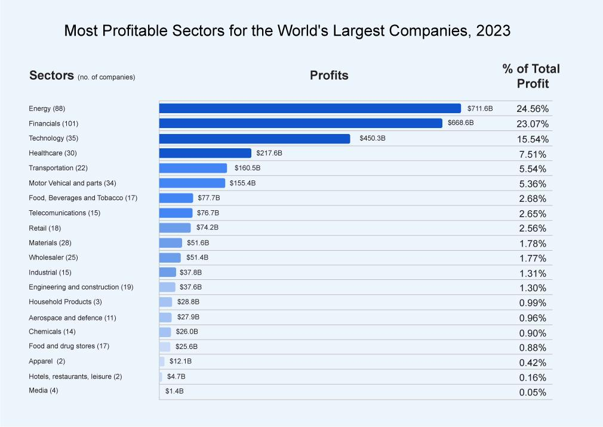

## Table of Contents

## What are the criteria for defining a company as profitable?

A company is considered profitable when its total revenue exceeds its total expenses over a specific period, usually a fiscal year. This means that after paying for all the costs involved in running the business, like salaries, rent, and materials, the company still has money left over. This leftover money is called profit, and it's a key indicator of a company's financial health.

Profitability can be measured in different ways, but the most straightforward method is looking at the net profit, which is calculated by subtracting all expenses from total revenue. Another important measure is the profit margin, which shows profit as a percentage of revenue. A higher profit margin indicates a more profitable company. Consistently making a profit is crucial for a company's long-term success and growth.

## How is the profitability of a company measured?

Profitability of a company is measured by looking at how much money the company makes after paying for everything it needs to run its business. This is called net profit. To find net profit, you take the total money the company earns, which is called revenue, and subtract all the costs like salaries, rent, and materials. If the number you get is positive, the company is profitable. If it's negative, the company is losing money.

Another way to measure profitability is by looking at the profit margin. This tells you what percentage of the revenue is profit. For example, if a company makes $100 in revenue and has $80 in expenses, its profit is $20. The profit margin would be 20% because $20 is 20% of $100. A higher profit margin means the company is more profitable. Companies often use these measures to see how well they are doing and to make plans for the future.

## Which industries tend to have the most profitable companies?

Some industries that often have the most profitable companies are technology and healthcare. In the technology industry, companies like Apple and Microsoft make a lot of money because people all over the world use their products and services. They can sell things like computers, phones, and software at high prices, and it doesn't cost them much to make each one. This means they can keep a lot of the money they make as profit.

In the healthcare industry, companies that make medicines and medical devices can be very profitable. It can be expensive to create new drugs or devices, but once they are made, companies can sell them for a lot of money. Also, people need healthcare no matter what, so there is always a demand for these products. This steady demand helps these companies make big profits over time.

## What are the top 10 most profitable companies in the world?

The top 10 most profitable companies in the world often include big names in technology, finance, and energy. Companies like Apple, Microsoft, and Alphabet (Google's parent company) make a lot of money from selling products like phones, computers, and advertising. They can keep a big part of what they earn as profit because it doesn't cost them much to make each product or service. Banks like JPMorgan Chase and Bank of America also make it to the list because they earn money from interest on loans and fees for their services. These companies are good at managing money and keeping their costs low.

Energy companies like Saudi Aramco and ExxonMobil are also among the most profitable. They make money by selling oil and gas, which people and businesses need for energy. Even though it can be expensive to find and get oil out of the ground, once they start selling it, they can make a lot of profit. Other companies like Berkshire Hathaway, which invests in many different businesses, and Samsung, which makes electronics and appliances, also make the list because they are good at making money from a lot of different things. These companies show that being profitable can come from different kinds of businesses, as long as they are good at what they do and manage their money well.

## How do the profits of these companies compare year-over-year?

The profits of the top 10 most profitable companies can change a lot from year to year. For example, tech companies like Apple and Microsoft often see their profits go up because more people are buying their products and using their services. But if there's a big change in the economy or if they have to spend more money on new projects, their profits might go down. Banks like JPMorgan Chase and Bank of America can also see their profits change a lot. If interest rates go up, they can make more money from loans, but if there's a financial crisis, their profits can drop quickly.

Energy companies like Saudi Aramco and ExxonMobil have profits that can swing a lot too. When oil prices are high, they make a lot of money, but if oil prices drop, their profits can fall a lot. Companies like Berkshire Hathaway, which invests in many different businesses, might see their profits go up and down depending on how well their investments are doing. Samsung, which makes electronics and appliances, can also see changes in profits based on how much people are buying their products and how much it costs to make them. Overall, the profits of these top companies can change a lot from year to year because of many different reasons.

## What factors contribute to the high profitability of these companies?

The high profitability of these companies comes from a few main things. First, many of them, like Apple and Microsoft, sell products and services that a lot of people want. They can make a lot of money because it doesn't cost them much to make each phone, computer, or piece of software. Banks like JPMorgan Chase and Bank of America make money from interest on loans and fees, and they are good at managing money to keep their costs low. Energy companies like Saudi Aramco and ExxonMobil can make big profits when oil prices are high because people always need energy.

Another reason these companies are so profitable is that they are good at finding new ways to make money. For example, Alphabet (Google's parent company) makes a lot of money from advertising, and they keep finding new ways to show ads to people. Berkshire Hathaway, which invests in many different businesses, can make money from a lot of different places. Samsung makes electronics and appliances, and they are always coming up with new products that people want to buy. These companies are also good at managing their money and keeping their costs down, which helps them keep more of what they earn as profit.

## How do global economic conditions affect the profitability of these companies?

Global economic conditions can really change how much money these big companies make. When the economy is doing well, people have more money to spend on things like new phones from Apple or Microsoft, or to take out loans from banks like JPMorgan Chase. This means these companies can make more profit. But if the economy is not doing well, people might not want to spend as much money. This can hurt the profits of companies like Samsung, which makes electronics, or ExxonMobil, which sells oil. If oil prices drop because of a global economic slowdown, ExxonMobil's profits can go down a lot.

Also, things like interest rates and currency values can affect these companies. For banks, if interest rates go up, they can make more money from loans, but if rates go down, their profits might drop. For companies like Apple and Microsoft that sell products all over the world, if the value of the dollar changes, it can make their products more or less expensive in other countries. This can affect how much they sell and how much profit they make. Overall, global economic conditions play a big role in how much money these top companies can make.

## What are the business strategies employed by these companies to maintain high profits?

These companies use smart strategies to keep making a lot of money. For example, tech companies like Apple and Microsoft always work on making new and better products that people want to buy. They also spend a lot of money on advertising to make sure everyone knows about their products. Banks like JPMorgan Chase and Bank of America focus on giving loans and other services that people need, and they try to keep their costs low so they can keep more of the money they make. Energy companies like Saudi Aramco and ExxonMobil look for new ways to find and sell oil and gas, and they try to do it in a way that costs them less money.

Another important strategy is to keep growing their business. Companies like Alphabet (Google's parent company) find new ways to make money from advertising and other services. Berkshire Hathaway, which invests in many different businesses, looks for new places to put their money to make even more profit. Samsung keeps coming up with new electronics and appliances that people want to buy. All these companies also try to manage their money well, so they can keep their costs down and their profits high. By always looking for new ways to make money and keeping their costs under control, these companies can stay very profitable.

## How do these companies manage their finances to maximize profitability?

These companies manage their finances carefully to make sure they keep as much profit as possible. They do this by keeping a close eye on their costs and trying to make them as low as they can. For example, tech companies like Apple and Microsoft work hard to make their products at a low cost, so they can sell them for a higher price and keep more of the money as profit. Banks like JPMorgan Chase and Bank of America try to manage their money well by keeping their expenses down and making sure they earn enough from loans and fees to cover their costs and still make a profit. Energy companies like Saudi Aramco and ExxonMobil look for ways to find and sell oil and gas more cheaply, so they can make more money when they sell it.

Another way these companies manage their finances is by investing wisely. Companies like Berkshire Hathaway, which owns many different businesses, look for good places to put their money to make even more profit. They might buy other companies or invest in stocks and bonds. Companies like Alphabet (Google's parent company) and Samsung also invest in new projects and technologies that they think will make them more money in the future. By being smart about where they spend their money and keeping their costs low, these companies can keep their profits high and continue to grow.

## What role does innovation play in the sustained profitability of these companies?

Innovation is really important for these big companies to keep making a lot of money. They always try to come up with new products and services that people want to buy. For example, Apple and Microsoft keep making new phones, computers, and software that are better than the old ones. This makes people want to buy them, even if they already have an old version. Google, part of Alphabet, keeps finding new ways to show ads to people, which helps them make more money from advertising. By always innovating, these companies can stay ahead of other companies and keep their profits high.

Innovation also helps these companies save money and make their products cheaper to make. For example, energy companies like ExxonMobil and Saudi Aramco look for new ways to find and sell oil and gas more cheaply. This means they can make more money when they sell it. Banks like JPMorgan Chase and Bank of America use new technology to do their work faster and cheaper, which helps them keep their costs down. Companies like Berkshire Hathaway and Samsung invest in new technologies and ideas that they think will make them more money in the future. By being innovative, these companies can keep their costs low and their profits high, which helps them stay successful over time.

## How do regulatory environments in different countries impact the profitability of these global companies?

The rules and laws in different countries can really change how much money big companies like Apple, Microsoft, and ExxonMobil make. Some countries have strict rules about how businesses can operate, which can make it harder for these companies to make a profit. For example, if a country has high taxes on profits or strict rules about how products can be made or sold, it can cost these companies more money to do business there. This means they might make less profit in those countries. On the other hand, countries with fewer rules and lower taxes can make it easier for these companies to make more money.

These companies have to follow different rules in each country they work in, which can be tricky. For example, banks like JPMorgan Chase and Bank of America have to deal with different financial regulations in each country, which can affect how much money they can make from loans and other services. Tech companies like Alphabet (Google's parent company) have to follow different rules about data privacy and advertising in different places, which can affect how they make money from ads. By understanding and following these rules, these companies can try to make as much profit as possible, even though it can be hard to manage all the different regulations.

## What future trends are likely to influence the profitability of these companies?

In the future, technology will keep changing how these big companies make money. For example, more people using the internet and new technologies like [artificial intelligence](/wiki/ai-artificial-intelligence) (AI) and virtual reality (VR) could help companies like Apple and Microsoft make new products that people want to buy. These new technologies can also help companies like Alphabet (Google's parent company) find new ways to show ads and make more money from them. But these technologies can also make it harder for these companies to make money if they don't keep up with the changes. They need to keep innovating to stay ahead and keep their profits high.

Another big trend is how people are thinking more about the environment and wanting companies to be more sustainable. This can affect companies like ExxonMobil and Saudi Aramco, which sell oil and gas. If more people start using electric cars and renewable energy, these companies might make less money from oil. But if they can find new ways to make energy that is good for the environment, they could still make a lot of profit. Banks like JPMorgan Chase and Bank of America might also need to change how they do business to help with things like green loans, which can affect their profits. Overall, these trends mean these companies need to keep changing and adapting to stay profitable in the future.

## References & Further Reading

[1]: Bergstra, J., Bardenet, R., Bengio, Y., & Kégl, B. (2011). ["Algorithms for Hyper-Parameter Optimization."](https://papers.nips.cc/paper/4443-algorithms-for-hyper-parameter-optimization) Advances in Neural Information Processing Systems 24.

[2]: ["Advances in Financial Machine Learning"](https://www.amazon.com/Advances-Financial-Machine-Learning-Marcos/dp/1119482089) by Marcos Lopez de Prado

[3]: ["Evidence-Based Technical Analysis: Applying the Scientific Method and Statistical Inference to Trading Signals"](https://www.amazon.com/Evidence-Based-Technical-Analysis-Scientific-Statistical/dp/0470008741) by David Aronson

[4]: ["Machine Learning for Algorithmic Trading"](https://github.com/stefan-jansen/machine-learning-for-trading) by Stefan Jansen

[5]: ["Quantitative Trading: How to Build Your Own Algorithmic Trading Business"](https://www.amazon.com/Quantitative-Trading-Build-Algorithmic-Business/dp/1119800064) by Ernest P. Chan