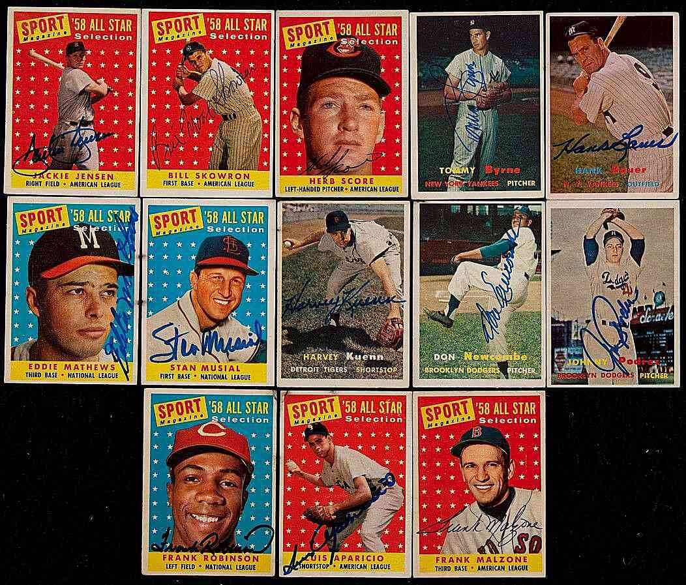

The world of collectibles is vast and varied, encompassing items from stamps and coins to rare autographs and celebrity signatures. Autographs hold a special place in this landscape, serving as tangible connections to historical figures and present-day celebrities. They capture moments in time, embodying personal interactions and significant historical events.

Recently, the autograph market has experienced a notable surge in interest among collectors and investors. This growing enthusiasm is fueled by the unique blend of historical significance and personal attachment that autographs offer. Autographs not only preserve the legacy of noteworthy individuals but also provide collectors with a piece of history that is both personal and significant.



This article examines the allure of rare and valuable autographs, which continue to attract fervent interest and competitive bidding among enthusiasts. Furthermore, it discusses the rising trend of algorithmic trading within the autograph market. As technology increasingly influences various investment sectors, algorithmic trading introduces a new dynamic to the world of collectibles. It enables collectors and investors to make data-driven decisions by analyzing market trends and predicting value fluctuations, thereby enhancing the potential for investment in rare autographs.

Understanding the factors contributing to the desirability and value of autographs is crucial for prospective collectors and investors. By leveraging technology, particularly algorithmic trading, participants in this market can unlock opportunities previously inaccessible to traditional collectors. This interplay between historical reverence and modern technological advancements is shaping the future of autograph collecting, offering enriching experiences to both seasoned collectors and newcomers alike.

## Table of Contents

## The Allure of Rare Autographs

Autographs from well-known personalities such as presidents, celebrities, and athletes are highly attractive to collectors, often serving as tangible mementos of influential figures. One of the primary factors contributing to their allure is rarity. The scarcity of an autograph directly impacts its value; fewer known signatures often correlate with higher market prices. For instance, William Shakespeare's autograph is notoriously scarce, with only a handful of authenticated examples in existence. This rarity enhances its appeal and results in significant demand, leading these autographs to be highly sought after in auctions.

Beyond rarity, the sentimental and historical significance tied to these autographs further amplifies their desirability. They provide more than just a signature; they offer a glimpse into the life and times of iconic figures, serving as pieces of history that can be passed down through generations. This historical context adds a layer of depth and meaning, making them not only collectibles but also symbols of cultural heritage.

This combination of rarity, historical context, and the emotional connection to the signatory often incites fierce competition among collectors, sparking bidding wars at auctions. Collectors are not merely purchasing a name on paper; they are acquiring a fragment of history, a direct link to the past, which significantly boosts both the allure and monetary value of rare autographs.

## Factors Influencing Autograph Value

Several key factors determine the value of an autograph, crucial for collectors and investors looking to assess and obtain autographs of significant worth. One of the primary considerations is the condition of the autograph. Autographs that are clear and legible generally command higher values than those that are faded, smudged, or difficult to read. This is particularly true when considering the ease of authentication, as clear signatures can be more readily verified by experts as genuine artifacts of the signer.

Rarity is another essential [factor](/wiki/factor-investing) impacting an autograph's value. The fewer the number of available authentic signatures, the more desirable they become to collectors. Take, for example, historical figures or celebrities who penned only a limited number of autographs during their lifetime–these signatures are often considered more valuable. For mathematicians interested in evaluating rarity, a simple model can be employed by assessing the known quantity of existing autographs ($Q_a$) and the demand ($D$). A basic supply-demand value model might be expressed as:

$$
V = \frac{D}{Q_a}
$$

where $V$ is the potential market value, subject to adjustments based on other quality indicators.

Additionally, the context or medium on which an autograph is signed significantly contributes to its ultimate worth. Autographs on personal or unique items such as movie scripts, garments, or sports memorabilia from impactful moments in cultural history are particularly sought after, as they represent not just the person’s signature but also a piece of their life or career. This uniqueness adds intrinsic value beyond that of a mere signature on paper.

The fame and enduring legacy of the signer play a significant role in determining autograph value. Signers who have made lasting impacts in history, culture, or entertainment often have autographs that maintain or appreciate over time. Collectors might evaluate the market trends associated with a signer’s cultural relevance or historical significance to forecast potential value. Python, for instance, could be utilized to analyze historical market data or trends to predict future autograph values with [machine learning](/wiki/machine-learning) models, leveraging libraries like scikit-learn for market prediction.

In summary, autograph valuations are influenced by their condition, rarity, the specific item signed, and the signer’s continuous cultural and historical significance. Understanding these factors enables better decision-making in acquiring and investing in valuable autographs.

## Most Valuable Autographed Items

Throughout history, certain autographed items have achieved extraordinary prices at auctions, primarily due to their rarity and historical significance. One of the most notable examples is George Washington's copy of the U.S. Constitution. This document, bearing Washington's signature, is invaluable not just for its connection to the first President of the United States but also for its role in American history. The fact that Washington handled this document adds a tangible connection to a pivotal point in history, making it immensely desirable among collectors and historians alike.

Similarly, autographed letters and documents by Albert Einstein have fetched high prices. Einstein's letters, often containing discussions about his groundbreaking theories in physics, provide a direct insight into the mind of one of the most influential scientists in history. For instance, a letter in which Einstein elaborated on his famous equation, $E=mc^2$, might be particularly valued given its profound impact on modern science. The rarity of such documents, coupled with their scientific importance, significantly elevates their worth.

Understanding why these items are so highly valued can provide insights into the autograph market. The scarcity of a signature, the prominence of the individual, and the context surrounding the document are key factors. For example, a document associated with a historic event or a personal item directly linked to the figure increases its significance. Collectors and investors should consider these elements when evaluating the potential value of autographed items. This approach not only aids in appreciating the intrinsic worth of historical documents but also helps predict future valuation trends in the autograph market.

## Algorithmic Trading and Autograph Investment

Algorithmic trading, commonly known as algo trading, is a transformative approach that leverages computational power to facilitate informed decision-making in the autograph market. As the collectible market grows more complex, algorithms provide insightful analyses by processing vast amounts of data to discern market patterns and predict future trends in autograph valuation. This technology-driven method enhances the ability for collectors and investors to buy and sell autographs strategically.

The core of algo trading lies in its capability to analyze historical sales data, monitor current market conditions, and simulate potential scenarios, all in real-time. By applying statistical models and machine learning techniques, algorithms identify undervalued autographs or predict the optimal timing for a sale. For instance, time series analysis models like ARIMA (AutoRegressive Integrated Moving Average) can be employed to forecast autograph prices based on historical data. Python can facilitate these analyses with libraries such as `pandas` and `statsmodels`. An example of using ARIMA for price prediction might look like this:

```python
import pandas as pd
from statsmodels.tsa.arima_model import ARIMA

# Load historical price data
data = pd.read_csv('autograph_prices.csv')
model = ARIMA(data['Price'], order=(5,1,0))
model_fit = model.fit(disp=0)
forecast = model_fit.forecast(steps=3)[0]
print(forecast)
```

Algo trading also allows investors to diversify their portfolios with autographed items that are deemed undervalued or expected to appreciate. By considering variables such as signer notoriety, market demand, and autograph authenticity, algorithms suggest acquisitions that might not be immediately obvious to the human eye. This calculated diversification can mitigate risks associated with the highly unpredictable nature of the collectibles market.

Moreover, algo trading democratizes access to the autograph market for both novice and seasoned collectors. With the aid of technology, even beginners can make investment decisions with a heightened level of sophistication. Collectors can subscribe to services that offer algorithm-based insights, enabling them to compete alongside more experienced investors without requiring extensive expertise.

The integration of algo trading in autograph investment indicates a shift towards a more analytical and systematic approach. As algorithms continue to evolve, they hold the promise of further enhancing market efficiency and offering new opportunities to capitalize on the dynamic world of autograph collecting.

## How to Buy and Sell Autographs

When investing in autographs, ensuring authenticity is paramount, as the presence of counterfeit items in the market can pose significant risks. Collaborating with reputable dealers and auction houses is a fundamental step in this process. These entities often have established processes for verifying the legitimacy of autographs, utilizing experts who can discern subtle characteristics indicative of genuine signatures.

Professional appraisers play a crucial role in establishing the value of an autograph. They evaluate factors such as the item's provenance, the condition of the signature, and its historical significance. Authentication services, such as those provided by companies like PSA/DNA or JSA, offer peace of mind by providing certificates of authenticity, detailing the signature's assessment process. This not only helps in ensuring authenticity but also adds value, making the autograph more appealing to prospective buyers.

The internet has expanded the marketplace for buying and selling autographs, with platforms such as eBay and specialized marketplaces like Heritage Auctions providing collectors with access to a vast selection. These platforms facilitate transactions by offering a range of autographed items, from historic documents to memorabilia from beloved celebrities.

Understanding market trends is critical to maximizing profitability when selling autographs. Analyzing data on past sales and current demand can help sellers price their items effectively. Algorithmic trading tools have emerged as valuable resources in this regard. These tools can process large volumes of data to forecast price trends, identify peak selling times, and suggest optimal pricing strategies. For instance, a Python script using libraries like pandas and matplotlib could be designed to analyze historical sales data from eBay, offering insights into the best times to list certain types of autographs.

```python
import pandas as pd
import matplotlib.pyplot as plt

# Sample data loading
data = pd.read_csv('historical_sales_data.csv')

# Analyzing sales trends
monthly_sales = data.groupby('month')['sale_price'].mean()

# Plotting sales trends
plt.plot(monthly_sales.index, monthly_sales.values)
plt.title('Average Monthly Sales Price')
plt.xlabel('Month')
plt.ylabel('Average Sale Price')
plt.show()
```

Combining these insights with traditional methods of appraisal and authentication can provide both novice and seasoned collectors with a comprehensive strategy for buying and selling autographs effectively. Whether the goal is to build a personal collection or secure a lucrative return on investment, leveraging technology alongside expert advice can enhance success in the autograph market.

## Conclusion

The autograph market effectively bridges the gap between a profound appreciation for history and the allure of contemporary culture, establishing itself as a dynamic domain for collectors. As artifacts of significant cultural and historical importance, autographs provide an emotional and intellectual connection to figures from the past and the present. This duality in charm is amplified by the evolution of collection methodologies, as traditional practices are augmented by [algorithmic trading](/wiki/algorithmic-trading) strategies. Algorithmic trading introduces an innovative aspect to the acquisition and sale of autographs, allowing collectors to utilize data-driven insights to better navigate the market.

As interest in autographs of rare and notable personalities increases, a strategic approach is advantageous for both collectors and investors. Employing algorithms to analyze trends and make predictions, traders can potentially enhance the profitability of their collections. This fusion between the vintage appeal of autographs and modern technology not only optimizes investment outcomes but also deepens the engagement of enthusiasts with their collections.

Navigating the autograph market—whether for personal enrichment or investment purposes—demands a thorough understanding of the market's dynamics, patience in the face of market fluctuations, and an openness to leveraging technological advancements. The application of knowledge, alongside algorithmic tools, facilitates a more informed decision-making process, thereby enhancing the experience and outcomes for autograph aficionados and investors alike.

## References & Further Reading

[1]: Nathan Raab (2016). ["The Hunt for History: On the Trail of the World's Lost Treasures—from the Letters of Lincoln, Churchill, and Einstein to the Secret Recordings Onboard JFK's Air Force One"](https://www.amazon.com/Hunt-History-Treasures_from-Churchill-Recordings/dp/1501198904)

[2]: Antonio Murgia (2020). ["Autographs: A Collector's Guide"](https://www.celebremagazine.world/culture/artist/the-dream-realized-by-the-undisputed-grande-maestro-antonio-murgia/)

[3]: Selby Kiffer and Cathy Elkies (2005). ["100 Greatest Autographs"](https://www.sothebys.com/en/about/team/selby-kiffer)

[4]: Wilfrid Michael Voynich (2012). ["Rare Books and Invisible Libraries"](https://en.wikipedia.org/wiki/Wilfrid_Voynich)

[5]: Marcos Lopez de Prado (2018). ["Advances in Financial Machine Learning"](https://www.amazon.com/Advances-Financial-Machine-Learning-Marcos/dp/1119482089)