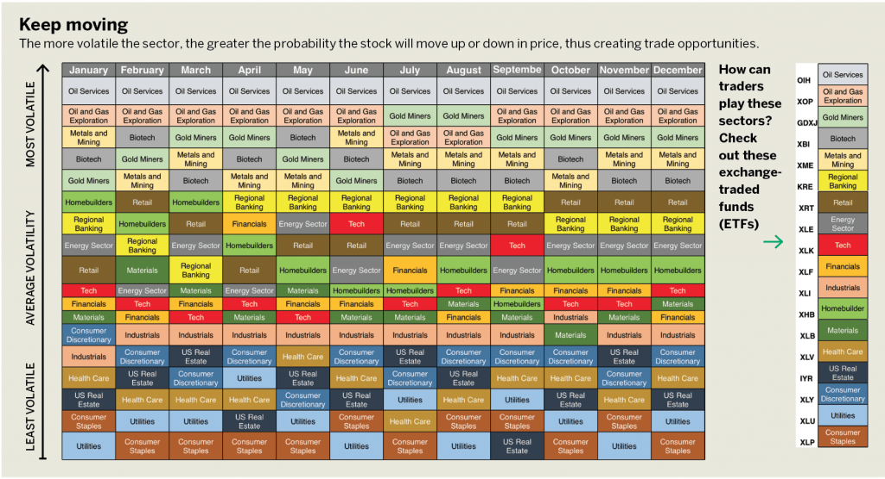

## Table of Contents

## What is economic volatility?

Economic volatility refers to the ups and downs in an economy over time. It's like the economy going through a roller coaster ride, with periods of growth followed by periods of slowdown or even decline. This can happen because of many reasons, like changes in interest rates, big events around the world, or even natural disasters. When the economy is volatile, it can be hard for businesses and people to plan for the future because they don't know what's coming next.

Volatility can affect things like stock prices, the value of money, and how much people spend or save. For example, if people think the economy might get worse, they might spend less money and save more, which can slow down the economy even more. On the other hand, if people feel confident about the future, they might spend more, which can help the economy grow. Understanding economic volatility is important for making good decisions about money, whether you're running a business or just managing your own finances.

## How is volatility measured in economic sectors?

Volatility in economic sectors is often measured by looking at the changes in important numbers over time, like stock prices, sales, or how much the economy is growing. For stocks, a common way to measure volatility is by calculating the standard deviation of the stock's returns. This tells us how much the stock's price moves up and down. If the standard deviation is high, the stock is more volatile, meaning its price changes a lot. For the economy as a whole, economists might look at the ups and downs in the Gross Domestic Product (GDP) to see how stable or volatile the economy is.

Another way to measure [volatility](/wiki/volatility-trading-strategies) is by using something called the volatility index, or VIX, which is often called the "fear index." The VIX measures how much people expect the stock market to move around in the future. If the VIX is high, it means people think the market will be more volatile. In different sectors, like housing or manufacturing, economists might look at specific data, like housing starts or factory orders, to see how much these numbers go up and down. By keeping an eye on these measures, people can get a better idea of how stable or unpredictable different parts of the economy are.

## Which sectors are generally considered volatile and why?

Some sectors are known for being more volatile than others. Technology and biotech are two examples. These sectors can have big ups and downs because they often depend on new ideas and inventions. If a company comes up with a new product that everyone wants, its stock price can shoot up really fast. But if the product fails or if there are problems, the stock price can drop just as quickly. Also, these sectors can be affected a lot by what's happening in the world, like new laws or big events.

Another sector that can be volatile is energy, especially oil and gas. The prices of oil and gas can change a lot because of things like politics, natural disasters, or decisions made by countries that produce a lot of oil. When the price of oil goes up or down a lot, it can have a big effect on the companies in this sector. This can make their stocks more unpredictable. People who invest in these sectors need to be ready for a lot of ups and downs.

## What are the historical trends in volatility for different economic sectors?

Over the years, different economic sectors have shown different patterns of volatility. The technology sector, for example, has often been very up and down. In the late 1990s, there was a big boom in tech stocks, but then in the early 2000s, many of these stocks crashed. This shows how quickly things can change in this sector. More recently, tech companies have seen big swings in their stock prices because of things like new products, changes in the law, or big events around the world. The biotech sector is similar, with big jumps in stock prices when a new drug gets approved, but also big drops if a drug fails.

The energy sector, especially oil and gas, has also had a lot of ups and downs. In the 1970s, oil prices went way up because of political problems in the Middle East. Then in the 1980s, prices fell a lot. More recently, oil prices have been affected by things like new ways of getting oil out of the ground, decisions by big oil-producing countries, and even natural disasters. These changes can make the energy sector very unpredictable. On the other hand, sectors like utilities and consumer staples, which include things like electricity and food, tend to be less volatile. People always need these things, so the demand stays pretty steady, which makes these sectors more stable over time.

## How do global events impact the volatility of economic sectors?

Global events can really shake up different economic sectors by causing big changes in how much people buy, how much things cost, and how companies do business. For example, if there's a war or a big political change in a country that makes a lot of oil, it can make oil prices go up or down a lot. This can make the energy sector very unpredictable. Also, if there's a natural disaster like a hurricane or an earthquake, it can mess up supply chains and make it hard for companies to get the things they need to make their products. This can lead to big swings in stock prices and how much money companies make.

Another way global events can affect economic sectors is by changing what people think about the future. If there's a big event like a global health crisis, people might start to worry and spend less money. This can hit sectors like travel and entertainment really hard because people don't go out as much. On the other hand, some sectors might do better during these times. For example, during a health crisis, people might buy more medicine and food, which can help the healthcare and consumer staples sectors. So, global events can make some sectors more volatile while making others more stable, depending on how people react and what they need.

## What role do technological advancements play in sector volatility?

Technological advancements can make some sectors more volatile because they can change things really fast. When a new technology comes out, it can make some companies do really well and their stock prices go up a lot. But it can also make other companies struggle if they can't keep up with the new technology. For example, when smartphones became popular, companies that made them did really well, but companies that made old-fashioned phones had a hard time. This shows how new technology can cause big ups and downs in a sector.

Also, technology can change how people buy things and how companies do business. When the internet became big, it made it easier for people to shop online, which was good for companies like Amazon but not so good for traditional stores. This kind of change can make a sector more unpredictable because it's hard to know how people will react to new technology. So, while technology can help some companies grow a lot, it can also make things more uncertain for everyone in the sector.

## How does government policy affect the volatility of economic sectors?

Government policies can really change how stable or unpredictable different economic sectors are. When the government makes new rules or changes taxes, it can make some companies do better and others do worse. For example, if the government gives tax breaks to companies that use clean energy, it can make the renewable energy sector grow a lot. But it might make the oil and gas sector more uncertain because people might start using less oil. Also, if the government decides to spend a lot of money on things like roads or schools, it can help the construction and education sectors, but it might make other sectors worry about where the money is coming from.

Another way government policies can affect volatility is by changing how much people trust the economy. If the government does things that make people feel more sure about the future, like keeping interest rates low or helping people find jobs, it can make the economy more stable. But if the government makes sudden changes or if there's a lot of arguing about what to do, it can make people nervous and cause more ups and downs in the economy. So, government policies can either help calm things down or make them more unpredictable, depending on what the government does and how people react to it.

## Can you provide examples of economic sectors that experienced high volatility in the past decade?

In the past ten years, the technology sector has seen a lot of ups and downs. Companies like Tesla and Amazon have had their stock prices go up and down a lot because of new products, changes in the law, and big events around the world. For example, when Tesla announced new electric cars or when Amazon started new services like Amazon Web Services, their stock prices jumped. But when there were worries about the economy or problems with their products, their stock prices could drop just as fast. This shows how new technology can make things very unpredictable in this sector.

The energy sector, especially oil and gas, has also been very volatile over the last decade. Oil prices went up a lot when there were problems in oil-producing countries or when natural disasters hit. But then, when new ways of getting oil out of the ground were found, like fracking, oil prices dropped a lot. This made it hard for companies in the energy sector to plan because they didn't know what oil prices would do next. So, the energy sector had a lot of ups and downs because of these big changes.

Another sector that saw a lot of volatility in the past decade is healthcare, especially biotech. When a new drug got approved by the government, the stock price of the company making it could go way up. But if the drug didn't work or had problems, the stock price could fall just as quickly. Also, big events like the global health crisis made people buy more medicine, which helped some companies in the healthcare sector but made others struggle. This shows how the healthcare sector can be very unpredictable because of new drugs and big events.

## What strategies can investors use to mitigate risks associated with volatile sectors?

Investors can use a few simple strategies to handle the ups and downs in volatile sectors. One good way is to spread out their money, or diversify. Instead of putting all their money into one company or sector, they can invest in different companies and sectors. This way, if one sector goes down, the others might still do okay, which can help balance things out. Another strategy is to keep an eye on the news and learn about the companies they're investing in. By knowing what's going on, investors can make smarter choices about when to buy or sell.

Another thing investors can do is use something called stop-loss orders. This means setting a point where they will automatically sell a stock if it drops to a certain price. This can help limit how much money they might lose if the stock price goes down a lot. Also, some investors choose to invest in companies that pay dividends, which are regular payments to shareholders. Even if the stock price goes up and down, the dividends can give investors a steady income, which can make things feel less risky. By using these strategies, investors can better handle the ups and downs in volatile sectors.

## How do volatile sectors influence overall economic stability?

Volatile sectors can shake up the whole economy because they can change how much people spend and how businesses do. When a big sector like technology or energy goes through a lot of ups and downs, it can make other parts of the economy feel it too. For example, if oil prices go crazy, it can make everything from gas to food more expensive. This can make people spend less money on other things, which can slow down the economy. Also, if a lot of people have their money in stocks from these volatile sectors, big drops in stock prices can make people feel less sure about the future, which can make them spend even less.

But it's not all bad. Sometimes, the ups and downs in volatile sectors can help the economy grow. When a new technology comes out and does really well, it can create a lot of new jobs and make people feel more sure about the future. This can make them spend more money, which can help the economy grow. So, while volatile sectors can make things unpredictable, they can also bring new opportunities and help the economy in the long run. It's all about finding a balance and being ready for the ups and downs.

## What are the long-term forecasts for volatility in key economic sectors?

Looking ahead, the technology sector is expected to keep being pretty up and down. This is because new inventions and changes in what people want can happen really fast. As more and more things get connected to the internet and new technologies like [artificial intelligence](/wiki/ai-artificial-intelligence) and virtual reality grow, companies in this sector might see their stock prices jump around a lot. Big events around the world, like new laws or big changes in the economy, can also make things more unpredictable. So, people who invest in tech need to be ready for a lot of ups and downs.

The energy sector, especially oil and gas, is also likely to stay volatile. This is because oil prices can change a lot because of things like politics, new ways of getting oil out of the ground, and even natural disasters. As the world tries to use less oil and more clean energy, this can make things even more unpredictable for companies in the energy sector. But it can also create new opportunities for companies that work on renewable energy. So, while the energy sector might keep having big ups and downs, it can also help the economy grow in new ways.

In the healthcare sector, especially biotech, volatility is expected to continue as well. New drugs and treatments can make a big difference in how well companies do. When a new drug gets approved, it can make the company's stock price go way up. But if the drug doesn't work or has problems, the stock price can drop just as fast. Big events like global health crises can also make things more unpredictable. But these events can also create new chances for companies to come up with new solutions. So, the healthcare sector might keep being up and down, but it can also bring new opportunities for growth.

## How can predictive analytics be used to anticipate volatility in economic sectors?

Predictive analytics can help people guess how much a sector might go up and down by looking at a lot of data from the past and seeing patterns. For example, if a company wants to know how its stock price might change, it can use computers to look at things like how the economy is doing, what people are buying, and even what's happening around the world. By finding patterns in this data, the company can make better guesses about what might happen next. This can help them get ready for big changes and make smarter choices about where to put their money.

Another way predictive analytics can help is by looking at what people are saying on social media and in the news. If a lot of people are talking about a new product or a big event, it can give clues about how a sector might do in the future. For example, if a lot of people are excited about a new phone coming out, it might mean the tech sector will do well. By keeping an eye on these things, companies can get a heads-up about what might make their sector more unpredictable. This can help them plan better and maybe even find new chances to grow.

## How can we optimize algo trading strategies for volatile markets?

Adaptability and robust risk management are crucial components of successful [algorithmic trading](/wiki/algorithmic-trading) strategies in volatile markets. Volatile markets present both risks and opportunities, necessitating approaches that can respond dynamically to rapid changes in market conditions. Algorithmic trading strategies can be optimized for such environments by employing volatility-based indicators and adopting strategies such as [trend following](/wiki/trend-following) and mean reversion.

Volatility-based indicators are essential tools in gauging the level of price fluctuations within a given period. Popular indicators include the Average True Range (ATR), Bollinger Bands, and the Volatility Index (VIX). The ATR measures market volatility by calculating the average range between price highs and lows over a specified period. Traders can use the ATR to set stop-loss levels that adjust dynamically to changing market conditions. Bollinger Bands, on the other hand, signify price volatility by depicting a band around the moving average, where the width of the band varies with volatility. The VIX, often referred to as the "fear index," provides a measure of market expectation of near-term volatility based on S&P 500 index options. Using these indicators, traders can adapt their algorithms to enter or [exit](/wiki/exit-strategy) positions in response to evolving conditions.

Trend following is a strategy capitalizing on the [momentum](/wiki/momentum) of price movements, operating on the premise that prices will continue to move in the same direction. Algorithms employ technical indicators such as moving averages and relative strength index (RSI) to identify and capitalize on upward or downward trends. For example, a simple moving average crossover strategy might involve buying a security when a short-term moving average crosses above a long-term moving average, and selling when the opposite occurs.

Mean reversion strategies are based on the statistical tendency of asset prices to revert to their historical mean. This approach assumes that extreme price movements will eventually normalize. Algorithms can employ statistical tests, such as the Z-score, to determine when an asset is overbought or oversold relative to its historical mean. The Z-score is calculated as:

$$
Z = \frac{X - \mu}{\sigma}
$$

where $X$ is the current price, $\mu$ is the mean price over a specified period, and $\sigma$ is the standard deviation. When the Z-score exceeds a predetermined threshold, the algorithm may trigger buy or sell orders to capitalize on the anticipated price reversion.

Implementing these strategies requires robust risk management practices to mitigate potential losses due to erroneous signals or unexpected market events. Key techniques include diversification, position sizing, and utilization of stop-loss orders. Diversification involves spreading investments across various assets to reduce exposure to any single asset's risk. Position sizing ensures that the magnitude of each trade aligns with the trader's overall risk tolerance. Stop-loss orders automatically close positions when prices reach a certain threshold, limiting potential losses.

By integrating adaptability and risk management into their trading algorithms, traders can enhance the effectiveness and resilience of their strategies in volatile markets, allowing them to capitalize on opportunities while mitigating risks.

## References & Further Reading

[1]: Bergstra, J., Bardenet, R., Bengio, Y., & Kégl, B. (2011). ["Algorithms for Hyper-Parameter Optimization."](https://dl.acm.org/doi/10.5555/2986459.2986743) Advances in Neural Information Processing Systems 24.

[2]: ["Advances in Financial Machine Learning"](https://www.amazon.com/Advances-Financial-Machine-Learning-Marcos/dp/1119482089) by Marcos Lopez de Prado

[3]: ["Evidence-Based Technical Analysis: Applying the Scientific Method and Statistical Inference to Trading Signals"](https://www.amazon.com/Evidence-Based-Technical-Analysis-Scientific-Statistical/dp/0470008741) by David Aronson

[4]: ["Machine Learning for Algorithmic Trading"](https://github.com/stefan-jansen/machine-learning-for-trading) by Stefan Jansen

[5]: ["Quantitative Trading: How to Build Your Own Algorithmic Trading Business"](https://github.com/LucindaYa/quant-resources/blob/master/Quantitative%20Trading%20How%20to%20Build%20Your%20Own%20Algorithmic%20Trading%20Business.pdf) by Ernest P. Chan