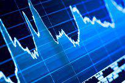

In today's rapidly changing financial landscape, economic volatility is a significant concern for investors and businesses alike. Market fluctuations can create both opportunities and challenges, particularly in volatile sectors. Economic volatility, defined as the degree of variation in economic variables such as asset prices, interest rates, and inflation over time, presents a complex dynamic that market participants must navigate. These fluctuations are often unpredictable, driven by a multitude of factors including geopolitical events, policy changes, and unexpected shifts in economic indicators.

The implications of economic volatility are profound. High volatility can lead to larger price swings, which may impact investment strategies, risk management practices, and economic planning. However, for astute traders and businesses, such conditions also present unique opportunities to capitalize on price movements, potentially leading to increased profitability.



This article explores the intricacies of economic volatility, highlights the most volatile sectors, and examines how algorithmic trading has become a vital tool in navigating these erratic market conditions. Algorithmic trading, characterized by the use of complex mathematical models and high-speed computer systems, enables traders to make rapid decisions and exploit market inefficiencies, a key advantage in volatile environments.

From understanding what drives market volatility to optimizing trading strategies, this guide provides insights into managing and capitalizing on economic fluctuations. By embracing advanced technologies and strategic approaches, investors and businesses can better position themselves to respond to and profit from the ever-changing financial landscape.

## Table of Contents

## Understanding Economic Volatility

Economic volatility denotes the extent to which economic variables fluctuate over time, manifesting as variations in asset prices, interest rates, and inflation levels. Such volatility is characterized by large swings that significantly impact both investment strategies and economic planning. High economic volatility can lead to increased uncertainty and risk, which can affect decision-making for investors, businesses, and policymakers alike.

Several factors contribute to the occurrence of economic volatility. A primary driver is geopolitical events, which can cause sudden and unpredictable movements in financial markets. For instance, political instability, international conflicts, or trade disputes can disrupt market equilibrium, leading to erratic changes in asset valuations. 

Changes in monetary and fiscal policy also play a crucial role. Central banks influence economic stability through monetary policy decisions, such as altering interest rates or engaging in quantitative easing. Similarly, fiscal policy adjustments, including government spending and taxation strategies, can impact demand and economic performance, thereby contributing to [volatility](/wiki/volatility-trading-strategies).

Unexpected shifts in economic indicators, such as employment figures or GDP growth rates, are another source of volatility. These indicators provide insights into the health of an economy, and unexpected deviations from forecasts can trigger rapid market reactions. For example, a sudden decline in employment rates might signal economic downturns, eliciting responsive actions from investors and driving market volatility.

Mathematically, economic volatility can often be measured through the standard deviation or variance of returns on an asset, providing a quantifiable measure of uncertainty. In more complex analyses, econometric models like GARCH (Generalized Autoregressive Conditional Heteroskedasticity) are employed to forecast and understand volatility patterns in time series data.

Overall, grasping the elements that cause economic volatility aids market participants in devising strategies to mitigate risks and potentially exploit profitable opportunities present in such unpredictable environments.

## Volatile Sectors in the Market

Certain market sectors exhibit higher volatility due to a variety of intrinsic and extrinsic factors. This discussion focuses on eight key sectors: energy, commodities, financial, technology, consumer discretionary, communication services, health care, and utilities. Understanding the drivers of volatility in these sectors can provide insights into market behavior and assist investors in making informed decisions.

**Energy Sector**: The energy sector is characterized by significant volatility driven primarily by fluctuations in oil and gas prices. These fluctuations can result from geopolitical instability, changes in supply and demand dynamics, and regulatory decisions. For instance, OPEC's production targets and international sanctions can substantially alter oil prices, impacting the entire sector.

**Commodities Sector**: Volatility in the commodities sector often stems from changes in supply chain dynamics, weather conditions, and global economic health. Commodities such as metals, agricultural products, and natural resources can experience price swings based on factors like natural disasters or unexpected changes in demand from emerging markets.

**Financial Sector**: The financial sector's volatility is influenced by interest rate changes, monetary policy decisions, and macroeconomic indicators such as GDP growth and employment rates. Financial institutions, including banks and insurance companies, are sensitive to economic cycles and regulatory changes, which can affect their profitability and market stability.

**Technology Sector**: Technological advancements, innovation cycles, and consumer demand drive the volatility in the technology sector. Companies in this sector face rapid changes due to the fast-paced nature of technology development and the constant pressure to innovate. Moreover, regulatory decisions regarding data privacy and international trade can further contribute to the sector's volatility.

**Consumer Discretionary Sector**: This sector is affected by consumer spending patterns, economic cycles, and trends in consumer preferences. Factors such as employment rates and disposable incomes significantly influence the demand for non-essential goods and services. Consequently, during economic downturns, the consumer discretionary sector often experiences heightened volatility.

**Communication Services Sector**: Volatility in communication services can be attributed to technological changes, shifts in consumer behavior, and regulatory environments. The rise of digital platforms and the ongoing convergence of media and telecommunications industries drive constant change in this sector.

**Health Care Sector**: The health care sector's volatility can be linked to regulatory changes, drug approval processes, and shifts in public health policies. Innovation and the introduction of new medical treatments or technologies can lead to significant market adjustments. Additionally, demographic trends, such as aging populations, impact demand for health care services and products.

**Utilities Sector**: Although typically less volatile due to its essential nature, the utilities sector can still experience fluctuations due to regulatory changes, environmental policies, and shifts in energy sourcing. The transition from fossil fuels to renewable energy sources is an ongoing challenge that adds to the sector's complexity.

In conclusion, these sectors illustrate the diverse factors contributing to market volatility. By identifying and understanding these drivers, investors and businesses can better anticipate changes and develop strategies to mitigate risks associated with volatile market conditions.

## What Causes Sector Volatility?

Several factors contribute to fluctuations in sector-specific markets, influencing the overall economic volatility observed in these areas. Key influencers include trader emotions, macroeconomic variables, and significant global events, such as pandemics or wars.

Trader emotions can significantly impact market behavior. Emotional responses can induce abrupt trading actions, as market participants may react impulsively to news or rumors—often without a comprehensive understanding of underlying market dynamics. This behavior is encapsulated in the concept of noise trader risk. Noise traders are characterized by their tendency to make decisions based on sentiment and trends rather than [fundamental analysis](/wiki/fundamental-analysis). Their actions can lead to amplified price swings as they quickly enter or [exit](/wiki/exit-strategy) positions based on perceived [momentum](/wiki/momentum).

Macroeconomic variables also play a crucial role in sector volatility. Changes in interest rates, inflation, and unemployment figures are examples of such variables that can influence investor confidence and decision-making processes. For instance, an unexpected hike in interest rates by a central bank might prompt a sell-off in [interest rate](/wiki/interest-rate-trading-strategies)-sensitive sectors, such as utilities and real estate. Conversely, expansionary monetary policies can lead to asset inflation, particularly in sectors like technology and consumer discretionary.

Global events, including geopolitical tensions, natural disasters, and health crises, can lead to abrupt shifts in market conditions. The COVID-19 pandemic, for example, triggered unprecedented volatility as industries such as travel and hospitality faced severe disruptions, while others, like technology and pharmaceuticals, experienced increased demand and growth. Wars and geopolitical conflicts can similarly influence specific sectors, such as energy, where supply chain disruptions or embargoes directly impact pricing and availability.

Sector-specific volatility, therefore, arises from a complex interplay of these factors, creating a dynamic environment where market participants must navigate with caution and strategic foresight. By recognizing these drivers of volatility, traders and investors can better prepare for and respond to potential opportunities and risks inherent in fluctuating market conditions.

## Algorithmic Trading and Market Fluctuations

Algorithmic trading, or 'algo trading,' employs intricate mathematical algorithms to facilitate high-speed trading decisions, primarily aiming to benefit from market efficiencies that arise during times of volatility. This method of trading leverages technological advancements to perform tasks that exceed human capacity, specifically in terms of speed and frequency of order execution. 

The foundation of [algorithmic trading](/wiki/algorithmic-trading) lies in its ability to process vast amounts of market data in real-time, executing trades based on pre-defined criteria or market signals. This process involves integrating quantitative analysis, statistical models, and sophisticated computer systems to identify short-lived patterns or [arbitrage](/wiki/arbitrage) opportunities that are usually invisible to human traders. The primary advantage of algorithmic trading is the minimization of manual intervention, which significantly reduces trading costs while maximizing potential returns.

Automated systems operating within algorithmic trading platforms can evaluate multiple market conditions simultaneously, reacting instantly to even the slightest inefficiencies. For instance, if stock prices in a particular sector fluctuate due to a macroeconomic announcement, algorithmic programs can immediately execute trades based on the updated data, profiting from the rapid price corrections that often follow such events.

Algorithmic trading strategies often exploit time-based arbitrage opportunities, [volume](/wiki/volume-trading-strategy)-weighted average price (VWAP), and [statistical arbitrage](/wiki/statistical-arbitrage). These strategies benefit from the latency arbitrage and other inefficiencies stemming from millisecond price differences across trading venues. High-frequency trading ([HFT](/wiki/high-frequency-trading-strategies)) represents a specialized form of algorithmic trading that targets these fleeting opportunities, executing a high volume of trades within microsecond intervals.

For implementing algorithmic trading, one might use Python due to its rich ecosystems of libraries like NumPy for numerical computations, pandas for data manipulation, and libraries like [backtrader](/wiki/backtrader) and Zipline for [backtesting](/wiki/backtesting) strategies. A simple example of an algorithmic strategy in Python could involve moving averages:

```python
import numpy as np
import pandas as pd

def moving_average_strategy(prices, short_window=40, long_window=100):
    signals = pd.DataFrame(index=prices.index)
    signals['signal'] = 0.0

    signals['short_mavg'] = prices.rolling(window=short_window, min_periods=1, center=False).mean()
    signals['long_mavg'] = prices.rolling(window=long_window, min_periods=1, center=False).mean()

    signals['signal'][short_window:] = np.where(signals['short_mavg'][short_window:] 
                                                > signals['long_mavg'][short_window:], 1.0, 0.0)   
    signals['positions'] = signals['signal'].diff()

    return signals
```

This code calculates short and long moving averages of stock prices and generates a 'buy' signal (1.0) when the short moving average crosses above the long moving average, indicative of a potential price upward trend. The 'sell' signal (0.0) is generated when the reverse occurs.

While algorithmic trading increases market efficiency and [liquidity](/wiki/liquidity-risk-premium), it also raises concerns including market flash crashes, ethical implications, and regulatory challenges. Nonetheless, the systematic approach of algorithmic trading enhances the capability to manage risks and exploit the complex dynamics of contemporary financial markets.

## Optimizing Algo Trading Strategies for Volatile Markets

Adaptability and robust risk management are crucial components of successful algorithmic trading strategies in volatile markets. Volatile markets present both risks and opportunities, necessitating approaches that can respond dynamically to rapid changes in market conditions. Algorithmic trading strategies can be optimized for such environments by employing volatility-based indicators and adopting strategies such as [trend following](/wiki/trend-following) and mean reversion.

Volatility-based indicators are essential tools in gauging the level of price fluctuations within a given period. Popular indicators include the Average True Range (ATR), Bollinger Bands, and the Volatility Index (VIX). The ATR measures market volatility by calculating the average range between price highs and lows over a specified period. Traders can use the ATR to set stop-loss levels that adjust dynamically to changing market conditions. Bollinger Bands, on the other hand, signify price volatility by depicting a band around the moving average, where the width of the band varies with volatility. The VIX, often referred to as the "fear index," provides a measure of market expectation of near-term volatility based on S&P 500 index options. Using these indicators, traders can adapt their algorithms to enter or exit positions in response to evolving conditions.

Trend following is a strategy capitalizing on the momentum of price movements, operating on the premise that prices will continue to move in the same direction. Algorithms employ technical indicators such as moving averages and relative strength index (RSI) to identify and capitalize on upward or downward trends. For example, a simple moving average crossover strategy might involve buying a security when a short-term moving average crosses above a long-term moving average, and selling when the opposite occurs.

Mean reversion strategies are based on the statistical tendency of asset prices to revert to their historical mean. This approach assumes that extreme price movements will eventually normalize. Algorithms can employ statistical tests, such as the Z-score, to determine when an asset is overbought or oversold relative to its historical mean. The Z-score is calculated as:

$$
Z = \frac{X - \mu}{\sigma}
$$

where $X$ is the current price, $\mu$ is the mean price over a specified period, and $\sigma$ is the standard deviation. When the Z-score exceeds a predetermined threshold, the algorithm may trigger buy or sell orders to capitalize on the anticipated price reversion.

Implementing these strategies requires robust risk management practices to mitigate potential losses due to erroneous signals or unexpected market events. Key techniques include diversification, position sizing, and utilization of stop-loss orders. Diversification involves spreading investments across various assets to reduce exposure to any single asset's risk. Position sizing ensures that the magnitude of each trade aligns with the trader's overall risk tolerance. Stop-loss orders automatically close positions when prices reach a certain threshold, limiting potential losses.

By integrating adaptability and risk management into their trading algorithms, traders can enhance the effectiveness and resilience of their strategies in volatile markets, allowing them to capitalize on opportunities while mitigating risks.

## Emerging Trends in Algorithmic Trading

The integration of [machine learning](/wiki/machine-learning) (ML) and [artificial intelligence](/wiki/ai-artificial-intelligence) (AI) into trading algorithms represents a pivotal shift in the evolution of algorithmic trading. These technologies equip trading systems with the ability to analyze vast datasets, recognize patterns, and make informed decisions with unprecedented speed and accuracy. Machine learning models, such as neural networks and [deep learning](/wiki/deep-learning) algorithms, are particularly adept at detecting complex non-linear relationships within market data, which can be crucial for predicting price movements and anticipating market trends.

One of the main advantages of incorporating ML and AI into trading strategies is their capacity for continuous learning and adaptation. Unlike traditional algorithms that rely on predefined rules, ML-based systems dynamically adjust their models based on new data inputs, allowing for a more responsive approach to market changes. For example, [reinforcement learning](/wiki/reinforcement-learning), a type of ML, enables algorithms to optimize trading strategies by learning from a series of reward-based feedback, gradually improving their decision-making process.

As technology progresses, the emergence of decentralized finance (DeFi) and blockchain technology is also significantly influencing algorithmic trading. DeFi platforms, which operate on blockchain networks, provide decentralized financial services without the need for traditional intermediaries. This decentralization opens up new trading opportunities by facilitating novel financial instruments and access to a broader array of asset classes. Furthermore, blockchain's inherent transparency, security, and immutability enhance the reliability of trading processes and data integrity.

The amalgamation of AI, ML, and blockchain technology creates innovative avenues for traders seeking to exploit volatile market conditions. For instance, blockchain-based systems can offer smart contract execution, automating trading strategies while maintaining precise control and transparency over transactions. Concurrently, AI-driven algorithms can utilize the real-time data generated by blockchain networks to adjust trading strategies swiftly in response to emerging market signals.

As these technologies continue to advance, they hold the potential to transform the landscape of algorithmic trading. Market participants leveraging these developments are likely to gain a competitive edge, as they harness enhanced analytical capabilities and access novel trading environments fostered by the rapid adoption of DeFi and blockchain technologies.

## Conclusion

Economic volatility serves as both a challenge and an opportunity for market participants. Volatility across various sectors can lead to substantial fluctuations in asset prices, interest rates, and other economic variables. While these fluctuations introduce a level of risk and uncertainty, they also provide pathways for generating profits through strategic trading approaches.

Understanding the underlying drivers of economic volatility is crucial for successfully navigating these erratic conditions. Factors such as geopolitical events, policy shifts, or unexpected economic indicators play a significant role in shaping market dynamics. By recognizing these influences, traders and investors can better anticipate market movements and adjust their strategies accordingly.

Sophisticated trading strategies, particularly those leveraging algorithmic and high-frequency trading techniques, can effectively capitalize on these volatile conditions. Algorithmic trading systems, equipped with advanced mathematical models and real-time data processing capabilities, allow for rapid decision-making and the exploitation of fleeting market inefficiencies. By implementing adaptable and robust risk management practices, traders can mitigate potential losses while optimizing their returns.

Moreover, the integration of emerging technologies such as machine learning and artificial intelligence can further enhance the capabilities of trading algorithms. These technologies offer improved predictive analytics, enabling more precise and informed trading decisions. Additionally, the rise of decentralized finance and blockchain technology introduces new opportunities and challenges in the context of economic volatility.

To summarize, while economic volatility inherently carries risk, it also provides fertile ground for opportunity. By gaining a thorough understanding of its drivers and employing advanced trading methodologies, market participants can effectively navigate the complexities of volatile market conditions and potentially achieve profitable outcomes.

## References & Further Reading

[1]: Bergstra, J., Bardenet, R., Bengio, Y., & Kégl, B. (2011). ["Algorithms for Hyper-Parameter Optimization."](https://dl.acm.org/doi/10.5555/2986459.2986743) Advances in Neural Information Processing Systems 24.

[2]: ["Advances in Financial Machine Learning"](https://www.amazon.com/Advances-Financial-Machine-Learning-Marcos/dp/1119482089) by Marcos Lopez de Prado

[3]: ["Evidence-Based Technical Analysis: Applying the Scientific Method and Statistical Inference to Trading Signals"](https://www.amazon.com/Evidence-Based-Technical-Analysis-Scientific-Statistical/dp/0470008741) by David Aronson

[4]: ["Machine Learning for Algorithmic Trading"](https://github.com/stefan-jansen/machine-learning-for-trading) by Stefan Jansen

[5]: ["Quantitative Trading: How to Build Your Own Algorithmic Trading Business"](https://github.com/LucindaYa/quant-resources/blob/master/Quantitative%20Trading%20How%20to%20Build%20Your%20Own%20Algorithmic%20Trading%20Business.pdf) by Ernest P. Chan