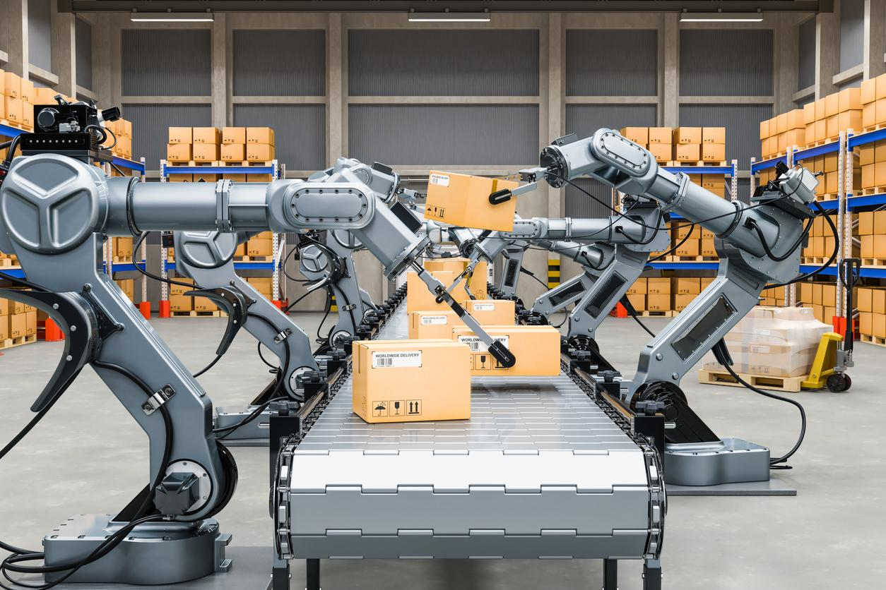

## Table of Contents

## What is motion control in the context of machine learning?

Motion control in the context of machine learning refers to the use of algorithms and models to control the movement of objects or systems. This can include robots, vehicles, or any device that needs to move in a specific way. Machine learning helps by allowing the system to learn from data and improve its motion control over time. For example, a self-driving car uses machine learning to understand how to navigate roads safely and efficiently.

One common approach in motion control is reinforcement learning, where an agent learns to make decisions by interacting with its environment. The agent receives feedback in the form of rewards or penalties, which helps it learn the best actions to take. This method is useful for tasks like robotic arm manipulation, where the robot learns to move objects precisely by trial and error. By using machine learning, motion control systems can adapt to new situations and improve their performance without needing constant manual adjustments.

## How does motion control differ from traditional control systems?

Motion control in traditional control systems relies on pre-programmed instructions and fixed algorithms. These systems use mathematical models to predict how a machine should move and then control it based on those predictions. For example, a traditional control system might use a PID (Proportional-Integral-Derivative) controller to manage the speed of a motor. The system continuously adjusts the motor's speed to match a set target, but it does not learn or adapt over time. This means that if the environment changes or if the machine encounters a new situation, the system might not respond well because it cannot adjust its behavior based on new data.

In contrast, motion control using [machine learning](/wiki/machine-learning) can adapt and improve over time. Machine learning algorithms, such as [reinforcement learning](/wiki/reinforcement-learning), allow a system to learn from its experiences. For instance, a robot using reinforcement learning might try different ways to move an object and learn which methods work best through trial and error. Over time, the robot gets better at its task without needing someone to reprogram it. This adaptability makes machine learning-based motion control more flexible and capable of handling new or changing situations compared to traditional control systems.

## What are the basic components of a motion control system using machine learning?

A motion control system using machine learning has a few main parts. First, there is the sensor system, which collects data about the environment and the machine's current position. This data could be from cameras, distance sensors, or other devices that help the machine understand where it is and what's around it. Next, there is the machine learning model, which uses this data to make decisions about how the machine should move. The model could be trained using reinforcement learning, where it learns from trial and error, or supervised learning, where it learns from examples.

The third part is the actuator system, which actually moves the machine based on the decisions made by the machine learning model. Actuators could be motors, servos, or other devices that control motion. Finally, there is a feedback loop that helps the system learn and improve over time. The machine learning model uses the data from the sensors and the results of the actuator's movements to adjust its decisions. This loop allows the system to get better at controlling motion as it gains more experience.

## Can you explain the role of sensors in motion control systems?

Sensors play a crucial role in motion control systems by collecting important data about the machine's surroundings and its own position. They act like the eyes and ears of the system, providing real-time information that the machine learning model uses to make decisions. For example, a camera sensor might capture images of the environment, while a distance sensor might measure how far away objects are. This data helps the system understand where it is and what obstacles it needs to navigate around.

The information gathered by sensors is fed into the machine learning model, which then processes it to decide how the machine should move. Without accurate and timely data from sensors, the system would struggle to control motion effectively. For instance, if a robot needs to pick up an object, sensors help it know exactly where the object is and how to approach it. This constant flow of data from sensors to the model and back to the actuators creates a feedback loop that allows the system to learn and improve its motion control over time.

## What machine learning algorithms are commonly used in motion control?

Machine learning algorithms commonly used in motion control include reinforcement learning and supervised learning. Reinforcement learning is popular because it allows a machine to learn by doing. The machine tries different movements, gets feedback in the form of rewards or penalties, and adjusts its actions to get better over time. For example, a robot might try different ways to move an object and learn which method works best. This approach is great for tasks like controlling a robotic arm or navigating a self-driving car.

Supervised learning is another common method where the machine learns from examples. In this case, the system is trained on a dataset of correct movements and then tries to replicate these movements in new situations. For example, a drone might be trained on videos of other drones flying through obstacles and then use that knowledge to fly through new obstacles. Both reinforcement learning and supervised learning help machines become better at controlling their motion by learning from data, making them more adaptable and effective than traditional control systems.

## How does reinforcement learning apply to motion control?

Reinforcement learning is a way for machines to learn how to move by trying different actions and getting feedback. Imagine a robot that needs to pick up a ball. It tries different ways to move its arm, and if it gets the ball, it gets a reward. If it misses, it gets a penalty. Over time, the robot learns which movements work best to pick up the ball. This is how reinforcement learning helps with motion control – the machine keeps trying and learning from its mistakes until it gets good at the task.

In a self-driving car, reinforcement learning can help it learn to drive safely. The car tries different speeds and paths, and if it stays on the road and avoids accidents, it gets a reward. If it goes off the road or crashes, it gets a penalty. By driving more and more, the car learns the best ways to navigate different roads and situations. This makes reinforcement learning a powerful tool for motion control because it lets machines improve their movements without needing someone to program every detail.

## What are the challenges of implementing machine learning in real-time motion control?

One big challenge of using machine learning for real-time motion control is making sure the system can make decisions fast enough. When a machine is moving, it needs to react quickly to changes in its environment. Machine learning models, especially complex ones like deep neural networks, can take a lot of time to process data and decide what to do next. If the model is too slow, the machine might not be able to move smoothly or safely. This is a big problem for things like self-driving cars or robots that need to move quickly and accurately.

Another challenge is dealing with the unpredictability of the real world. Machine learning models are trained on data, but the real world can be very different from the training data. For example, a robot trained to pick up objects in a lab might struggle if it tries to do the same thing in a cluttered home. The model needs to be able to adapt to new situations and keep learning on the go. This is hard because the machine needs to balance using what it has learned with trying new things to see if they work better. Getting this balance right is key to making machine learning work well for real-time motion control.

## How can machine learning improve the precision and efficiency of motion control systems?

Machine learning can make motion control systems more precise by learning from past movements and getting better over time. For example, a robot that needs to pick up objects can use machine learning to figure out the best way to move its arm. The more it practices, the better it gets at making small adjustments to grab things just right. This is because machine learning can find patterns in the data that are hard for people to see. By using these patterns, the machine can make tiny changes to its movements that make them more accurate.

Machine learning also helps make motion control systems more efficient. Instead of having to program every little detail, the machine can learn on its own how to do things faster and with less energy. For instance, a self-driving car can learn the best routes and speeds to save fuel. This is possible because machine learning can look at a lot of data and find the most efficient ways to move. By doing this, the machine can save time and resources, making it work better overall.

## What are some practical applications of machine learning in motion control?

Machine learning helps robots move better in factories. For example, a robot that puts car parts together can use machine learning to learn the best way to pick up and place the parts. It keeps practicing and gets better at moving quickly and accurately. This makes the factory work faster and makes fewer mistakes. Machine learning also helps drones fly better. A drone can learn how to avoid obstacles and fly through tight spaces by trying different paths and learning from its mistakes. This makes the drone more useful for jobs like delivering packages or checking on buildings.

Self-driving cars use machine learning to drive safely and efficiently. The car learns from lots of driving data to know how to stay in its lane, avoid other cars, and follow traffic rules. This makes the car safer and helps it use less gas by choosing the best routes and speeds. Machine learning also helps in sports, like teaching a tennis robot to hit the ball perfectly. The robot tries different swings and learns which ones work best, making it a great practice partner for players.

## How do you train a machine learning model for motion control?

Training a machine learning model for motion control starts with collecting lots of data about how the machine moves. This data comes from sensors that watch the machine as it tries different movements. For example, if you're training a robot to pick up objects, you would have the robot try to pick up many different things while cameras and other sensors record how it moves. This data is then used to teach the model. If you're using reinforcement learning, the robot tries different ways to move, gets feedback like rewards or penalties, and learns what works best over time. The goal is to make the model understand the best way to move the machine for different tasks.

Once you have the data, you use it to train the model. This means you let the model look at the data and learn from it. For reinforcement learning, the model keeps trying different actions and gets better at choosing the right ones. For supervised learning, you show the model examples of good movements and it tries to copy them. You keep training the model until it gets really good at controlling the machine's motion. After training, you test the model to make sure it works well in real situations. If it doesn't work perfectly, you might need to collect more data and train it again until it gets better.

## What are the latest advancements in machine learning techniques for motion control?

One of the latest advancements in machine learning for motion control is the use of deep reinforcement learning. This technique uses deep neural networks to help machines learn complex movements. For example, a robot can learn to walk or a drone can learn to navigate through tight spaces. Deep reinforcement learning is good because it can handle a lot of data and learn from it in a smart way. It makes the machine better at figuring out the best way to move without needing someone to tell it exactly what to do.

Another advancement is the use of transfer learning in motion control. This means using knowledge from one task to help with another task. For example, a robot trained to pick up one type of object can use what it learned to pick up different objects more quickly. Transfer learning saves time and makes the machine more flexible. It can learn new tasks faster because it already knows some things from before. This is really helpful in real-world situations where machines often need to do different jobs.

## How can motion control systems using machine learning adapt to new or changing environments?

Motion control systems using machine learning can adapt to new or changing environments by using what they have learned before. Imagine a robot that has been trained to move around in a factory. If the factory changes and new machines are added, the robot can use its past experiences to figure out how to move around these new obstacles. It keeps learning as it goes, trying different paths and getting better at navigating the new setup. This is possible because machine learning models can update themselves with new data, making them flexible and able to handle changes.

Another way these systems adapt is through a process called transfer learning. This is like using what you learned in one class to help you in another class. For example, a self-driving car trained to drive in the city can use that knowledge to drive in the countryside more easily. The car doesn't start from scratch; it uses what it knows about roads and traffic to learn the new environment faster. By doing this, the machine can quickly adjust to new situations without needing a lot of new training, making it very useful in the real world where things are always changing.

## References & Further Reading

[1]: Sutton, R. S., & Barto, A. G. (2018). ["Reinforcement Learning: An Introduction."](https://web.stanford.edu/class/psych209/Readings/SuttonBartoIPRLBook2ndEd.pdf) MIT Press.

[2]: Lillicrap, T. P., et al. (2015). ["Continuous control with deep reinforcement learning."](https://arxiv.org/abs/1509.02971) arXiv preprint arXiv:1509.02971.

[3]: Levine, S., et al. (2016). ["End-to-end training of deep visuomotor policies."](https://arxiv.org/abs/1504.00702) The Journal of Machine Learning Research, 17(1), 1334-1373.

[4]: Kober, J., Bagnell, J. A., & Peters, J. (2013). ["Reinforcement learning in robotics: A survey."](https://www.researchgate.net/publication/258140920_Reinforcement_Learning_in_Robotics_A_Survey) The International Journal of Robotics Research, 32(11), 1238-1274.

[5]: DeepMind. ["AlphaGo](https://deepmind.google/research/breakthroughs/alphago/), a Case Study in Meta-Reasoning Systems".