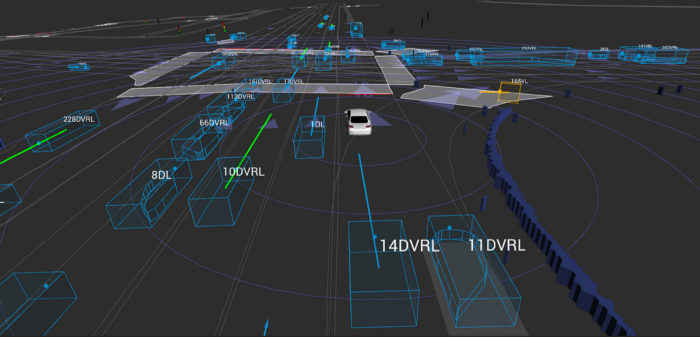

## Table of Contents

## What is a motion prediction model in machine learning?

A motion prediction model in machine learning is a type of algorithm that tries to guess where an object will be in the future based on where it has been in the past. Imagine you are watching a soccer game and you see a player running towards the goal. A motion prediction model would use the player's past movements to predict where the player will be in the next few seconds. This is useful in many areas, like self-driving cars, where predicting the movements of other vehicles and pedestrians is crucial for safety.

These models often use data from sensors, cameras, or other devices to track the object's position over time. The data is then fed into the model, which uses mathematical formulas and algorithms to make its predictions. For example, a simple model might use the object's speed and direction to predict its future position using a formula like $$ \text{future_position} = \text{current_position} + \text{velocity} \times \text{time} $$. More complex models might use machine learning techniques like neural networks to learn patterns from large amounts of data and make more accurate predictions.

## How do motion prediction models differ from other types of predictive models?

Motion prediction models are specialized types of predictive models that focus specifically on forecasting the future positions and movements of objects. Unlike general predictive models that might predict anything from stock prices to weather patterns, motion prediction models are designed to work with spatial data, tracking how objects move through space over time. They use information like an object's speed, direction, and past positions to make their predictions. For example, a simple motion prediction model might use the formula $$ \text{future_position} = \text{current_position} + \text{velocity} \times \text{time} $$ to estimate where an object will be in the future.

What sets motion prediction models apart is their need to handle dynamic and often complex spatial data. While other predictive models might focus on static data points or time series data, motion prediction models must account for the continuous changes in an object's position. This requires them to process data from sensors, cameras, or other tracking devices in real-time. Additionally, these models often need to predict not just where an object will be, but also how it will move, which can involve predicting changes in speed and direction. This makes motion prediction models particularly useful in applications like autonomous vehicles, robotics, and sports analytics, where understanding and anticipating movement is crucial.

## What are the basic components of a motion prediction model?

The basic components of a motion prediction model include data collection and preprocessing, a prediction algorithm, and an evaluation method. Data collection involves gathering information about an object's past positions, usually from sensors or cameras. This data is then preprocessed to clean it and make it ready for the model. The prediction algorithm is the core of the model, using the preprocessed data to estimate where the object will be in the future. This can be done using simple formulas like $$ \text{future_position} = \text{current_position} + \text{velocity} \times \text{time} $$ or more complex methods like machine learning algorithms. Finally, the evaluation method checks how well the model's predictions match the actual movements of the object, helping to improve the model over time.

Another important component is the model's ability to handle real-time data. Motion prediction models often need to update their predictions as new data comes in, which requires them to process information quickly and efficiently. This real-time processing is crucial for applications like self-driving cars, where the model must constantly adjust its predictions based on the latest sensor data. Additionally, the model may include features like uncertainty estimation, which helps it predict not just where an object will be, but also how confident it is in that prediction. This can be important for making safe decisions in critical situations.

## Can you explain the concept of MotionNet and its role in motion prediction?

MotionNet is a type of motion prediction model that uses deep learning to predict where objects will be in the future. It is designed to understand and predict the movement of objects by learning from lots of data. Imagine you are watching a video of cars driving on a road. MotionNet would look at how the cars move in the video and try to guess where each car will be in the next few seconds. It does this by using a special kind of neural network that can handle both the space where the objects are and the time they move through.

The key idea behind MotionNet is to use something called a convolutional neural network (CNN) to process the images or videos and a recurrent neural network (RNN) to understand how things change over time. This combination helps MotionNet to see patterns in the movement of objects and make better predictions. For example, if a car is speeding up, MotionNet can use the information from the CNN to see the car's position in the image and the RNN to remember how fast the car was going before. This way, MotionNet can predict where the car will be in the future more accurately than simpler models.

## What types of data are typically used to train motion prediction models?

Motion prediction models are trained using data that shows how objects move over time. This data often comes from videos or sensors that track the position of objects in different places like roads, sports fields, or even inside buildings. For example, in a self-driving car, the model might use data from cameras and radar to see where other cars, people, and obstacles are. This data is collected over time, so the model can learn how these objects move and change direction.

The data used to train these models needs to be very detailed and accurate. It includes information like the exact position of an object at different times, how fast it is moving, and which way it is going. For instance, if you are tracking a soccer player, the data might show where the player was every second during a game. This helps the model learn patterns in how the player moves, so it can predict where the player will be next. Sometimes, the data is also labeled to show what type of object it is, like a car or a pedestrian, which helps the model understand different kinds of movements better.

## How do you evaluate the performance of a motion prediction model?

To evaluate the performance of a motion prediction model, you need to see how well it can guess where an object will be in the future. One common way to do this is by using a measure called the Mean Squared Error (MSE). This measure looks at the difference between where the model says the object will be and where it actually ends up. If the MSE is small, it means the model's predictions are close to the real positions. For example, if you are predicting where a car will be in 5 seconds, you would compare the predicted position to the actual position and calculate the MSE using the formula $$ \text{MSE} = \frac{1}{n} \sum_{i=1}^{n} (y_i - \hat{y}_i)^2 $$, where \( y_i \) is the actual position and \( \hat{y}_i \) is the predicted position.

Another important way to evaluate the model is by looking at how well it can predict the path of an object over time. This is often done using a measure called the Average Displacement Error (ADE). The ADE calculates the average distance between the predicted path and the actual path of the object. If the ADE is low, it means the model is good at predicting the whole path, not just one point in time. For example, if you are tracking a soccer player, you would compare the predicted path of the player to the actual path and calculate the ADE. Both MSE and ADE help you understand how accurate the model is and where it might need to be improved.

## What are some common challenges faced when developing motion prediction models?

One common challenge when developing motion prediction models is dealing with noisy and incomplete data. Imagine trying to predict where a car will go next, but the camera or sensor data you are using is not perfect. Sometimes the data can be missing or full of errors, which makes it hard for the model to learn and make good predictions. For example, if a camera is blocked by something, it might miss seeing the car for a few moments, making the data incomplete. This means the model has to be smart enough to fill in the gaps and still make accurate guesses about where the car will be.

Another challenge is predicting the movements of objects that can change direction suddenly or in unexpected ways. For example, a soccer player can quickly change direction to dodge another player, which is hard for a model to predict. The model needs to understand not just where the object has been, but also why it might move in a certain way. This often requires the model to learn from a lot of different examples and understand the context of the movement. If the model can't do this well, its predictions might be off, especially in situations where quick and unpredictable movements are common.

## How can motion prediction models be applied in real-world scenarios?

Motion prediction models can be very useful in self-driving cars. These models help the car guess where other cars, people, and things on the road will be in the future. By using data from cameras and sensors, the model can predict the path of a car in front of it. For example, if a car suddenly slows down, the model can help the self-driving car know to slow down too, so it can avoid a crash. This makes driving safer and helps the car make smart decisions on the road.

Another real-world use for motion prediction models is in sports. Coaches and analysts use these models to understand how players move during a game. For instance, in soccer, a model can predict where a player will run next based on their past movements. This can help teams plan better strategies and make quick decisions during the game. By knowing where players are likely to go, a team can set up plays that take advantage of these predictions, making them more likely to win.

## What are the latest advancements in motion prediction models beyond MotionNet?

One of the latest advancements in motion prediction models beyond MotionNet is the use of transformer-based architectures. These models, inspired by natural language processing, can better understand the context and relationships between different objects in a scene. For example, in a busy street, a transformer-based model can look at all the cars, pedestrians, and cyclists at once and predict how they will move together. This is different from older models that might only look at one object at a time. By considering everything in the scene, these new models can make more accurate predictions, especially in complex situations where many things are moving at the same time.

Another advancement is the integration of uncertainty estimation into motion prediction models. This means the model not only predicts where an object will be but also how confident it is in that prediction. For instance, if a self-driving car is trying to guess where a pedestrian will walk next, the model can say, "I think the pedestrian will go this way, but I'm not very sure." This helps the car make safer decisions because it knows when to be cautious. Using techniques like Bayesian neural networks, these models can provide a range of possible future positions for an object, which is very helpful in real-world applications where things don't always move in predictable ways.

## How do different architectures, such as RNNs and CNNs, impact the performance of motion prediction models?

Recurrent Neural Networks (RNNs) and Convolutional Neural Networks (CNNs) play different roles in motion prediction models. RNNs are good at understanding how things change over time. They can remember past positions of an object and use that information to predict where it will go next. For example, if a car is speeding up, an RNN can use the history of its speed to guess its future position. This makes RNNs very useful for tasks where the past movements of an object are important for predicting its future path. However, RNNs can struggle with very long sequences of data because they might forget older information.

On the other hand, CNNs are excellent at processing images and understanding spatial relationships. They can look at a picture or a video frame and see where objects are located. In motion prediction, CNNs can help by extracting features from images, like the shape and position of a car. By combining CNNs with RNNs, a model can both see where objects are in a scene and remember how they have moved over time. This combination, often called a CNN-RNN architecture, can lead to better predictions because it uses the strengths of both types of networks. For instance, a CNN can identify a pedestrian in a video, and an RNN can predict where that pedestrian will walk next based on their past movements.

## What are the ethical considerations when deploying motion prediction models?

When deploying motion prediction models, one important ethical consideration is privacy. These models often use data from cameras and sensors to track where people and vehicles are. This means they can collect a lot of personal information, like where someone walks or drives every day. It's important to make sure this data is kept safe and used in a way that respects people's privacy. For example, if a self-driving car uses motion prediction to avoid hitting a pedestrian, the data it collects should not be used to track that person's daily routine without their permission.

Another ethical issue is fairness and bias. Motion prediction models learn from the data they are given, so if the data is biased, the predictions can be too. For instance, if a model is trained mostly on data from one type of neighborhood, it might not work as well in different areas. This could lead to unfair outcomes, like a self-driving car being less safe in certain places. It's important to use diverse data and test the models in different situations to make sure they work fairly for everyone.

## How can one fine-tune a motion prediction model like MotionNet for specific applications?

To fine-tune a motion prediction model like MotionNet for a specific application, you first need to gather data that matches the situation you want to use the model for. For example, if you are fine-tuning MotionNet for a self-driving car, you would collect data from the roads where the car will drive. This data should include different times of day, weather conditions, and types of traffic. Once you have this data, you can use it to train MotionNet again, but this time, you focus on making it better at predicting movements in your specific scenario. This process is called fine-tuning, and it helps the model learn the unique patterns and behaviors of the objects in your application.

During fine-tuning, you might also adjust the model's architecture or hyperparameters to improve its performance. For example, you could change the number of layers in the neural network or adjust the learning rate to see if it helps the model predict better. You would use a validation set to check how well the model is doing and keep making small changes until you are happy with the results. By carefully fine-tuning MotionNet, you can make it more accurate and reliable for your specific use case, whether it's helping a self-driving car navigate busy city streets or tracking players on a sports field.