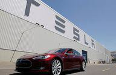

The vehicle sales market is an essential component of the global economy, serving as a reflection of consumer confidence and broader economic health. As one of the largest consumer-driven markets, it directly impacts Gross Domestic Product (GDP), employment, and a range of associated industries, from manufacturing to services. Historically, vehicle sales have been considered a bellwether for economic conditions, with fluctuations often mirroring periods of economic expansion and contraction. 

In recent years, digital technology has begun transforming traditional paradigms across many industries, and the automotive market is no exception. The rise of online marketplaces and digital platforms has introduced new modes of trading and sales. Algorithmic trading, in particular, is gaining traction as a means to enhance efficiency, transparency, and decision-making processes within the vehicle sales sector. This automated approach enables rapid analysis of vast datasets, allowing for more informed pricing strategies and market predictions.



Understanding these transformations is crucial, especially as stakeholders within the automotive industry adapt to these technological advancements. Companies like ALgo and Carvana are at the forefront, reshaping consumer experiences and the dynamics of the automotive market. ALgo focuses on streamlining the car selling process through technology, while Carvana offers both buying and selling options nationwide, emphasizing convenience and transparency.

As the market evolves, it is imperative for industry participants to grasp the implications of these changes. The landscape of vehicle sales continues to shift, driven by technologies that promise to redefine how vehicles are bought and sold. By exploring the current state of the market, the role of algorithmic trading, and potential future developments, businesses and consumers alike can better navigate the challenges and opportunities ahead.

## Table of Contents

## Understanding the Vehicle Sales Market

The vehicle sales market is an integral component of the global economy, encompassing the sales of cars, SUVs, minivans, and light trucks. In the United States, it significantly contributes to the Gross Domestic Product (GDP) and provides employment for millions of individuals. This sector's performance is closely monitored as an economic indicator, with sales figures reported on a quarterly or monthly basis. These reports offer insights into consumer demand and broader economic trends, helping analysts gauge overall financial confidence.

Historically, trends in motor vehicle sales have closely mirrored the state of the economy. During periods of economic prosperity, there is usually an uptick in vehicle sales, reflecting higher consumer spending and financial stability. Conversely, during economic downturns, such as the Great Recession of 2008, the market often sees a sharp decline in sales. This decline prompts government interventions to stabilize the economy, such as the "Cash for Clunkers" program in the U.S., which was designed to boost vehicle sales and simultaneously promote environmentally friendly vehicle purchases.

Understanding the vehicle sales market requires not only an analysis of these sales figures but also an appreciation of the external factors that influence consumer behavior. Economic conditions, interest rates, availability of credit, and consumer confidence all play pivotal roles. Additionally, advancements in technology and shifts in consumer preferences towards more environmentally friendly vehicles, such as electric vehicles (EVs), are also shaping the future landscape of this market.

To quantify consumer confidence and its impact on vehicle sales, analysts may employ statistical models. For instance, the correlation coefficient can be calculated to measure the strength and direction of the relationship between consumer confidence indexes and vehicle sales data. An example in Python might look like this:

```python
import pandas as pd
from scipy.stats import pearsonr

# Sample data representing consumer confidence index and vehicle sales
data = {
    'consumer_confidence': [95, 97, 99, 101, 103],
    'vehicle_sales': [5.5, 5.7, 6.1, 6.3, 6.8]  # in millions
}

df = pd.DataFrame(data)

# Calculate Pearson correlation coefficient
correlation, _ = pearsonr(df['consumer_confidence'], df['vehicle_sales'])

print(f'Pearson correlation coefficient: {correlation:.2f}')
```

By evaluating these data-driven metrics, stakeholders can make informed decisions, aligning strategies to the prevailing economic conditions and consumer preferences. The current trajectory of the vehicle sales market underscores the importance of agility and innovation in addressing evolving consumer expectations and regulatory landscapes.

## Digital Platforms and Algorithmic Trading in Vehicle Sales

Algorithmic trading in the vehicle market leverages advanced technology to automate the process of buying and selling vehicles, bringing innovation to a traditionally manual industry. Platforms such as ALgo and Carvana are at the forefront of this transformation, utilizing algorithmic models to streamline operations and improve both transparency and efficiency.

Carvana, known for its vast nationwide inventory, provides a comprehensive suite of services that include both buying and selling vehicles. Its model is designed for efficiency and customer convenience, removing traditional barriers in vehicle transactions. Carvana’s platform automates the pricing and sales process using extensive data analytics, enabling fast transactions and eliminating the need for price negotiations. The "no-haggle" pricing model presented by Carvana ensures an upfront and transparent valuation, which appeals to consumers who prefer straightforward transactions.

ALgo, on the other hand, is primarily focused on aiding customers in selling their vehicles. The platform applies algorithmic solutions to appraise vehicles swiftly, offering sellers competitive and accurate pricing. By harnessing large-scale data analysis, ALgo can predict market changes and offer real-time market valuations for sellers, optimizing sales outcomes.

Algorithmic trading models employed by these platforms have the ability to dissect extensive datasets to forecast market trends and set optimal prices. Here, [machine learning](/wiki/machine-learning) algorithms play a pivotal role, continuously learning from transaction data to refine pricing strategies. For instance, these algorithms can evaluate historical sales data, market demand, seasonal variations, and economic indicators to recommend ideal pricing. A basic example in Python could resemble:

```python
import pandas as pd
from sklearn.linear_model import LinearRegression

# Load historical sales data
data = pd.read_csv('vehicle_sales_data.csv')
X = data[['feature1', 'feature2', 'feature3']]  # Example features
y = data['price']

# Initialize and train the linear regression model
model = LinearRegression()
model.fit(X, y)

# Predict the price for new data
new_data = pd.DataFrame([[value1, value2, value3]], columns=['feature1', 'feature2', 'feature3'])
predicted_price = model.predict(new_data)
```

In summary, the integration of [algorithmic trading](/wiki/algorithmic-trading) into the vehicle sales market via platforms like Carvana and ALgo is reshaping consumer interactions. These digital platforms enhance efficiency and transparency, accommodating changing consumer preferences through innovative, data-driven strategies. As the automotive industry continues to evolve, the role of algorithmic trading is likely to become even more prominent, influencing market dynamics significantly.

## Current Trends and Challenges

Recent years have marked a significant transformation in the vehicle sales market, primarily fueled by the accelerated adoption of electric vehicles (EVs). This shift is largely propelled by increasing consumer demand for environmentally-friendly transportation options and stringent environmental policies aimed at reducing carbon emissions. Governments worldwide have implemented policies to promote EV adoption, such as tax rebates, subsidies, and the development of charging infrastructure, further incentivizing consumers to transition from traditional internal combustion engine vehicles to EVs.

The COVID-19 pandemic has also profoundly affected consumer behavior and vehicle sales dynamics. With the onset of the pandemic, there was a marked shift toward online transactions as consumers sought safer, contactless purchasing options. This shift has been catalyzed by digital platforms that offer streamlined buying processes, without the need for a physical visit to a dealership. As a result, these platforms have gained prominence, and the traditional model of car sales has been reevaluated to accommodate remote and virtual interaction.

Despite these innovations, the market faces challenges that could impact long-term growth. Regulatory compliance is a critical issue, particularly concerning data privacy and protection. As transactions increasingly occur online, safeguarding consumer data from breaches and cyber threats has become paramount. Digital platforms must ensure they adhere to regional and international regulations to maintain consumer trust and confidence.

Additionally, consumer preferences are evolving, with a growing emphasis on sustainability and environmentally responsible practices. This change not only influences the types of vehicles in demand but also informs sales strategies. Manufacturers and retailers are increasingly prioritizing eco-friendly practices and transparent operations to align with consumer values. For example, many companies are now highlighting the lifecycle environmental impact of their vehicles and adopting sustainable practices across their supply chains.

Understanding these trends is crucial for vehicle manufacturers and digital sales platforms. As consumer expectations shift towards sustainability and digital convenience, aligning product offerings and services with these preferences will be essential. Companies that can effectively navigate these challenges and leverage the current trends will likely find themselves well-positioned in an evolving market landscape.

In conclusion, the vehicle sales market is undergoing significant transformation driven by technological advancements and changing consumer behaviors. Companies must innovate and adapt to these changes, with a focus on sustainability and digitization, to remain relevant and competitive. This evolving landscape represents both challenges and opportunities for stakeholders in the automotive industry.

## Policy Implications and Future Projections

Government policies play a pivotal role in shaping the vehicle sales market, particularly through initiatives aimed at promoting electric vehicles (EVs) and regulating emissions. These policies impact consumer behavior and industry practices, driving the automotive sector towards more sustainable and environmentally friendly solutions. For instance, incentives such as tax rebates and subsidies for EV buyers can significantly boost the adoption of electric vehicles, reflecting broader environmental goals and compliance with international climate agreements.

As algorithmic trading platforms gain prominence in the vehicle sales market, they may attract increased regulatory scrutiny. Ensuring consumer protection and fair market practices is essential, prompting the need for comprehensive regulatory frameworks. These frameworks may involve guidelines on data privacy, transparency in pricing models, and measures to prevent market manipulation. The evolution of digital platforms necessitates a careful balance between innovation and regulatory oversight to foster a competitive yet secure trading environment.

The convergence of [artificial intelligence](/wiki/ai-artificial-intelligence) (AI), the Internet of Things (IoT), and cloud computing promises to further revolutionize vehicle sales and trading. AI can be leveraged to enhance predictive analytics, optimize inventory management, and improve customer engagement through personalized recommendations. IoT-enabled vehicles can provide real-time data on performance and maintenance needs, offering value-added services to consumers and helping manufacturers design more efficient and user-friendly cars.

Traditional and digital platforms must adapt to these technological advancements and shifting consumer expectations. This adaptation involves integrating advanced technology into their operations to improve efficiency and customer satisfaction. Digital platforms, such as Carvana and ALgo, are already using algorithmic trading models to streamline transactions and offer competitive pricing strategies, showcasing the advantages of technology-driven solutions.

To stay competitive in this rapidly changing landscape, stakeholders must remain agile, leveraging data analytics and real-time marketing insights. The ability to quickly analyze and respond to market trends allows companies to maintain a competitive edge and align with consumer demands. For instance, utilizing machine learning algorithms to analyze buying patterns can assist in developing targeted marketing strategies that enhance customer acquisition and retention.

In conclusion, government policies, technological advancements, and evolving consumer preferences are key factors shaping the future of the vehicle sales market. Stakeholders must navigate these dynamics carefully, balancing innovation with regulatory compliance to ensure sustainable growth and competitiveness. By embracing technological change and aligning with policy objectives, the automotive industry can thrive in the emerging digital economy.

## Conclusion

The interplay between vehicle sales and algorithmic trading represents a fundamental shift in the automotive industry. This shift is driven by the increasing integration of digital platforms that are not only facilitating seamless transactions but are also shaping consumer habits and expectations in unprecedented ways. These platforms leverage sophisticated algorithms to automate and optimize the vehicle buying and selling process, enhancing the consumer experience by delivering transparency, efficiency, and competitive pricing.

As the market dynamics continue to evolve, it becomes crucial for companies operating within this sector to innovate and adapt. Staying relevant and competitive requires a proactive approach to embracing technological advancements. By harnessing the power of data analytics, artificial intelligence, and machine learning, these companies can better understand market trends, improve pricing strategies, and anticipate consumer behavior. This technological integration allows for a more personalized and efficient service, ultimately leading to increased consumer satisfaction and loyalty.

Moreover, the future of the vehicle sales market hinges on continuous monitoring of market trends and proactive policy adjustments. Policymakers must work in tandem with industry stakeholders to ensure regulatory frameworks keep pace with technological advancements while maintaining consumer protection. Such collaboration will help guide sustainable growth by setting standards that promote fair trade practices, data security, and environmental responsibility.

In conclusion, the fusion of vehicle sales and algorithmic trading is reshaping the automotive landscape, presenting both challenges and opportunities. Companies that effectively understand and leverage these technological advancements will secure a competitive edge. A vigilant approach to market trends, accompanied by strategic policy interventions, will be key to sustaining growth and fostering innovation in this dynamic sector.

## References & Further Reading

[1]: Bergstra, J., Bardenet, R., Bengio, Y., & Kégl, B. (2011). ["Algorithms for Hyper-Parameter Optimization."](https://dl.acm.org/doi/10.5555/2986459.2986743) Advances in Neural Information Processing Systems.

[2]: Carvana. (n.d.). ["How It Works."](https://www.carvana.com/buying-a-car-online-how-it-works) Carvana.

[3]: ["Advances in Financial Machine Learning"](https://www.amazon.com/Advances-Financial-Machine-Learning-Marcos/dp/1119482089) by Marcos Lopez de Prado

[4]: ["Machine Learning for Algorithmic Trading"](https://github.com/stefan-jansen/machine-learning-for-trading) by Stefan Jansen

[5]: ["Quantitative Trading: How to Build Your Own Algorithmic Trading Business"](https://www.amazon.com/Quantitative-Trading-Build-Algorithmic-Business/dp/1119800064) by Ernest P. Chan

[6]: ["Vehicle Sales: A Historical Overview"](https://medium.com/@adeleke.joe/eda-on-automobile-sales-248a58e86597) by the Bureau of Transportation Statistics

[7]: U.S. Department of Energy. (n.d.). ["Alternative Fuels Data Center: Federal and State Laws and Incentives."](https://afdc.energy.gov/)