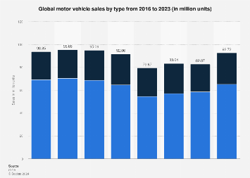

## Table of Contents

## What is a motor vehicle?

A motor vehicle is a type of vehicle that has its own engine to move it. This engine can be powered by gasoline, diesel, electricity, or other fuels. Cars, trucks, buses, and motorcycles are all examples of motor vehicles. They are used to transport people and goods from one place to another.

Motor vehicles are important for daily life. They help people get to work, school, and other places quickly and easily. They also help businesses move products and materials. Without motor vehicles, it would be much harder to do many of the things we do every day.

## What types of motor vehicles are commonly sold?

The most common types of motor vehicles sold are cars, trucks, and SUVs. Cars come in different sizes and styles, like sedans, hatchbacks, and coupes. They are popular because they are easy to drive and park, and they can carry a few people comfortably. Trucks are bigger and stronger than cars. They are used to carry heavy things or to tow trailers. SUVs, or sport utility vehicles, are like a mix of cars and trucks. They are bigger than cars and can carry more people and things, but they are not as big as trucks.

Motorcycles and vans are also commonly sold. Motorcycles are smaller than cars and have two wheels. They are fun to ride and can go through traffic easily, but they are not as safe as cars. Vans are bigger than cars and can [carry](/wiki/carry-trading) many people or a lot of things. They are often used by families or businesses.

Electric vehicles are becoming more common too. These vehicles run on electricity instead of gas. They are good for the environment because they do not produce harmful gases. Electric cars, trucks, and even motorcycles are now available in many places.

## How does one start a motor vehicle sales business?

Starting a motor vehicle sales business involves several steps. First, you need to decide what kind of vehicles you want to sell. You can choose to sell new cars, used cars, or both. Once you have decided, you need to find a good location for your business. It should be easy for customers to find and have enough space to display the vehicles. You also need to get the right licenses and permits from your local government to legally sell motor vehicles.

Next, you need to find a reliable source of vehicles to sell. If you are selling new cars, you will need to partner with car manufacturers or dealers. For used cars, you can buy them from auctions, trade-ins, or private sellers. It's important to check the vehicles carefully to make sure they are in good condition before you sell them. You also need to set up a system to keep track of your inventory and sales.

Finally, you need to market your business to attract customers. You can use ads in newspapers, on the radio, or online to let people know about your business. Having a good website where people can see your inventory and contact you is also important. Good customer service is key to keeping customers happy and coming back. By following these steps, you can start and grow a successful motor vehicle sales business.

## What are the legal requirements for selling motor vehicles?

To sell motor vehicles, you need to follow certain legal rules. First, you must get a dealer's license from your state's motor vehicle department. This license lets you legally sell cars. You also need to follow rules about where you can sell cars. Some places have zoning laws that say you can only sell cars in certain areas. You also need to make sure you have the right permits for your business location.

Another important legal requirement is to be honest with customers. You must tell them the truth about the cars you are selling. This includes any problems the car might have. You also need to follow laws about how you advertise your cars. You can't say things that aren't true just to get people to buy from you. Keeping good records of your sales and the cars you sell is also required by law.

Lastly, you need to handle taxes correctly. When you sell a car, you need to collect sales tax from the buyer and give it to the government. You also need to follow rules about vehicle titles and registration. When someone buys a car from you, you need to help them get the title and register the car in their name. Following all these legal requirements will help you run a successful and legal motor vehicle sales business.

## What are the key factors that influence motor vehicle sales?

Several key factors affect how many motor vehicles are sold. One big [factor](/wiki/factor-investing) is the economy. When people feel good about their money, they are more likely to buy new cars. If the economy is not doing well, people might wait to buy a car or choose a cheaper one. Another factor is interest rates. If it costs less to borrow money, more people can afford to buy cars. High interest rates can make car loans more expensive, so fewer people buy.

Another important factor is what people want and need. If gas prices are high, more people might want to buy cars that use less gas or electric cars. New technology and features in cars can also make people want to buy them. For example, if a car has a new safety feature or a cool entertainment system, it might sell more. Also, car companies often offer special deals and discounts to get people to buy. These deals can make a big difference in how many cars are sold.

## How do economic conditions affect motor vehicle sales?

Economic conditions have a big impact on how many motor vehicles are sold. When the economy is doing well, people feel more confident about their money. They are more likely to buy new cars because they feel they can afford it. This is because they might have more money to spend, or they might feel more secure in their jobs. Car companies also do well during good economic times because more people are buying their products.

On the other hand, when the economy is not doing well, people are more careful with their money. They might wait to buy a new car or choose a cheaper one. This is because they might be worried about losing their job or not having enough money. During bad economic times, car companies often have to offer big discounts to try to sell their cars. This can make it harder for them to make money.

## What are the differences between selling new versus used motor vehicles?

Selling new motor vehicles is different from selling used ones in several ways. When you sell new cars, you work with car manufacturers or dealers to get the cars. This means you have a steady supply of cars that are brand new and have the latest features. You can also offer warranties and special deals that come with new cars. Customers who buy new cars often want the newest models and are willing to pay more for them. This can mean higher profits for you, but you also have to follow strict rules from the car companies about how you sell the cars.

Selling used motor vehicles is different because you get your cars from many places like auctions, trade-ins, or private sellers. You need to check each car carefully to make sure it is in good condition before you sell it. Used cars are usually cheaper than new ones, so you might sell more of them, but you also make less money on each sale. Customers who buy used cars are often looking for a good deal and might not care as much about the latest features. You don't have to follow as many rules from car companies, but you still need to be honest about the condition of the cars you sell.

## How can technology be utilized to enhance motor vehicle sales?

Technology can help make selling motor vehicles easier and better. One way is by using a good website. A website can show all the cars you have for sale with pictures and details. People can look at the cars anytime they want, even if your store is closed. You can also use the website to let people know about special deals or new cars that just came in. Another way technology helps is with online tools that let people apply for car loans or get a price for their old car right from your website. This makes it easier for people to buy a car without having to come to your store right away.

Another important way technology can help is with customer service. You can use chatbots on your website to answer questions people have about the cars or the buying process. This can make people feel more comfortable and ready to buy. Also, using social media can help you reach more people. You can post pictures and videos of the cars you sell and share stories from happy customers. This can make more people want to buy from you. By using technology in these ways, you can sell more cars and make your customers happier.

## What marketing strategies are effective for increasing motor vehicle sales?

One effective marketing strategy for increasing motor vehicle sales is to use digital marketing. This means using the internet to reach more people. You can create a good website where people can see all the cars you have for sale, with lots of pictures and details. Using social media is also a great idea. You can post pictures and videos of the cars and share stories from happy customers. This can make more people want to buy from you. Another part of digital marketing is using search engine optimization (SEO) so that when people search for cars online, your website comes up first. Email marketing can also work well. You can send emails to people who have visited your website or bought from you before, telling them about new cars or special deals.

Another strategy is to offer special deals and promotions. People like to feel they are getting a good deal. You can offer discounts on certain cars or have special financing options with low interest rates. You can also have events like a big sale day or a test drive event where people can come and try out different cars. These events can bring more people to your store and help you sell more cars. It's also important to have good customer service. When people feel good about buying from you, they are more likely to tell their friends and come back to buy from you again.

Using traditional marketing methods can also help. This includes things like ads in newspapers, on the radio, or on TV. You can also use billboards or signs to let people know about your business. Sometimes, a mix of digital and traditional marketing works best. By using different strategies, you can reach more people and sell more cars.

## How do consumer preferences impact the motor vehicle sales market?

Consumer preferences have a big impact on the motor vehicle sales market. People's likes and wants change over time, and this can make some types of cars more popular than others. For example, if people start caring more about the environment, they might want to buy electric cars instead of cars that use gas. Car companies need to pay attention to what people want so they can make and sell the right kinds of cars. If they don't, they might not sell as many cars as they could.

Another way consumer preferences affect the market is through the features people want in their cars. If people like new technology, like touch screens or self-driving features, car companies need to include these in their cars to sell more. Also, if people want cars that are safe and good for families, car companies might make more SUVs or minivans. By understanding what people want, car companies can make cars that people will buy, which helps them sell more cars and make more money.

## What are the current trends in the global motor vehicle sales industry?

One big trend in the global motor vehicle sales industry is the growing popularity of electric vehicles. More and more people are choosing electric cars because they are good for the environment. They don't use gas, so they don't produce harmful gases. Many countries are making rules to encourage people to buy electric cars. Car companies are also making more electric models with better batteries that can go farther on a single charge. This trend is making the market for electric vehicles grow quickly.

Another trend is the use of technology in cars. People want cars with the latest technology, like touch screens, smartphone connections, and self-driving features. Car companies are adding these things to their cars to make them more appealing to buyers. Also, more people are buying cars online. They can look at cars, get prices, and even buy them without going to a dealership. This makes buying a car easier and more convenient for people.

## How can data analytics be used to predict and improve motor vehicle sales performance?

Data analytics can help car sellers predict and improve how many cars they sell. By looking at data from past sales, car sellers can see patterns and trends. For example, they can find out what types of cars sell best at different times of the year or in different areas. They can also see which special deals or promotions work best to get people to buy cars. With this information, car sellers can make better choices about what cars to buy and sell, and when to offer special deals. This can help them sell more cars and make more money.

Another way data analytics helps is by understanding what customers want. Car sellers can use data to see what features people look for in cars, like good gas mileage or new technology. They can also see how people shop for cars, like if they use the internet a lot or if they prefer to visit a dealership. By knowing these things, car sellers can change their marketing and sales strategies to match what customers want. This can make customers happier and more likely to buy from them, which can improve sales performance.

## References & Further Reading

[1]: Bergstra, J., Bardenet, R., Bengio, Y., & Kégl, B. (2011). ["Algorithms for Hyper-Parameter Optimization."](https://dl.acm.org/doi/10.5555/2986459.2986743) Advances in Neural Information Processing Systems.

[2]: Carvana. (n.d.). ["How It Works."](https://www.carvana.com/buying-a-car-online-how-it-works) Carvana.

[3]: ["Advances in Financial Machine Learning"](https://www.amazon.com/Advances-Financial-Machine-Learning-Marcos/dp/1119482089) by Marcos Lopez de Prado

[4]: ["Machine Learning for Algorithmic Trading"](https://github.com/stefan-jansen/machine-learning-for-trading) by Stefan Jansen

[5]: ["Quantitative Trading: How to Build Your Own Algorithmic Trading Business"](https://www.amazon.com/Quantitative-Trading-Build-Algorithmic-Business/dp/1119800064) by Ernest P. Chan

[6]: ["Vehicle Sales: A Historical Overview"](https://medium.com/@adeleke.joe/eda-on-automobile-sales-248a58e86597) by the Bureau of Transportation Statistics

[7]: U.S. Department of Energy. (n.d.). ["Alternative Fuels Data Center: Federal and State Laws and Incentives."](https://afdc.energy.gov/)