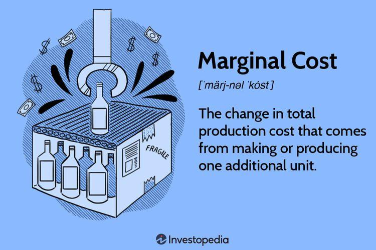

Understanding film production expenses is crucial for successful filmmaking as it lays the foundation for ensuring a project is completed efficiently and within its intended scope. A film's budget is a financial blueprint that enables producers to allocate resources effectively, manage the expectations of stakeholders, and mitigate financial risk. The significance of budgeting lies not only in managing costs but also in maximizing the quality and profitability of the film. Proper budget management can dictate the caliber of talent employed, the quality of special effects used, and the overall production value, thereby directly influencing a film's success both critically and at the box office.

Budgeting's impact on a film's quality and profitability cannot be overstated. Films that overspend are often unable to recoup their investments, while those that scrimp too much may fall short in production value, affecting their reception and earning potential. Therefore, strategic budget allocation is key, helping to balance the creative ambitions of the filmmakers with the financial realities of production. This allocation involves anticipating potential overruns and planning for contingencies, thereby safeguarding the project from common pitfalls such as delays or unexpected costs.



In recent years, the introduction of algorithmic trading concepts to budgeting has provided a novel approach to managing film production expenses. Algorithmic trading, originally used in financial markets to automate the buying and selling of securities through pre-programmed criteria, shares several principles applicable to budgeting. These include data-driven decision-making, risk management, and predictive analytics. By correlating financial market strategies with film budgeting, producers can improve the forecasting of both expenses and revenues.

Further, data-driven approaches have influenced filmmaking costs by enabling producers to analyze historical data, assess market trends, and predict audience responses. These insights can optimize expenditure, predict box office performance, and guide marketing strategies, ultimately leading to more informed budgeting decisions. The integration of advanced data analytics into film production can lead to adaptive budgeting processes, creating dynamic models that respond to real-time data changes and shifts in market conditions.

The purpose of this article is to explore the intersection of film budgets and algorithmic trading, providing insights into how data-driven methodologies can enhance traditional budgeting practices. This exploration aims to equip filmmakers with the tools and knowledge to integrate algorithmic insights into their production strategies. By understanding these cutting-edge techniques, the industry can progressively adapt to a more analytical and systematic approach to budgeting, ultimately encouraging a more balanced relationship between creativity, cost efficiency, and technological advancement.

## Table of Contents

## Breakdown of Film Production Expenses

Film production expenses are integral to the success of any cinematic project, impacting both the creative process and the final profitability. This section provides a detailed breakdown of these expenses, categorized into the major stages of filmmaking: pre-production, production, and post-production.

### Pre-Production Costs

Pre-production encompasses the planning phase of filmmaking, where numerous critical decisions are made. Key expenses include:

- **Script Development**: Costs involved in writing and refining the screenplay, including payments to writers and script consultants.
- **Casting**: Fees paid to casting directors and audition expenses.
- **Location Scouting**: Costs associated with finding and securing shooting venues.
- **Legal Fees**: Expenses for obtaining rights, permits, and contracts essential for production.

### Production Expenses

During the production stage, filming takes place, involving a broader range of expenditures:

- **Above-the-Line Expenses**: These costs are related to major creative talent and intellectual property rights. They encompass salaries for leading cast members, producers, directors, and screenwriters.
- **Below-the-Line Expenses**: These relate to the technical and logistical aspects of production, including:
  - **Crew Wages**: Salaries for technical crew members such as camera operators and lighting technicians.
  - **Location Fees**: Payments for the usage of filming locations.
  - **Equipment Rentals**: Costs for renting cameras, lighting, and sound equipment.
  - **Set Construction and Wardrobe**: Expanses for building sets and creating costumes.

### Post-Production Costs

Post-production refers to assembling and editing the footage to create the final product. Expenses include:

- **Editing**: Fees for editors and post-production facilities.
- **Visual Effects**: Costs for CGI and other special effects.
- **Music and Sound Design**: Payments for composers, sound editors, and sound mixing services.

### Contingency Funds and Unexpected Costs

Contingency funds are critical in budgeting to accommodate unforeseen expenses, which can arise from schedule overruns, equipment damage, or other unexpected events. The standard practice is to allocate about 5-10% of the total budget as a contingency reserve.

### Real-Life Examples

Consider the budget breakdown of a film like "Mad Max: Fury Road", which reportedly had a production budget of approximately $150 million[^[1^]]. A significant portion was allocated to special effects and rigorous location shoots, exemplifying the importance of strategic budget allocation.

### Managing and Forecasting Expenses

For effective management and forecasting of film production expenses, several strategies are employed, including:

- **Detailed Budgeting Grids**: They help in tracking every line item, ensuring expenditures remain within the allocated budget.
- **Software Tools**: Tools like Movie Magic Budgeting are widely used for creating detailed budgets and financial reports.
- **Predictive Analytics**: Employing data analysis to predict potential cost overruns and revenue forecasting.

Effective expense management not only ensures that projects stay on budget but also enhances the capacity to allocate resources efficiently, thus maximizing both creative output and financial return.

**References:**
1. IMDB.com. "Mad Max: Fury Road (2015) - Financial Information." Accessed October 10, 2023. [Link](https://www.imdb.com/title/tt1392190/).

Note: The information presented here is for illustrative purposes and is based on publicly available data and estimates.

## Techniques for Effective Movie Budgeting

Effective movie budgeting is a cornerstone of successful filmmaking, as it ensures that a film is produced within financial constraints while maximizing creative output. Central to this process is detailed planning and comprehensive research. Before production begins, filmmakers must identify all potential costs, ranging from salaries and location fees to post-production expenses. Such thorough groundwork allows for the creation of a realistic and detailed budget that serves as a financial blueprint throughout the filmmaking process.

The tools available for budgeting have evolved significantly with technological advancements, offering filmmakers access to sophisticated software that streamlines the budgeting process. Programs like Movie Magic Budgeting and Celtx offer features to manage complex budgets, providing templates tailored to various genres and production types. These tools facilitate instantaneous updates and provide different budgeting scenarios, enabling producers to adapt to changing circumstances seamlessly.

Successful budget management is exemplified in several notable films. For instance, the independent film "Get Out" (2017), directed by Jordan Peele, was produced with a modest budget of $4.5 million yet grossed over $255 million worldwide. This achievement was partially due to meticulous budget planning and allocation, which prioritized essential elements such as cast and key production aspects, ensuring resources were spent effectively.

Incorporating risk assessment into budgeting is another critical technique. By identifying and evaluating potential risks, such as weather disruptions or fluctuating currency rates, filmmakers can allocate contingency funds to mitigate unforeseen expenses. This proactive approach reduces the likelihood of budget overruns that could jeopardize a project’s completion.

Predictive analytics offers an additional layer of precision in movie budgeting. By analyzing past film data, including genre trends, audience preferences, and market performance, producers can forecast potential revenues and expenses. This data-driven insight helps in making informed decisions about budget allocations, marketing strategies, and distribution plans. For example, the use of predictive models can help estimate box office performance based on factors like release timing and competition, reducing financial uncertainty.

Furthermore, technology serves as a critical [factor](/wiki/factor-investing) in cost savings, allowing filmmakers to cut expenses without sacrificing quality. Virtual production techniques, such as those employed in "The Mandalorian," leverage real-time rendering and LED screens to create immersive environments, reducing the need for expensive on-location shoots. Such innovations demonstrate the potential to maintain high-quality production values within budget constraints.

In summary, effective movie budgeting is underpinned by detailed planning, strategic use of software tools, and the integration of risk assessment and predictive analytics. By leveraging technology intelligently, filmmakers can optimize costs while preserving the artistic and narrative integrity of their projects. These techniques collectively contribute to the financial and creative success of films in an increasingly competitive industry.

## Algorithmic Trading Principles in Movie Budgeting

Algorithmic trading, a method that employs complex algorithms and automated systems to execute trading orders, offers valuable insights that can be translated into movie budgeting strategies. At its core, [algorithmic trading](/wiki/algorithmic-trading) leverages vast datasets and sophisticated mathematical models to maximize returns and minimize risks, principles that can effectively be applied to optimize film production costs.

# to Algorithmic Trading and Its Principles

Algorithmic trading relies on predefined criteria and computational technology to rigorously assess market conditions and execute trades at optimal times. This automated approach minimizes human error and emotional trading, making way for precision and efficiency. Key principles include data analysis, trend analysis, and risk management, all designed to ensure profitability and consistently balanced portfolios.

### Comparing Financial Market Strategies with Film Budgeting

Much like the financial markets, film production involves volatile costs and unpredictable outcomes. By adopting strategies employed in algorithmic trading, such as dynamic allocation of resources and predictive modeling, filmmakers can better manage these uncertainties. For example, structured budgeting models akin to risk-adjustment in trading can aid in evenly distributing funds to various aspects of production and adjusting as necessary to mitigate unforeseen expenses.

### Exploring Insights from Algo Trading That Apply to Cost Optimization in Filmmaking

The cost-optimization techniques used in algo trading involve efficient capital usage and leveraging data to foresee potential market movements. Applying these could involve analyzing previous film data to predict box office returns and adjust spending accordingly. Techniques such as sensitivity analysis can help identify key budget drivers and focus efforts on elements that will provide the highest marginal returns.

### Utilizing Data Analysis to Predict the Success and ROI of Films

Just as traders use data to forecast stock performance, filmmakers can employ analytics to predict a film's likely financial success. Regression analysis and [machine learning](/wiki/machine-learning) models can be deployed to evaluate factors such as genre trends, actor popularity, and historical box office data. For instance, a predictive model could be programmed in Python to assess the potential ROI based on these variables:

```python
from sklearn.linear_model import LinearRegression
import numpy as np

# Hypothetical data points
budget = np.array([[5000000], [10000000], [15000000], [20000000]])
box_office = np.array([30000000, 50000000, 75000000, 95000000])

# Create a linear regression model
model = LinearRegression()
model.fit(budget, box_office)

# Predict ROI for a new film budget
new_budget = np.array([[12000000]])
predicted_box_office = model.predict(new_budget)
predicted_roi = (predicted_box_office / new_budget) * 100
```

This code provides a framework for assessing financial outcomes based on budget allocations.

### Balancing Creative Decision-Making with Data-Driven Approaches

The challenge lies in harmonizing artistic vision with fiscal responsibility. Data analytics can inform decision-making without stifling creativity. Insights derived from algorithmic techniques should serve as guides, allowing creatives to allocate resources intelligently while achieving their artistic goals. Directors and producers can use these insights to identify where spending adds value to the project and where it does not.

### Benefits of an Algorithmic Approach to Budgeting in Volatile Markets

In a turbulent financial environment, algorithmic strategies provide stability and foresight. Film productions often face fluctuating costs due to changing market conditions and unforeseen disruptions (e.g., global events influencing distribution). An algorithmic approach allows for adaptive budgeting processes that can rapidly respond to financial shifts, minimizing risks and optimizing investment returns. 

Overall, by integrating algorithmic trading principles, filmmakers can better control budgets, enhance financial predictability, and achieve a healthier balance between innovation and economic feasibility.

## Case Studies: Success Stories and Lessons Learned

In the film industry, a well-managed budget can significantly influence a movie's success. Several films have demonstrated the potential of data-driven budgeting strategies, while others have provided cautionary tales through budget overruns. These examples highlight the impact of effective budget management on a film's box office success and critical reception.

### Notable Films with Data-Driven Budgeting Strategies

One of the most cited success stories in data-driven budgeting is the film "Paranormal Activity" (2007). With an initial budget of just $15,000, the filmmakers employed a meticulous approach to expense allocation, relying heavily on data to minimize costs. The use of simple locations, unknown actors, and limited special effects ensured the film stayed within budget. This strategic management, coupled with a viral marketing campaign, led to a box office revenue of approximately $193 million, showcasing an extraordinary return on investment (ROI).

Another example is "The Blair Witch Project" (1999), which utilized a unique marketing strategy to amplify its low budget of $60,000 into a $248 million revenue haul. The producers capitalized on the Internet's emerging power for viral marketing, significantly boosting interest in the film. This data-informed decision was pivotal in maximizing profits and set a precedent for future low-budget films seeking significant ROI through strategic planning.

### Algorithmic Insights for Cost Savings

Algorithmic insights have helped films identify potential cost-saving measures. For instance, movies using predictive analytics for location selection can avoid overspending on non-essential sites. Analyzing historical data on shoot durations and crew efficiency allows filmmakers to optimize production schedules, thereby reducing overtime costs and preventing budget overruns.

### Films Facing Budget Overruns

Conversely, films like "Waterworld" (1995) demonstrate the pitfalls of poor budget management. Initially budgeted at $100 million, the film's costs spiraled to $175 million due to unforeseen delays and expensive sets, resulting in financial pressure on the production studio. Similarly, "Heaven's Gate" (1980) suffered from extensive reshoots and extravagant spending, culminating in a budget of $44 million and a disappointing $3.5 million return at the box office. These examples underline the importance of maintaining a balance between creative ambition and financial prudence.

### Lessons in Balancing Creativity and Budget Constraints

Effective budget management requires balancing artistic vision with financial realities. Films like "Mad Max: Fury Road" (2015) illustrate that high creativity can coexist with budgetary discipline. The film employed innovative cost-control measures, such as building multipurpose sets and utilizing a tightly controlled shooting schedule, enabling it to achieve critical acclaim and box office success.

### Analyzing ROI of Differently Budgeted Films

The relationship between budget size and profitability is not linear; both low- and high-budget films can achieve substantial ROIs with strategic management. For example, "Joker" (2019), produced with a relatively modest budget of $55 million, grossed over $1 billion worldwide due to its strong narrative, marketing strategy, and audience engagement. The film's success highlights how careful fiscal planning and strategic risk-taking can lead to impressive financial outcomes.

### Impact on Box Office Success and Critical Acclaim

Budget management plays a crucial role in determining a film's financial success and critical reputation. Wisely allocated resources can enhance production quality, resulting in a product that resonates with audiences and critics alike. Effective budget management not only secures financial stability but also serves as a fundamental component for artistic achievement within the film industry. 

In summary, the nuanced interplay between creative processes and budgetary constraints underscores the importance of data-driven strategies in filmmaking. Films that harness predictive analytics and algorithmic insights are better positioned to navigate the volatile market, maximizing both artistic integrity and financial returns.

## Future Trends: The Role of AI and Automation

Artificial Intelligence (AI) and automation are increasingly shaping the future of film production budgeting by offering innovative solutions for streamlining processes, enhancing accuracy, and providing deeper insights.

**Predictions for the role of AI in film production budgeting** suggest that AI will play a pivotal role in transforming how budgets are formulated and managed. AI systems can process vast datasets to identify spending patterns, predict future costs, and recommend adjustments to maintain financial efficiency. For instance, predictive analytics can be employed to estimate the likely success of a film based on genre, cast, and historical performance metrics.

The integration of **machine learning** in financial analysis allows for more accurate forecasting. Machine learning algorithms, such as regression models or neural networks, can analyze previous budget data to identify trends and predict future budgetary requirements. This predictive capability aids producers in making informed decisions about resource allocation. A simple implementation in Python might involve using libraries like pandas for data manipulation and scikit-learn for building predictive models.

```python
from sklearn.model_selection import train_test_split
from sklearn.linear_model import LinearRegression
import pandas as pd

# Sample data
data = pd.DataFrame({
    'production_hours': [100, 200, 150, 300, 250],
    'budget_cost': [10000, 22000, 15000, 30000, 26000]
})

# Splitting data into training and testing
X = data[['production_hours']]
y = data['budget_cost']
X_train, X_test, y_train, y_test = train_test_split(X, y, test_size=0.2)

# Model training
model = LinearRegression()
model.fit(X_train, y_train)

```

Automation stands to **revolutionize budgeting processes** by reducing manual workload and error rates. Automating tasks such as cost tracking, invoice processing, and financial reporting not only speeds up these processes but also enhances accuracy. Automation tools can integrate data from various departmental budgets, allowing for real-time updates and unified financial oversight.

Moreover, **blockchain technology** offers potential advantages for managing production expenses through its decentralized and secure nature. Blockchain can ensure transparency and security in financial transactions, reducing fraud and enabling precise tracking of how funds are utilized throughout the production cycle.

However, there are **ethical considerations** when relying on AI for creative decision-making. While AI provides data-driven insights, excessive dependence might stifle creativity and constrain directors and producers who might opt for innovative choices that deviate from algorithmically suggested paths. Therefore, balancing AI-driven recommendations with human intuition remains critical to preserving the artistic essence of filmmaking.

The **balance between human intuition and algorithmic accuracy** in film budgets is exemplified by a hybrid approach that leverages AI for data analysis while encouraging creative professionals to interpret and apply these insights judiciously. AI, by predicting financial outcomes and offering strategic recommendations, can augment human decision-making but should not replace the nuanced understanding that filmmakers bring to their projects. Embracing AI and automation requires a philosophy that values both technological efficiency and the artistic integrity intrinsic to filmmaking.

## Conclusion

Strategic budgeting remains a cornerstone of effective filmmaking, ensuring that resources are allocated wisely to maximize both creative output and financial returns. As the film industry navigates the complexities of modern production, the integration of algorithmic insights continues to revolutionize how movie production expenses are managed. By leveraging data-driven strategies, filmmakers can anticipate financial pitfalls, optimize resource distribution, and enhance overall production quality.

The landscape of budgeting in the film industry is evolving rapidly, influenced by advances in technology and computational methods. Algorithmic trading principles, traditionally applied in financial markets, are now being harnessed to refine budget allocations. These techniques offer predictive analytics, enabling more accurate forecasting of revenues and expenses. This not only mitigates the risk of budget overruns but also aids in making informed decisions that balance creativity with financial viability.

Filmmakers are encouraged to embrace these data-driven approaches, which are becoming increasingly integral to successful production management. By adopting modern techniques such as machine learning and AI, the film industry can streamline budgeting processes, ultimately reducing costs without sacrificing quality. For instance, machine learning algorithms can analyze vast datasets to recommend optimal spending patterns or investment focuses, thereby aligning financial management with creative objectives.

Balancing the intricate interplay of creativity, costs, and technology necessitates a nuanced understanding of both art and science. While technology aids in efficient resource management, the essence of filmmaking—a deeply creative pursuit—must remain at the forefront. This balance ensures that while budgets are meticulously managed, the creative vision is not compromised.

Therefore, the call to action is clear: filmmakers should integrate cutting-edge budgeting methodologies to enhance their production practices. By adopting algorithmic insights and advanced technological tools, the film industry can foster creativity and innovation, ultimately leading to both critical acclaim and box office success. As these trends continue to shape the future of filmmaking, strategic budgeting will remain an indispensable element in the toolkit of every successful filmmaker.

## References & Further Reading

[1]: Bergstra, J., Bardenet, R., Bengio, Y., & Kégl, B. (2011). ["Algorithms for Hyper-Parameter Optimization."](https://papers.nips.cc/paper/4443-algorithms-for-hyper-parameter-optimization) Advances in Neural Information Processing Systems 24.

[2]: Prindle, B. (2010). ["Film Production Budgeting."](https://www.taylorfrancis.com/books/mono/10.4324/9781315223186/film-production-management-bastian-cleve) Creative Planet Network.

[3]: ["The Producer's Business Handbook: The Roadmap for the Balanced Film Producer"](https://www.taylorfrancis.com/books/mono/10.4324/9781315168579/producer-business-handbook-john-lee-jr-anne-marie-gillen) by John J. Lee Jr. & Rob Holt

[4]: ["Advances in Financial Machine Learning"](https://www.wiley.com/en-us/Advances+in+Financial+Machine+Learning-p-9781119482086) by Marcos Lopez de Prado

[5]: ["Predictive Analytics: The Power to Predict Who Will Click, Buy, Lie, or Die"](https://onlinelibrary.wiley.com/doi/book/10.1002/9781119172536) by Eric Siegel