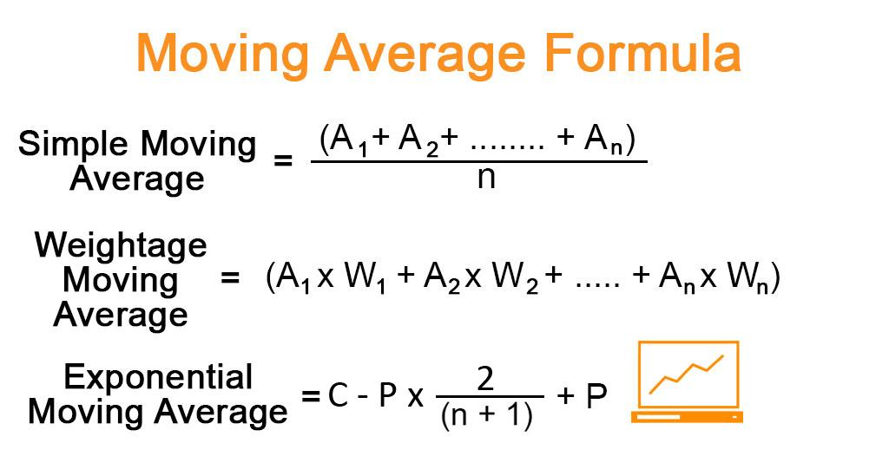

In the world of financial analysis and algorithmic trading, technical indicators are essential tools that assist traders in making informed decisions using historical data and market trends. Among these indicators, the moving average is particularly noteworthy as it serves a fundamental role in smoothing price data and identifying trends. The moving average is extensively utilized to determine the general direction of an asset's price movement and to forecast future trends, thereby providing critical insights for traders.

This article examines the role of moving averages within financial analysis and their application in algorithmic trading. Moving averages process historical price data to create a series of averages, smoothing out short-term fluctuations and highlighting longer-term trends. As an essential component of trading strategies, moving averages are used for both analysis and as a mechanism to guide trading decisions in automated systems.



Through this exploration, we aim to provide traders and analysts with a comprehensive guide to moving averages, illustrating how these tools can be leveraged to perform effective financial analysis and develop sophisticated trading models. By understanding the types of moving averages, including Simple Moving Average (SMA) and Exponential Moving Average (EMA), this piece will equip readers with the knowledge needed to incorporate moving averages into trading algorithms and enhance their analytical capabilities.

## Table of Contents

## Understanding Moving Averages

A moving average (MA) is a fundamental stock market indicator utilized extensively in financial analysis to even out price data fluctuations by creating a continuously updated average value. As a trend-following or lagging indicator, it is grounded in historical prices and thus reflects past market behavior. This characteristic makes moving averages especially useful in identifying the general direction of a trend and determining key support and resistance levels within the asset price movements.

The sensitivity of a moving average to changes in price is significantly affected by the length of the moving average period. A moving average calculated over a shorter period will respond more swiftly to price changes, making it more sensitive, whereas a moving average derived from a longer period will reflect a smoother trajectory, reacting less to minor fluctuations.

Among the different types of moving averages, the Simple Moving Average (SMA) and the Exponential Moving Average (EMA) are prominent due to their distinct analytical capabilities. The Simple Moving Average (SMA) calculates the average of a security’s closing prices over a specific number of periods. For instance, the formula for a 10-day SMA is:

$$
SMA = \frac{P_1 + P_2 + \ldots + P_{10}}{10}
$$

where $P_i$ represents the price at each period considered. This straightforward approach, however, results in the SMA having a higher lag compared to other forms of moving averages.

On the other hand, the Exponential Moving Average (EMA) places greater emphasis on more recent prices, which makes it more responsive to new information. The EMA is calculated using the formula:

$$
EMA_t = (P_t \cdot \alpha) + EMA_{t-1} \cdot (1 - \alpha)
$$

where $P_t$ is the current price, $EMA_{t-1}$ is the previous period's EMA, and $\alpha$ is the smoothing factor, typically calculated as $\frac{2}{n+1}$, with $n$ representing the number of periods.

Both SMA and EMA serve different analytical purposes and can be chosen by traders based on whether a more general trend indication or a more current price response is desired in their strategy. The strategic deployment of these moving averages assists traders and analysts in smoothing out the price data, thereby enabling a clearer picture of the asset's historical performance and making informed predictions about future market movements.

## Types of Moving Averages

Simple Moving Average (SMA) is a fundamental type of moving average employed widely in technical analysis. It is computed by taking the arithmetic mean of a set number of closing prices over a specified period. For instance, a 10-day SMA is obtained by summing the closing prices of the past 10 days and dividing by 10. This method smooths out price data, providing traders with a straightforward view of the market's trend. However, the SMA is known for its lagging nature, as it reacts slowly to rapid price changes due to its equal weighting on all data points within the period.

Exponential Moving Average (EMA) enhances the sensitivity of the moving average to recent price data. Unlike the SMA, the EMA assigns greater weight to more recent prices, making it more responsive to new information. This attribute is achieved through an exponential smoothing formula: 

$$

EMA_t = \alpha \times \text{Price}_t + (1-\alpha) \times EMA_{t-1} 
$$

where $\alpha$ is the smoothing factor, which depends on the number of periods chosen. The EMA's heightened responsiveness makes it an ideal tool for short-term traders aiming to capitalize on swift market movements.

Comparisons between SMA and EMA reveal distinct use cases aligned with trading strategies. SMA, due to its lagging nature, is often preferred in calm markets where the noise needs filtering and traders aim to capture long-term trends. Conversely, the EMA is favored in volatile markets where reacting quickly to price changes is crucial. The choice between SMA and EMA depends significantly on the market conditions and individual strategy preferences of the trader.

Weighted Moving Averages (WMA) offer a customizable alternative by allowing traders to assign different weights to each period within the moving average calculation, typically giving more importance to recent prices but in a linear fashion as opposed to the exponential approach of EMAs. This flexibility permits traders to adjust the moving average according to specific analytical needs, potentially offering a balanced characteristic between the SMA and EMA depending on how the weights are configured. These diverse types of moving averages enable traders, through a nuanced understanding, to tailor their strategies for various market scenarios and to enhance their decision-making process.

## Moving Averages in Financial Analysis

Moving averages play a critical role in financial analysis, particularly in identifying overall market trends and interpreting price fluctuations in financial assets. Their primary function is to smooth out the [volatility](/wiki/volatility-trading-strategies) in price data, providing analysts and investors with a clearer picture of the trend direction. This smoothing effect allows for more reliable assessments of market movements, mitigating the impact of short-term fluctuations that could otherwise obscure the longer-term trend.

Analysts often rely on moving averages to inform their trading decisions, using historical price patterns as a guide. For instance, when the price moves above a moving average, it is often interpreted as a signal to buy, while a price below the moving average may signal a sell. This is due to the perception that the moving average represents a support level in an uptrend and a resistance level in a downtrend.

Moving averages also prove invaluable in predicting future price movements. By analyzing past price data, financial analysts can extrapolate potential future trends and price directions. Additionally, moving averages help in risk assessment, offering a systematic approach to understanding the volatility and stability of financial assets. This is particularly useful in optimizing portfolios by balancing the risk and return profiles based on historical data.

One common application of moving averages in financial analysis is portfolio optimization. By indicating when to buy or sell assets, moving averages assist investors in aligning their trading actions with realistic price expectations. This not only helps in maximizing returns but also in minimizing potential losses, as investors are less likely to react impulsively to short-term market volatility.

Moreover, moving averages provide essential insights for making sense of price fluctuations. For instance, during periods of high volatility, moving averages help investors maintain focus on the broader trend, thus aligning their strategies with long-term objectives. This long-term perspective is especially beneficial for institutional investors and long-term equity holders, as it reduces the noise generated by short-term market volatility, leading to more informed and strategically sound decisions.

In summary, moving averages are a fundamental component of financial analysis, utilized widely for their ability to simplify complex market data and provide clear, actionable insights. By smoothing out the irregularities in price movements, they enable analysts and investors to make strategic decisions based on more consistent and reliable trend assessments.

## Algorithmic Trading and the Use of Moving Averages

In [algorithmic trading](/wiki/algorithmic-trading), moving averages are instrumental in automating trend identification and generating buy or sell signals. Moving averages serve as a foundational element in numerous trading strategies due to their ability to provide objective and quantifiable data that adapts to market conditions.

A primary strategy in algorithmic trading is the moving average crossover. This technique employs both short-term and long-term moving averages to assess market [momentum](/wiki/momentum) and predict potential shifts. The crossover strategy typically involves two moving averages—an Exponential Moving Average (EMA) and a Simple Moving Average (SMA). The short-term MA is more responsive to recent price changes, whereas the long-term MA presents a broader view. A common trading rule is that a buy signal is triggered when the short-term MA crosses above the long-term MA, indicating upward momentum. Conversely, a sell signal occurs when the short-term MA crosses below the long-term MA.

Algorithmic systems derive significant advantages from moving averages due to their straightforward calculability and the clarity they bring to trend-following decisions. The formula for a simple moving average over $n$ periods is:

$$
SMA_t = \frac{P_{t - n + 1} + P_{t - n + 2} + \ldots + P_{t}}{n}
$$

where $P$ represents the closing prices. Similarly, the exponential moving average is given by:

$$
EMA_t = P_t \times \left(\frac{2}{n+1}\right) + EMA_{t-1} \times \left(1-\frac{2}{n+1}\right)
$$

Backtesting is a vital component in refining trading algorithms that use moving averages. This process involves testing an algorithm on historical data to evaluate its effectiveness and optimize performance. Through [backtesting](/wiki/backtesting), traders can assess how moving averages would have signaled trades under past conditions, allowing fine-tuning of parameters like the period length to improve results. The integration of moving averages in algorithmic trading not only enhances dynamic decision-making but also improves the consistency and reliability of trade executions in fluctuating markets.

The adaptability and precise nature of moving averages make them invaluable in creating robust algorithmic trading systems that respond well to various market scenarios, providing both entry and [exit](/wiki/exit-strategy) points aligned with defined risk parameters and investment strategies.

## Examples and Case Studies

Moving averages have been extensively employed in automated trading systems due to their ability to filter out market noise and emphasize the underlying trend. This attribute makes them essential components in numerous algorithmic trading strategies, thus providing a strategic edge.

One noteworthy case study is the use of moving average crossovers. This strategy involves short-term and long-term moving averages to generate buy or sell signals. A common setup uses the 50-day and 200-day simple moving averages (SMA). When the 50-day SMA crosses above the 200-day SMA, it generates a bullish signal, suggesting increasing momentum. Conversely, when it crosses below, it indicates bearish market conditions. This strategy, often referred to as the "Golden Cross" and "Death Cross," has historically been a reliable predictor of significant market movements. For instance, the Golden Cross on US equities in April 2009 marked the end of the Great Recession, signaling a prolonged bull market.

In terms of automated trading systems, moving averages form the backbone of many quantitative models. Consider a Python-based algorithmic trading strategy relying on the Exponential Moving Average (EMA) for short-term trend detection. Here’s a simplified example:

```python
import pandas as pd

def ema_strategy(data, short_window=12, long_window=26):
    data['ShortEMA'] = data['Close'].ewm(span=short_window, adjust=False).mean()
    data['LongEMA'] = data['Close'].ewm(span=long_window, adjust=False).mean()

    # Generate signals
    data['Signal'] = 0
    data['Signal'][short_window:] = np.where(data['ShortEMA'][short_window:] > data['LongEMA'][short_window:], 1, -1)

    return data

# Example usage with a DataFrame 'df' containing historical close prices
trade_data = ema_strategy(df)
```

In this example, the algorithm computes the short EMA for the 12-day period and the long EMA for the 26-day period. A signal is generated whenever the short EMA crosses the long EMA, either to the upside or downside. This systematic approach exploits the responsiveness of the EMA to recent price changes, beneficial in fast-moving markets.

Historically, moving averages have also proven effective in spotting major pivot points in market history. For example, the moving average convergence divergence (MACD), which operates on the differences between EMAs, provided advance warning of substantial trends prior to the dot-com bubble burst in early 2000. Traders who incorporated MACD with moving average strategies managed to mitigate losses by exiting positions early or adopting short positions.

In summary, moving averages not only provide a tool for smoothing data, but they are pivotal in crafting robust trading algorithms. Systems exploiting moving average signals have consistently achieved competitive advantages, acting as a crucial decision-making component in both high-frequency and long-term investment strategies.

## Conclusion

Moving averages are crucial in connecting the principles of technical analysis with the precision of algorithmic trading. By providing a clear depiction of price trends, they offer traders and analysts a reliable method to interpret market data. This clarity facilitates the development of strategies that are both systematic and adaptive to market dynamics.

When integrated into trading strategies, moving averages enhance decision-making by summarizing past price data and highlighting potential entry and exit points. Their ability to smooth out market noise results in more strategic positioning, allowing traders to respond effectively to emerging trends. As a versatile tool, they serve the diverse needs of both active traders, who require quick responses to market changes, and long-term investors, who benefit from using refined signals to mitigate risk over extended periods.

The future of algorithmic trading holds promise for further innovation in the application of moving averages. Advancements could lead to more sophisticated algorithms, capable of deeper learning and adaptation. To capitalize on these innovations, traders must stay informed about the latest developments and continuously refine their strategies in response to an evolving market environment. This commitment to staying updated ensures that moving averages remain a potent tool in the trader's arsenal, capable of yielding insights and competitive advantages.

## References & Further Reading

[1]: ["Technical Analysis of the Financial Markets: A Comprehensive Guide to Trading Methods and Applications"](https://www.amazon.com/Technical-Analysis-Financial-Markets-Comprehensive/dp/0735200661) by John J. Murphy

[2]: ["Moving Averages in Algorithmic Trading: Simple, Exponential, and Beyond"](https://www.liberatedstocktrader.com/moving-average/) - Investopedia

[3]: ["Quantitative Technical Analysis: An integrated approach to trading system development and trading management"](https://resources.caih.jhu.edu/papersCollection/virtual-library/_pdfs/quantitative_technical_analysis_an_integrated_approach_to_trading_system_development_and_trading_management.pdf) by Howard B. Bandy

[4]: Brock, W., Lakonishok, J., & LeBaron, B. (1992). ["Simple Technical Trading Rules and the Stochastic Properties of Stock Returns"](https://www.jstor.org/stable/2328994) The Journal of Finance.

[5]: Appel, G., & Hitschler, F. (2008). ["Technical Analysis: Power Tools for Active Investors"](https://www.amazon.com/Technical-Analysis-Power-Active-Investors/dp/0132930048) - FT Press

[6]: ["The Complete Guide to Moving Averages"](https://www.tradingview.com/chart/AAPL/UcUQgSNv-Mastering-Moving-Averages-A-Comprehensive-Guide-for-Traders/) - Investopedia