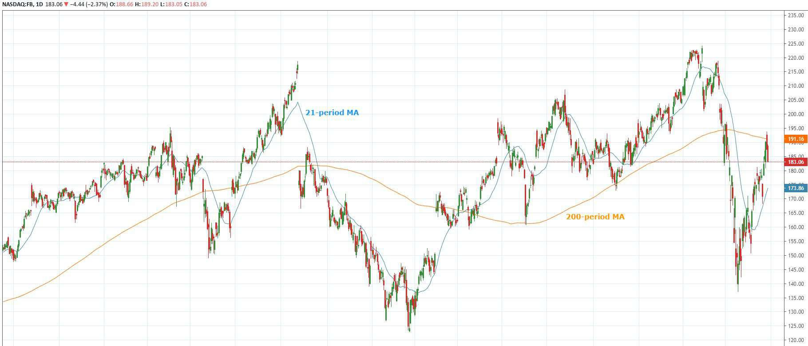

Financial charts serve as essential tools for data analysis, offering valuable insights into market trends and price movements. They distill complex data into visual representations, enabling both novice and seasoned traders to make informed decisions. Within the diverse toolkit of financial chart analysis, moving averages stand out as a crucial component. By smoothing out price data over a specific period, moving averages help traders filter out market noise and recognize underlying trends.

Moving averages vary in calculation methods, with the most common being the Simple Moving Average (SMA) and the Exponential Moving Average (EMA). These averages provide a foundational element for developing trading strategies in automated systems. Algorithmic trading, which relies heavily on data analysis and statistical insights, leverages the systematic and formulaic approach of moving averages.



The integration of moving averages in financial charts not only aids in the visual analysis but also supports algorithmic systems in automating and optimizing trading strategies. Traders employ moving average techniques to craft strategies that can capitalize on identified patterns and predicted trends, enabling more precise and timely trading decisions.

This article will discuss how moving averages are employed in financial charts to enhance algorithmic trading. By understanding the mechanics and applications of moving averages, traders can refine their automated trading systems, ultimately achieving more reliable and strategically sound outcomes in financial markets.

## Table of Contents

## Understanding Moving Averages

A moving average (MA) is a statistical calculation used to analyze data points by creating a series of averages of different subsets of the full data set. In financial markets, moving averages are widely utilized to smooth out price data over a specific period to help traders filter out short-term fluctuations, or "noise," and identify more stable and underlying price trends. This makes them invaluable for technical analysis and the development of trading strategies.

Two of the most common types of moving averages are the Simple Moving Average (SMA) and the Exponential Moving Average (EMA). The Simple Moving Average is calculated by taking the arithmetic mean of a given set of values. For instance, an SMA over 10 days is calculated by adding the closing prices from the last ten days and dividing the total by ten. The formula for SMA is:

$$

SMA = \frac{P_1 + P_2 + ... + P_n}{n} 
$$

where $P$ represents each period price and $n$ is the number of periods.

The Exponential Moving Average, on the other hand, assigns greater weight to more recent prices, making it more reactive to new information. This prioritization helps in capturing price [momentum](/wiki/momentum) and detecting more recent trends more effectively than the SMA. The EMA is calculated using the formula:

$$

EMA_t = \alpha \times P_t + (1 - \alpha) \times EMA_{t-1} 
$$

where $\alpha$ is the smoothing constant, calculated as $\alpha = \frac{2}{n+1}$, $P_t$ is the current price, and $EMA_{t-1}$ is the previous period's EMA value.

The choice between using an SMA or EMA often depends on the trader's specific objectives and market conditions. The SMA's simplicity and ease of calculation make it suitable for investors looking to get a broad sense of direction without overreacting to market fluctuations. Conversely, the EMA's sensitivity to recent prices can be advantageous for identifying short-term trend reversals, particularly in volatile markets.

Ultimately, the type of moving average selected is influenced by the trading strategy being deployed and the characteristics of the market environment. Traders may also use combinations of various types of moving averages as part of their trading systems to achieve a harmonious balance between sensitivity and stability in trend analysis.

## Types of Moving Averages

Simple Moving Average (SMA): A Simple Moving Average (SMA) is one of the most straightforward types of moving averages. It is calculated by summing up the closing prices of an asset over a specified number of periods and then dividing by the number of periods. This creates a series of averages that help smooth out price data, making it easier to identify trends. Although SMA does not apply any weighting, each data point gets equal importance. The formula for calculating the SMA is given by:

$$
\text{SMA} = \frac{P_1 + P_2 + \ldots + P_n}{n}
$$

Where $P_1, P_2, \ldots, P_n$ are the closing prices of the asset over $n$ periods.

Exponential Moving Average (EMA): The Exponential Moving Average (EMA) is designed to address the lag encountered with SMAs by giving more weight to the most recent prices. This makes the EMA more sensitive to recent price changes, allowing traders to capture trends more quickly. The EMA is calculated using a smoothing [factor](/wiki/factor-investing), which is determined by the following formula:

$$
\text{EMA}_t = \left( \frac{2}{n+1} \right) \times (P_t - \text{EMA}_{t-1}) + \text{EMA}_{t-1}
$$

Here, $P_t$ is the closing price at time $t$, $\text{EMA}_{t-1}$ is the EMA of the previous period, and $n$ represents the number of periods.

Weighted Moving Average (WMA): Unlike the SMA, the Weighted Moving Average (WMA) assigns different weights to different price levels, generally giving more importance to recent data. This type of moving average is useful for generating signals based on short-term fluctuations while maintaining a focus on overall trend direction. The WMA is calculated as follows:

$$
\text{WMA} = \frac{nP_1 + (n-1)P_2 + \ldots + 1P_n}{n + (n-1) + \ldots + 1}
$$

Where $P_1, P_2, \ldots, P_n$ are the prices of the asset, and $n$ is the longest period utilized.

These three types of moving averages form the foundation of how traders analyze price data. Each type has distinct characteristics suited for different market conditions and trading strategies, enabling traders to customize their approach towards data analysis and decision-making in financial markets.

## Moving Averages in Financial Analysis

Moving averages are extensively employed in financial analysis to identify and confirm market trends. By smoothing out fluctuations in price data, moving averages help analysts and traders gain clearer insights into the longer-term direction of market movement. One of the primary uses of moving averages is to establish support and resistance levels, which serve as critical indicators of potential price movements. These levels occur at price points on charts where the market historically has had difficulty surpassing. Support is the price level where a downward trend can be expected to pause due to demand concentration, while resistance is the upper boundary a price struggles to move past.

In practice, moving averages can help anticipate changes in investment trends. For example, when the stock price crosses above a moving average, it may signal the start of an upward trend. Conversely, a move below a moving average could indicate a potential downturn.

Moving averages also feature prominently in [backtesting](/wiki/backtesting), where they are used to evaluate trading strategy performance on historical data. Backtesting involves applying a trading strategy to past data to ascertain its potential efficacy without risking actual capital. By examining how strategies leveraging moving averages would have performed, analysts can refine and optimize trading systems for improved decision-making and risk management.

Consider the calculation of a simple moving average (SMA), which can be expressed in Python as follows:

```python
def calculate_sma(data, window_size):
    sma = []
    for i in range(len(data) - window_size + 1):
        sma.append(sum(data[i:i+window_size]) / window_size)
    return sma

price_data = [120, 122, 119, 121, 124, 125, 128, 130, 127, 125]
window_size = 3
simple_moving_average = calculate_sma(price_data, window_size)
```

In this example, the `calculate_sma` function calculates the SMA over a specified window size. Such computations are foundational to strategy development and are used to backtest trading models.

Overall, moving averages are indispensable in financial analysis, offering traders a systematic framework for making informed decisions based on historical trends and reducing market noise. They are integral in developing reliable risk management strategies, ultimately strengthening financial analysis and trading success.

## Algorithmic Trading Using Moving Averages

Algorithmic trading utilizes the systematic methodologies embedded within moving averages (MAs) to execute trades efficiently and effectively. MAs form the basis of various trading strategies by smoothing out price data to identify trends or reversals. A popular strategy employed in [algorithmic trading](/wiki/algorithmic-trading) is the crossover system. This involves at least two moving averages of different periods: a faster-moving average and a slower-moving average. The strategy generates buy or sell signals when these two MAs intersect. 

For example, a typical crossover approach involves a short-term EMA crossing above a long-term EMA, which may signal a buying opportunity, while the opposite crossing suggests a selling opportunity. This automation allows traders to capitalize on trends as they develop, without the need for continuous manual analysis.

The advantages of using MAs in algorithmic trading include their ability to structure trading decisions without emotional bias and enhance the speed and efficiency of trade execution. Algorithms based on MAs can be easily backtested, allowing traders to evaluate the viability of strategies over historical data. This process aids in refining strategies to fit particular market conditions or trader preferences.

In Python, a simple moving average crossover strategy can be implemented using libraries like pandas and numpy. Here is a basic example of such a strategy:

```python
import pandas as pd

# Assuming 'data' is a DataFrame with a 'Close' column for the stock prices
data['Short_MA'] = data['Close'].rolling(window=50).mean()
data['Long_MA'] = data['Close'].rolling(window=200).mean()

# Generate signals
data['Signal'] = 0
data['Signal'][50:] = np.where(data['Short_MA'][50:] > data['Long_MA'][50:], 1, -1)

# Positions based on signals
data['Position'] = data['Signal'].shift()

# Backtesting results, simple P&L position
data['Market_Returns'] = data['Close'].pct_change()
data['Strategy_Returns'] = data['Market_Returns'] * data['Position']

# Plot results or further analysis as required
```

In this script, moving averages are computed over 50 and 200 days to generate a signal for trading positions. Such strategies benefit from the clarity moving averages provide in detecting trends, optimizing execution timing, and maximizing returns, all hallmarks of successful algorithmic trading algorithms. The adaptability and robustness of MAs make them central elements in modern trading, contributing significantly to systematized and potentially more profitable trading strategies.

## Examples and Case Studies

Case studies highlight the practical implementation of moving averages in various market scenarios, illustrating their effectiveness in detecting trend shifts. One of the most renowned examples is the use of the 'Golden Cross' and 'Death Cross'. The 'Golden Cross' occurs when a short-term moving average, typically the 50-day moving average, crosses above a long-term moving average, such as the 200-day moving average. This event is generally interpreted as a bullish signal, indicating a potential upward trend in the market. Conversely, the 'Death Cross' represents a bearish signal, occurring when the short-term moving average crosses below the long-term moving average, suggesting a potential downward trend.

The efficacy of moving averages is often tested through algorithmic systems, which utilize historical data to backtest the effectiveness of trading strategies incorporating moving averages. When integrated into algorithmic trading, moving average strategies can be systematically evaluated to determine their performance across different market conditions. This backtesting involves simulating trades based on historical data to analyze potential outcomes and refine the trading strategy.

For example, a Python implementation can be used to backtest a moving average crossover strategy:

```python
import pandas as pd
import numpy as np

# Load historical price data
data = pd.read_csv('historical_prices.csv')
data['Date'] = pd.to_datetime(data['Date'])
data.set_index('Date', inplace=True)

# Calculate moving averages
data['SMA50'] = data['Close'].rolling(window=50).mean()
data['SMA200'] = data['Close'].rolling(window=200).mean()

# Define trading signals
data['Signal'] = np.where(data['SMA50'] > data['SMA200'], 1, -1)

# Simulate backtesting
data['Position'] = data['Signal'].shift()
data['Daily Returns'] = data['Close'].pct_change()
data['Strategy Returns'] = data['Position'] * data['Daily Returns']

# Calculate cumulative returns
cumulative_strategy_returns = (1 + data['Strategy Returns']).cumprod() - 1

# Output the results
print(data[['SMA50', 'SMA200', 'Signal', 'Daily Returns', 'Strategy Returns', 'Cumulative Returns']])
```

In this example, the script calculates the 50-day and 200-day simple moving averages and generates trading signals based on their crossover points. The strategy's performance is then evaluated by calculating and plotting the cumulative returns. By analyzing these results, traders can refine their strategies, optimizing for various market conditions and improving decision-making.

Ultimately, these examples and case studies underscore the significance of moving averages as technical indicators. Their ability to automate decisions and their utility in backtesting strategies make them invaluable tools in both manual and algorithmic trading.

## Conclusion

Moving averages serve as important instruments in the arsenal of technical analysis and algorithmic trading. They simplify the complexities of volatile market data, helping traders to discern trends without getting distracted by minor price fluctuations often referred to as 'noise'. By smoothing out these fluctuations, moving averages provide clearer signals that enable traders to make data-driven decisions. For example, a simple strategy involving moving averages is the use of crossover systems, where a faster-moving average crossing above a slower-moving average generates a buy signal, and vice versa for a sell signal. This systematic approach reduces emotional and subjective bias, paving the way for more disciplined trading practices.

The integration of moving averages into trading strategies has transformed how traders interact with financial markets. Moving averages facilitate risk management and enhance strategic planning by offering a structured framework for analyzing price trends. Traders can automate their strategies using moving averages, allowing them to execute trades based on predetermined rules. This automation not only reduces human error but also improves the efficiency and reliability of trading systems. Python, a popular language for algorithmic trading, can be utilized to implement moving average strategies. For instance, the `pandas` library can be used to compute moving averages and simulate backtesting of historical data to evaluate strategy performance.

In conclusion, moving averages enable traders to employ quantitative techniques for analyzing market behavior, leading to systematic and reliable trading outcomes. By embedding moving averages into algorithmic trading systems, practitioners can ensure that their trading strategies are grounded in sound technical analysis, ultimately fostering greater confidence in their decision-making processes.

## References & Further Reading

[1]: ["Quantitative Trading: How to Build Your Own Algorithmic Trading Business"](https://www.amazon.com/Quantitative-Trading-Build-Algorithmic-Business/dp/1119800064) by Ernest P. Chan

[2]: ["Machine Learning for Algorithmic Trading"](https://github.com/stefan-jansen/machine-learning-for-trading) by Stefan Jansen

[3]: ["Evidence-Based Technical Analysis: Applying the Scientific Method and Statistical Inference to Trading Signals"](https://www.amazon.com/Evidence-Based-Technical-Analysis-Scientific-Statistical/dp/0470008741) by David Aronson

[4]: ["Advances in Financial Machine Learning"](https://www.amazon.com/Advances-Financial-Machine-Learning-Marcos/dp/1119482089) by Marcos Lopez de Prado

[5]: Murphy, John J. ["Technical Analysis of the Financial Markets: A Comprehensive Guide to Trading Methods and Applications"](https://archive.org/details/technicalanalysi0000murp)