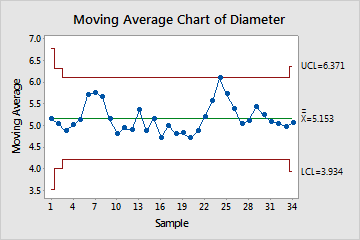

## Table of Contents

## What is a Moving Average Chart?

A Moving Average Chart is a tool used to show how data changes over time by smoothing out the ups and downs. It does this by taking the average of a set number of data points and plotting it on a graph. This helps people see trends more clearly because it reduces the impact of short-term changes and focuses on longer-term patterns.

For example, if you want to track the average monthly sales of a store over the past year, you could use a moving average chart. Instead of looking at the sales for each month separately, which might show big jumps or drops, the chart would show a smoother line that represents the average sales over several months. This makes it easier to understand if sales are generally increasing, decreasing, or staying the same over time.

## How do you calculate a simple moving average?

To calculate a simple moving average, you need to choose a time period, like 3 months or 5 days. Then, you add up the data values for that time period and divide by the number of values. For example, if you want a 3-day moving average of daily sales, you would add the sales for the first three days and divide by 3. The result is the moving average for that period.

As you move forward in time, you drop the oldest data point and add the newest one. So, for the next 3-day moving average, you would drop the sales from the first day, add the sales from the fourth day, and then divide by 3 again. This process continues, creating a series of averages that smooth out the ups and downs in your data. It helps you see the overall trend more clearly.

## What are the different types of moving averages?

There are several types of moving averages that people use to understand data trends. The simplest one is the Simple Moving Average (SMA). To calculate an SMA, you add up a set number of data points and divide by that number. For example, a 5-day SMA of stock prices would be the average of the last 5 days' prices. It's easy to understand and calculate, but it gives equal weight to all data points, which might not always be ideal.

Another type is the Exponential Moving Average (EMA). This one is a bit more complex because it gives more weight to recent data points. This means an EMA can react faster to new information compared to an SMA. For example, if a stock price suddenly changes, the EMA will show this change more quickly than the SMA. This can be useful for people who need to make quick decisions based on the latest data.

There are also other types of moving averages, like the Weighted Moving Average (WMA) and the Triangular Moving Average (TMA). A WMA gives different weights to data points, usually giving more weight to more recent data, similar to an EMA but with a different weighting method. A TMA is a type of SMA that is calculated twice, which makes it even smoother than a regular SMA. Each type of moving average has its own strengths and can be used depending on what kind of trend you want to see in your data.

## How can a Moving Average Chart be used in financial analysis?

In financial analysis, a Moving Average Chart helps people understand how prices of stocks, currencies, or other financial assets are changing over time. By using moving averages, analysts can smooth out the daily ups and downs in price data to see the bigger picture. For example, if someone is looking at the price of a stock over the last year, they can use a moving average chart to see if the stock's price is generally going up, down, or staying the same. This can help them decide if it's a good time to buy or sell the stock.

Moving Average Charts can also be used to spot trends and make predictions. For instance, if a stock's price is above its moving average, it might mean the stock is in an uptrend, which could be a good sign for investors. On the other hand, if the price is below the moving average, it might be in a downtrend, suggesting it could be time to sell. By comparing different types of moving averages, like a short-term and a long-term average, analysts can get even more insights. If a short-term average crosses above a long-term average, it's called a "golden cross" and is seen as a strong buy signal. If it crosses below, it's called a "death cross" and is seen as a sell signal.

## What are the benefits of using a Moving Average Chart for trend analysis?

Using a Moving Average Chart for trend analysis helps to see the bigger picture in data. It smooths out the small ups and downs, making it easier to spot if something is generally going up, down, or staying the same. For example, if you're looking at the price of a stock over time, a moving average chart can show you if the stock is in a long-term uptrend or downtrend, which can help you make better decisions about buying or selling.

Another benefit is that moving average charts can help predict future trends. By looking at how the moving average line is moving, you can guess where the price or data might go next. For instance, if the moving average line starts to go up, it might mean the price will keep going up too. This can be really useful for people who need to make decisions based on where they think things are headed.

## How do you determine the appropriate time period for a Moving Average Chart?

Choosing the right time period for a Moving Average Chart depends on what you want to see in your data. If you want to see short-term trends, you might use a smaller time period, like a 5-day or 10-day moving average. This can help you spot quick changes in your data. For example, if you're trading stocks and want to make fast decisions, a short-term moving average can show you if the stock price is moving up or down quickly.

On the other hand, if you're looking at long-term trends, you might choose a longer time period, like a 50-day or 200-day moving average. This can help you see the bigger picture and understand if something is going up, down, or staying the same over a longer time. For instance, if you're investing in stocks for the long term, a longer moving average can help you decide if it's a good time to buy or sell based on the overall trend.

## What are the common pitfalls when using Moving Average Charts?

One common pitfall when using Moving Average Charts is that they can make you think a trend is starting or ending when it's not. This happens because moving averages smooth out the ups and downs in the data, but they can still give false signals. For example, if the price of a stock goes up a little and then comes back down, the moving average might show a trend that isn't really there. This can lead people to make decisions based on something that turns out to be a short-term change, not a real trend.

Another issue is that moving averages can be slow to react to new information. Because they use past data to calculate the average, they might not show you what's happening right now. If the price of something suddenly changes a lot, the moving average might take a while to catch up. This can be a problem if you need to make quick decisions based on the latest data. It's important to use moving averages along with other tools and not rely on them alone to understand what's happening.

## How do Moving Average Charts help in identifying support and resistance levels?

Moving Average Charts can help people see where the price of something might stop going down or up. These places are called support and resistance levels. A support level is where the price often stops going down and starts to go back up. A resistance level is where the price often stops going up and starts to go back down. By looking at a moving average chart, you can see where the price has bounced off the moving average line many times. This can tell you that the moving average might be acting as a support or resistance level.

For example, if the price of a stock keeps going down to the moving average line but then starts to go up again, the moving average is acting like a support level. On the other hand, if the price keeps going up to the moving average line but then starts to go down again, the moving average is acting like a resistance level. Knowing these levels can help people decide when to buy or sell. If the price gets close to a support level, it might be a good time to buy because the price could go up from there. If it gets close to a resistance level, it might be a good time to sell because the price could go down from there.

## Can Moving Average Charts predict future price movements accurately?

Moving Average Charts can help guess where prices might go next, but they can't predict the future perfectly. They do this by showing the average price over time, which makes it easier to see if the price is going up or down overall. If the moving average line starts to go up, it might mean the price will keep going up too. But, moving averages look at past data, so they can be slow to show what's happening right now. This means they might not catch quick changes in price, and they can sometimes give false signals about where the price is going.

Because of this, it's important not to rely only on Moving Average Charts to make decisions about buying or selling. They are just one tool that can help you see trends and make guesses about the future. To get a better idea of what might happen, it's good to use Moving Average Charts along with other tools and information. This way, you can make more informed decisions and not be surprised by sudden changes in price.

## What are the limitations of using Moving Average Charts in volatile markets?

Moving Average Charts can be tricky to use in markets that change a lot. In these volatile markets, prices can go up and down quickly. Moving averages look at past data to make a smooth line, but they might not show these quick changes fast enough. This means that if the price suddenly jumps or drops, the moving average might still be showing an old trend. This can make it hard to make good decisions because the chart might not be showing what's really happening right now.

Because of this, people might get false signals from the moving average. For example, they might think the price is starting to go up when it's really just a short-term jump. Or they might think it's going down when it's just a quick drop. In a volatile market, these false signals can happen a lot, which can lead to bad choices about buying or selling. It's important to use other tools and information along with Moving Average Charts to get a better picture of what's going on in a fast-changing market.

## How do advanced traders combine Moving Average Charts with other technical indicators?

Advanced traders often use Moving Average Charts along with other tools to get a better understanding of the market. One common way is to use them with the Relative Strength Index (RSI). The RSI helps traders see if a stock is being bought or sold too much. If the RSI is high, it might mean the stock is overbought and could go down soon. If it's low, it might mean the stock is oversold and could go up. By looking at the RSI and the moving average together, traders can see if a trend is strong or if it might change soon.

Another tool that traders use with Moving Average Charts is the MACD, or Moving Average Convergence Divergence. The MACD shows the difference between two moving averages and can help traders see if the trend is getting stronger or weaker. When the MACD line crosses above the signal line, it might be a good time to buy. When it crosses below, it might be a good time to sell. By using the MACD with moving averages, traders can get a clearer picture of when to make their moves. This way, they can make better decisions by looking at more than just one piece of information.

## What statistical methods can be used to enhance the accuracy of Moving Average Charts?

One way to make Moving Average Charts more accurate is by using something called the Least Squares Method. This method helps find the best line that fits the data points. It does this by making the total difference between the line and the data points as small as possible. By using this line instead of a simple moving average, you can get a better idea of where the trend is going. This can be really helpful in markets that change a lot because it can show the trend more clearly and help you make better decisions.

Another way to improve the accuracy of Moving Average Charts is by using something called the Kalman Filter. This is a bit more complicated, but it helps by guessing what the next data point might be based on past data and how much the data changes. The Kalman Filter is good at dealing with data that has a lot of ups and downs, so it can make the moving average smoother and more accurate. By using these statistical methods, you can get a better picture of the trend and make more informed choices about buying or selling.

## What is Understanding Moving Averages?

A moving average (MA) is a statistical calculation used to analyze data points by creating a series of averages of different subsets of the full data set. In financial markets, moving averages are widely utilized to smooth out price data over a specific period to help traders filter out short-term fluctuations, or "noise," and identify more stable and underlying price trends. This makes them invaluable for technical analysis and the development of trading strategies.

Two of the most common types of moving averages are the Simple Moving Average (SMA) and the Exponential Moving Average (EMA). The Simple Moving Average is calculated by taking the arithmetic mean of a given set of values. For instance, an SMA over 10 days is calculated by adding the closing prices from the last ten days and dividing the total by ten. The formula for SMA is:

$$

SMA = \frac{P_1 + P_2 + ... + P_n}{n} 
$$

where $P$ represents each period price and $n$ is the number of periods.

The Exponential Moving Average, on the other hand, assigns greater weight to more recent prices, making it more reactive to new information. This prioritization helps in capturing price [momentum](/wiki/momentum) and detecting more recent trends more effectively than the SMA. The EMA is calculated using the formula:

$$

EMA_t = \alpha \times P_t + (1 - \alpha) \times EMA_{t-1} 
$$

where $\alpha$ is the smoothing constant, calculated as $\alpha = \frac{2}{n+1}$, $P_t$ is the current price, and $EMA_{t-1}$ is the previous period's EMA value.

The choice between using an SMA or EMA often depends on the trader's specific objectives and market conditions. The SMA's simplicity and ease of calculation make it suitable for investors looking to get a broad sense of direction without overreacting to market fluctuations. Conversely, the EMA's sensitivity to recent prices can be advantageous for identifying short-term trend reversals, particularly in volatile markets.

Ultimately, the type of moving average selected is influenced by the trading strategy being deployed and the characteristics of the market environment. Traders may also use combinations of various types of moving averages as part of their trading systems to achieve a harmonious balance between sensitivity and stability in trend analysis.

## What are the types of moving averages?

Simple Moving Average (SMA): A Simple Moving Average (SMA) is one of the most straightforward types of moving averages. It is calculated by summing up the closing prices of an asset over a specified number of periods and then dividing by the number of periods. This creates a series of averages that help smooth out price data, making it easier to identify trends. Although SMA does not apply any weighting, each data point gets equal importance. The formula for calculating the SMA is given by:

$$
\text{SMA} = \frac{P_1 + P_2 + \ldots + P_n}{n}
$$

Where $P_1, P_2, \ldots, P_n$ are the closing prices of the asset over $n$ periods.

Exponential Moving Average (EMA): The Exponential Moving Average (EMA) is designed to address the lag encountered with SMAs by giving more weight to the most recent prices. This makes the EMA more sensitive to recent price changes, allowing traders to capture trends more quickly. The EMA is calculated using a smoothing [factor](/wiki/factor-investing), which is determined by the following formula:

$$
\text{EMA}_t = \left( \frac{2}{n+1} \right) \times (P_t - \text{EMA}_{t-1}) + \text{EMA}_{t-1}
$$

Here, $P_t$ is the closing price at time $t$, $\text{EMA}_{t-1}$ is the EMA of the previous period, and $n$ represents the number of periods.

Weighted Moving Average (WMA): Unlike the SMA, the Weighted Moving Average (WMA) assigns different weights to different price levels, generally giving more importance to recent data. This type of moving average is useful for generating signals based on short-term fluctuations while maintaining a focus on overall trend direction. The WMA is calculated as follows:

$$
\text{WMA} = \frac{nP_1 + (n-1)P_2 + \ldots + 1P_n}{n + (n-1) + \ldots + 1}
$$

Where $P_1, P_2, \ldots, P_n$ are the prices of the asset, and $n$ is the longest period utilized.

These three types of moving averages form the foundation of how traders analyze price data. Each type has distinct characteristics suited for different market conditions and trading strategies, enabling traders to customize their approach towards data analysis and decision-making in financial markets.

## References & Further Reading

[1]: ["Quantitative Trading: How to Build Your Own Algorithmic Trading Business"](https://www.amazon.com/Quantitative-Trading-Build-Algorithmic-Business/dp/1119800064) by Ernest P. Chan

[2]: ["Machine Learning for Algorithmic Trading"](https://github.com/stefan-jansen/machine-learning-for-trading) by Stefan Jansen

[3]: ["Evidence-Based Technical Analysis: Applying the Scientific Method and Statistical Inference to Trading Signals"](https://www.amazon.com/Evidence-Based-Technical-Analysis-Scientific-Statistical/dp/0470008741) by David Aronson

[4]: ["Advances in Financial Machine Learning"](https://www.amazon.com/Advances-Financial-Machine-Learning-Marcos/dp/1119482089) by Marcos Lopez de Prado

[5]: Murphy, John J. ["Technical Analysis of the Financial Markets: A Comprehensive Guide to Trading Methods and Applications"](https://archive.org/details/technicalanalysi0000murp)