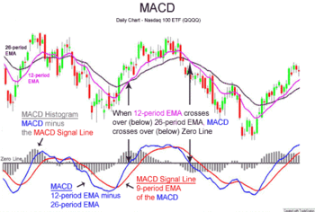

## Table of Contents

## What is the Moving Average Convergence Divergence (MACD) indicator?

The Moving Average Convergence Divergence (MACD) indicator is a popular tool used in technical analysis to help traders understand the momentum and possible trend changes in a stock or other financial instrument. It works by showing the relationship between two moving averages of an asset's price. The MACD is calculated by subtracting the 26-period Exponential Moving Average (EMA) from the 12-period EMA. The result of this calculation is the MACD line. A 9-period EMA of the MACD, called the signal line, is then plotted on top of the MACD line, which can help traders identify potential buy or sell signals.

When the MACD line crosses above the signal line, it is often seen as a bullish signal, suggesting that it might be a good time to buy. On the other hand, when the MACD line crosses below the signal line, it is considered a bearish signal, indicating that it might be a good time to sell. Additionally, traders also look at the MACD histogram, which shows the difference between the MACD line and the signal line. If the histogram is above zero, it indicates bullish momentum, and if it's below zero, it suggests bearish momentum. By using the MACD, traders can get a clearer picture of the market's direction and make more informed trading decisions.

## How is the MACD calculated?

The MACD is calculated by taking two moving averages of a stock's price. First, you find the 12-day Exponential Moving Average (EMA) of the stock's price. Then, you find the 26-day EMA of the same stock's price. The MACD line is the difference between these two EMAs. So, you subtract the 26-day EMA from the 12-day EMA. This line shows how the short-term trend is moving compared to the longer-term trend.

Next, a signal line is added to the MACD. This signal line is the 9-day EMA of the MACD line itself. Traders watch for when the MACD line crosses above or below this signal line. If the MACD line goes above the signal line, it's a sign that the stock might be starting to go up, which could be a good time to buy. If the MACD line goes below the signal line, it might mean the stock is starting to go down, which could be a time to sell. This helps traders see when trends might be changing.

## What are the components of the MACD?

The MACD has three main parts that help traders understand how a stock's price is moving. The first part is the MACD line. This is found by taking the 12-day Exponential Moving Average (EMA) of the stock's price and subtracting the 26-day EMA from it. The MACD line shows the difference between these two averages, helping to see if the short-term trend is moving faster or slower than the long-term trend.

The second part is the signal line. This is a 9-day EMA of the MACD line. Traders look at where the MACD line is compared to the signal line. If the MACD line goes above the signal line, it might mean the stock's price is starting to go up, which could be a good time to buy. If the MACD line goes below the signal line, it might mean the price is starting to go down, which could be a time to sell.

The third part is the MACD histogram. This shows the difference between the MACD line and the signal line. When the histogram is above zero, it means the stock has bullish momentum, which is good. When it's below zero, it means the stock has bearish momentum, which is not so good. By looking at the histogram, traders can see how strong the current trend is.

## What does the MACD line represent?

The MACD line is a key part of the MACD indicator. It shows the difference between two moving averages of a stock's price. One is the 12-day Exponential Moving Average (EMA), which looks at the price over a shorter time. The other is the 26-day EMA, which looks at the price over a longer time. By subtracting the 26-day EMA from the 12-day EMA, the MACD line helps traders see if the short-term trend is moving faster or slower than the long-term trend.

When the MACD line goes up, it means the short-term average is getting bigger compared to the long-term average. This can be a sign that the stock's price is starting to go up, which might be a good time to buy. When the MACD line goes down, it means the short-term average is getting smaller compared to the long-term average. This can be a sign that the stock's price is starting to go down, which might be a time to sell. By watching the MACD line, traders can get a better idea of where the stock's price might be headed next.

## What is the significance of the signal line in MACD?

The signal line in the MACD is a 9-day Exponential Moving Average (EMA) of the MACD line. It helps traders see when the trend of the stock's price might be changing. When the MACD line crosses above the signal line, it's like a green light that the stock's price might start going up. This can be a good time for traders to think about buying the stock. On the other hand, when the MACD line crosses below the signal line, it's like a red light that the stock's price might start going down. This can be a time for traders to think about selling the stock.

By watching the signal line, traders can get a clearer picture of what's happening with the stock's price. It's like having a helper that makes it easier to spot the right moments to buy or sell. The signal line smooths out the MACD line, making it easier to see the overall trend and not get confused by small ups and downs. This way, traders can make better decisions based on the bigger picture of the stock's price movement.

## How can the MACD histogram be used in trading?

The MACD histogram is a tool that shows the difference between the MACD line and the signal line. It helps traders see how strong the current trend of a stock's price is. When the histogram bars are above zero, it means the stock is in a bullish trend, which is good because it suggests the price might keep going up. On the other hand, when the histogram bars are below zero, it means the stock is in a bearish trend, which is not so good because it suggests the price might keep going down. By watching the height of the histogram bars, traders can tell if the trend is getting stronger or weaker.

Traders also use the MACD histogram to spot when a trend might be about to change. If the histogram bars start getting smaller, it could mean the current trend is losing strength. For example, if the bars were getting taller while above zero but start shrinking, it might be a sign that the bullish trend is fading, and it could be a good time to sell. Similarly, if the bars were getting taller while below zero but start shrinking, it might mean the bearish trend is weakening, and it could be a good time to buy. By paying attention to these changes, traders can make better decisions about when to buy or sell a stock.

## What are common MACD trading signals?

The MACD gives traders important signals to help them decide when to buy or sell a stock. One common signal is the MACD line crossing the signal line. If the MACD line goes above the signal line, it's a bullish signal. This means the stock's price might start going up, so it could be a good time to buy. If the MACD line goes below the signal line, it's a bearish signal. This means the stock's price might start going down, so it might be a good time to sell.

Another signal traders watch is the MACD histogram. When the histogram bars start getting taller above zero, it shows the bullish trend is getting stronger, which is good. If the bars start getting taller below zero, it shows the bearish trend is getting stronger, which is not so good. Traders also look for when the histogram bars start getting smaller. If the bars were tall and above zero but start shrinking, it might mean the bullish trend is losing strength, and it could be a good time to sell. If the bars were tall and below zero but start shrinking, it might mean the bearish trend is losing strength, and it could be a good time to buy.

## How can MACD be used to identify trend reversals?

The MACD can help traders see when a stock's price might start moving in the opposite direction, which is called a trend reversal. One way to spot this is by watching the MACD line and the signal line. If the MACD line was below the signal line but then crosses above it, it's a sign that the stock's price might start going up. This is called a bullish crossover. On the other hand, if the MACD line was above the signal line but then crosses below it, it's a sign that the stock's price might start going down. This is called a bearish crossover. By paying attention to these crossovers, traders can get a heads-up that the trend might be changing.

Another way to use the MACD to spot trend reversals is by looking at the MACD histogram. When the histogram bars start getting smaller, it can mean the current trend is losing strength. For example, if the bars were tall and above zero but start shrinking, it might mean the bullish trend is fading, and the price could start going down soon. If the bars were tall and below zero but start shrinking, it might mean the bearish trend is fading, and the price could start going up soon. By keeping an eye on these changes in the histogram, traders can get ready for a possible trend reversal and make better trading decisions.

## What are the limitations of using MACD as a trading tool?

Using MACD as a trading tool can be helpful, but it has some limitations. One big problem is that MACD can give false signals. Sometimes, the MACD line might cross above or below the signal line, but the stock's price doesn't actually go up or down like you thought it would. This can happen because the market can be unpredictable, and the MACD might not always catch the right trends. Also, MACD works best when there's a clear trend, but if the market is moving sideways without a strong trend, the MACD signals can be confusing and lead to bad trading decisions.

Another limitation is that MACD is based on past price data, so it might not always be the best tool for predicting future price movements. It's like trying to drive a car by only looking in the rearview mirror. You can see where you've been, but it's harder to know where you're going. Traders often use MACD along with other tools like charts and other indicators to get a better overall picture of what's happening in the market. This way, they can make more informed decisions and not rely too much on just one tool like the MACD.

## How can MACD be combined with other technical indicators for better results?

Combining the MACD with other technical indicators can help traders make better decisions. One popular combination is using MACD with the Relative Strength Index (RSI). The RSI measures how fast a stock's price is moving and if it's overbought or oversold. If the MACD shows a bullish crossover and the RSI is below 30, which means the stock might be oversold, it could be a strong signal to buy. On the other hand, if the MACD shows a bearish crossover and the RSI is above 70, indicating the stock might be overbought, it could be a good time to sell. By using both indicators together, traders can confirm their signals and avoid making trades based on just one tool.

Another useful combination is using MACD with moving averages. For example, traders might look at the 50-day and 200-day Simple Moving Averages (SMA) along with the MACD. If the MACD shows a bullish crossover while the stock's price is above both the 50-day and 200-day SMAs, it suggests a strong upward trend, making it a good time to buy. If the MACD shows a bearish crossover while the stock's price is below both SMAs, it suggests a strong downward trend, which might be a good time to sell. By combining these tools, traders can get a clearer picture of the market's direction and make more informed trading decisions.

## What are some advanced MACD strategies used by experienced traders?

Experienced traders often use a strategy called MACD divergence to spot when a stock's price might change direction. Divergence happens when the MACD line and the stock's price start moving in different ways. For example, if the stock's price keeps going up but the MACD line starts going down, it's called bearish divergence. This might mean the stock's price will start going down soon. On the other hand, if the stock's price keeps going down but the MACD line starts going up, it's called bullish divergence. This might mean the stock's price will start going up soon. By watching for these divergences, traders can get ready for possible trend reversals and make smarter trading choices.

Another advanced strategy is using the MACD histogram to find zero-line crossovers. When the histogram bars cross above the zero line, it's a sign that the stock might start going up, and when they cross below the zero line, it's a sign that the stock might start going down. Experienced traders look for these crossovers to spot new trends early. They also pay attention to the size of the histogram bars. If the bars are getting taller after a crossover, it means the new trend is getting stronger. By combining zero-line crossovers with other signals like MACD line crossovers, traders can get a better idea of when to buy or sell a stock.

## How does the choice of time frame affect the effectiveness of MACD?

The time frame you choose to use with the MACD can make a big difference in how well it works for you. If you use a short time frame like a few minutes or hours, the MACD can help you spot quick changes in a stock's price. This is good if you want to make fast trades and catch short-term trends. But, short time frames can also make the MACD give you more false signals because the market can be very jumpy in the short term. So, you might think a stock is going to go up or down, but it doesn't always happen.

On the other hand, if you use a longer time frame like days or weeks, the MACD can help you see bigger trends that last longer. This is good if you want to hold onto a stock for a while and not worry about every little up and down. Longer time frames usually give you fewer false signals because the market has more time to settle into a trend. But, it also means you might miss out on quick price changes that you could have caught with a shorter time frame. So, choosing the right time frame depends on what kind of trader you are and what you're trying to do with your trades.

## What is the MACD Indicator and How Does it Work?

The Moving Average Convergence Divergence (MACD) indicator is a fundamental tool employed by traders to assess the relationship between two moving averages of an asset's price, primarily relying on exponential moving averages (EMAs). The MACD is composed of three main components: the MACD line, the Signal line, and the Histogram, each serving an essential role in identifying momentum shifts and potential shifts in trend.

1. **MACD Components:**
   - **MACD Line:** This is calculated by subtracting the 26-period EMA from the 12-period EMA. The formula for this is:
$$
     \text{MACD Line} = \text{EMA}_{12} - \text{EMA}_{26}

$$
     This difference highlights changes in the asset's [momentum](/wiki/momentum).

   - **Signal Line:** A 9-period EMA of the MACD line, the Signal line assists in making buy or sell decisions based on crossovers that occur concerning the MACD line. It can be expressed as:
$$
     \text{Signal Line} = \text{EMA}_{9}(\text{MACD Line})

$$

   - **Histogram:** The difference between the MACD line and the Signal line is represented as the Histogram. It provides a visual representation of the momentum changes and helps detect convergences and divergences. The formula for the Histogram is:
$$
     \text{Histogram} = \text{MACD Line} - \text{Signal Line}

$$

2. **Convergence and Divergence:**
   - **Convergence** occurs when the two moving averages become closer, suggesting decreasing momentum of the current trend.
   - **Divergence** happens when the moving averages spread apart, indicating increasing momentum. Divergence often points to a potential continuation of the current trend or a reversal.

The MACD indicator is appreciated for its simplicity and effectiveness in showcasing crucial information about an asset's momentum and trend strength. Traders often utilize the signal crossover strategy, where a MACD line crossing above the Signal line is considered a bullish signal—indicating potential upward momentum—while a crossover below is seen as bearish—suggesting downward momentum. 

This approach to momentum analysis allows traders to make more informed decisions by visually decoding momentum shifts and trend strength onto charts, thus becoming an invaluable tool in the technical analysis toolkit.

## References & Further Reading

[1]: Appel, G. (2005). ["Technical Analysis: Power Tools for Active Investors"](https://www.amazon.com/Technical-Analysis-Power-Active-Investors/dp/0132930048) by Gerald Appel

[2]: Pring, M. J. (2002). ["Technical Analysis Explained"](https://www.amazon.com/Technical-Analysis-Explained-Fifth-Successful/dp/0071825177) by Martin J. Pring

[3]: Murphy, J. J. (1999). ["Technical Analysis of the Financial Markets"](https://www.amazon.com/Technical-Analysis-Financial-Markets-Comprehensive/dp/0735200661) by John J. Murphy

[4]: Chan, E. (2009). ["Quantitative Trading: How to Build Your Own Algorithmic Trading Business"](https://github.com/ftvision/quant_trading_echan_book) by Ernest P. Chan

[5]: Jansen, S. (2020). ["Machine Learning for Algorithmic Trading: Predictive models to extract signals from market and alternative data for systematic trading strategies with Python"](https://www.amazon.com/Machine-Learning-Algorithmic-Trading-alternative/dp/1839217715) by Stefan Jansen

[6]: ["Advances in Financial Machine Learning"](https://www.amazon.com/Advances-Financial-Machine-Learning-Marcos/dp/1119482089) by Marcos Lopez de Prado

[7]: Aronson, D. (2006). ["Evidence-Based Technical Analysis: Applying the Scientific Method and Statistical Inference to Trading Signals"](https://www.wiley.com/en-us/Evidence+Based+Technical+Analysis%3A+Applying+the+Scientific+Method+and+Statistical+Inference+to+Trading+Signals-p-9780470008744) by David Aronson