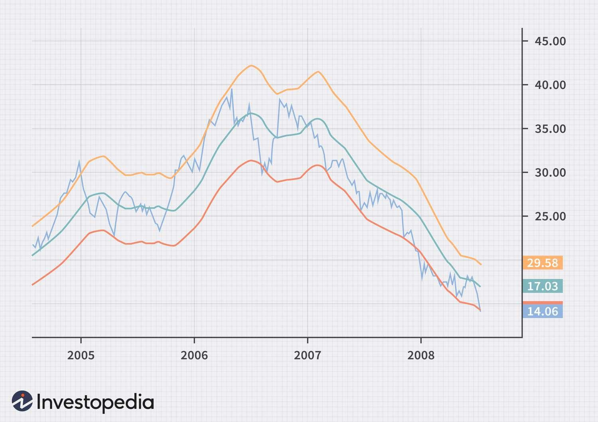

## Table of Contents

## What are Moving Average Envelopes and how do they work in trading?

Moving Average Envelopes are a technical analysis tool used by traders to help identify potential buy and sell signals in the market. They consist of two lines plotted around a moving average, creating an "envelope" around the price action. The upper line is set a certain percentage above the moving average, while the lower line is set the same percentage below it. This creates a channel that prices tend to move within, helping traders spot overbought and oversold conditions.

In trading, Moving Average Envelopes work by signaling potential entry and exit points. When the price touches or crosses the upper envelope, it might be a sign that the asset is overbought, suggesting a possible sell signal. Conversely, when the price touches or crosses the lower envelope, it might indicate that the asset is oversold, suggesting a potential buy signal. Traders often use these signals in combination with other indicators to confirm their trading decisions, as relying solely on Moving Average Envelopes can sometimes lead to false signals.

## How do you calculate Moving Average Envelopes?

To calculate Moving Average Envelopes, you first need to calculate a simple moving average (SMA) or an exponential moving average (EMA) of the price over a certain number of periods. This moving average acts as the middle line of the envelope. For example, if you're using a 20-day SMA, you would add up the closing prices of the last 20 days and then divide by 20 to get the average.

Next, you need to decide on a percentage to use for the upper and lower bands of the envelope. A common choice is 5%, but this can be adjusted based on the asset's volatility. To find the upper band, you multiply the moving average by 1 plus the percentage (e.g., 1.05 for 5%). To find the lower band, you multiply the moving average by 1 minus the percentage (e.g., 0.95 for 5%). So, if your 20-day SMA is $100, the upper band would be $105 (100 * 1.05) and the lower band would be $95 (100 * 0.95). These bands create the envelope around the moving average.

## What are the common settings for Moving Average Envelopes?

The most common settings for Moving Average Envelopes involve choosing the type of moving average and the period over which it is calculated. A popular choice is the Simple Moving Average (SMA) because it's easy to understand and calculate. The period for the moving average often ranges from 20 to 50 days for daily charts, but traders might use shorter periods for more volatile assets or longer periods for less volatile ones. The choice of period depends on the trader's strategy and the specific market they are trading in.

The other key setting is the percentage used to create the upper and lower bands of the envelope. A common percentage is 5%, meaning the upper band is set at 5% above the moving average and the lower band is set at 5% below it. However, this percentage can be adjusted based on the asset's volatility. For more volatile assets, traders might use a larger percentage, like 10%, to avoid too many false signals. For less volatile assets, a smaller percentage, like 2%, might be more appropriate.

## How can beginners use Moving Average Envelopes to identify buy and sell signals?

Beginners can use Moving Average Envelopes to spot good times to buy or sell by watching where the price touches the upper and lower lines of the envelope. When the price hits the upper line, it might mean the price is too high and could go down soon. This could be a sign to sell or not buy more. On the other hand, when the price touches the lower line, it might mean the price is too low and could go up soon. This could be a sign to buy or add to your position.

It's important for beginners to not just rely on Moving Average Envelopes alone. They should use them with other tools, like looking at the overall trend or using other indicators, to make better decisions. For example, if the price touches the lower line and other signs also show the price might go up, it could be a stronger signal to buy. By combining Moving Average Envelopes with other methods, beginners can get a clearer picture of when to buy or sell.

## What are the advantages of using Moving Average Envelopes in trading?

Using Moving Average Envelopes can help traders see when a price might be too high or too low. They draw lines above and below the average price, creating a channel. When the price touches the top line, it might mean the price is too high and could drop soon. When it touches the bottom line, it might mean the price is too low and could rise. This helps traders decide when to buy or sell, making it easier to spot good times to trade.

Another good thing about Moving Average Envelopes is that they can be adjusted to fit different situations. Traders can change the time period for the moving average and the percentage for the lines to match how much the price moves. This makes them useful for trading different kinds of assets, like stocks or cryptocurrencies. By tweaking these settings, traders can make better choices that fit their trading style and the market they are in.

## What are the potential drawbacks or limitations of Moving Average Envelopes?

One limitation of Moving Average Envelopes is that they can give false signals. Sometimes, the price might touch the top or bottom line, but it doesn't always mean it will go the other way. This can trick traders into buying or selling at the wrong time. To avoid this, traders need to use other tools and watch the market carefully to make sure the signals are real.

Another drawback is that Moving Average Envelopes can be slow to react to big changes in the market. They are based on past prices, so they might not catch quick moves in the market right away. This can be a problem if the market suddenly changes direction. Traders need to be aware of this and maybe use shorter time periods for the moving average if they want to see changes faster.

## How do Moving Average Envelopes compare to other technical indicators?

Moving Average Envelopes are different from other technical indicators because they focus on showing when a price is too high or too low. They do this by drawing lines around a moving average, creating a channel that the price moves in. This is different from indicators like the Relative Strength Index (RSI), which measures how fast the price is going up or down, or the Moving Average Convergence Divergence (MACD), which looks at the relationship between two moving averages to spot changes in the trend. While Moving Average Envelopes help spot overbought and oversold conditions, RSI and MACD give more information about the strength and direction of the trend.

Another way Moving Average Envelopes are different is that they can be adjusted to fit different situations. Traders can change the time period for the moving average and the percentage for the lines to match how much the price moves. This makes them useful for trading different kinds of assets. In contrast, indicators like Bollinger Bands also create a channel around a moving average, but they use standard deviation instead of a fixed percentage. This makes Bollinger Bands more responsive to changes in volatility, while Moving Average Envelopes give a more stable channel that might not react as quickly to big market moves.

## Can Moving Average Envelopes be used in conjunction with other indicators, and if so, how?

Yes, Moving Average Envelopes can be used with other indicators to make better trading choices. For example, a trader might use the Relative Strength Index (RSI) along with Moving Average Envelopes. If the price touches the lower line of the envelope and the RSI is below 30, it could be a strong sign that the price is oversold and might go up soon. This can give traders more confidence to buy. On the other hand, if the price touches the upper line and the RSI is above 70, it might mean the price is overbought and could drop, signaling a good time to sell.

Another way to use Moving Average Envelopes with other indicators is with the Moving Average Convergence Divergence (MACD). If the price hits the lower envelope and the MACD line crosses above the signal line, it could be a good sign to buy because it shows the price might start going up. If the price hits the upper envelope and the MACD line crosses below the signal line, it might be a good time to sell because it suggests the price could start going down. By combining Moving Average Envelopes with other indicators, traders can get a clearer picture of the market and make better trading decisions.

## How can traders adjust the parameters of Moving Average Envelopes to suit different market conditions?

Traders can change the settings of Moving Average Envelopes to make them work better in different markets. One way to do this is by adjusting the time period of the moving average. For markets that move a lot, traders might use a shorter time period, like 10 or 20 days, to catch quick changes. For markets that don't move as much, a longer time period, like 50 or 100 days, can help show the bigger picture. By choosing the right time period, traders can make the envelopes fit the market they are trading in.

Another way to adjust Moving Average Envelopes is by changing the percentage used for the upper and lower lines. If the market is very up and down, traders might use a bigger percentage, like 10%, to make the channel wider and avoid false signals. If the market is more steady, a smaller percentage, like 2% or 3%, can be used to make the channel narrower and catch smaller price moves. By tweaking these settings, traders can make Moving Average Envelopes work better for different market conditions and improve their trading decisions.

## What advanced strategies can expert traders employ with Moving Average Envelopes?

Expert traders can use Moving Average Envelopes in more advanced ways by combining them with other indicators and looking at different time frames. For example, they might use Moving Average Envelopes on both daily and hourly charts to see the bigger picture and the smaller details at the same time. If the price touches the lower line on the daily chart and also on the hourly chart, it could be a strong sign to buy. This helps traders make more confident decisions by seeing how the price is moving in different time frames.

Another advanced strategy is to use Moving Average Envelopes with other tools like the Relative Strength Index (RSI) or the Moving Average Convergence Divergence (MACD). If the price touches the lower line of the envelope and the RSI is below 30, it might mean the price is very oversold and could go up soon. If the MACD line crosses above the signal line at the same time, it adds more evidence that the price might start going up. By using Moving Average Envelopes with other indicators, expert traders can get a clearer picture of the market and make better trading choices.

## How do Moving Average Envelopes perform in different market environments, such as trending or ranging markets?

Moving Average Envelopes work well in markets that are moving sideways, which means the price is not going up or down a lot but staying in a range. In these markets, the price often bounces between the upper and lower lines of the envelope. Traders can use this to buy when the price touches the lower line and sell when it touches the upper line. This can help them make money as the price goes back and forth within the channel. But, if the market is very choppy and the price keeps breaking out of the envelope, it might lead to false signals and make it hard to trade.

In trending markets, where the price is going up or down steadily, Moving Average Envelopes can still be useful but in a different way. If the market is going up, traders might look for times when the price pulls back to the lower line of the envelope as a chance to buy. They can then ride the trend as the price goes back up. In a downtrend, they might sell when the price bounces up to the upper line. But, in strong trends, the price might stay above or below the envelope for a long time, so traders need to be careful and use other tools to confirm their trades.

## What are some real-world examples of successful trades using Moving Average Envelopes?

One real-world example of a successful trade using Moving Average Envelopes happened with a stock called XYZ. The stock had been moving sideways for a few weeks, staying within the channel created by the envelopes. A trader noticed that every time the price touched the lower line of the envelope, it would bounce back up. One day, the price hit the lower line again, and the trader decided to buy. A few days later, the price reached the upper line, and the trader sold, making a nice profit as the stock moved back and forth within the channel.

Another example is with a [cryptocurrency](/wiki/cryptocurrency) called ABC. The market was in a strong uptrend, and the price of ABC was steadily climbing. A trader using Moving Average Envelopes saw that whenever the price pulled back to the lower line, it would start going up again. The trader bought ABC when it touched the lower line and held onto it as the price continued to rise. When the price hit the upper line of the envelope, the trader sold some of their holdings to take profits but kept the rest, riding the trend higher. This strategy helped the trader make money by buying at the dips and selling at the peaks during the uptrend.

## What are Moving Average Envelopes and how do they work?

Moving average envelopes are a technical analysis tool used to identify trading signals and assess market trends. They consist of two bounds or "envelopes" set at a fixed percentage distance above and below a moving average. These envelopes help traders recognize potential overbought or oversold conditions and signal possible continuation or reversal points in price movements.

### Construction of Moving Average Envelopes

The construction of moving average envelopes involves two main components:

1. **Base Moving Average**: This is usually a simple moving average (SMA) or an exponential moving average (EMA) calculated over a specific period. The choice of moving average type and the number of periods depends on the trader's strategy and the timeframe being analyzed.
$$
   \text{SMA} = \frac{P_1 + P_2 + \ldots + P_n}{n}

$$

   where $P_i$ represents the price at each observed point, and $n$ is the number of periods.

2. **Envelopes**: These are lines plotted at a fixed percentage distance above and below the moving average. The percentage used for the envelope's width is usually based on historical volatility and personal risk appetite:
$$
   \text{Upper Envelope} = \text{SMA} \times (1 + \frac{\text{Percentage}}{100})

$$
$$
   \text{Lower Envelope} = \text{SMA} \times (1 - \frac{\text{Percentage}}{100})

$$

### Positioning Relative to Price Movements

The positioning of the envelopes relative to price movements offers insights into market conditions. When the price is near or breaks above the upper envelope, the asset may be considered overbought, indicating a possible selling opportunity or price reversal. Conversely, when the price is near or breaks below the lower envelope, the asset may be considered oversold, suggesting a potential buying opportunity.

### Significance of the Width of Envelope Bands

The width of the envelope bands is critical as it reflects market [volatility](/wiki/volatility-trading-strategies) and affects the sensitivity of the trading signals. Narrow bands might lead to frequent false signals in volatile markets, while excessively wide bands might miss important price signals. Traders often adjust the band width based on historical volatility, recent price behavior, and their risk management strategies.

### Visual Representation

To visualize moving average envelopes, various trading platforms allow users to plot these indicators over price charts. Consider the following Python code using the popular `matplotlib` and `pandas` libraries to plot a simple moving average envelope:

```python
import pandas as pd
import matplotlib.pyplot as plt

# Sample data creation (placeholders for actual price data)
price_data = pd.DataFrame({
    'Price': [100, 102, 101, 103, 105, 107, 106, 104, 108, 110]
})

# Simple moving average calculation
period = 5
price_data['SMA'] = price_data['Price'].rolling(window=period).mean()

# Envelope calculations (e.g., 2% envelope)
percentage = 2
price_data['Upper Envelope'] = price_data['SMA'] * (1 + percentage / 100)
price_data['Lower Envelope'] = price_data['SMA'] * (1 - percentage / 100)

# Plotting the price, SMA, and envelopes
plt.figure(figsize=(10, 6))
plt.plot(price_data.index, price_data['Price'], label='Price', color='black')
plt.plot(price_data.index, price_data['SMA'], label='SMA', color='blue')
plt.plot(price_data.index, price_data['Upper Envelope'], label='Upper Envelope', linestyle='--', color='red')
plt.plot(price_data.index, price_data['Lower Envelope'], label='Lower Envelope', linestyle='--', color='green')
plt.title('Moving Average Envelope')
plt.xlabel('Time')
plt.ylabel('Price')
plt.legend()
plt.show()
```

This code snippet demonstrates how to compute and visualize moving average envelopes, emphasizing their practical application in identifying trading windows based on historical price data. The width and position of the envelopes provide a visual cue that can aid traders in their decision-making process.

## References & Further Reading

[1]: Bergstra, J., Bardenet, R., Bengio, Y., & Kégl, B. (2011). ["Algorithms for Hyper-Parameter Optimization."](https://papers.nips.cc/paper/4443-algorithms-for-hyper-parameter-optimization) Advances in Neural Information Processing Systems 24.

[2]: ["Advances in Financial Machine Learning"](https://www.amazon.com/Advances-Financial-Machine-Learning-Marcos/dp/1119482089) by Marcos Lopez de Prado

[3]: ["Evidence-Based Technical Analysis: Applying the Scientific Method and Statistical Inference to Trading Signals"](https://www.amazon.com/Evidence-Based-Technical-Analysis-Scientific-Statistical/dp/0470008741) by David Aronson

[4]: ["Machine Learning for Algorithmic Trading"](https://github.com/stefan-jansen/machine-learning-for-trading) by Stefan Jansen

[5]: ["Quantitative Trading: How to Build Your Own Algorithmic Trading Business"](https://books.google.com/books/about/Quantitative_Trading.html?id=j70yEAAAQBAJ) by Ernest P. Chan