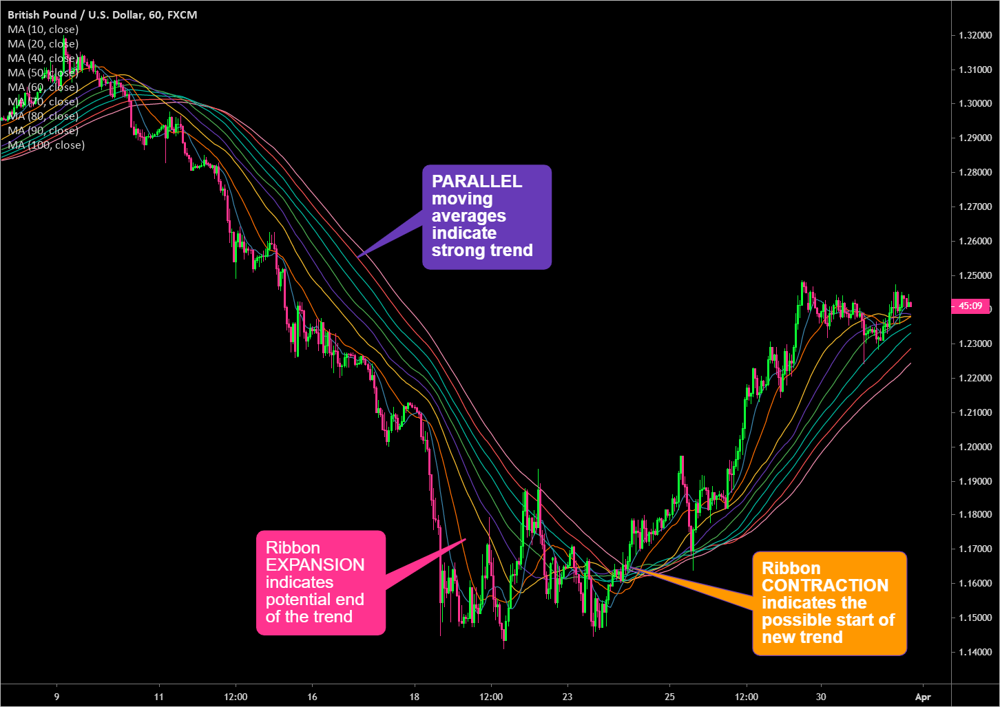

The stock market is an ever-evolving arena that requires traders to adapt and find new strategies to gain an edge. As market conditions shift due to economic, political, and social factors, traders often turn to technical analysis for insights into market behavior. Technical analysis provides various tools and indicators that aid traders in interpreting past price movements and predicting future trends. One such tool, the moving average ribbon, stands out for its ability to visually represent market trends and dynamics. This versatile indicator is employed in both manual and algorithmic trading to identify trends and potential trades, helping traders make informed decisions based on comprehensive market insights. This article will explore what a moving average ribbon is, how it works, and its application in algorithmic trading, offering traders the knowledge required to optimize their trading strategies in a competitive market landscape.

## Table of Contents



## What is a Moving Average Ribbon?

A moving average ribbon is a technical analysis tool comprising multiple moving averages displayed concurrently on a single chart. Each moving average within the ribbon is calculated over different lookback periods, giving the ribbon its distinct, layered appearance. This tool is particularly useful for identifying trends and different phases within the market. 

By varying the lookback periods, the moving average ribbon provides a nuanced analysis of market trends. When plotted, the series of moving averages create a visual representation of trend strength and market phases, such as consolidations or reversals. Traders utilize the ribbon to scrutinize the robustness of price trends, pinpoint potential support and resistance levels, and forecast possible trend reversals.

The flexibility of the moving average ribbon lies in its ability to be tailored according to the trader's requirements. This customization is achieved by adjusting both the number of moving averages included and the periods over which they are calculated. For example, a trader might choose to use a series of short, medium, and long-term moving averages to gain insights across different market time frames.

Using this tool, traders can better visualize how the market reacts to various pressures and adjust their strategies accordingly. The moving average ribbon's ability to provide clear and customizable insights into market conditions makes it a valuable instrument for technical analysis.

## Formula and Calculation

The formula for a simple moving average (SMA) consists of calculating the average of closing prices over a set number of time periods, providing a smoothed line that represents the overall trend of a dataset. This calculation is expressed as:

$$
SMA = \frac{P_1 + P_2 + \ldots + P_n}{n}
$$

where $P_1, P_2, \ldots, P_n$ are the closing prices over $n$ periods.

For a moving average ribbon, a trader selects several SMAs with varying time frames to create a series of overlapping averages on a chart. This builds a 'ribbon' that can visually illustrate the strength and direction of market trends. By using different periods for each SMA, the ribbon helps to identify subtle and overarching patterns within the market data.

In addition to SMAs, Exponential Moving Averages (EMAs) are also widely used in moving average ribbons. EMAs give more weight to recent data points, allowing for a more responsive indicator to recent price changes. The EMA formula differs slightly from the SMA, incorporating a smoothing [factor](/wiki/factor-investing), $\alpha$, which adjusts the weight of new data as follows:

$$
EMA_t = \alpha \times P_t + (1 - \alpha) \times EMA_{t-1}
$$

where $\alpha = \frac{2}{n+1}$, $P_t$ is the current price, $EMA_t$ is the current EMA value, and $EMA_{t-1}$ is the previous EMA value.

Traders implement these calculations using programming languages such as Python. Here’s a simple Python snippet to calculate an SMA and EMA:

```python
def calculate_sma(prices, period):
    return sum(prices[-period:]) / period

def calculate_ema(prices, period):
    ema = [sum(prices[:period]) / period]  # start with the SMA for the first EMA value
    alpha = 2 / (period + 1)
    for price in prices[period:]:
        ema_value = alpha * price + (1 - alpha) * ema[-1]
        ema.append(ema_value)
    return ema

# Example usage:
closing_prices = [1, 2, 3, 4, 5, 6, 7, 8, 9, 10]
print(calculate_sma(closing_prices, 5))  # Output: average of last 5 closing prices
print(calculate_ema(closing_prices, 5))
```

Using these calculations, traders can plot multiple moving averages with different periods on a chart to create a moving average ribbon, offering a versatile tool for market analysis and strategy development.

## Interpreting a Moving Average Ribbon

The moving average ribbon provides valuable insights into market direction through the relative positioning of the price in relation to the ribbon. When the current market price is above the moving average ribbon, it typically signals an uptrend. This suggests that the market is experiencing bullish [momentum](/wiki/momentum), with potential for continued upward movement. Conversely, if the price is below the ribbon, it indicates a downtrend, reflecting bearish sentiment and a likelihood of further decline.

The structure of the ribbon itself also provides clues about the market's behavior. If the lines of the moving average ribbon fan out, it is a strong indication of an ongoing trend. This spreading effect occurs when there is a clear and decisive direction in the market, bolstered by a strong price movement. In such cases, traders interpret this as a confirmation to follow the current trend, either continuing to hold long positions in an uptrend or short positions in a downtrend.

When the moving average ribbon's lines converge, it suggests market consolidation, where prices are moving within a narrow range without a clear upward or downward direction. This convergence is often a precursor to a trend reversal or a significant price move. Traders closely watch for potential breakouts following such consolidations, as they often provide the impetus for the next trend leg.

Understanding these movements allows traders to make informed decisions. Using the moving average ribbon is beneficial in identifying trend strength and potential turning points in the market, thus offering a strategic advantage in timing market entries and exits.

## Trading Strategies with Moving Average Ribbon

Increasing the number of moving averages in a moving average ribbon can enhance the detection of market trends by smoothing out price fluctuations. However, traders need to be cautious as this can also lead to a cluttered chart, complicating the interpretation of data. When constructing a ribbon, traders generally use multiple moving averages with different periods such as short, medium, and long-term averages, which together provide a deeper insight into the market's behavior.

One trading strategy involves identifying crossover points, which occur when a shorter-term moving average crosses over a longer-term moving average. This crossover is a critical signal that suggests a potential change in the market trend. For example, when a short-term moving average, such as a 10-day SMA, crosses above a long-term moving average, such as a 50-day SMA, it may indicate the beginning of an uptrend. Conversely, a crossover in the opposite direction could signal the start of a downtrend.

Here is a simple Python script to identify crossover points using pandas and matplotlib:

```python
import pandas as pd
import matplotlib.pyplot as plt

# Sample data for moving averages
data = {'Date': pd.date_range(start='1/1/2022', periods=100),
        'Close': np.random.rand(100) * 100}  # Replace with actual closing prices
df = pd.DataFrame(data)

# Create short-term and long-term moving averages
df['SMA_10'] = df['Close'].rolling(window=10).mean()
df['SMA_50'] = df['Close'].rolling(window=50).mean()

# Identify crossover points
df['Crossover'] = np.where(df['SMA_10'] > df['SMA_50'], 1, 0)

# Plotting the data
plt.figure(figsize=(14, 7))
plt.plot(df['Date'], df['Close'], label='Close', color='k', alpha=0.5)
plt.plot(df['Date'], df['SMA_10'], label='10-Day SMA', color='b')
plt.plot(df['Date'], df['SMA_50'], label='50-Day SMA', color='r')

# Highlight crossover points
for i in range(1, len(df)):
    if df['Crossover'].iloc[i] != df['Crossover'].iloc[i-1]:
        plt.axvline(x=df['Date'].iloc[i], color='g' if df['Crossover'].iloc[i] == 1 else 'r', linestyle='--')

plt.legend()
plt.title('Moving Average Crossover Strategy')
plt.show()
```

Using a combination of short, medium, and long-term moving averages allows traders to gain insights into various market trends simultaneously. For instance, while short-term moving averages can help capture recent market [volatility](/wiki/volatility-trading-strategies), medium and long-term averages can provide a broader view of the prevailing trends. This multi-faceted approach helps traders make more informed trading decisions by aligning short-term price movements with the overall market trend.

While employing these strategies, it is crucial for traders to balance between the number of moving averages and the readability of the chart. The goal is to effectively use the ribbon for detecting trends without overwhelming the visual clarity, thus ensuring it remains a useful tool in the trader's arsenal.

## Using Moving Average Ribbon in Algorithmic Trading

Algorithmic trading utilizes moving average ribbons as a tool to execute trades automatically, relying on predefined criteria derived from the ribbon's patterns. Traders use algorithmic systems to interpret the movement and arrangement of the multiple moving averages within the ribbon to identify market trends and signals for trade execution.

When implementing moving average ribbons in [algorithmic trading](/wiki/algorithmic-trading), traders program algorithms to recognize certain conditions involving the ribbon's structure, such as expansion, contraction, or crossover events. These conditions can signal potential entry or [exit](/wiki/exit-strategy) points. For instance, ribbon expansion, characterized by the moving averages spreading apart, may indicate a strengthening trend, prompting algorithms to maintain or increase position sizes in the trend's direction. Conversely, ribbon contraction suggests consolidation, potentially signaling algorithms to reduce positions or prepare for trend reversals.

Crossover signals serve as another critical factor when using moving average ribbons in algorithmic trading. These are generated when shorter-term moving averages intersect longer-term ones, often suggesting changes in trend direction. Algorithmic systems can be programmed to initiate buy or sell orders based on such crossover points. The flexibility in programming allows for adjustments in the sensitivity of the algorithm by modifying the moving average periods to suit specific trading styles or market conditions.

Moving average ribbons bring a systematic element to trend-following strategies. By analyzing the continuous interaction between moving averages, algorithms can efficiently adapt to varying market conditions without human intervention. Implementing these ribbons into an algorithmic setup involves the construction of a codebase capable of continuously monitoring ribbon behavior and executing trades based on pre-set rules.

An example of implementing a simple moving average crossover strategy in Python is as follows:

```python
import pandas as pd
import numpy as np

# Sample data setup
data = pd.DataFrame({
    'Close': [150, 152, 153, 157, 160, 162, 165, 167, 170, 173]
})

# Define the simple moving averages
data['SMA_5'] = data['Close'].rolling(window=5).mean()
data['SMA_10'] = data['Close'].rolling(window=10).mean()

# Define crossover signal
data['Signal'] = 0
data['Signal'][5:] = np.where(data['SMA_5'][5:] > data['SMA_10'][5:], 1, 0)

# Execute trades
data['Position'] = data['Signal'].diff()

# Display the results
print(data[['Close', 'SMA_5', 'SMA_10', 'Signal', 'Position']])
```

In this code snippet, a simple moving average crossover strategy uses a 5-day and a 10-day SMA. The algorithm generates a 'Signal' when the 5-day SMA crosses above the 10-day SMA, indicating a potential buy, and a change in 'Position' represents a trade execution.

Incorporating moving average ribbons into algorithmic trading takes advantage of their visual clarity and structured nature, allowing traders or developers to tailor strategies that align with their market outlook and risk tolerance. As algorithmic trading continues to grow, such tools remain integral in developing resilient and responsive trading systems.

## Advantages and Limitations

The moving average ribbon is a widely appreciated tool within technical analysis due to its ability to visually depict market trends, thereby aiding traders in the assessment of market direction. The visual layout of multiple moving averages plotted together helps traders quickly grasp the overarching trend of a security or market. This visualization can be particularly useful in distinguishing between bullish and bearish trends based on the positioning of price action in relation to the ribbon.

One of the principal advantages of the moving average ribbon is its adaptability. Traders can customize the ribbon by selecting various lengths and types of moving averages, such as Simple Moving Averages (SMA) or Exponential Moving Averages (EMA). This customization allows traders to tailor the indicator to align with their specific trading strategies and goals. For instance, a trader seeking to analyze short-term trends might use shorter moving averages, while another focusing on long-term trends might select longer periods.

However, the moving average ribbon is not without its limitations. Being a lagging indicator, its signals are based on past price data, which means it often reacts to price movements after they have already occurred. This delay can lead to entries and exits that are not optimally timed, potentially reducing the effectiveness of trades and impacting profits. For example, by the time a trader receives a crossover signal suggesting a new trend direction, the price may have already made a substantial move.

To mitigate the lagging nature of the moving average ribbon, it is beneficial for traders to use it in conjunction with other technical analysis tools and indicators. By combining the ribbon with leading indicators or complementary tools like support and resistance lines, [volume](/wiki/volume-trading-strategy) analysis, or momentum indicators, traders can enhance their market assessments and make more informed decisions. This integrative approach can help minimize risks associated with delayed signals and improve overall trading strategy effectiveness.

## Conclusion

The moving average ribbon is a valuable tool for traders looking to identify trends and make informed trading decisions. This technical indicator offers a layered view of market trends by combining multiple moving averages, each with different periods. This multi-faceted approach allows traders to observe the market more comprehensively.

However, it is crucial to integrate the moving average ribbon into a broader trading strategy. Relying solely on the ribbon for trading decisions can lead to missed opportunities or late trade entries, as it is inherently a lagging indicator. The lag means that it reflects past market movements and trends, which may delay response times to current market shifts.

To optimize the use of a moving average ribbon, traders should combine it with other technical and fundamental analyses. Pairing it with tools such as RSI (Relative Strength Index), MACD (Moving Average Convergence Divergence), or P/E ratios can enhance its effectiveness by providing a more holistic market analysis. This combination allows traders to mitigate the limitations of each individual tool and develop a more balanced view of market conditions.

As algorithmic trading continues to grow, the moving average ribbon is likely to play a significant role in developing automated trading strategies. Algorithmic traders can program systems to interpret ribbon signals, such as expansions or contractions, and execute trades based on predefined criteria. This systematic approach not only leverages the inherent strengths of the moving average ribbon but also allows for precision and efficiency in trade execution.

In conclusion, while the moving average ribbon is a powerful component in technical analysis, its true potential is realized when used in conjunction with other analytical methods. Traders who blend these insights with a comprehensive strategy are better positioned to navigate the complexities of the stock market and make informed, timely decisions.

## References & Further Reading

[1]: ["Technical Analysis of the Financial Markets: A Comprehensive Guide to Trading Methods and Applications"](https://www.amazon.com/Technical-Analysis-Financial-Markets-Comprehensive/dp/0735200661) by John J. Murphy

[2]: ["Algorithmic Trading: Winning Strategies and Their Rationale"](https://www.wiley.com/en-us/Algorithmic+Trading%3A+Winning+Strategies+and+Their+Rationale-p-9781118746912) by Ernie Chan

[3]: Hull, J.C. (2015). ["Options, Futures, and Other Derivatives."](https://archive.org/download/economia-usp/Hull%20J.C.-Options%2C%20Futures%20and%20Other%20Derivatives_9th%20edition.pdf) Prentice Hall.

[4]: ["Mean Reversion Trading Systems: Practical Methods for Swing Trading"](https://www.amazon.com/Reversion-Trading-Systems-Howard-Bandy/dp/0979183847) by Howard B. Bandy

[5]: Murphy, J. J. (1999). ["Technical Analysis of the Financial Markets: A Comprehensive Guide to Trading Methods and Applications."](https://archive.org/details/technicalanalysi0000murp) New York Institute of Finance.