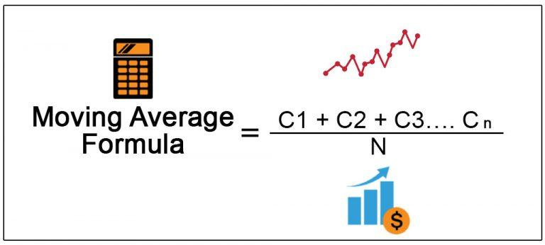

## Table of Contents

## What is a moving average?

A moving average is a way to smooth out data over time. It helps to see trends by averaging a set number of past data points. For example, if you want to know the moving average of a stock price over the last 10 days, you would add up the prices of the last 10 days and then divide by 10.

There are different types of moving averages, but the most common ones are the simple moving average (SMA) and the exponential moving average (EMA). The SMA gives equal weight to all the data points in the period, while the EMA gives more weight to recent data points. This makes the EMA more responsive to new information. Moving averages are used in many fields, like finance, economics, and even weather forecasting, to help make better predictions and decisions.

## How is a moving average calculated?

A moving average is calculated by taking the average of a set number of data points over time. For example, if you want a 5-day moving average of a stock price, you would add up the stock prices for the last 5 days and then divide by 5. Each day, you drop the oldest data point and add the newest one, then recalculate the average. This creates a smooth line that helps you see trends more clearly.

There are different types of moving averages, like the simple moving average (SMA) and the exponential moving average (EMA). The SMA is the most straightforward: you just add up the data points and divide by the number of points. The EMA, on the other hand, puts more weight on recent data. To calculate an EMA, you start with an SMA, then use a formula that gives more importance to the newest data points. This makes the EMA react faster to changes in the data.

## What does the slope of a moving average indicate?

The slope of a moving average tells us if something is going up, down, or staying the same over time. If the moving average line is going up, it means the data, like stock prices or temperatures, is increasing. If it's going down, the data is decreasing. And if it's flat, the data isn't changing much.

This is useful because it helps us see trends more easily. For example, if you're looking at the moving average of a company's stock price and the slope is upward, it might be a good sign that the stock is doing well. On the other hand, a downward slope could mean the stock is losing value. By watching the slope, you can make better decisions about what might happen next.

## Why is the slope of a moving average important in technical analysis?

In technical analysis, the slope of a moving average is really important because it helps traders see if a trend is getting stronger or weaker. If the slope is going up, it means the price of something, like a stock, is going up too. This can tell traders that it might be a good time to buy. If the slope is going down, it means the price is going down, and it might be a good time to sell or avoid buying.

The slope also helps traders spot when a trend might be changing. If the slope starts to flatten out, it could mean the trend is losing strength and might reverse soon. By watching the slope, traders can make better guesses about what the market might do next and make smarter choices about when to buy or sell.

## How can you calculate the slope of a moving average?

To calculate the slope of a moving average, you need to find out how much the moving average changes over time. Imagine you have the moving average values for several days. You can pick two points on the moving average line, like the value from today and the value from a week ago. Then, you subtract the older value from the newer value to see how much the moving average has changed. Next, you divide this change by the number of days between the two points to get the slope. If the slope is positive, the moving average is going up. If it's negative, it's going down.

This simple method helps you understand if the trend is getting stronger or weaker. For example, if you're looking at a stock's 50-day moving average, you might compare today's value to the value from 10 days ago. If today's value is higher, you divide the difference by 10 to get the slope. A bigger positive slope means the stock's price is rising faster, which might be a good sign for investors. On the other hand, a bigger negative slope means the price is falling faster, which might be a warning to sell or avoid buying.

## What are the different types of moving averages used for slope analysis?

In slope analysis, the two main types of moving averages used are the simple moving average (SMA) and the exponential moving average (EMA). The SMA is calculated by adding up a set number of data points, like stock prices, and then dividing by that number. For example, a 10-day SMA of a stock would be the average of the last 10 days' closing prices. The slope of an SMA shows how the average price is changing over time. If the slope is going up, it means the average price is increasing, which could be a good sign for investors.

The EMA is different because it puts more weight on recent data. This means it reacts faster to changes in price. To calculate an EMA, you start with an SMA and then use a formula that gives more importance to the newest prices. The slope of an EMA can help traders see trends more quickly. If the EMA's slope is going up, it means the price is rising faster than with an SMA, and if it's going down, it means the price is falling faster. This can be really helpful for making quick decisions in trading.

## How does the choice of time period affect the slope of a moving average?

The time period you choose for a moving average can really change how the slope looks. If you use a short time period, like a 5-day moving average, the slope will be more sensitive to small changes in the data. This means the slope can go up and down a lot, showing quick trends but also making it harder to see the big picture. On the other hand, if you use a longer time period, like a 200-day moving average, the slope will be smoother and show bigger trends over time. It won't react as fast to small changes, but it can give a clearer view of the overall direction.

Choosing the right time period depends on what you're trying to see. If you want to catch fast changes in the market, a shorter time period might be better because the slope will show those changes quickly. But if you're more interested in the long-term trend and don't want to be distracted by short-term ups and downs, a longer time period will give you a clearer, more stable slope. Both short and long time periods have their uses, and the best choice depends on your goals and how you plan to use the information.

## Can you explain how to interpret changes in the slope of a moving average?

When the slope of a moving average changes, it tells you something about the trend of the data you're looking at, like stock prices or temperatures. If the slope starts to get steeper, it means the trend is getting stronger. For example, if the slope of a stock's moving average is going up more sharply, it means the stock price is rising faster. This can be a good sign if you're thinking about buying the stock. On the other hand, if the slope is getting less steep or even starting to flatten out, it means the trend is losing strength. This could mean the stock price might stop going up soon, and it's a signal to be careful.

If the slope of the moving average starts to go in the opposite direction, it's a big warning sign that the trend might be changing. For example, if the slope was going up but now it's starting to go down, it means the stock price might start to fall. This is a good time to think about selling the stock or not buying it if you haven't already. By watching how the slope changes, you can make better guesses about what might happen next and make smarter choices.

## What are the common pitfalls when analyzing the slope of a moving average?

One common pitfall when analyzing the slope of a moving average is relying too much on short-term changes. If you use a short time period, like a 5-day moving average, the slope can change a lot from day to day. This can make you think a big trend is starting when it's really just a small change. It's important to look at longer time periods too, like a 50-day or 200-day moving average, to see the bigger picture and not get tricked by short-term ups and downs.

Another pitfall is ignoring other important information. The slope of a moving average is just one piece of the puzzle. You should also look at other things like the overall market, news about the company, or economic reports. If you only focus on the slope, you might miss out on important signs that can help you make better decisions. It's always a good idea to use the slope along with other tools and information to get a full understanding of what's going on.

## How can the slope of a moving average be used in trading strategies?

The slope of a moving average can help traders decide when to buy or sell stocks. If the slope is going up, it means the stock price is going up too. This can be a good sign to buy the stock because it might keep going up. On the other hand, if the slope is going down, it means the stock price is falling. This could be a signal to sell the stock or avoid buying it because it might keep going down. By watching the slope, traders can make better guesses about what the stock price might do next and make smarter choices.

Another way to use the slope of a moving average in trading is to spot when a trend might be changing. If the slope starts to flatten out, it could mean the stock price is not going up or down as fast as before. This can be a warning that the trend might be losing strength and could reverse soon. Traders can use this information to get ready for a change in the stock price. By combining the slope of the moving average with other tools and information, traders can build strategies that help them make better decisions and hopefully make more money.

## What advanced techniques can be used to enhance the analysis of moving average slopes?

One advanced technique to enhance the analysis of moving average slopes is using multiple moving averages at the same time. For example, you can look at both a short-term moving average, like a 20-day one, and a long-term moving average, like a 50-day one. By comparing the slopes of these two moving averages, you can see if short-term trends are in line with long-term trends. If the short-term slope is going up but the long-term slope is flat or going down, it might mean the stock price is having a short-term bump but the overall trend is still down. This can help traders make better guesses about what might happen next.

Another technique is to use something called a moving average convergence divergence (MACD) indicator. This tool looks at the difference between two moving averages, usually a 12-day and a 26-day one, and then uses another line called a signal line, which is a 9-day moving average of the MACD. When the MACD line crosses above the signal line, it can be a sign to buy, and when it crosses below, it can be a sign to sell. By watching how the MACD line moves and its slope, traders can get more detailed information about trends and changes in the stock price. This can help them make smarter trading decisions.

## How do moving average slopes interact with other technical indicators?

Moving average slopes can work together with other technical indicators to help traders make better decisions. For example, the Relative Strength Index (RSI) measures how fast a stock's price is going up or down and if it's overbought or oversold. If the slope of a moving average is going up and the RSI is also showing that the stock is not overbought, it might be a good time to buy. But if the slope is going up and the RSI shows the stock is overbought, it might be a warning sign that the price could go down soon. By looking at both the slope and the RSI, traders can get a better idea of what might happen next.

Another way moving average slopes interact with other indicators is through the use of Bollinger Bands. Bollinger Bands are lines drawn above and below a moving average that show how much the price is moving around. If the slope of the moving average is going up and the price is touching the upper Bollinger Band, it might mean the stock is getting too expensive and could go down. On the other hand, if the slope is going down and the price is touching the lower Bollinger Band, it might mean the stock is getting too cheap and could go up. By using the slope of the moving average along with Bollinger Bands, traders can see if a stock is likely to keep going in the same direction or if it might change soon.

## What is the Moving Average Slope?

The moving average slope serves as a crucial indicator in financial analysis, derived from the traditional moving average to provide more nuanced insights into trend direction and strength. At its core, the moving average slope measures the rate of change of a moving average over a specified period, thereby offering traders a dynamic perspective on market trends.

This is achieved by comparing the current moving average value with its value from a certain number of periods ago. The formula for calculating the slope of a moving average is:

$$
\text{MA Slope} = \frac{\text{MA}_c - \text{MA}_n}{n}
$$

where $\text{MA}_c$ represents the current moving average value, $\text{MA}_n$ denotes the moving average value from $n$ periods ago, and $n$ is the period interval. By computing this slope, traders can assess whether the market is in an uptrend, downtrend, or transitioning sideways.

The moving average slope helps in determining the market's [momentum](/wiki/momentum) and identifying potential reversal points. In an uptrend, the slope will be positive, indicating that prices are generally increasing over the specified period. Conversely, a negative slope suggests a downtrend, with prices decreasing. When the slope approaches zero, it indicates a sideways movement, implying a lack of directional momentum.

Traders integrate the moving average slope into their strategies to better gauge price movement momentum, improving their ability to pinpoint entry and [exit](/wiki/exit-strategy) points. By understanding the velocity of price changes, traders can anticipate potential reversals, making the moving average slope a vital tool in identifying trading opportunities and managing risk.

## How do you calculate the slope of a moving average?

The slope of a moving average is calculated using the formula: 

$$
\text{MA Slope} = \frac{\text{MAc} - \text{MAn}}{n}
$$

where $\text{MAc}$ is the current moving average value, $\text{MAn}$ is the moving average value from $n$ periods ago, and $n$ represents the period interval. This measure provides insight into the direction and strength of the trend.

Traders can calculate this manually utilizing historical price data. For instance, to compute a 10-period moving average slope on daily data, subtract the moving average value from 10 days prior from the current moving average value, then divide the result by 10. This provides an average rate of change per period, indicating the trend’s momentum.

Computational tools and trading software also perform these calculations, automating the process and integrating the moving average slope into sophisticated trading algorithms. This automation enhances accuracy and efficiency, allowing traders to respond to market changes promptly.

Regardless of the method employed, precise calculation of the moving average slope is critical. Inaccuracies can lead to misleading interpretations of market trends, adversely affecting trading decisions. Thus, whether computed manually or through software, maintaining accuracy ensures the moving average slope serves as an effective instrument in trading strategies.

## References & Further Reading

[1]: Bergstra, J., Bardenet, R., Bengio, Y., & Kégl, B. (2011). ["Algorithms for Hyper-Parameter Optimization."](https://papers.nips.cc/paper/4443-algorithms-for-hyper-parameter-optimization) Advances in Neural Information Processing Systems 24.

[2]: ["Advances in Financial Machine Learning"](https://www.amazon.com/Advances-Financial-Machine-Learning-Marcos/dp/1119482089) by Marcos Lopez de Prado

[3]: ["Evidence-Based Technical Analysis: Applying the Scientific Method and Statistical Inference to Trading Signals"](https://www.amazon.com/Evidence-Based-Technical-Analysis-Scientific-Statistical/dp/0470008741) by David Aronson

[4]: ["Machine Learning for Algorithmic Trading"](https://github.com/stefan-jansen/machine-learning-for-trading) by Stefan Jansen

[5]: ["Quantitative Trading: How to Build Your Own Algorithmic Trading Business"](https://books.google.com/books/about/Quantitative_Trading.html?id=j70yEAAAQBAJ) by Ernest P. Chan