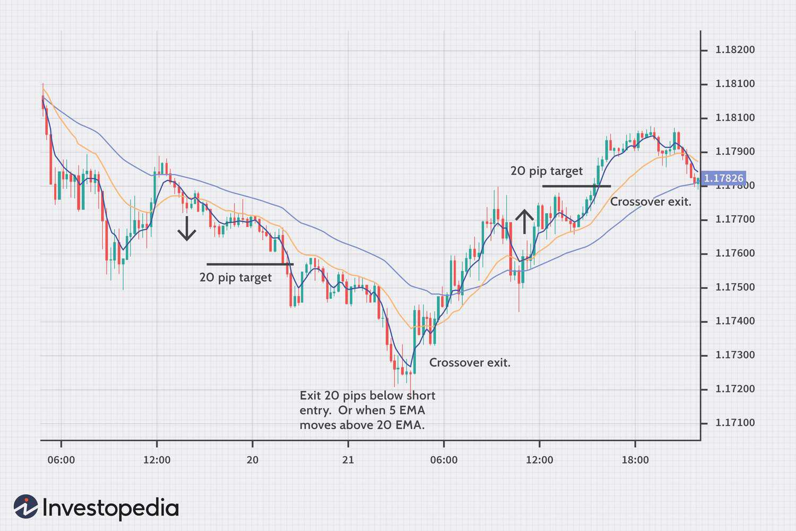

## Table of Contents

## What is a moving average in forex trading?

A moving average in forex trading is a tool that helps traders see the average price of a currency over a certain period of time. It smooths out price data to make it easier to spot trends. Imagine you're looking at a chart with lots of ups and downs. A moving average line would be drawn over this chart, showing you a smoother path that represents the average price over the last few days, weeks, or even months.

Traders use moving averages to help them decide when to buy or sell a currency. For example, if the price of a currency is above its moving average, it might be a good time to buy because the price is trending up. On the other hand, if the price is below the moving average, it might be a good time to sell because the price is trending down. There are different types of moving averages, like the simple moving average and the exponential moving average, but they all serve the same basic purpose of helping traders understand market trends.

## How does a simple moving average (SMA) work?

A simple moving average (SMA) is a way to smooth out price data over time. Imagine you want to know the average price of a currency over the last 10 days. You would add up the closing prices of those 10 days and then divide by 10. This gives you the average price, or the SMA, for those 10 days. As each new day passes, you drop the oldest day's price and add the newest day's price, then recalculate the average. This way, the SMA keeps updating to reflect the most recent data.

Traders use the SMA to help them see the overall direction of the market. If the SMA is going up, it means the average price is increasing, which might suggest the market is in an uptrend. If the SMA is going down, it means the average price is decreasing, which might suggest a downtrend. By comparing the current price to the SMA, traders can make decisions about buying or selling. For example, if the current price is above the SMA, it might be a good time to buy, and if it's below, it might be a good time to sell.

## What is the difference between a simple moving average and an exponential moving average (EMA)?

A simple moving average (SMA) and an exponential moving average (EMA) are both used to smooth out price data, but they do it in different ways. An SMA gives equal weight to all the prices in the period you're looking at. For example, if you're using a 10-day SMA, each of the last 10 days' prices is equally important in calculating the average. This makes the SMA easy to understand and calculate, but it can be slow to respond to recent price changes.

On the other hand, an EMA puts more weight on recent prices. This means it reacts faster to new information. If the price of a currency suddenly goes up or down, the EMA will show this change more quickly than the SMA. Traders who want to catch trends early often prefer using an EMA because it can help them make quicker decisions based on the most recent data.

## How can moving averages help identify trends in forex markets?

Moving averages help traders see the overall direction of the forex market by smoothing out the ups and downs in price data. When you look at a chart, it can be hard to tell if the price is going up or down because there are so many small changes. But if you use a moving average, you can see a line that shows you the average price over a certain time. If this line is going up, it means the average price is going up, which can tell you that the market is in an uptrend. If the line is going down, it means the average price is going down, showing a downtrend.

Traders often use two moving averages together to spot trends more clearly. They might use a short-term moving average, like a 50-day average, and a long-term moving average, like a 200-day average. When the short-term average crosses above the long-term average, it's called a "golden cross," and it can be a sign that an uptrend is starting. When the short-term average crosses below the long-term average, it's called a "death cross," and it can signal the start of a downtrend. By watching these crossovers, traders can get a better idea of when to buy or sell currencies based on the overall trend of the market.

## What are common time periods used for moving averages in forex trading?

In forex trading, people often use different time periods for moving averages to help them understand the market. Some common ones are the 50-day moving average and the 200-day moving average. The 50-day moving average looks at the average price over the last 50 days, which is good for seeing short-term trends. The 200-day moving average looks at the average price over the last 200 days, which is better for seeing long-term trends. Traders might use these to decide when to buy or sell a currency.

Another popular time period is the 10-day moving average, which is even shorter and can help traders catch very quick changes in the market. Some traders also use a 100-day moving average, which is in between the short-term and long-term averages. By looking at different time periods, traders can get a better picture of what's happening in the market and make smarter decisions about their trades.

## How do traders use moving average crossovers to make trading decisions?

Traders use moving average crossovers to help them decide when to buy or sell a currency. They often look at two moving averages: a short-term one, like a 50-day moving average, and a long-term one, like a 200-day moving average. When the short-term moving average crosses above the long-term moving average, it's called a "golden cross." This can be a sign that the price is starting to go up, so traders might see it as a good time to buy the currency. On the other hand, when the short-term moving average crosses below the long-term moving average, it's called a "death cross." This can be a sign that the price is starting to go down, so traders might see it as a good time to sell the currency.

These crossovers help traders spot changes in the market's direction. By watching for these signals, traders can try to get into a trade at the start of a new trend and get out before the trend changes. It's important to remember that moving averages are just one tool, and traders often use other indicators and analysis to make their final decisions. But crossovers can be a simple and clear way to see when the market might be shifting from an uptrend to a downtrend, or vice versa.

## What are the limitations and potential pitfalls of using moving averages in forex trading?

Using moving averages in forex trading can help traders spot trends, but they have some limitations. One big problem is that moving averages can be slow to react to big changes in the market. If the price suddenly goes up or down a lot, the moving average might not show this change right away. This can make traders miss out on good chances to buy or sell. Also, moving averages are based on past prices, so they can't predict the future. Just because the price was going up before doesn't mean it will keep going up.

Another issue is that moving averages can give false signals. Sometimes, the price might cross the moving average and then quickly go back the other way. This can trick traders into thinking the trend is changing when it's not. Traders might buy or sell based on these false signals and end up losing money. It's important for traders to use moving averages along with other tools and not rely on them alone. By combining moving averages with other indicators, traders can make better decisions and avoid some of these pitfalls.

## How can moving averages be combined with other indicators for more effective trading strategies?

Traders can make their trading strategies better by using moving averages along with other tools, like the Relative Strength Index (RSI) or the Moving Average Convergence Divergence (MACD). The RSI helps traders see if a currency is overbought or oversold. If the RSI is above 70, it might mean the currency is too expensive and could go down soon. If it's below 30, it might mean the currency is too cheap and could go up. By using the RSI with moving averages, traders can check if the trend they see from the moving average makes sense. For example, if the moving average shows an uptrend and the RSI is not overbought, it might be a good time to buy.

Another useful tool is the MACD, which helps traders see if the trend is getting stronger or weaker. The MACD has two lines: a fast line and a slow line. When the fast line crosses above the slow line, it can be a sign to buy. When it crosses below, it can be a sign to sell. Traders can use the MACD to confirm what they see from the moving averages. If the moving average shows an uptrend and the MACD also shows a bullish signal, it can give traders more confidence in their decision to buy. By combining moving averages with other indicators, traders can get a fuller picture of the market and make smarter trading choices.

## What is the concept of a moving average ribbon and how is it used in forex trading?

A moving average ribbon is a tool used in forex trading that shows several moving averages on a chart at the same time. Each moving average line is set for a different time period, like 10 days, 20 days, 30 days, and so on. When you put all these lines together, it looks like a ribbon. The idea is to help traders see the overall trend of the market more clearly. If all the lines are going up, it means the market is in a strong uptrend. If all the lines are going down, it means the market is in a strong downtrend.

Traders use the moving average ribbon to make decisions about buying or selling a currency. For example, if the shorter-term moving averages start to cross above the longer-term ones, it might be a sign that the market is starting to go up. This could be a good time to buy. On the other hand, if the shorter-term moving averages start to cross below the longer-term ones, it might be a sign that the market is starting to go down. This could be a good time to sell. By looking at the whole ribbon, traders can get a better sense of the market's direction and strength, helping them make smarter trading choices.

## How do adaptive moving averages adjust to market volatility and improve trading performance?

Adaptive moving averages are special because they change how they work based on how much the market is moving around. When the market is calm and not changing much, the adaptive moving average will use a longer time period to smooth out the prices. This helps it not to be fooled by small changes. But when the market gets wild and prices start jumping a lot, the adaptive moving average will switch to a shorter time period. This way, it can react faster to the big changes and help traders make quicker decisions.

Using an adaptive moving average can help traders do better in the forex market. Because it changes with the market's ups and downs, it can give traders a better idea of what's happening right now. This can help them catch trends earlier and avoid getting tricked by false signals. By adjusting to how much the market is moving, adaptive moving averages can be a powerful tool for traders who want to stay on top of the market's changes.

## Can you explain the use of moving averages in different forex trading styles, such as scalping versus swing trading?

In forex trading, moving averages can be used differently depending on the trading style. For scalpers, who make lots of quick trades to catch small price changes, short-term moving averages like a 5-day or 10-day moving average are useful. These short-term averages help scalpers see the quick ups and downs in the market. They might use these moving averages to spot very short trends and decide when to buy or sell in just a few minutes or hours. Scalpers need to react fast, so using a short-term moving average helps them stay on top of the market's quick changes.

For swing traders, who hold trades for days or weeks to catch bigger price moves, longer-term moving averages like a 50-day or 200-day moving average are more helpful. These longer-term averages show the bigger trends in the market. Swing traders might use these to see if the market is in an uptrend or a downtrend over a longer time. They can then decide to buy when the price is above the moving average and sell when it's below. By using longer-term moving averages, swing traders can make decisions based on the overall direction of the market, which fits their slower, more patient trading style.

## What advanced techniques involve using multiple moving averages to predict forex market movements?

Traders often use multiple moving averages together to get a better idea of where the forex market might be heading. One popular way is to use a short-term moving average, like a 50-day one, and a long-term moving average, like a 200-day one. When the short-term average crosses above the long-term average, it's called a "golden cross," and it can mean the market is starting to go up. On the other hand, when the short-term average crosses below the long-term average, it's called a "death cross," and it can mean the market is starting to go down. By watching these crossovers, traders can try to catch the start of new trends and make smarter trading choices.

Another advanced technique is using a moving average ribbon, which shows many moving averages all at once. Each line in the ribbon is set for a different time period, like 10 days, 20 days, 30 days, and so on. When all the lines in the ribbon are going up, it means the market is in a strong uptrend. When they're all going down, it means the market is in a strong downtrend. Traders can use the moving average ribbon to see not just the direction of the market, but also how strong the trend is. If the lines are spread out a lot, it can mean the trend is really strong. By looking at the whole ribbon, traders can get a fuller picture of the market and make better decisions about when to buy or sell.

## What is Understanding Moving Averages?

Moving averages are crucial mathematical tools used extensively in financial markets to smooth out price data and highlight the underlying trends by filtering out the noise from random price fluctuations. They are calculated using historical price data over a specified time period. The basic idea is to compute an average that continuously moves across the dataset, effectively recalibrating itself with every new data point, thus reflecting the most recent market conditions. 

### Types of Moving Averages

1. **Simple Moving Average (SMA):** The SMA is the most straightforward type of moving average. It is calculated by summing up the closing prices of an asset for a given number of time period $n$ and then dividing the total by $n$. The formula for SMA is:
$$
   \text{SMA} = \frac{P_1 + P_2 + \cdots + P_n}{n}

$$

   where $P_i$ represents the price at each time point.

2. **Exponential Moving Average (EMA):** The EMA gives more weight to recent prices, making it more responsive to new data compared to the SMA. The EMA is calculated using the formula:
$$
   \text{EMA}_t = \text{EMA}_{t-1} + \alpha (P_t - \text{EMA}_{t-1})

$$

   where $\alpha$ is the smoothing factor typically calculated as $\frac{2}{n+1}$.

3. **Weighted Moving Average (WMA):** The WMA assigns different weights to each price point, with more emphasis placed on the recent prices in the dataset. The calculation involves multiplying each closing price by a weighting factor and dividing by the sum of the weights:
$$
   \text{WMA} = \frac{nP_1 + (n-1)P_2 + \cdots + P_n}{n + (n-1) + \cdots + 1}

$$

### Role in Identifying Trends and Reversal Points

Moving averages are instrumental in identifying price trends and potential reversal points. When a price crosses above a moving average, it may indicate the start of a bullish trend, whereas a cross below might signal a bearish trend. Furthermore, the intersection of two moving averages, commonly known as a "crossover," is used as an indicator of market reversals.

### Advantages for Traders

The use of moving averages offers several advantages:
- **Simplicity:** They are easy to compute and visualize, making them accessible even for novice traders.
- **Reliability:** By focusing on historical data, they help in identifying significant market trends rather than volatile price swings.
- **Versatility:** Moving averages can be adapted across various timeframes and integrated into diverse trading strategies.

### Common Misconceptions and Overcoming Them

A common misconception is that moving averages predict future market movements. In reality, they reflect historical price data and should be used in conjunction with other forms of analysis. Additionally, the choice of time period for a moving average can greatly affect its sensitivity and the signals it provides. Traders often overcome these misconceptions by [backtesting](/wiki/backtesting) different configurations to ascertain their effectiveness in distinct market conditions.

By understanding moving averages and applying them judiciously, traders can enhance their ability to recognize trends and make more informed trading decisions. Moving averages remain an indispensable component of technical analysis in the [forex](/wiki/forex-system) market.

## What are common moving average trading strategies?

Trading strategies utilizing moving averages are fundamental in forex trading, providing traders with insights into market trends and potential entry and [exit](/wiki/exit-strategy) points. These strategies are built around the behavior of moving averages as they track historical price data to smooth out price fluctuations and reveal prevailing market trends.

### The Crossover Strategy

The crossover strategy involves using two distinct moving averages — typically a short-term and a long-term average. The basic principle is that when the short-term moving average crosses above the long-term moving average, it generates a buy signal. Conversely, when the short-term moving average crosses below the long-term average, it produces a sell signal. This method capitalizes on the assumption that [momentum](/wiki/momentum) will continue in the direction of the crossover. The strategy is visually represented and can be expressed mathematically as:

$$
\text{Buy Signal: } \text{SMA}_{\text{short}}(t) > \text{SMA}_{\text{long}}(t)
$$

$$
\text{Sell Signal: } \text{SMA}_{\text{short}}(t) < \text{SMA}_{\text{long}}(t)
$$

Python code for implementing a simple crossover strategy could look like this:

```python
import pandas as pd

def crossover_strategy(data, short_window, long_window):
    data['SMA_short'] = data['Price'].rolling(window=short_window).mean()
    data['SMA_long'] = data['Price'].rolling(window=long_window).mean()

    data['Signal'] = 0
    data['Signal'][short_window:] = np.where(data['SMA_short'][short_window:] > data['SMA_long'][short_window:], 1, 0)
    data['Position'] = data['Signal'].diff()

    return data
```

### The Moving Average Envelope

The moving average envelope strategy involves setting bands above and below a moving average, typically using a fixed percentage. These bands create a channel in which the price fluctuates. Traders act based on the price's movement relative to these bands — buying when the price hits the lower band and selling when it reaches the upper band. The calculation for the bands is:

$$
\text{Upper Band} = \text{SMA}(t) \times (1 + k)
$$

$$
\text{Lower Band} = \text{SMA}(t) \times (1 - k)
$$

where $k$ is the percentage distance from the SMA.

### Moving Average Convergence Divergence (MACD)

MACD is a momentum oscillator that follows the difference between two exponential moving averages (EMAs), usually calculated as:

$$
\text{MACD Line} = \text{EMA}_{12}(t) - \text{EMA}_{26}(t)
$$

The MACD strategy generates signals based on interactions between the MACD line and its signal line, which is a 9-day EMA of the MACD line. A buy signal occurs when the MACD line crosses above the signal line; a sell signal is generated when it crosses below.

### Tips for Optimizing Moving Average Strategies

1. **Adaptability:** Customize parameters (e.g., lengths of moving averages) based on the specific currency pairs and market conditions being traded.

2. **Timeframes:** Consider the appropriate timeframe to match your trading strategy (short-term vs. long-term).

3. **Complementary Indicators:** Use complementary indicators like relative strength index (RSI) or volume to confirm signals, reducing the likelihood of false positives.

4. **Backtesting:** Always backtest strategies on historical data to ensure their robustness before implementing in live markets.

5. **Risk Management:** Combine strategies with sound risk management techniques to protect against significant losses.

These moving average strategies, fundamental in forex, allow traders to effectively predict market movements and make informed trading decisions by analyzing trends and smoothing out market noise.

## What is Algorithmic Trading in Forex?

Algorithmic trading in the foreign exchange (forex) markets refers to the use of computer programs to automate trading activities based on pre-set rules and algorithms. This form of trading leverages computational power to process vast amounts of data and execute trades at speeds and frequencies impossible for a human trader. Its significance in forex trading lies in its ability to enhance efficiency, accuracy, and consistency in decision-making.

**Definition and Components:**

Algorithmic trading involves the development of algorithms that can analyze market data, identify trading opportunities, and execute trades. Key components of an effective trading algorithm include:

1. **Inputs:** The input phase involves collecting and analyzing market data. This can include price data, volume, economic indicators, and even social media sentiment.

2. **Processing:** In this phase, the collected data is analyzed using various mathematical models and strategies. Moving averages, for instance, play a crucial role. A moving average is a statistical calculation used to analyze data points by creating averages of different subsets of the data to identify trends over time. This can be expressed mathematically as follows:
$$
   \text{SMA}_n = \frac{P_1 + P_2 + \cdots + P_n}{n}

$$

   where $P$ denotes the price and $n$ refers to the number of time periods.

3. **Outputs:** Finally, the output phase involves executing trades based on the signals generated by the algorithm. This can include generating buy or sell orders or adjusting positions.

**Role of Moving Averages:**

Moving averages serve as a foundational element in many trading algorithms. They help in smoothing out price data to highlight trends by filtering out short-term fluctuations. In [algorithmic trading](/wiki/algorithmic-trading), moving averages aid in:

- Identifying trend directions
- Generating trading signals through crossover strategies
- Defining support and resistance levels

**Benefits:**

The benefits of algorithmic trading are numerous:

- **Speed:** Algorithms can analyze and process data and execute trades within fractions of a second, offering a significant advantage in fast-moving forex markets.
- **Accuracy:** Computers can execute trades with precision, reducing errors that might occur due to manual trading.
- **Elimination of Emotional Bias:** By adhering strictly to predefined rules, algorithmic trading eliminates emotional biases that can cloud human judgment.

**Challenges and Risks:**

While algorithmic trading offers numerous advantages, it also poses challenges:

- **Technical Failures:** Algorithms rely on technical infrastructures, and any failure in software, hardware, or network can lead to significant trading losses.
- **Market Anomalies:** Unexpected market events or anomalies can disrupt algorithmic strategies. Algorithms need constant monitoring and updating to adapt to new conditions.
- **Over-optimization:** There's a risk of creating overly complex models that perform well on historical data but poorly in live markets.

To mitigate these risks, rigorous backtesting, continuous monitoring, and adaptive learning mechanisms are essential components of a successful algorithmic trading strategy. Platforms like MetaTrader and Python-based tools such as Backtrader and Zipline are commonly used in the development and testing of forex trading algorithms.

## References & Further Reading

[1]: Bergstra, J., Bardenet, R., Bengio, Y., & Kégl, B. (2011). ["Algorithms for Hyper-Parameter Optimization."](https://papers.nips.cc/paper/4443-algorithms-for-hyper-parameter-optimization) Advances in Neural Information Processing Systems 24.

[2]: ["Advances in Financial Machine Learning"](https://www.amazon.com/Advances-Financial-Machine-Learning-Marcos/dp/1119482089) by Marcos Lopez de Prado

[3]: ["Evidence-Based Technical Analysis: Applying the Scientific Method and Statistical Inference to Trading Signals"](https://books.google.com/books/about/Evidence_Based_Technical_Analysis.html?id=jbD47VkOHAEC) by David Aronson

[4]: ["Machine Learning for Algorithmic Trading"](https://github.com/stefan-jansen/machine-learning-for-trading) by Stefan Jansen

[5]: ["Quantitative Trading: How to Build Your Own Algorithmic Trading Business"](https://www.amazon.com/Quantitative-Trading-Build-Algorithmic-Business/dp/1119800064) by Ernest P. Chan