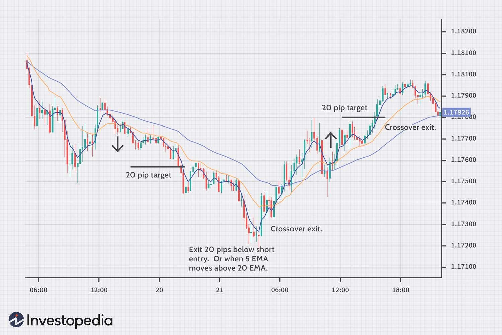

## Table of Contents

## What is a moving average and how is it calculated?

A moving average is a way to smooth out data over time. It helps you see the overall trend instead of focusing on short-term ups and downs. Imagine you're tracking the daily temperature in your city. If you want to know if it's getting warmer or cooler overall, looking at the average temperature over the last week can be more helpful than looking at each day's temperature.

To calculate a moving average, you pick a number of time periods to include in your average. For example, if you're using a 5-day moving average for stock prices, you would add up the closing prices of the last 5 days and then divide by 5. Each day, you drop the oldest day's price and add the newest day's price to keep the average moving. This way, the moving average always reflects the most recent data and helps show trends more clearly.

## What are the different types of moving averages used in trading?

In trading, there are mainly two types of moving averages that people use: the Simple Moving Average (SMA) and the Exponential Moving Average (EMA). The Simple Moving Average is easy to understand and calculate. It's just the average price of a security over a set number of time periods. For example, a 10-day SMA adds up the closing prices of the last 10 days and divides by 10. It's good for seeing the general trend but can be slow to react to new price changes.

The Exponential Moving Average is a bit more complex but reacts to price changes faster. It gives more weight to recent prices, which means it can show new trends sooner than the SMA. To calculate an EMA, you start with an SMA and then use a formula that includes a multiplier to give more importance to the latest price data. Traders often use EMAs when they want to catch trends early, but they can also lead to more false signals because they're more sensitive to price movements.

## How can moving averages help identify trends in the market?

Moving averages help traders see the overall direction of the market by smoothing out the ups and downs of daily price changes. When you look at a chart with a moving average line, you can tell if the market is going up or down over time. If the moving average line is going up, it means the market is in an uptrend. If it's going down, it shows a downtrend. This makes it easier for traders to decide when to buy or sell, based on the direction of the trend.

Using different types of moving averages, like the Simple Moving Average (SMA) and the Exponential Moving Average (EMA), can give traders different views of the market. The SMA is good for seeing the general trend because it's slower to change, while the EMA reacts faster to new price movements. By watching how these lines move, traders can spot when a trend might be starting or ending. For example, if a short-term moving average crosses above a long-term one, it might signal the start of an uptrend, which could be a good time to buy.

## What is a simple moving average (SMA) strategy and how do you implement it?

A simple moving average (SMA) strategy is a way to trade based on the average price of a security over a certain number of days. The idea is to use two SMAs with different time periods, like a short-term SMA and a long-term SMA. When the short-term SMA crosses above the long-term SMA, it's a sign that the price might be starting to go up, so you might want to buy. When the short-term SMA crosses below the long-term SMA, it could mean the price is going down, so you might want to sell.

To implement this strategy, first, choose the time periods for your SMAs. A common choice might be a 50-day SMA for the short-term and a 200-day SMA for the long-term. Next, calculate these SMAs every day based on the closing prices of the security. Watch the chart to see when the 50-day SMA crosses above the 200-day SMA. This is known as a "golden cross," and it's a signal to buy. When the 50-day SMA crosses below the 200-day SMA, known as a "death cross," it's a signal to sell. By following these signals, you can try to catch the beginning of trends and make trading decisions based on them.

## What is an exponential moving average (EMA) strategy and how does it differ from SMA?

An exponential moving average (EMA) strategy is similar to an SMA strategy but uses an EMA instead. With an EMA, you look at two different EMAs, like a short-term one and a long-term one. When the short-term EMA crosses above the long-term EMA, it's a sign that the price might start going up, so you might want to buy. When the short-term EMA crosses below the long-term EMA, it could mean the price is going down, so you might want to sell. The key difference from an SMA strategy is that the EMA reacts faster to price changes because it gives more importance to recent prices.

The main difference between an EMA and an SMA is how they calculate the average. An SMA just adds up the prices over a certain number of days and divides by that number. It's simple but slow to react to new price changes. An EMA, on the other hand, starts with an SMA but then adjusts it every day using a formula that gives more weight to the most recent price. This makes the EMA more sensitive to new trends, which can be good for catching them early but also means it can give false signals more often. So, traders might choose an EMA strategy when they want to act quickly on new market movements, while an SMA strategy might be better for those who want to see a clearer, longer-term trend.

## How do you use moving average crossovers to generate buy and sell signals?

Moving average crossovers are a way to figure out when to buy or sell a stock by looking at where two moving averages cross on a chart. You use two moving averages, one that looks at prices over a shorter time and another that looks at prices over a longer time. When the short-term moving average crosses above the long-term one, it's called a "golden cross." This is a signal to buy because it means the price might start going up. On the other hand, when the short-term moving average crosses below the long-term one, it's called a "death cross." This is a signal to sell because it means the price might start going down.

The idea behind using moving average crossovers is to catch the start of new trends. If you see a golden cross, it tells you that the price has been going up recently and might keep going up, so you buy the stock. If you see a death cross, it tells you that the price has been going down recently and might keep going down, so you sell the stock. This strategy helps traders make decisions based on clear signals from the chart, making it easier to decide when to get in or out of the market.

## What are the common time periods used for moving averages in trading strategies?

In trading, people often use different time periods for moving averages to help them make decisions. Some common time periods are 50 days and 200 days. The 50-day moving average is usually considered a short-term average, and the 200-day moving average is seen as a long-term average. Traders watch these two averages to see if they cross each other. When the 50-day average goes above the 200-day average, it's called a golden cross, and it might be a good time to buy. When the 50-day average goes below the 200-day average, it's called a death cross, and it might be a good time to sell.

Besides the 50-day and 200-day moving averages, other time periods are used too. For example, some traders look at a 10-day moving average for very short-term trends or a 100-day moving average for medium-term trends. The choice of time period depends on what kind of trading you're doing. If you're a day trader, you might use shorter time periods like 5 or 10 days. If you're more of a long-term investor, you might stick with longer time periods like 100 or 200 days. The key is to pick the time periods that match your trading style and goals.

## How can moving average ribbons be used to enhance trading decisions?

Moving average ribbons are a way to see more trends in the market at the same time. They are made up of several moving averages, each with a different time period, all shown on the same chart. This makes a "ribbon" of lines. By looking at this ribbon, traders can see if the market is moving up or down over different time periods. If all the lines in the ribbon are going up, it means the market is in a strong uptrend. If all the lines are going down, it shows a strong downtrend. This helps traders make better decisions because they can see the overall direction of the market more clearly.

Traders can use moving average ribbons to find good times to buy or sell. For example, if the shorter-term moving averages start to go above the longer-term ones, it might be a good time to buy because it could mean the start of an uptrend. If the shorter-term averages start to go below the longer-term ones, it might be a good time to sell because it could mean the start of a downtrend. By watching how the lines in the ribbon move, traders can catch trends early and make smarter trading choices based on what the market is doing over different time periods.

## What are the potential pitfalls and limitations of using moving average strategies?

Using moving average strategies can have some problems. One big issue is that moving averages can give you false signals. This happens when the moving average line crosses over another line, but the price doesn't actually keep going in that direction. For example, you might see a golden cross and think it's a good time to buy, but then the price goes down instead. This can lead to losing money because you bought at the wrong time. Also, moving averages are always looking at past data, so they can be slow to catch up with what's happening right now in the market. This delay can make you miss out on quick changes in the price.

Another problem with moving averages is that they don't work well in markets that don't have a clear trend. If the market is moving sideways, with the price going up and down but not really going anywhere, moving averages can make you think there's a trend when there isn't. This can lead to a lot of buying and selling that doesn't help you make money. Plus, choosing the right time periods for your moving averages can be tricky. What works well for one stock or market might not work for another, so you might need to keep trying different time periods to find what works best for you.

## How can moving averages be combined with other indicators for more robust trading strategies?

Moving averages can be combined with other indicators to make better trading decisions. One common way is to use them with the Relative Strength Index (RSI). The RSI helps you see if a stock is overbought or oversold. If you see a golden cross on your moving averages and the RSI is below 30, it might be a really good time to buy because the stock is starting to go up and it's also at a low price. On the other hand, if you see a death cross and the RSI is above 70, it might be a good time to sell because the stock is starting to go down and it's also at a high price. By looking at both the moving averages and the RSI, you can get a clearer picture of when to buy or sell.

Another way to use moving averages with other indicators is to combine them with the Moving Average Convergence Divergence (MACD). The MACD helps you see the strength and direction of a trend. When the MACD line crosses above the signal line, it's a buy signal, and when it crosses below, it's a sell signal. If you see a golden cross on your moving averages and the MACD line is also above the signal line, it can give you more confidence that it's a good time to buy. If you see a death cross and the MACD line is below the signal line, it can make you more sure that it's a good time to sell. Using moving averages with the MACD can help you catch trends early and make more informed trading choices.

## What are some advanced moving average techniques like adaptive moving averages?

Adaptive moving averages are a more advanced way to use moving averages in trading. They change how quickly they react to price changes based on what the market is doing. When the market is moving a lot, the adaptive moving average will react faster to catch the trend. When the market is quiet, it will slow down to avoid false signals. This makes them better at following the market's ups and downs compared to regular moving averages, which always react the same way no matter what the market is doing.

One popular type of adaptive moving average is the Kaufman's Adaptive Moving Average (KAMA). It was made by Perry Kaufman and it changes how it calculates the average based on how much the price is moving. If the price is moving a lot, KAMA will give more weight to recent prices to catch the trend quickly. If the price is moving less, KAMA will give less weight to recent prices to smooth out the trend. Traders like using KAMA because it can help them see trends more clearly and make better decisions about when to buy or sell.

## How do you backtest and optimize moving average trading strategies for better performance?

To backtest and optimize a moving average trading strategy, you first need to use past data to see how the strategy would have worked. You can use trading software or a spreadsheet to do this. Start by choosing the time periods for your moving averages, like a 50-day and a 200-day moving average. Then, go through the historical price data and see where the moving averages crossed. If the short-term average crossed above the long-term average, that's a buy signal. If it crossed below, that's a sell signal. Keep track of how much money you would have made or lost with each trade. This will show you if the strategy works well or if it needs changes.

Once you have the results from your backtest, you can try to make the strategy better. You might change the time periods of the moving averages to see if different ones work better. For example, you could try a 10-day and a 50-day moving average instead. You can also add other indicators, like the RSI or MACD, to see if they help make better trading decisions. Keep testing different combinations until you find one that makes more money and loses less. Remember, what works well in the past might not work in the future, so keep checking and updating your strategy as the market changes.

## What is Understanding Moving Averages?

Moving averages are fundamental analytical tools used extensively in technical analysis to simplify price data and provide a clearer view of market trends. By calculating an average price over a specified number of periods, moving averages eliminate short-term price fluctuations, allowing traders to focus on the underlying trend. The basic calculation of a simple moving average (SMA) involves averaging a set of prices over a defined period. For instance, a 10-day SMA would be computed as the average of the closing prices for the last ten days.

Mathematically, the simple moving average is represented as:

$$
\text{SMA}_n = \frac{P_1 + P_2 + \ldots + P_n}{n}
$$

where $P$ denotes the price of the asset and $n$ indicates the number of periods.

Different types of moving averages are utilized in trading due to their distinct characteristics. The simple moving average (SMA) assigns equal weight to each price point in its calculation, potentially making it slower to react to recent price changes. Conversely, the exponential moving average (EMA) assigns more weight to recent prices, making it more sensitive to new information. This sensitivity allows traders to receive earlier signals regarding potential price movements. The calculation of an EMA is slightly more complex and involves reducing the weight exponentially as one moves further back in time, which can be expressed through the following recursive formula:

$$
\text{EMA}_t = P_t \cdot \alpha + \text{EMA}_{t-1} \cdot (1 - \alpha)
$$

where $\alpha = \frac{2}{n+1}$.

Weighted moving averages (WMA) assign different weights to each price point within the calculation period, which allows specific data points to influence the moving average more than others. This custom weighting system is particularly useful when traders wish to emphasize specific time intervals that are believed to have more predictive power.

In crossover strategies, moving averages play a pivotal role in identifying both the direction of trends and potential points where the price may reverse or continue. When used in combination, different moving averages can signal changes in market [momentum](/wiki/momentum), which traders interpret as buy or sell indicators. For example, a common technique involves using two moving averages of different lengths—when the shorter moving average crosses above the longer one, an upward trend could be forming, and when it crosses below, a downward trend might ensue. These crossover points enable traders to make informed decisions on entering or exiting trades, aiming to maximize gains or minimize losses based on identified trends.

## Why should one use three moving averages?

Using three moving averages in a trading strategy offers a more comprehensive analysis of market trends by incorporating short-term, medium-term, and long-term price data. This approach enables traders to capture market movements with greater precision and avoid potential pitfalls associated with using fewer indicators.

Incorporating a third moving average aims to verify signals produced by the initial two moving averages, thereby minimizing erroneous entries and exits. For instance, if a short-term moving average crosses a medium-term moving average, the presence of a third, longer-term moving average can validate whether this crossover signals a genuine trend shift or a temporary price fluctuation. By doing so, the third moving average acts as a filter, reducing noise and improving signal reliability. 

This method allows traders to more reliably assess the strength and sustainability of a trend. During times of high market [volatility](/wiki/volatility-trading-strategies), a three-moving-average strategy is particularly advantageous as it smooths out erratic price movements and provides a clearer indication of overarching trends. This can be especially critical when a market is susceptible to sudden shifts due to news events or changes in investor sentiment.

The mathematical foundation of moving averages involves calculating the mean of a specified number of past prices. For instance, an exponential moving average (EMA) for a period $N$ can be calculated as follows:

$$
EMA_t = (\text{Price}_t \times K) + (EMA_{t-1} \times (1 - K))
$$

Where:

- $\text{Price}_t$ is the current price
- $K = \frac{2}{N+1}$ is the smoothing constant
- $EMA_{t-1}$ is the EMA calculated for the previous period

In Python, the calculation can be implemented using libraries such as Pandas to streamline data manipulation:

```python
import pandas as pd

def calculate_ema(data, period):
    return data.ewm(span=period, adjust=False).mean()

# Example usage
prices = [/* your price data */]
df = pd.DataFrame(prices, columns=['Prices'])
df['Short_EMA'] = calculate_ema(df['Prices'], 5)
df['Medium_EMA'] = calculate_ema(df['Prices'], 21)
df['Long_EMA'] = calculate_ema(df['Prices'], 63)
```

Utilizing three EMAs with different time spans, such as 5, 21, and 63 days, offers an effective strategy for identifying entry and [exit](/wiki/exit-strategy) points and managing trades. Through this approach, traders can enhance their decision-making processes, leading to more informed and potentially more profitable trading outcomes.

## What is the 3 Moving Average Crossover Strategy and how is it explained?

The 3 moving average crossover strategy applies three distinct moving averages set at different time intervals, enabling the identification of market trends and generating trading signals. Common time periods for these moving averages include 5, 21, and 63 days. The selection of these lengths allows traders to capture short-term, medium-term, and long-term price trends, thereby improving decision-making.

A bullish signal is identified when the shortest moving average, such as the 5-day, crosses above the medium-term (21-day) and long-term (63-day) moving averages. This crossover suggests a potential upward momentum in the price, indicating a buying opportunity. Conversely, a bearish signal arises when the shortest moving average crosses below the other two, signaling potential downward pressure and suggesting a selling opportunity.

Traders often prefer exponential moving averages (EMAs) for their heightened sensitivity to recent price changes. The formula for calculating an EMA places more weight on recent prices, thus reacting more promptly to new price information compared to a simple moving average (SMA).

The formula for an EMA is given by:

$$
EMA_t = \alpha \times P_t + (1 - \alpha) \times EMA_{t-1}
$$

where:
- $EMA_t$ is the exponential moving average at time $t$,
- $\alpha$ is the smoothing factor, defined as $\frac{2}{n+1}$ for an $n$-day EMA,
- $P_t$ is the price at time $t$,
- $EMA_{t-1}$ is the EMA at the previous time period.

Implementation of this strategy in [algorithmic trading](/wiki/algorithmic-trading) often involves coding these calculations and conditions into trading algorithms using Python or other languages. Below is an example code snippet implementing a simple moving average crossover strategy using Python:

```python
import pandas as pd

def calculate_ema(prices, days):
    return prices.ewm(span=days, adjust=False).mean()

def crossover_strategy(price_data):
    short_ema = calculate_ema(price_data['Close'], 5)
    medium_ema = calculate_ema(price_data['Close'], 21)
    long_ema = calculate_ema(price_data['Close'], 63)

    price_data['Signal'] = 0
    price_data['Signal'][short_ema > medium_ema] = 1
    price_data['Signal'][short_ema < long_ema] = -1

    return price_data

# Assuming 'data' is a DataFrame with stock price data including a 'Close' price column
data = crossover_strategy(data)
```

This code calculates exponential moving averages for 5, 21, and 63 days and assigns buying or selling signals based on the crossovers of these averages. Such a systematic approach allows traders to automate the trading decisions, enhancing the efficiency and efficacy of trading strategies.

## References & Further Reading

[1]: ["Moving Averages Simplified"](https://www.amazon.com/Moving-Averages-Simplified-Clif-Droke/dp/1883272661) by Clif Droke

[2]: ["Technical Analysis of the Financial Markets: A Comprehensive Guide to Trading Methods and Applications"](https://www.amazon.com/Technical-Analysis-Financial-Markets-Comprehensive/dp/0735200661) by John J. Murphy

[3]: Brock, W., Lakonishok, J., & LeBaron, B. (1992). ["Simple Technical Trading Rules and the Stochastic Properties of Stock Returns."](https://www.jstor.org/stable/2328994) The Journal of Finance, 47(5), 1731-1764.

[4]: ["Algorithmic Trading: Winning Strategies and Their Rationale"](https://www.wiley.com/en-us/Algorithmic+Trading%3A+Winning+Strategies+and+Their+Rationale-p-9781118460146) by Ernest P. Chan

[5]: Appel, G., & Hitschler, J. (2012). ["Technical Analysis: Power Tools for Active Investors."](https://www.amazon.com/Technical-Analysis-Power-Active-Investors/dp/0132930048)