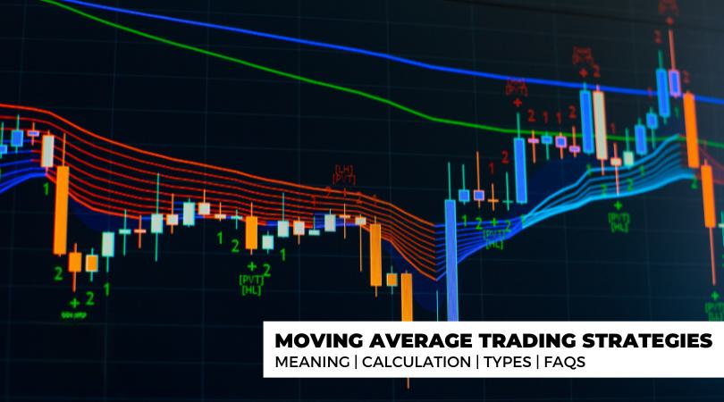

## Table of Contents

## What is a moving average in trading?

A moving average in trading is a tool that helps smooth out price data to make it easier to see trends over time. It does this by calculating the average price of a security over a certain number of periods, like days or weeks. This average is then plotted on a chart, and as new data comes in, the oldest data is dropped and the newest is added, which makes the average "move" over time.

Traders use moving averages to help them make decisions about when to buy or sell. For example, if the price of a stock is above its moving average, it might be seen as a good time to buy because the price is trending up. On the other hand, if the price is below the moving average, it might be a signal to sell because the price could be trending down. Moving averages can be set for different time frames, like a short-term 10-day average or a longer-term 200-day average, depending on what the trader is looking for.

## How does a moving average trading strategy work?

A moving average trading strategy uses moving averages to help traders decide when to buy or sell a stock. The strategy involves looking at two moving averages: a short-term one, like a 50-day average, and a long-term one, like a 200-day average. When the short-term average crosses above the long-term average, it's called a "golden cross," and it's seen as a good time to buy because it suggests the stock's price is starting to go up. On the other hand, when the short-term average crosses below the long-term average, it's called a "death cross," and it's seen as a good time to sell because it suggests the price might start going down.

Traders use these signals to make decisions, but they also need to be careful. Moving averages can give false signals, so it's important to look at other things too, like the overall market and news about the company. Some traders also use more than two moving averages to get more signals and make better decisions. By combining moving averages with other tools and information, traders can create a strategy that helps them make smarter choices about when to buy and sell stocks.

## What are the different types of moving averages used in trading?

There are a few types of moving averages that traders use. The simplest one is the Simple Moving Average (SMA). It's calculated by adding up the closing prices of a stock over a certain number of days and then dividing by that number of days. For example, a 10-day SMA adds up the last 10 days' closing prices and divides by 10. This type of average is easy to understand and use, but it treats all days the same, which can be a disadvantage if you want to give more weight to recent prices.

Another type is the Exponential Moving Average (EMA). The EMA gives more weight to recent prices, which makes it more responsive to new information. It's a bit more complicated to calculate because it uses a formula that includes a smoothing [factor](/wiki/factor-investing). This means that if the stock's price changes a lot recently, the EMA will show that change more quickly than the SMA. Traders who want to react faster to price changes often prefer using the EMA.

There's also the Weighted Moving Average (WMA), which is another way to give more importance to recent prices. Like the EMA, the WMA uses a formula that multiplies each price by a weight, with the most recent prices getting the highest weights. This type of moving average can be useful when you think the most recent data is the most important, but it's less common than the SMA and EMA because it's a bit more complicated to calculate.

## What is the difference between a simple moving average (SMA) and an exponential moving average (EMA)?

A simple moving average (SMA) is easy to understand. It takes the closing prices of a stock over a set number of days, adds them up, and then divides by that number of days. For example, a 10-day SMA adds the last 10 days' closing prices and divides by 10. This gives you an average price that treats all days the same. The downside is that it might not react quickly enough to recent changes in the stock's price because it gives equal weight to all days in the period.

An exponential moving average (EMA), on the other hand, pays more attention to recent prices. It uses a formula that includes a smoothing factor, which means it reacts faster to new information. If a stock's price changes a lot recently, the EMA will show that change more quickly than the SMA. This makes the EMA more useful for traders who want to make quick decisions based on the most recent price movements.

## How do traders use moving averages to identify trends?

Traders use moving averages to spot trends in a stock's price by looking at how the price moves relative to the moving average line on a chart. If the price stays above the moving average, it suggests the stock is in an upward trend. On the other hand, if the price stays below the moving average, it suggests the stock is in a downward trend. Traders often use a longer-term moving average, like a 200-day moving average, to get a clear view of the overall trend.

They also compare short-term moving averages, like a 50-day average, with longer-term ones to see if the trend is changing. When the short-term average crosses above the long-term average, it's called a golden cross, and it signals that an upward trend might be starting. When the short-term average crosses below the long-term average, it's called a death cross, and it signals that a downward trend might be starting. By watching these crossovers, traders can make decisions about when to buy or sell based on the trend they see.

## What are the common time periods used for moving averages in trading strategies?

Traders often use different time periods for moving averages depending on what they want to see. A common short-term moving average is the 50-day moving average. This helps traders spot quick changes in a stock's price. Another popular short-term average is the 20-day moving average, which is even more responsive to recent price movements. These short-term averages are useful for traders who want to make quick decisions based on what's happening right now.

For a longer view, traders often look at the 200-day moving average. This helps them see the bigger picture and understand the overall trend of a stock over a longer period. Some traders also use a 100-day moving average, which is in between the short-term and long-term averages. By comparing these different time periods, traders can get a better idea of both the short-term and long-term trends, helping them make smarter trading decisions.

## How can moving averages help in determining entry and exit points for trades?

Moving averages help traders figure out good times to buy or sell stocks. They do this by watching how the stock's price moves compared to the moving average line on a chart. If a stock's price goes above the moving average, it might be a good time to buy because it could mean the price is starting to go up. On the other hand, if the price drops below the moving average, it might be a good time to sell because the price might be starting to go down. Traders often use a short-term moving average, like a 50-day average, to see quick changes in the price, and a longer-term moving average, like a 200-day average, to see the bigger trend.

Traders also look at when the short-term moving average crosses over the long-term moving average. When the short-term average goes above the long-term average, it's called a golden cross, and it can be a signal to buy because it suggests the price might keep going up. When the short-term average goes below the long-term average, it's called a death cross, and it can be a signal to sell because it suggests the price might keep going down. By using these signals, traders can decide when to get into or out of a trade based on the trends they see in the moving averages.

## What are the advantages of using a moving average crossover strategy?

Using a moving average crossover strategy helps traders spot when a stock's price might start going up or down. This strategy looks at two moving averages, one short-term like a 50-day average and one long-term like a 200-day average. When the short-term average goes above the long-term average, it's called a golden cross, and it can be a good time to buy the stock because the price might keep going up. On the other hand, when the short-term average goes below the long-term average, it's called a death cross, and it can be a good time to sell because the price might keep going down. This makes it easier for traders to decide when to get into or out of a trade based on clear signals.

Another advantage of this strategy is that it helps smooth out the ups and downs of a stock's price, making it easier to see the overall trend. Instead of getting confused by daily price changes, traders can focus on the bigger picture. This can lead to better trading decisions because they're not reacting to every little move in the stock's price. By using moving averages to see the trend, traders can be more confident in their choices about when to buy or sell.

## What are the limitations and risks associated with moving average trading strategies?

Moving average trading strategies can have some problems. One big issue is that they can give false signals. Sometimes, the short-term moving average might cross the long-term average, but the stock's price doesn't keep going in that direction. This can lead traders to buy or sell at the wrong time, which can cause them to lose money. Also, moving averages are based on past prices, so they can be slow to react to new information. If something big happens that affects the stock's price, the moving average might not show that change right away, which can be a problem if traders need to act quickly.

Another risk is that moving averages can be affected by big price swings. If the stock's price jumps up or down a lot in a short time, the moving average might not give a clear signal about the trend. This can make it hard for traders to know what to do. Also, relying too much on moving averages can make traders miss out on other important information, like news about the company or changes in the overall market. So, it's important for traders to use moving averages along with other tools and information to make the best trading decisions.

## How can moving average strategies be optimized for different market conditions?

Traders can change their moving average strategies to work better in different market conditions by using different time periods for the moving averages. In a fast-moving market, where prices change a lot and quickly, traders might use shorter time periods, like a 10-day or 20-day moving average. This helps them react faster to new price changes and make quick decisions. On the other hand, in a slower market where prices don't change as much, traders might use longer time periods, like a 100-day or 200-day moving average. This helps them see the bigger trend and avoid being tricked by small price movements that don't mean much.

Another way to optimize moving average strategies is to use different types of moving averages, like the Simple Moving Average (SMA) or the Exponential Moving Average (EMA). In a market where recent price changes are more important, traders might choose an EMA because it gives more weight to the newest prices. This can be helpful in a market that's moving quickly. In a more stable market, where all price changes are about equally important, traders might stick with an SMA because it treats all days the same. By choosing the right type of moving average and the right time period, traders can make their strategies work better in different kinds of markets.

## Can moving averages be combined with other indicators to improve trading performance?

Moving averages can be used with other tools to help traders make better decisions. One common tool is the Relative Strength Index (RSI), which shows if a stock is overbought or oversold. When traders see a moving average signal, like a golden cross, they can check the RSI to see if the stock is overbought. If it is, they might wait before buying because the price might go down soon. On the other hand, if the RSI shows the stock is oversold, it could be a good time to buy after a death cross because the price might go up soon. By using moving averages and RSI together, traders can get a better idea of when to buy or sell.

Another tool that works well with moving averages is the Moving Average Convergence Divergence (MACD). The MACD helps traders see when the trend might change. When the MACD line crosses above the signal line, it's a buy signal, and when it crosses below, it's a sell signal. Traders can use these signals along with moving average crossovers to confirm their trades. For example, if a golden cross happens at the same time as a MACD buy signal, it can give traders more confidence that it's a good time to buy. By combining moving averages with other indicators like RSI and MACD, traders can make smarter trading choices and improve their performance.

## What are some advanced techniques for using moving averages in algorithmic trading?

In [algorithmic trading](/wiki/algorithmic-trading), traders can use moving averages in smart ways to make their trading systems better. One way is to use multiple moving averages at the same time. Instead of just looking at one short-term and one long-term moving average, traders can use three or more moving averages with different time periods. For example, they might use a 10-day, a 50-day, and a 200-day moving average. When the shortest average crosses above both the middle and the longest average, it can be a strong signal to buy. On the other hand, if the shortest average crosses below both the middle and the longest average, it can be a strong signal to sell. This can help traders catch trends earlier and make more accurate trades.

Another advanced technique is to use adaptive moving averages, which change their time periods based on how much the stock's price is moving. In a market where the price is changing a lot, the moving average might use a shorter time period to react quickly. In a quieter market, it might use a longer time period to avoid false signals. This can help traders adjust their strategies to fit the current market conditions without having to change their settings all the time. By using these advanced techniques, traders can make their moving average strategies more flexible and effective, leading to better trading performance.

## What is a Moving Average?

A moving average is a widely used statistical calculation in trading and financial analysis that helps smooth out short-term fluctuations and highlight longer-term trends in data series, such as stock prices. It works by calculating the average of a set of data points (prices) over a specific time period, updating this average as new data becomes available and older data is removed.

### Basic Concepts: Simple Moving Average (SMA) and Exponential Moving Average (EMA)

The Simple Moving Average (SMA) is the most basic form of moving average. It calculates the average of a specified number of most recent prices. Mathematically, the SMA for a period $n$ is represented as:

$$
\text{SMA}_n = \frac{P_1 + P_2 + P_3 + \cdots + P_n}{n}
$$

where $P$ represents the asset's prices over a certain period.

The Exponential Moving Average (EMA) gives more weight to recent prices, which makes it more responsive to new information. The formula for EMA is more complex than SMA, as it involves a multiplier:

$$
\text{EMA}_t = \left( \frac{2}{n + 1} \right) \times (P_t - \text{EMA}_{t-1}) + \text{EMA}_{t-1}
$$

where $n$ is the span of the periods, $\text{EMA}_{t}$ is the current EMA, $\text{EMA}_{t-1}$ is the previous EMA, and $P_t$ is the current price.

### Visual Difference Between SMA and EMA

In general, the SMA tends to be smoother and reacts more slowly to price changes than the EMA. This is because the EMA places a greater emphasis on more recent data points. Thus, in a rapidly changing market, the EMA will adjust its average more quickly to reflect the current trend.

For illustration, Python can be used to generate plots that showcase these differences. Here’s a simple example:

```python
import numpy as np
import pandas as pd
import matplotlib.pyplot as plt

# Sample price data
prices = pd.Series([22, 24, 25, 23, 22, 26, 27, 28, 30, 31])

# Calculate SMA and EMA
sma = prices.rolling(window=3).mean()
ema = prices.ewm(span=3, adjust=False).mean()

# Plotting
plt.figure(figsize=(10, 5))
plt.plot(prices, label='Price')
plt.plot(sma, label='SMA')
plt.plot(ema, label='EMA')
plt.title('Visual Comparison: SMA vs EMA')
plt.legend(loc='best')
plt.show()
```

### Significance of Moving Averages in Trading

Moving averages are crucial in technical analysis because they serve as a basis for constructing various trading strategies and tools. They help traders identify trends, determine potential support and resistance levels, and can be used for generating trading signals. In particular, moving averages are fundamental to strategies such as the Moving Average Crossover, where a short-term moving average crosses above or below a long-term moving average, indicating a potential shift in market direction. Analyzing moving averages can assist traders in making informed decisions by filtering out market noise and focusing on the underlying movement of prices.

## What are the types of moving averages in trading?

Moving averages are pivotal tools in trading, offering a mathematical method to smooth out price data over a specific period, thereby helping traders identify trends and potential reversals. Several types of moving averages are commonly employed, each with distinct characteristics and applications. Here, we explore some of the most widely used types:

### Simple Moving Average (SMA)

The Simple Moving Average (SMA) is the most basic form of moving average. It is calculated by taking the sum of closing prices over a specific period and then dividing by the number of periods. The formula is expressed as:

$$
\text{SMA} = \frac{P_1 + P_2 + \ldots + P_n}{n}
$$

where $P$ is the closing price, and $n$ is the number of periods. The SMA is straightforward to compute and provides an unweighted mean, making it less sensitive to sudden price swings.

### Exponential Moving Average (EMA)

The Exponential Moving Average (EMA) gives more weight to recent prices, making it more responsive to new information compared to the SMA. The EMA is calculated using the following recursive formula:

$$
\text{EMA}_t = \alpha \times P_t + (1 - \alpha) \times \text{EMA}_{t-1}
$$

where $\alpha = \frac{2}{n+1}$, $P_t$ is the price at time $t$, and $n$ is the number of periods. EMAs react more quickly to price changes, which can be advantageous in fast-moving markets.

### Hull Moving Average (HMA)

The Hull Moving Average (HMA) aims to reduce the lag while maintaining smoothness. It uses a weighted approach that involves several steps, combining weighted moving averages and square roots. The process is as follows:

1. Calculate a weighted moving average (WMA) over half the period.
2. Multiply the result by 2.
3. Subtract the WMA over the full period.
4. Calculate a WMA of this result over the square root of the period.

The HMA is beneficial for its quick response to market conditions without the excessive lag.

### Linear Weighted Moving Average (LWMA)

The Linear Weighted Moving Average (LWMA) assigns a descending linear weight to each price within the moving average period. Here, the most recent prices impact the average significantly more than older prices. The LWMA is computed as follows:

$$
\text{LWMA} = \frac{(n \times P_1) + ((n-1) \times P_2) + \ldots + (1 \times P_n)}{n + (n-1) + \ldots + 1}
$$

This type is useful for detecting immediate trends and responding quickly to price changes.

### Other Moving Averages

Other variations include the Triangular Moving Average (TMA), which further smooths the data by applying a double averaging process, and the Double Exponential Moving Average (DEMA), which reduces lag more effectively than a traditional EMA by applying a smoothing function twice.

### Comparison of Uses and Effectiveness

Each moving average type has its strengths and weaknesses. The SMA provides a clear overview of long-term trends but is less responsive to quick market changes due to its equal weighting. The EMA and HMA are favored for scenarios where recent price action is a priority. HMA, in particular, shines in minimizing lag, advantageous in short-term trading. LWMA, with its skewed weighting, is excellent for detecting trends quickly and is often used in fast markets.

### Backtested Results for Moving Averages

Backtesting has shown that no single moving average consistently outperforms others across all market conditions. In trending markets, EMAs and HMAs tend to have a distinct edge due to their responsiveness, often resulting in better returns compared to SMAs and LWMAs. Conversely, in volatile or sideways markets, SMAs' stable response often reduces false signals.

In summary, selecting an appropriate moving average relies heavily on the specific market environment and trading strategy. Traders often employ multiple types to maximize the robustness of their analyses and decisions.

## References & Further Reading

[1]: [Brock, W., Lakonishok, J., & LeBaron, B. (1992). "Simple Technical Trading Rules and the Stochastic Properties of Stock Returns."](https://www.jstor.org/stable/2328994) *The Review of Financial Studies, 5*(4), 173-205. 

[2]: ["Technical Analysis of the Financial Markets: A Comprehensive Guide to Trading Methods and Applications"](https://www.amazon.com/Technical-Analysis-Financial-Markets-Comprehensive/dp/0735200661) by John J. Murphy.

[3]: [Jain, S. (2021). "Algorithmic Trading using Python: Technical and Fundamental Analysis using Python"](https://en.wikipedia.org/wiki/Diwali)

[4]: [Prado, M. L. de. (2018). "Advances in Financial Machine Learning."](https://www.amazon.com/Advances-Financial-Machine-Learning-Marcos/dp/1119482089) John Wiley & Sons.

[5]: [Chan, E. P. (2009). "Quantitative Trading: How to Build Your Own Algorithmic Trading Business."](https://github.com/ftvision/quant_trading_echan_book) John Wiley & Sons.