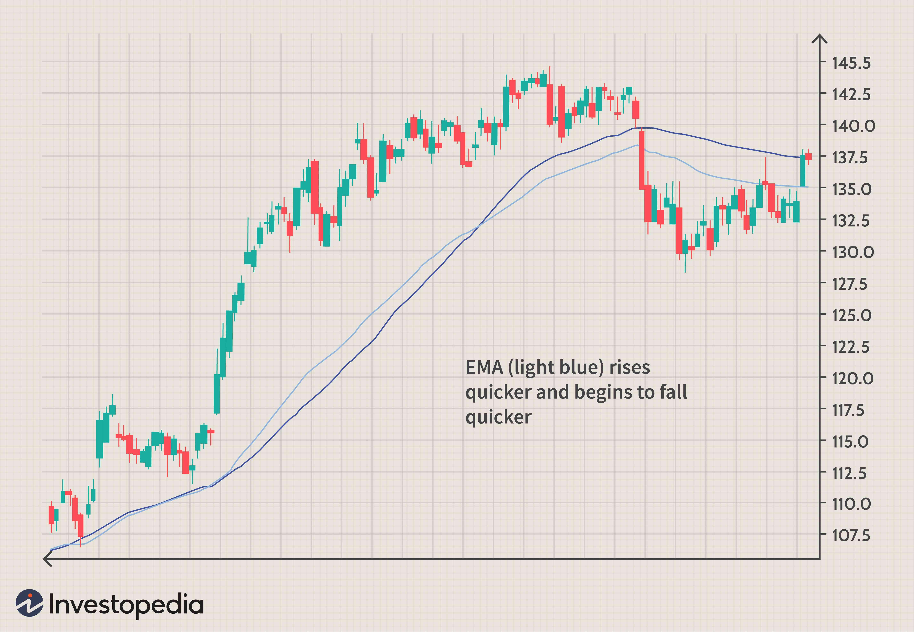

The moving average is a powerful statistical measure that plays a crucial role in algorithmic trading. It assists traders by analyzing data points within a dataset, creating an average which helps smooth out price data, highlighting trends that may not be immediately apparent from the raw data. This statistical technique is essential for reducing short-term fluctuations and noise, allowing traders to focus on longer-term trends and make informed decisions.

At its core, a moving average calculates the average price of a security over a specific number of periods, continuously updating as new data becomes available. This process generates a smoothed line on a price chart, enabling traders to identify the overall direction of the market. For instance, if a stock's price is currently above its moving average, this might indicate an upward trend, while a price below the moving average could suggest a downward trajectory.



Moving averages are instrumental in algorithmic trading strategies, offering visual signals that can inform entry and exit points. By comparing the moving average to current price levels, traders can determine whether a stock is overbought or oversold, thereby guiding strategic decisions. This adaptability makes moving averages a fundamental tool for traders seeking to leverage statistical insights and enhance their trading performance.

## Table of Contents

## Understanding Moving Averages

A moving average is utilized in time series data to mitigate short-term fluctuations, thereby revealing longer-term trends. This process involves averaging a set of data points within the series over a given period. By doing so, the moving average smooths out noise, allowing traders and analysts to discern patterns and trends more clearly.

There are several variations of moving averages, each tailored to specific analytical needs. The Simple Moving Average (SMA) embodies the most basic form; it calculates the unweighted mean of the previous $k$ data points. For instance, to compute a 5-day SMA, one would sum the closing prices of the past five days and divide by five. This technique is effective for general trend analysis, though it may introduce a lag, as each data point carries equal weight regardless of its position in the timeframe.

Alternatively, the Cumulative Moving Average (CMA) considers all available data points up to the current point, continuously updating the average as new data arrives. This approach ensures that the entire dataset influences the output, which can be advantageous when a comprehensive historical context is necessary for analysis.

The Weighted Moving Average (WMA) addresses the lag issue present in SMAs by assigning decreasing weights to older data points. In a WMA, recent data are more significant in the average calculation, making it more responsive to recent changes. The weights typically decrease linearly or geometrically; adjusting these parameters can cater to different market conditions and analytical requirements.

Besides their application in financial analysis, moving averages function as filters in signal processing. Specifically, they act as low-pass filters, which allow low-frequency signals to pass while attenuating the high-frequency noise. This characteristic aligns with their primary purpose: to smoothen short-term [volatility](/wiki/volatility-trading-strategies) and accentuate longer-term trends in data analysis.

In summary, moving averages are versatile tools that not only offer valuable insights into time series data through various forms such as SMA, CMA, and WMA but also serve as effective filters to isolate pertinent trends from transient fluctuations. Understanding these forms and their applications allows traders and analysts to leverage moving averages in crafting more informed decision-making frameworks.

## Types of Moving Averages

### Types of Moving Averages

Moving averages play an integral role in smoothing data and identifying trends in financial markets. Here, we focus on three of the most utilized types: Simple Moving Average (SMA), Cumulative Moving Average (CMA), and Weighted Moving Average (WMA).

- **Simple Moving Average (SMA)**: The SMA is the most straightforward moving average. It is calculated by taking the arithmetic mean of a given set of prices over a specific number of periods. For instance, a 10-day SMA totals the last 10 days' closing prices and divides by 10. Although SMA is not sensitive to short-term fluctuations, it provides a clear signal of the trend direction. The formula for SMA is:
$$
  \text{SMA} = \frac{P_1 + P_2 + \cdots + P_k}{k}

$$

  where $P_i$ is the price at time $i$, and $k$ is the number of data points.

- **Cumulative Moving Average (CMA)**: CMA calculates the average of all data points up to the current time. It is updated incrementally as new data comes in, providing a historical view of the average. This cumulative nature means CMA offers a long-term perspective, making it less sensitive to recent changes. CMA can be calculated iteratively as:
$$
  \text{CMA}_n = \frac{(n-1) \times \text{CMA}_{n-1} + P_n}{n}

$$

  where $n$ is the current time period, and $P_n$ is the price at time $n$.

- **Weighted Moving Average (WMA)**: Unlike SMA, WMA assigns weights to each data point, with more recent data typically receiving greater weight. This attribute allows WMA to respond more quickly to price changes. The weight can decrease in an arithmetic progression, providing a faster reaction to recent price movements and reducing the lag associated with SMAs. The formula for WMA is:
$$
  \text{WMA} = \frac{\sum_{i=1}^{k} w_i \cdot P_i}{\sum_{i=1}^{k} w_i}

$$

  where $w_i$ represents the weight applied to each price $P_i$.

These types of moving averages each offer unique advantages and are used to suit varying trading strategies. SMAs are ideal for observing overall trend directions, CMAs offer a comprehensive average of past price data, and WMAs are useful in quickly capturing changes, particularly in volatile markets. Understanding how each type operates and its implications on market analysis is vital in [algorithmic trading](/wiki/algorithmic-trading).

## Simple Moving Average in Algorithmic Trading

The Simple Moving Average (SMA) is a cornerstone tool in algorithmic trading, used primarily to determine market direction by smoothing out price data over a specified period. This smoothing process allows traders to filter out the noise from the fluctuating market prices, offering a clearer view of the market's trend.

Traders employ the SMA to compare current prices with historical averages, facilitating informed decisions about potential entry and [exit](/wiki/exit-strategy) points. For example, if the current price of an asset is above its SMA, it might signify a potential buy signal, indicating that the market sentiment is trending upwards. Conversely, if the price falls below the SMA, it might be a sign to sell, as it could indicate a downward trend.

The selection of the SMA period is crucial and should align with a trader's investment strategy, targeting short, intermediate, or long-term trends. A short-term SMA, such as a 10-day average, is generally more sensitive to recent price changes and is suitable for identifying quick changes and short-term trading opportunities. An intermediate SMA, like a 50-day average, balances sensitivity with a broader perspective, capturing medium-term trends. Meanwhile, a long-term SMA, such as a 200-day average, offers a broader view suitable for long-term strategies, filtering out short-term volatility to emphasize the underlying trend.

In Python, implementing an SMA can be efficiently done using libraries such as Pandas. Here is a simple code example:

```python
import pandas as pd

# Assume 'data' is a DataFrame with a column 'Close' representing closing prices.
data['SMA_10'] = data['Close'].rolling(window=10).mean()
data['SMA_50'] = data['Close'].rolling(window=50).mean()
data['SMA_200'] = data['Close'].rolling(window=200).mean()
```

This code snippet calculates the 10-day, 50-day, and 200-day SMAs, which traders can then use to analyze price trends and make decisions aligned with their trading strategies. Proper calibration of these SMA periods against backtested results and adapting them to different market conditions and asset types can enhance their efficacy in live trading environments.

## Advanced Moving Averages: Exponential and Weighted

Exponential Moving Average (EMA) and Weighted Moving Average (WMA) are two types of moving averages often utilized in algorithmic trading to improve data interpretation and enhance trading decisions. Both methods are devised to reduce the lag associated with Simple Moving Averages (SMA), thereby offering a more accurate reflection of current market conditions.

The Exponential Moving Average (EMA) prioritizes recent price data by applying a higher weight to the latest observations. This weighting scheme ensures that the EMA is more responsive to new information than the SMA, making it particularly useful in markets experiencing rapid price changes. The EMA is calculated using the formula:

$$
\text{EMA}_t = \left( \frac{P_t - \text{EMA}_{t-1}}{\alpha + 1} \right) + \text{EMA}_{t-1}
$$

where $P_t$ is the current price, $\alpha$ is the smoothing factor, and $\text{EMA}_{t-1}$ is the previous period's EMA value. The smoothing factor $\alpha$ is typically derived from the number of periods $n$, as $\alpha = 2/(n+1)$.

Weighted Moving Average (WMA) further addresses the lag by assigning linearly decreasing weights to older data points while giving the most recent data points the highest weight. This is particularly effective in markets that require quick adaptation to shifts. The calculation is done using:

$$
\text{WMA} = \frac{\sum_{i=1}^n w_i P_{t-(i-1)}}{\sum_{i=1}^n w_i}
$$

where $w_i$ represents the weight for each period, with more weight given to recent prices.

Traders often prefer EMAs due to their ability to provide more timely signals in volatile markets, where quick decision-making can capitalize on price fluctuations. The primary advantage of using EMAs over WMAs lies in their exponential decrease of weightings, allowing for rapid adjustments. This characteristic makes EMAs an excellent choice for strategies focused on short-term price movements and market reversals, offering a competitive edge in fast-paced trading environments.

## Benefits and Drawbacks of Moving Averages in Trading

Moving averages offer a streamlined approach to analyzing price data, providing several advantages for traders. First, they simplify complex datasets by smoothing out price fluctuations. This simplification helps traders easily identify emerging trends and patterns. The visual representation of moving averages, often overlaid on price charts, serves as a clear signal for potential buy or sell actions, making it easier for traders to make informed decisions.

Despite their advantages, moving averages have certain limitations, particularly the lag effect. Since they are based on historical data, there's an inherent delay in reflecting the most current price changes. This lag can result in delayed trading signals, which may cause traders to miss optimal entry or exit points. For instance, by the time a moving average confirms a trend, the underlying asset's price might have already moved significantly.

To mitigate these drawbacks, traders must carefully choose the period length and type of moving average that best align with their specific strategies and the market conditions. While shorter moving averages might be more responsive, they can produce more false signals; longer ones, though more reliable, might be slower to react. Experimenting with combinations of moving averages and integrating them with other technical indicators can help optimize their predictive accuracy and minimize the lag effect.

In conclusion, moving averages are a vital component of technical analysis, but their effectiveness hinges on proper selection and application. By tailoring the parameters of moving averages to the trading context, traders can strike a balance between responsiveness and reliability, enhancing their decision-making processes.

## Moving Average Strategies in Algorithmic Trading

Moving average strategies in algorithmic trading revolve around using moving averages to identify trends and potential trading signals. One commonly used strategy is the Moving Average Crossover. This occurs when a short-term moving average crosses above a long-term moving average, which can indicate a buy signal. Conversely, when a short-term moving average crosses below a long-term moving average, it might suggest a sell signal. This crossover technique is popular because it can help traders identify shifts in market [momentum](/wiki/momentum) and potential trend reversals.

Incorporating additional indicators can enhance decision-making. For instance, pairing moving averages with the Relative Strength Index (RSI) can offer more comprehensive insights. The RSI measures the speed and change of price movements, providing information on whether a stock is overbought or oversold. By using RSI alongside moving averages, traders can refine their signals, confirming that crossovers align with broader market sentiment.

Adapting strategies based on volatility and market conditions is also crucial. During highly volatile periods, shorter moving average periods may be beneficial as they respond more quickly to price changes, allowing traders to capitalize on fleeting opportunities. Conversely, in stable market conditions, longer periods could reduce noise and prevent over-trading. Algorithmic systems can be programmed to adjust moving average periods and sensitivity based on detected market volatility. For instance, if using Python, traders could automate strategy adaptations with a simple script that adjusts moving average parameters in response to volatility indices.

By understanding and implementing these moving average strategies effectively, traders can better navigate the complexities of algorithmic trading and improve their potential for success.

## Conclusion

Moving averages are an essential tool in technical analysis, particularly for those engaged in algorithmic trading. By smoothing price data over specified periods, moving averages help traders discern trends and make informed decisions. Understanding the different types of moving averages—such as Simple, Exponential, and Weighted—enables traders to select the most suitable tool for their trading strategies, whether they focus on short-term fluctuations or long-term trends. 

Proper application of these moving averages can enhance trading performance by providing clear signals on potential market entry and exit points. For instance, employing strategies like the Moving Average Crossover can indicate buy or sell signals when short-term and long-term moving averages intersect. Combining these with other indicators can offer a comprehensive view of market conditions, thereby refining trading decisions and potentially increasing profitability.

As the algorithmic trading landscape evolves, continuous advancements and adaptations in trading algorithms can harness the full potential of moving averages. By optimizing the parameters and integrating them with other sophisticated tools, traders can significantly mitigate the drawbacks, such as lag, and capture more accurate and timely signals. Consequently, keeping abreast of technological developments and market dynamics is crucial for leveraging moving averages effectively in trading algorithms.

## References & Further Reading

[1]: ["Advances in Financial Machine Learning"](https://www.amazon.com/Advances-Financial-Machine-Learning-Marcos/dp/1119482089) by Marcos Lopez de Prado

[2]: ["Evidence-Based Technical Analysis: Applying the Scientific Method and Statistical Inference to Trading Signals"](https://www.amazon.com/Evidence-Based-Technical-Analysis-Scientific-Statistical/dp/0470008741) by David Aronson

[3]: ["Machine Learning for Algorithmic Trading"](https://github.com/stefan-jansen/machine-learning-for-trading) by Stefan Jansen

[4]: ["Quantitative Trading: How to Build Your Own Algorithmic Trading Business"](https://books.google.com/books/about/Quantitative_Trading.html?id=j70yEAAAQBAJ) by Ernest P. Chan

[5]: Murphy, J. J. (1999). ["Technical Analysis of the Financial Markets: A Comprehensive Guide to Trading Methods and Applications."](https://archive.org/details/technicalanalysi0000murp) New York Institute of Finance.