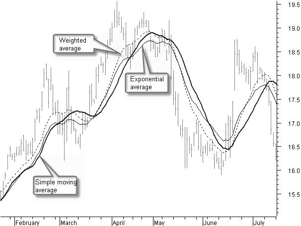

## Table of Contents

## What is a moving average and why is it used in data analysis?

A moving average is a way to smooth out data over time by calculating the average of different subsets of the full data set. Imagine you have daily temperatures for a month. Instead of looking at the temperature for each day, a moving average would take the average temperature over a few days and show you how it changes over time. This helps to see trends without getting distracted by small ups and downs.

In data analysis, moving averages are used because they help make sense of data that might be too noisy or variable to understand easily. For example, if you're looking at stock prices, the price might jump around a lot from day to day. By using a moving average, you can see the overall direction the stock is moving, which can be more useful for making decisions. It's like using a filter to see the big picture more clearly.

## How do you calculate a Simple Moving Average (SMA)?

To calculate a Simple Moving Average (SMA), you start by choosing a period of time, like 5 days or 10 days. Then, you take the prices or values for that period and add them up. After you have the total, you divide it by the number of days in your period. For example, if you're looking at a 5-day SMA for stock prices, you would add up the prices of the last 5 days and then divide by 5. That gives you the average price over those 5 days.

Once you have the first SMA, you can keep calculating it as new data comes in. You drop the oldest price from your calculation and add the newest one. Then, you do the same thing: add up the prices and divide by the number of days. This way, the SMA keeps moving forward, always showing you the average of the most recent period. It's a simple but effective way to smooth out data and see trends over time.

## What are the key differences between a Simple Moving Average and a Weighted Moving Average (WMA)?

A Simple Moving Average (SMA) and a Weighted Moving Average (WMA) are both used to smooth out data, but they do it in different ways. An SMA treats all the data points in the period the same. For example, if you're calculating a 5-day SMA, you add up the values for the last 5 days and then divide by 5. Each day's value is equally important in the calculation. This makes SMAs easy to understand and calculate, but it can sometimes miss important changes if recent data is more significant.

On the other hand, a WMA gives more importance to recent data. In a WMA, you assign different weights to the data points, usually with the most recent data getting the highest weight. For instance, in a 5-day WMA, you might give the most recent day a weight of 5, the second most recent a weight of 4, and so on down to 1 for the oldest day. You multiply each day's value by its weight, add up these products, and then divide by the total of the weights. This way, a WMA can react faster to recent changes in the data, which can be useful in situations where you want to catch trends quickly.

## How does a Weighted Moving Average assign more importance to recent data?

A Weighted Moving Average (WMA) gives more importance to recent data by using a system of weights. Each piece of data in the period gets a different weight, with the most recent data getting the biggest weight. For example, if you are looking at a 5-day WMA, you might give the most recent day a weight of 5, the day before that a weight of 4, and so on until the oldest day gets a weight of 1. You multiply each day's value by its weight, add up all these numbers, and then divide by the total of the weights. This way, the newest data has a bigger say in the final average.

This method helps the WMA to react faster to changes in the data. If something important happens and the numbers start to go up or down, the WMA will show that change more quickly than a Simple Moving Average (SMA). An SMA treats all the days the same, so if there's a big change, it might take longer to show up in the average. By giving more weight to recent data, the WMA can help you see trends and changes sooner, which can be really useful in things like stock trading or weather forecasting.

## What is an Exponential Moving Average (EMA) and how is it different from SMA and WMA?

An Exponential Moving Average (EMA) is a way to smooth out data over time, like a Simple Moving Average (SMA) and a Weighted Moving Average (WMA), but it uses a special formula to give more weight to recent data. The EMA starts with the most recent data point and then adds a fraction of the difference between the current data point and the previous EMA. This fraction, called the smoothing factor, is usually something like 2/(n+1), where n is the number of periods you're looking at. This means the EMA reacts even faster to changes in the data than a WMA, which makes it great for situations where you need to catch trends quickly.

The main difference between an EMA and an SMA is how they handle the data. An SMA gives equal weight to all the data points in the period, so if you're looking at a 10-day SMA, each of those 10 days is equally important. An EMA, on the other hand, gives the most recent data the biggest weight and keeps some of the old data in the calculation, making it more responsive to new changes. Compared to a WMA, an EMA is different because it uses a more complex method to assign weights. A WMA gives you control over how much weight each data point gets, but an EMA automatically adjusts the weights using the smoothing factor, which makes it easier to use but also a bit less flexible.

## How do you calculate an Exponential Moving Average?

To calculate an Exponential Moving Average (EMA), you start with the most recent data point and use a special formula that gives more weight to new data. You need to choose how many periods you want to look at, like 10 days or 20 days. Then, you figure out the smoothing factor, which is usually 2 divided by the number of periods plus 1. For a 10-day EMA, the smoothing factor would be 2/(10+1), which is about 0.1818. You start the EMA with the first data point, which could be the Simple Moving Average (SMA) for the chosen period. After that, for each new data point, you use the formula: EMA = (New Data Point - Previous EMA) * Smoothing Factor + Previous EMA. This way, the EMA keeps updating, always giving more importance to the newest data.

The EMA is different from a Simple Moving Average because it reacts faster to changes in the data. While an SMA treats all the data points the same, an EMA gives the most recent data more weight and keeps some of the old data in the calculation. This makes the EMA more sensitive to new trends, which can be helpful in things like stock trading where you want to catch changes quickly. Compared to a Weighted Moving Average, an EMA uses a more automatic way to assign weights. With a WMA, you choose how much weight each data point gets, but with an EMA, the weights are set by the smoothing factor, making it easier to use but a bit less flexible.

## In what scenarios would you prefer to use a Simple Moving Average over a Weighted or Exponential Moving Average?

You might choose to use a Simple Moving Average (SMA) instead of a Weighted Moving Average (WMA) or an Exponential Moving Average (EMA) when you want a straightforward and easy-to-understand average of your data. An SMA treats all the data points in the period the same, so it's simple to calculate and doesn't give more importance to any single day. This can be helpful if you're looking at data that doesn't change quickly or if you want to see the overall trend without focusing too much on recent changes. For example, if you're tracking monthly sales for a business that has steady sales, an SMA can give you a clear picture of how sales are doing over time without being too influenced by short-term ups and downs.

In some cases, using an SMA can be better if you're worried about overreacting to small changes in the data. Because an SMA doesn't react as quickly to new data as a WMA or an EMA, it can help you avoid making decisions based on short-term fluctuations that might not be important in the long run. For instance, if you're analyzing long-term weather patterns, an SMA can smooth out daily temperature changes and show you the bigger picture, like seasonal trends. This can be more useful than seeing quick changes that might not matter much over time.

## How can moving averages be applied in financial markets for trend analysis?

Moving averages are really useful in financial markets for figuring out trends. Imagine you're looking at a stock's price over time. It can go up and down a lot from day to day, which makes it hard to see if the stock is really going up or down overall. By using a moving average, like a Simple Moving Average (SMA), you can smooth out these daily changes and see the bigger picture. If the stock's price is above the moving average, it might mean the stock is in an upward trend. If it's below, it might be in a downward trend. Traders often use this to decide when to buy or sell stocks.

There are different kinds of moving averages, like the Weighted Moving Average (WMA) and the Exponential Moving Average (EMA), which can be helpful in different ways. A WMA gives more importance to recent prices, so it can help you catch changes in the market faster. An EMA does this even better by using a special formula that puts a lot of weight on the newest data. This can be really useful if you want to react quickly to what's happening in the market. For example, if a stock's price starts going up fast, an EMA will show you that change sooner than an SMA, which might help you make a quicker decision to buy the stock.

## What are the limitations of using moving averages in data analysis?

Moving averages are really helpful for smoothing out data and finding trends, but they have some limitations. One big problem is that they can be slow to show changes in the data. For example, if a stock price suddenly starts going up or down a lot, a moving average might not show that change right away. This can make it hard to make quick decisions based on the latest information. Another issue is that moving averages can sometimes give you false signals. If the data goes up and down a lot, the moving average might cross over the actual data a few times, making it look like the trend is changing when it's really not.

Another limitation is that moving averages don't work well with all kinds of data. They're great for data that changes smoothly over time, but if your data has big jumps or stays the same for a while and then changes suddenly, a moving average might not help much. It can smooth out the data so much that you miss important changes. Also, choosing the right time period for the moving average can be tricky. If you pick a period that's too short, the moving average might be too jumpy and not show you the real trend. If it's too long, it might be too slow to show you what's happening now.

## How can the choice of the time period affect the sensitivity and reliability of a moving average?

The time period you choose for a moving average can really change how sensitive it is to new data. If you pick a short time period, like a 5-day moving average, it will react quickly to changes in the data. This can be good if you want to catch new trends fast, but it can also make the moving average jump around a lot, which might make it hard to see the real trend. On the other hand, if you choose a long time period, like a 50-day moving average, it will be slower to show changes. This can be better if you want to see the bigger picture and not get distracted by short-term ups and downs, but it might miss important changes that happen quickly.

The reliability of a moving average also depends on the time period. A shorter time period can give you false signals because it reacts too quickly to small changes in the data. For example, if a stock price goes up for a few days and then goes back down, a short-term moving average might make it look like there's a new trend when there isn't. A longer time period can be more reliable because it smooths out these small changes, but it might be too slow to help you make timely decisions. So, choosing the right time period is important to balance sensitivity and reliability, depending on what you're trying to do with the data.

## What advanced techniques can be used to optimize the parameters of moving averages for specific applications?

To optimize the parameters of moving averages for specific applications, you can use something called backtesting. Backtesting means you take old data and try out different moving average time periods to see which one works best. For example, if you're looking at stock prices, you might test a 10-day, 20-day, and 50-day moving average to see which one gives you the best results for spotting trends. By trying out different time periods on past data, you can find the one that helps you make the best decisions for your specific needs, like knowing when to buy or sell stocks.

Another advanced technique is called optimization algorithms. These are special methods that help you find the best time period for your moving average automatically. One popular method is called genetic algorithms, which work a bit like natural selection. They try out lots of different time periods, keep the ones that work well, and mix them together to make even better ones. This way, the algorithm can find the best time period for your moving average without you having to try every possibility by hand. Both backtesting and optimization algorithms can help you get the most out of moving averages for things like stock trading or weather forecasting.

## How do moving averages interact with other technical indicators to enhance predictive analysis?

Moving averages work well with other technical indicators to make predictions better. One common way is to use moving averages with something called the Relative Strength Index (RSI). The RSI helps you see if a stock is being bought or sold too much. If the RSI is high, it means the stock might be overbought and could go down soon. If it's low, it might be oversold and could go up. By using a moving average with the RSI, you can get a clearer picture of the trend. For example, if the stock price is above the moving average and the RSI is low, it might be a good time to buy because the stock could be starting an upward trend.

Another way to use moving averages with other indicators is with something called the Moving Average Convergence Divergence (MACD). The MACD shows the difference between two moving averages, usually a fast one and a slow one. It helps you see if the trend is getting stronger or weaker. When you use the MACD with a moving average, you can spot good times to buy or sell. If the MACD line crosses above the signal line and the stock price is above the moving average, it might be a good time to buy. If it crosses below and the price is below the moving average, it might be time to sell. Using moving averages with other indicators like RSI and MACD can help you make better decisions by giving you more information about what's happening in the market.

## What is a Weighted Moving Average (WMA) and how is it understood?

Weighted Moving Averages (WMA) are a fundamental tool in technical analysis, offering traders a method to better gauge market trends by assigning more significance to recent data points over older data. The primary aim of a WMA is to decrease the lag seen in other moving averages, such as the Simple Moving Average (SMA), by emphasizing the most current prices. This makes it particularly valuable in volatile markets where rapid changes can influence trading decisions.

### Calculation of WMA

The calculation of a weighted moving average involves assigning a specific weight to each data point within a chosen window period. Recent prices are typically given more importance, which reflects the market's current [momentum](/wiki/momentum) more accurately. Mathematically, a WMA for a period $n$ can be formulated as:

$$
WMA = \frac{\sum_{i=1}^{n} (Price_i \times Weight_i)}{\sum_{i=1}^{n} Weight_i}
$$

In this formula, $Price_i$ is the price for the $i^{th}$ day and $Weight_i$ is the weight assigned to the $i^{th}$ day. A common practice is to set these weights as decreasing integers. For example, for a 5-day WMA, the weights might be 5, 4, 3, 2, and 1 for each respective day. This ensures that the most recent price is weighted five times as much as the oldest.

### Application in Volatile Markets

WMAs are particularly advantageous in volatile conditions where quick market shifts occur. Such conditions require recent price movements to be reflected rapidly in the moving average to provide relevant insights. The reduced lag of WMAs compared to other averages allows traders to respond more swiftly to new information, offering an edge in timing entries and exits.

For instance, if a stock price drops sharply only to recover just as rapidly, a WMA will adjust more quickly than other averages, indicating potential reversals or continuations in trends sooner.

### Practical Use for Traders

Traders commonly use WMAs to fine-tune the timing of their trades. By integrating WMAs into trading strategies, they aim to capture trends early or [exit](/wiki/exit-strategy) before sudden reversals, thereby optimizing their trading performance. This emphasis on more immediate data allows for a proactive rather than reactive trading strategy.

In [algorithmic trading](/wiki/algorithmic-trading), WMAs aid in creating automated trading signals that rely heavily on short to medium-term price actions. By offering more accurate signals in response to recent price moves, WMAs help in minimizing false signals and enhancing decision-making efficiency.

In conclusion, the Weighted Moving Average is a significant component of a trader's toolkit, primarily when trading in fast-moving markets. The ability to assign more relevance to recent prices allows traders to predict trends more effectively and optimize entry and exit points, ultimately contributing to more successful trading outcomes.

## What is Exploring Exponential Moving Average (EMA)?

Exponential Moving Averages (EMAs) are a popular technical analysis tool used to analyze financial market data. Their primary advantage lies in their ability to apply higher weight to more recent prices, which makes them more responsive to recent market changes compared to other moving averages, such as the Simple Moving Average (SMA). This characteristic makes EMAs particularly effective for capturing short-term trends, making them valuable in active trading scenarios where rapid adaptability to market dynamics is essential.

The calculation of an EMA involves a specific multiplier, often referred to as the smoothing [factor](/wiki/factor-investing), which determines how much weight is allocated to the most recent data points. The smoothing factor is calculated using the formula:

$$
\text{Smoothing Factor} = \frac{2}{n + 1}
$$

Here, $n$ is the number of time periods over which the EMA is calculated. Using this smoothing factor, the EMA is updated iteratively with each new price data point using the formula:

$$
\text{EMA}_{\text{today}} = (\text{Price}_{\text{today}} \times \text{Smoothing Factor}) + (\text{EMA}_{\text{yesterday}} \times (1 - \text{Smoothing Factor}))
$$

This iterative calculation ensures that more recent prices have a greater influence on the EMA, enhancing its responsiveness to price movements. This responsive nature is why traders prefer EMAs when seeking to identify short-term trends and signals for entry and exit points in volatile markets. By adjusting quickly to new data, EMAs help traders react to price changes with agility and precision, making them an indispensable tool in both manual and automated trading strategies. 

The enhanced sensitivity of EMAs is particularly advantageous for traders focused on short-term price movements, where rapid market changes must be capitalized on quickly to maximize potential gains. This is why EMAs are a staple in many algorithmic trading systems designed for high-frequency trading and other strategies that require fast decision-making processes.

## Can you explain Algo Trading with Moving Averages?

Algorithmic trading strategies often incorporate moving averages to execute trades automatically based on pre-established rules, taking advantage of their ability to smooth price data and highlight trends. These strategies particularly capitalize on the concept of moving average crossovers, which serve as critical triggers for executing buy or sell orders.

### Moving Average Crossovers

Two of the most notable crossover strategies are the golden cross and the death cross. A golden cross occurs when a short-term moving average crosses above a long-term moving average, typically signaling a bullish market trend. Conversely, a death cross happens when a short-term moving average crosses below a long-term moving average, commonly interpreted as an indicator of a bearish market trend.

### Integration of EMAs and WMAs

Both Exponential Moving Averages (EMAs) and Weighted Moving Averages (WMAs) are frequently integrated into trading algorithms due to their efficient trend detection and reduced lag compared to Simple Moving Averages (SMAs). EMAs, with their exponential weighting towards recent prices, allow trading algorithms to respond swiftly to price changes, making them advantageous in capturing short-term market movements. The formula for calculating an EMA is:

$$
EMA_t = \left( \frac{Price_t \times (Smoothing / (1 + Days))} + EMA_{t-1} \times \left(1 - \frac{Smoothing}{1 + Days}\right) \right)
$$

where $Price_t$ represents the current closing price, $EMA_{t-1}$ is the previous day’s EMA, and $Smoothing$ is a constant typically set to 2.

WMAs, by assigning linearly decreasing weights to older prices, offer distinct advantages in volatile markets where the latest data points hold more significance. This makes them particularly useful in scenarios where understanding the immediate market momentum is crucial.

### Implementation in Algorithms

The effectiveness of EMAs and WMAs in minimizing lag and enhancing trend detection makes them appealing for algorithmic trading. Traders utilize these moving averages within algorithms to set specific conditions for triggering trades. Here is a simple Python example demonstrating the calculation of a short-term and long-term EMA crossover to generate trade signals:

```python
import pandas as pd

def calculate_ema(prices, days):
    return prices.ewm(span=days, adjust=False).mean()

def generate_signals(prices, short_days=50, long_days=200):
    short_ema = calculate_ema(prices, short_days)
    long_ema = calculate_ema(prices, long_days)
    buy_signals = (short_ema > long_ema)
    sell_signals = (short_ema < long_ema)
    return buy_signals, sell_signals

# Example usage with a DataFrame 'data' containing a 'Close' column
data = pd.DataFrame({'Close': [...]})  # Add your closing prices data
buy, sell = generate_signals(data['Close'])
```

Such algorithmic strategies make the identification of trends and subsequent decision-making processes more efficient, allowing automated systems to operate with precision in fluctuating market conditions. As a result, EMAs and WMAs play a pivotal role in enhancing the decision-making framework within the domain of algorithmic trading.

## What are the differences between WMAs and EMAs?

Weighted Moving Averages (WMAs) and Exponential Moving Averages (EMAs) are pivotal tools in technical analysis, particularly for traders keen on incorporating recent data into their strategies. Both WMAs and EMAs assign greater importance to more recent prices, yet they differ significantly in their calculation methods and the sensitivity to market changes they exhibit.

### Calculation Differences

The calculation of a WMA involves allocating a linear weight to each of the data points in a specific period, with the latest data points receiving the highest weights. The formula for a WMA can be expressed as follows:

$$

\text{WMA} = \frac{\sum (n \times \text{Price}_n)}{\sum n}
$$

where $n$ is the time period for the moving average. This linear weighting ensures that the most recent prices have proportionally more impact on the moving average than older prices.

In contrast, EMAs apply an exponential weighting, meaning each recent data point holds exponentially more weight than the previous one. This is calculated using a formula that incorporates a smoothing factor $\alpha$, generally expressed as:

$$

\text{EMA} = \alpha \times \text{Price}_\text{today} + (1 - \alpha) \times \text{EMA}_\text{yesterday}
$$

where the smoothing factor $\alpha$ is usually derived as $\frac{2}{n+1}$, with $n$ being the length of the EMA.

### Sensitivity and Application

EMAs tend to be more sensitive to recent price changes than WMAs due to their exponential nature. This makes them particularly suitable for traders focused on capturing short-term price movements and reacting quickly to market shifts. The rapid adjustability allows EMAs to respond swiftly to [volatility](/wiki/volatility-trading-strategies), often preferred in fast-paced trading environments.

On the other hand, the linear attribute of WMAs renders them less sensitive to sharp fluctuations compared to EMAs. This characteristic is advantageous when traders seek a more stable moving average, which can be pivotal in markets with less volatility or over longer time frames.

### Trader Preferences

Traders choose between WMAs and EMAs based on a combination of their individual trading needs, the prevailing market conditions, and the historical data under consideration. Those aiming to optimize entry and exit points in volatile markets may gravitate towards EMAs, whereas WMAs might be more appropriate in scenarios requiring smoother trend lines and reduced noise from transient market fluctuations.

In algorithmic trading, the selection of either WMA or EMA can substantially influence the efficacy of trading strategies, particularly those involving moving average crossovers. Traders often engage in [backtesting](/wiki/backtesting) these strategies to evaluate which moving average best suits their objectives, whether reducing lag, enhancing responsiveness, or providing smoother price data.

## References & Further Reading

[1]: ["Technical Analysis of the Financial Markets: A Comprehensive Guide to Trading Methods and Applications"](https://archive.org/details/technicalanalysi0000murp) by John J. Murphy

[2]: ["Algorithmic Trading: Winning Strategies and Their Rationale"](https://www.wiley.com/en-us/Algorithmic+Trading%3A+Winning+Strategies+and+Their+Rationale-p-9781118460146) by Ernest P. Chan

[3]: ["Trading Systems and Methods"](https://www.amazon.com/Trading-Systems-Methods-Wiley/dp/1119605350) by Perry J. Kaufman

[4]: ["Python for Finance: Mastering Data-Driven Finance"](https://www.amazon.com/Python-Finance-Mastering-Data-Driven/dp/1492024333) by Yves Hilpisch

[5]: ["Evidence-Based Technical Analysis: Applying the Scientific Method and Statistical Inference to Trading Signals"](https://www.amazon.com/Evidence-Based-Technical-Analysis-Scientific-Statistical/dp/0470008741) by David Aronson