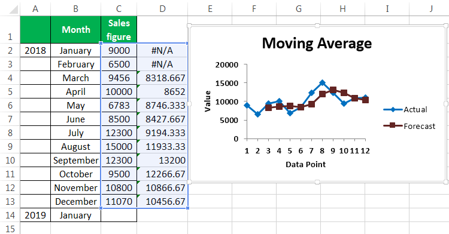

In the fast-paced world of algorithmic trading, moving averages are indispensable tools that traders utilize to gauge market trends and make data-driven decisions. Moving averages, by smoothing out price data over a specified period, help to reduce noise and highlight the underlying direction of asset prices. This ability to distill complex market movements into more comprehensible trends provides traders with clearer insights, allowing them to capitalize on opportunities with greater confidence.

The three primary types of moving averages—Weighted Moving Average (WMA), Exponential Moving Average (EMA), and Simple Moving Average (SMA)—each possess unique characteristics and specific use-cases. While SMAs offer a straightforward average of prices over a chosen timeframe, they do not account for the most recent data shifts as significantly as WMAs and EMAs. WMAs assign linearly increasing weights to more recent data points, providing a more sensitive reflection of current price action. Conversely, EMAs apply an exponentially decreasing weight scheme to past prices, enhancing their quick responsiveness to recent market changes. 



This article delves into WMAs and EMAs, exploring the reasons these particular averages are favored in algorithmic trading strategies. With their ability to reduce lag and effectively capture trends, WMAs and EMAs are particularly well-suited for dynamic market environments where rapid adaptability and precise execution are crucial.

By integrating moving averages into algorithms, traders can automate decisions based on historical and real-time data, participating in the market with precision and speed. These methods empower traders to spot potential entry and exit points while minimizing the impact of emotional decision-making. Understanding these concepts is essential for anyone engaged in algo trading, as it enables the construction of systems that can withstand the inherent uncertainties and fluctuations of financial markets.

## Table of Contents

## Understanding Weighted Moving Average (WMA)

Weighted Moving Averages (WMA) are a fundamental tool in technical analysis, offering traders a method to better gauge market trends by assigning more significance to recent data points over older data. The primary aim of a WMA is to decrease the lag seen in other moving averages, such as the Simple Moving Average (SMA), by emphasizing the most current prices. This makes it particularly valuable in volatile markets where rapid changes can influence trading decisions.

### Calculation of WMA

The calculation of a weighted moving average involves assigning a specific weight to each data point within a chosen window period. Recent prices are typically given more importance, which reflects the market's current [momentum](/wiki/momentum) more accurately. Mathematically, a WMA for a period $n$ can be formulated as:

$$
WMA = \frac{\sum_{i=1}^{n} (Price_i \times Weight_i)}{\sum_{i=1}^{n} Weight_i}
$$

In this formula, $Price_i$ is the price for the $i^{th}$ day and $Weight_i$ is the weight assigned to the $i^{th}$ day. A common practice is to set these weights as decreasing integers. For example, for a 5-day WMA, the weights might be 5, 4, 3, 2, and 1 for each respective day. This ensures that the most recent price is weighted five times as much as the oldest.

### Application in Volatile Markets

WMAs are particularly advantageous in volatile conditions where quick market shifts occur. Such conditions require recent price movements to be reflected rapidly in the moving average to provide relevant insights. The reduced lag of WMAs compared to other averages allows traders to respond more swiftly to new information, offering an edge in timing entries and exits.

For instance, if a stock price drops sharply only to recover just as rapidly, a WMA will adjust more quickly than other averages, indicating potential reversals or continuations in trends sooner.

### Practical Use for Traders

Traders commonly use WMAs to fine-tune the timing of their trades. By integrating WMAs into trading strategies, they aim to capture trends early or [exit](/wiki/exit-strategy) before sudden reversals, thereby optimizing their trading performance. This emphasis on more immediate data allows for a proactive rather than reactive trading strategy.

In [algorithmic trading](/wiki/algorithmic-trading), WMAs aid in creating automated trading signals that rely heavily on short to medium-term price actions. By offering more accurate signals in response to recent price moves, WMAs help in minimizing false signals and enhancing decision-making efficiency.

In conclusion, the Weighted Moving Average is a significant component of a trader's toolkit, primarily when trading in fast-moving markets. The ability to assign more relevance to recent prices allows traders to predict trends more effectively and optimize entry and exit points, ultimately contributing to more successful trading outcomes.

## Exploring Exponential Moving Average (EMA)

Exponential Moving Averages (EMAs) are a popular technical analysis tool used to analyze financial market data. Their primary advantage lies in their ability to apply higher weight to more recent prices, which makes them more responsive to recent market changes compared to other moving averages, such as the Simple Moving Average (SMA). This characteristic makes EMAs particularly effective for capturing short-term trends, making them valuable in active trading scenarios where rapid adaptability to market dynamics is essential.

The calculation of an EMA involves a specific multiplier, often referred to as the smoothing [factor](/wiki/factor-investing), which determines how much weight is allocated to the most recent data points. The smoothing factor is calculated using the formula:

$$
\text{Smoothing Factor} = \frac{2}{n + 1}
$$

Here, $n$ is the number of time periods over which the EMA is calculated. Using this smoothing factor, the EMA is updated iteratively with each new price data point using the formula:

$$
\text{EMA}_{\text{today}} = (\text{Price}_{\text{today}} \times \text{Smoothing Factor}) + (\text{EMA}_{\text{yesterday}} \times (1 - \text{Smoothing Factor}))
$$

This iterative calculation ensures that more recent prices have a greater influence on the EMA, enhancing its responsiveness to price movements. This responsive nature is why traders prefer EMAs when seeking to identify short-term trends and signals for entry and exit points in volatile markets. By adjusting quickly to new data, EMAs help traders react to price changes with agility and precision, making them an indispensable tool in both manual and automated trading strategies. 

The enhanced sensitivity of EMAs is particularly advantageous for traders focused on short-term price movements, where rapid market changes must be capitalized on quickly to maximize potential gains. This is why EMAs are a staple in many algorithmic trading systems designed for high-frequency trading and other strategies that require fast decision-making processes.

## Algo Trading with Moving Averages

Algorithmic trading strategies often incorporate moving averages to execute trades automatically based on pre-established rules, taking advantage of their ability to smooth price data and highlight trends. These strategies particularly capitalize on the concept of moving average crossovers, which serve as critical triggers for executing buy or sell orders.

### Moving Average Crossovers

Two of the most notable crossover strategies are the golden cross and the death cross. A golden cross occurs when a short-term moving average crosses above a long-term moving average, typically signaling a bullish market trend. Conversely, a death cross happens when a short-term moving average crosses below a long-term moving average, commonly interpreted as an indicator of a bearish market trend.

### Integration of EMAs and WMAs

Both Exponential Moving Averages (EMAs) and Weighted Moving Averages (WMAs) are frequently integrated into trading algorithms due to their efficient trend detection and reduced lag compared to Simple Moving Averages (SMAs). EMAs, with their exponential weighting towards recent prices, allow trading algorithms to respond swiftly to price changes, making them advantageous in capturing short-term market movements. The formula for calculating an EMA is:

$$
EMA_t = \left( \frac{Price_t \times (Smoothing / (1 + Days))} + EMA_{t-1} \times \left(1 - \frac{Smoothing}{1 + Days}\right) \right)
$$

where $Price_t$ represents the current closing price, $EMA_{t-1}$ is the previous day’s EMA, and $Smoothing$ is a constant typically set to 2.

WMAs, by assigning linearly decreasing weights to older prices, offer distinct advantages in volatile markets where the latest data points hold more significance. This makes them particularly useful in scenarios where understanding the immediate market momentum is crucial.

### Implementation in Algorithms

The effectiveness of EMAs and WMAs in minimizing lag and enhancing trend detection makes them appealing for algorithmic trading. Traders utilize these moving averages within algorithms to set specific conditions for triggering trades. Here is a simple Python example demonstrating the calculation of a short-term and long-term EMA crossover to generate trade signals:

```python
import pandas as pd

def calculate_ema(prices, days):
    return prices.ewm(span=days, adjust=False).mean()

def generate_signals(prices, short_days=50, long_days=200):
    short_ema = calculate_ema(prices, short_days)
    long_ema = calculate_ema(prices, long_days)
    buy_signals = (short_ema > long_ema)
    sell_signals = (short_ema < long_ema)
    return buy_signals, sell_signals

# Example usage with a DataFrame 'data' containing a 'Close' column
data = pd.DataFrame({'Close': [...]})  # Add your closing prices data
buy, sell = generate_signals(data['Close'])
```

Such algorithmic strategies make the identification of trends and subsequent decision-making processes more efficient, allowing automated systems to operate with precision in fluctuating market conditions. As a result, EMAs and WMAs play a pivotal role in enhancing the decision-making framework within the domain of algorithmic trading.

## Comparing WMAs and EMAs

Weighted Moving Averages (WMAs) and Exponential Moving Averages (EMAs) are pivotal tools in technical analysis, particularly for traders keen on incorporating recent data into their strategies. Both WMAs and EMAs assign greater importance to more recent prices, yet they differ significantly in their calculation methods and the sensitivity to market changes they exhibit.

### Calculation Differences

The calculation of a WMA involves allocating a linear weight to each of the data points in a specific period, with the latest data points receiving the highest weights. The formula for a WMA can be expressed as follows:

$$

\text{WMA} = \frac{\sum (n \times \text{Price}_n)}{\sum n}
$$

where $n$ is the time period for the moving average. This linear weighting ensures that the most recent prices have proportionally more impact on the moving average than older prices.

In contrast, EMAs apply an exponential weighting, meaning each recent data point holds exponentially more weight than the previous one. This is calculated using a formula that incorporates a smoothing factor $\alpha$, generally expressed as:

$$

\text{EMA} = \alpha \times \text{Price}_\text{today} + (1 - \alpha) \times \text{EMA}_\text{yesterday}
$$

where the smoothing factor $\alpha$ is usually derived as $\frac{2}{n+1}$, with $n$ being the length of the EMA.

### Sensitivity and Application

EMAs tend to be more sensitive to recent price changes than WMAs due to their exponential nature. This makes them particularly suitable for traders focused on capturing short-term price movements and reacting quickly to market shifts. The rapid adjustability allows EMAs to respond swiftly to [volatility](/wiki/volatility-trading-strategies), often preferred in fast-paced trading environments.

On the other hand, the linear attribute of WMAs renders them less sensitive to sharp fluctuations compared to EMAs. This characteristic is advantageous when traders seek a more stable moving average, which can be pivotal in markets with less volatility or over longer time frames.

### Trader Preferences

Traders choose between WMAs and EMAs based on a combination of their individual trading needs, the prevailing market conditions, and the historical data under consideration. Those aiming to optimize entry and exit points in volatile markets may gravitate towards EMAs, whereas WMAs might be more appropriate in scenarios requiring smoother trend lines and reduced noise from transient market fluctuations.

In algorithmic trading, the selection of either WMA or EMA can substantially influence the efficacy of trading strategies, particularly those involving moving average crossovers. Traders often engage in [backtesting](/wiki/backtesting) these strategies to evaluate which moving average best suits their objectives, whether reducing lag, enhancing responsiveness, or providing smoother price data.

## Conclusion

Moving averages remain a cornerstone of technical analysis, especially in algorithmic trading. They serve as fundamental tools for smoothing out price data, which aids traders in identifying trends and making informed decisions. Understanding the nuances of Weighted Moving Averages (WMAs) and Exponential Moving Averages (EMAs) enables traders to enhance their trading strategies by leveraging the strengths of each approach.

WMAs provide a linear weighted approach to price data, emphasizing the importance of recent prices. This makes them particularly valuable in volatile markets where current trends are critical. On the other hand, EMAs apply an exponential decay, allowing them to be more sensitive to recent changes in price. This sensitivity makes EMAs ideal for capturing short-term trends and quickly adapting to market fluctuations.

The choice of moving average depends significantly on trading objectives, market environment, and the type of data being analyzed. Traders might opt for WMAs when their focus is on recent price changes in volatile conditions or when they aim to reduce lag. Conversely, EMAs might be more appropriate for strategies that prioritize immediate market shifts.

Continued analysis and backtesting are crucial in optimizing the application of these moving averages in various trading contexts. By testing different scenarios and historical data, traders can fine-tune their strategies to ensure the most effective use of WMAs and EMAs. This iterative process allows for the development of robust trading algorithms that can automatically make precise trading decisions based on the calculated trends and patterns.

Ultimately, the effective integration of WMAs and EMAs into trading strategies can provide traders with a significant edge, enabling them to navigate complex market dynamics with greater efficacy.

## References & Further Reading

[1]: ["Technical Analysis of the Financial Markets: A Comprehensive Guide to Trading Methods and Applications"](https://archive.org/details/technicalanalysi0000murp) by John J. Murphy

[2]: ["Algorithmic Trading: Winning Strategies and Their Rationale"](https://www.wiley.com/en-us/Algorithmic+Trading%3A+Winning+Strategies+and+Their+Rationale-p-9781118460146) by Ernest P. Chan

[3]: ["Trading Systems and Methods"](https://www.amazon.com/Trading-Systems-Methods-Wiley/dp/1119605350) by Perry J. Kaufman

[4]: ["Python for Finance: Mastering Data-Driven Finance"](https://www.amazon.com/Python-Finance-Mastering-Data-Driven/dp/1492024333) by Yves Hilpisch

[5]: ["Evidence-Based Technical Analysis: Applying the Scientific Method and Statistical Inference to Trading Signals"](https://www.amazon.com/Evidence-Based-Technical-Analysis-Scientific-Statistical/dp/0470008741) by David Aronson